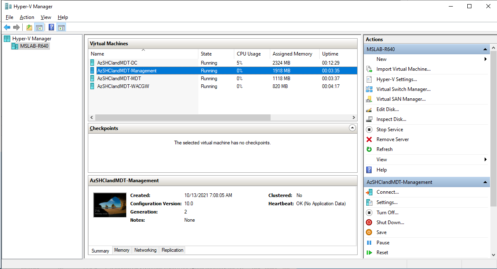
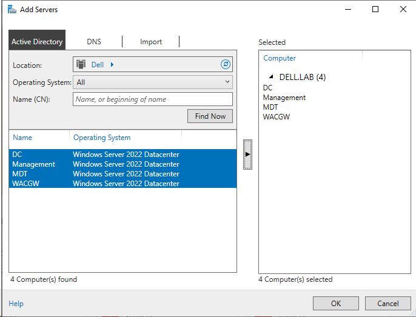
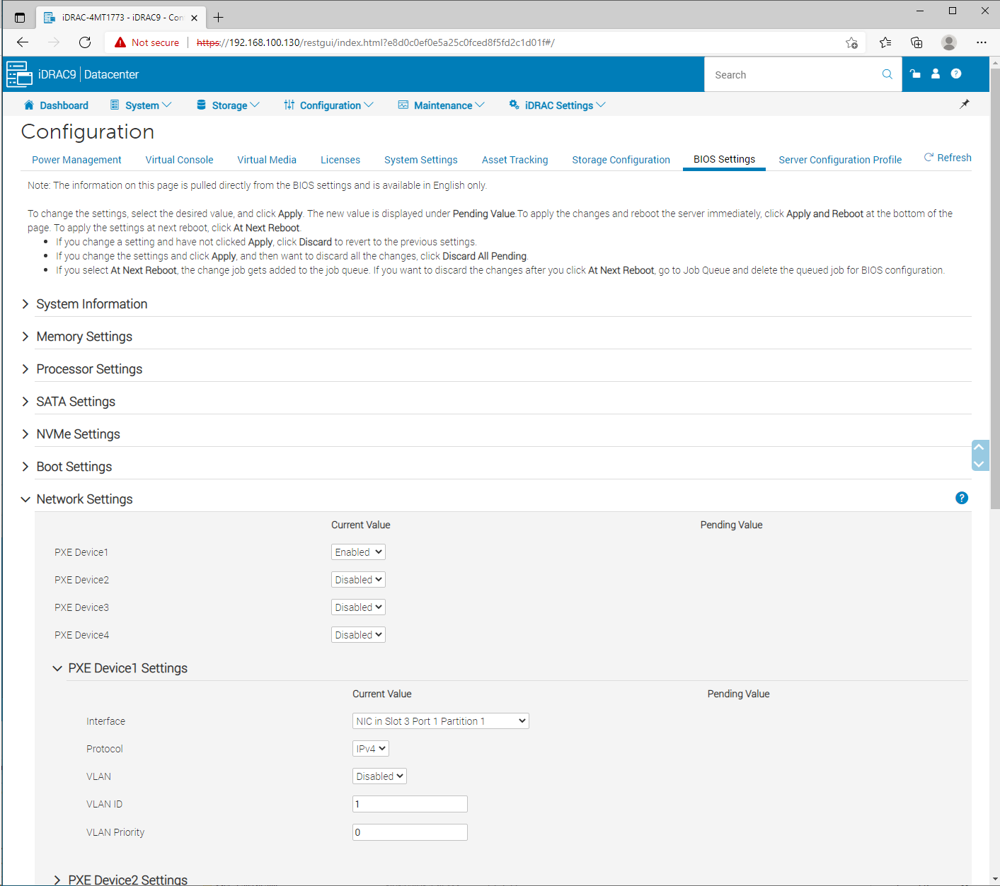
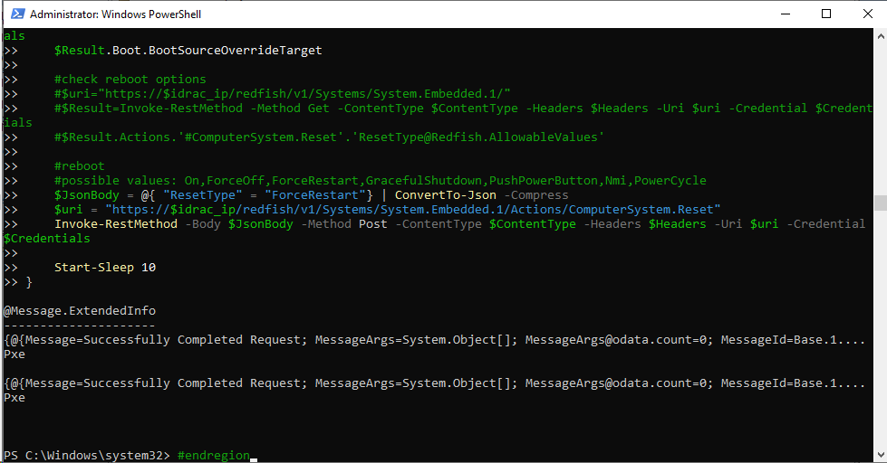
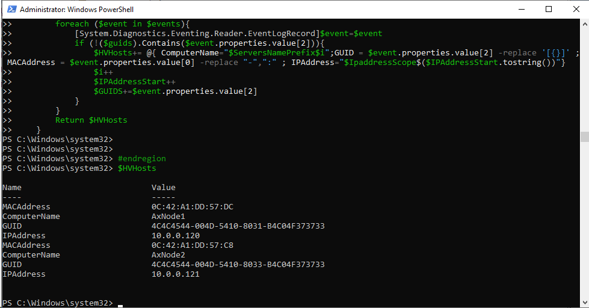

# Admin Lab 03 - Deploy Physical Servers with MSLab
<!-- TOC -->

- [Admin Lab 03 - Deploy Physical Servers with MSLab](#admin-lab-03---deploy-physical-servers-with-mslab)
    - [Prerequisites](#prerequisites)
    - [Deploy MSLab VMs](#deploy-mslab-vms)
        - [Expected result](#expected-result)
    - [Deploy MDT Server](#deploy-mdt-server)
        - [Expected result](#expected-result)
    - [Configure servers to boot from correct NIC](#configure-servers-to-boot-from-correct-nic)
    - [Restart Physical servers to attempt boot and collect information from logs](#restart-physical-servers-to-attempt-boot-and-collect-information-from-logs)
        - [Expected result](#expected-result)
        - [Expected result](#expected-result)
    - [Configure MDT Database and Active Directory Object](#configure-mdt-database-and-active-directory-object)
        - [Expected result](#expected-result)
    - [Restart Servers to Install Operating system](#restart-servers-to-install-operating-system)
        - [Expected result](#expected-result)

<!-- /TOC -->

## Prerequisites

* Hydrate MSLab [01-HydrateMSLab](../../admin-guides/01-HydrateMSLab/readme.md) - make sure you use same LabConfig (username, password, preferrably also domain)

* make sure you know [how to work with MSLab](../../admin-guides/02-WorkingWithMSLab/readme.md)

* two and more Physical servers (preferrably AX-Nodes) with iDRAC.

* physical server or laptop that will host MSLab VMs

> Minimal footprint is 2 servers, laptop and simple switch that will provide connectivity for physical servers and iDRAC interfaces.

> Scalable topology is what we have in the lab

> You can also boot servers using modified ISO (not requiring pressing button to boot) and physical servers can [boot directly to ISO using iDRAC](../../tips&tricks/02-BootToNetworkISO/readme.md)


## Deploy MSLab VMs

> Following lab is based on [Azure Stack and MDT scenario](https://github.com/microsoft/MSLab/tree/master/Scenarios/AzSHCI%20and%20MDT)

**1.** Identify NICs, that are connected to physical switch that will provide connectivity to AX Nodes by navigating into Network Connections. On below example it is NIC1 and NIC2


**2.** Navigate to MSLab folder and replace LabConfig.ps1 with following. Notice SwitchNics and it's NICs - those are the ones identified in step 1.

```PowerShell
$LabConfig=@{SwitchNics="NIC1","NIC2"; Internet=$true ; UseHostDnsAsForwarder=$true; DomainAdminName='LabAdmin'; AdminPassword='LS1setup!' ; DCEdition='4' ;VMs=@()}

$LabConfig.VMs += @{ VMName = 'Management' ; ParentVHD = 'Win2022_G2.vhdx' ; MGMTNICs=1 }

$LabConfig.VMs += @{ VMName = 'MDT' ; Configuration = 'S2D' ; ParentVHD = 'Win2022_G2.vhdx' ; SSDNumber = 1; SSDSize=1TB ; MGMTNICs=1 }

$LabConfig.VMs += @{ VMName = 'WACGW' ; ParentVHD = 'Win2022Core_G2.vhdx' ; MGMTNICs=1 }
 
```

> LabConfig will deploy Management VM, one VM for MDT and one for Windows Admin Center in GW mode. Notice, that it will add one more disk to MDT server.

> On Screenshot you can see prefix was changed to **AzSHCIandMDT** to easier identify scenario that is running in the lab.

### Expected result



## Deploy MDT Server

**1.** Log in into Management VM and make sure all VMs are up and running by adding all servers into Server Manager




**2.** Open PowerShell as administrator and paste content of 
[DeployMDT.ps1](./scripts/deploymdt.ps1)

> above code will deploy MDT Server on machine MDT, together with SQL Server and WDS to be able to deploy physical servers. It is the same as code in [Azure Stack HCI and MDT scenario](https://github.com/microsoft/MSLab/tree/master/Scenarios/AzSHCI%20and%20MDT/Scenario.ps1)

### Expected result

* Operating System present
* Task Sequence present
* SQL Server configured
* Monitoring enabled


## Configure servers to boot from correct NIC

**1.** Make sure, that correct network card is configured to boot. In this case Slot3 Port 1 Partition 1 is Mellanox CX5 that is connected to physical switch



## Restart Physical servers to attempt boot and collect information from logs

You can skip this step if you already have MAC Address and GUID of servers you want to deploy. If not, let it boot and collect information from logs

**1.** Restart servers with following command.

> you need to change $Credentials and $idrac_ips that corresponds with your environment

> servers will reboot and will attempt to boot from PXE


```PowerShell
#region Restart AX Nodes
#$Credentials=Get-Credential
$password = ConvertTo-SecureString "LS1setup!" -AsPlainText -Force
$Credentials = New-Object System.Management.Automation.PSCredential ("LabAdmin", $password)
$idrac_ips="192.168.100.130","192.168.100.131"
$Headers=@{"Accept"="application/json"}
$ContentType='application/json'
function Ignore-SSLCertificates
{
    $Provider = New-Object Microsoft.CSharp.CSharpCodeProvider
    $Compiler = $Provider.CreateCompiler()
    $Params = New-Object System.CodeDom.Compiler.CompilerParameters
    $Params.GenerateExecutable = $false
    $Params.GenerateInMemory = $true
    $Params.IncludeDebugInformation = $false
    $Params.ReferencedAssemblies.Add("System.DLL") > $null
    $TASource=@'
        namespace Local.ToolkitExtensions.Net.CertificatePolicy
        {
            public class TrustAll : System.Net.ICertificatePolicy
            {
                public bool CheckValidationResult(System.Net.ServicePoint sp,System.Security.Cryptography.X509Certificates.X509Certificate cert, System.Net.WebRequest req, int problem)
                {
                    return true;
                }
            }
        }
'@ 
    $TAResults=$Provider.CompileAssemblyFromSource($Params,$TASource)
    $TAAssembly=$TAResults.CompiledAssembly
    $TrustAll = $TAAssembly.CreateInstance("Local.ToolkitExtensions.Net.CertificatePolicy.TrustAll")
    [System.Net.ServicePointManager]::CertificatePolicy = $TrustAll
}
#ignoring cert is needed for posh5. In 6 and newer you can just add -SkipCertificateCheck
Ignore-SSLCertificates

#reboot machines
foreach ($idrac_ip in $idrac_ips){
    #Configure PXE for next reboot
    $JsonBody = @{ Boot = @{
        "BootSourceOverrideTarget"="Pxe"
        }} | ConvertTo-Json -Compress
    $uri = "https://$idrac_ip/redfish/v1/Systems/System.Embedded.1"
    Invoke-RestMethod -Body $JsonBody -Method Patch -ContentType $ContentType -Headers $Headers -Uri $uri -Credential $Credentials
    
    #Validate
    $uri="https://$idrac_ip/redfish/v1/Systems/System.Embedded.1/"
    $Result=Invoke-RestMethod -Method Get -ContentType $ContentType -Headers $Headers -Uri $uri -Credential $Credentials
    $Result.Boot.BootSourceOverrideTarget

    #check reboot options
    #$uri="https://$idrac_ip/redfish/v1/Systems/System.Embedded.1/"
    #$Result=Invoke-RestMethod -Method Get -ContentType $ContentType -Headers $Headers -Uri $uri -Credential $Credentials
    #$Result.Actions.'#ComputerSystem.Reset'.'ResetType@Redfish.AllowableValues'

    #reboot
    #possible values: On,ForceOff,ForceRestart,GracefulShutdown,PushPowerButton,Nmi,PowerCycle
    $JsonBody = @{ "ResetType" = "ForceRestart"} | ConvertTo-Json -Compress
    $uri = "https://$idrac_ip/redfish/v1/Systems/System.Embedded.1/Actions/ComputerSystem.Reset"
    Invoke-RestMethod -Body $JsonBody -Method Post -ContentType $ContentType -Headers $Headers -Uri $uri -Credential $Credentials

    Start-Sleep 10
}
#endregion
```

### Expected result

Script should return message "Completed request" and "Pxe"



**2.** Wait a bit and Collect information from logs by running following script

```PowerShell
#region Create hash table out of machines that attempted boot last 5 minutes
    #in real world scenairos you can have hash table like this:
    <#
    $HVHosts = @()
    $HVHosts+=@{ComputerName="AxNode1"  ;IPAddress="10.0.0.120" ; MACAddress="0C:42:A1:DD:57:DC" ; GUID="4C4C4544-004D-5410-8031-B4C04F373733"}
    $HVHosts+=@{ComputerName="AxNode2"  ;IPAddress="10.0.0.121" ; MACAddress="0C:42:A1:DD:57:C8" ; GUID="4C4C4544-004D-5410-8033-B4C04F373733"}
    #>

    #grab machines that attempted to boot in last 5 minutes and create hash table.
    $HVHosts=Invoke-Command -ComputerName $MDTServer -ScriptBlock {
        $IpaddressScope="10.0.0."
        $IPAddressStart=120 #starting this number IPs will be asigned
        $ServersNamePrefix="AxNode"
        $events=Get-WinEvent -FilterHashtable @{LogName="Microsoft-Windows-Deployment-Services-Diagnostics/Operational";Id=4132;StartTime=(get-date).AddMinutes(-5)} | Where-Object Message -like "*it is not recognized*" | Sort-Object TimeCreated
        $HVHosts = @()
        $GUIDS=@()
        $i=1
        foreach ($event in $events){
            [System.Diagnostics.Eventing.Reader.EventLogRecord]$event=$event
            if (!($guids).Contains($event.properties.value[2])){
                $HVHosts+= @{ ComputerName="$ServersNamePrefix$i";GUID = $event.properties.value[2] -replace '[{}]' ; MACAddress = $event.properties.value[0] -replace "-",":" ; IPAddress="$IpaddressScope$($IPAddressStart.tostring())"}
                $i++
                $IPAddressStart++
                $GUIDS+=$event.properties.value[2]
            }
        }
        Return $HVHosts
    }


#endregion
$HVHosts
 
```

### Expected result

Script should return list of nodes that attempted to boot in last 5 minutes



## Configure WDS to answer all clients

Since Azure Stack HCI 23H2 requires machines to be not domain joined, we will not create AD objects to control who can/cannot boot. Let's disable it

**1.** Disable authenticated PXE boot by configuring WDS to respond all requests

```PowerShell
# Temporarily enable CredSSP delegation to avoid double-hop issue
winrm quickconfig -force #on client is winrm not configured
Enable-WSManCredSSP -Role "Client" -DelegateComputer $MDTServer -Force
Invoke-Command -ComputerName $MDTServer -ScriptBlock { Enable-WSManCredSSP Server -Force }

$SecureStringPassword = ConvertTo-SecureString $CredSSPPassword -AsPlainText -Force
$Credentials = New-Object System.Management.Automation.PSCredential ($CredSSPUserName, $SecureStringPassword)

#Configure WDS to answer all clients (since machines are not in AD as known clients)
Invoke-Command -ComputerName $MDTServer -Credential $Credentials -Authentication Credssp -ScriptBlock {
    wdsutil.exe /Set-Server /AnswerClients:All
    wdsutil.exe /Set-Server /PxePromptPolicy /known:Noprompt /new:Noprompt
    #wdsutil.exe /Set-Server /PxePromptPolicy /known:Noprompt /new:abort
}


```

## Configure MDT Database

**1.** If you skipped last task, make sure you have hash table with your AX Nodes. You can find example below.

```PowerShell
    $HVHosts = @()
    $HVHosts+=@{ComputerName="AxNode1"  ;IPAddress="10.0.0.120" ; MACAddress="0C:42:A1:DD:57:DC" ; GUID="4C4C4544-004D-5410-8031-B4C04F373733"}
    $HVHosts+=@{ComputerName="AxNode2"  ;IPAddress="10.0.0.121" ; MACAddress="0C:42:A1:DD:57:C8" ; GUID="4C4C4544-004D-5410-8033-B4C04F373733"}
 
```

**2.** Paste content of following script to PowerShell window where you collected hvhost that booted in last 5 minutes (or where you pasted hash table) to add machines to DB, Active Directory and update task sequence with drivers

[AddMachinesToDB.ps1](./scripts/addmachinestodb.ps1)

### Expected result

* two applications configured in MDT (Dell DSU and Dell DSU Install Script)
* AXNodeDrivers role added to Database
* Servers Added to Database


## Restart Servers to Install Operating system

**1.** To restart Servers and boot from PXE you can simply run following script. Make sure you replace $Credentials and $idrac_ips with matching values from your environment.

```PowerShell
#region Restart AX Nodes again to deploy OS
#$Credentials=Get-Credential
$password = ConvertTo-SecureString "LS1setup!" -AsPlainText -Force
$Credentials = New-Object System.Management.Automation.PSCredential ("LabAdmin", $password)
$idrac_ips="192.168.100.130","192.168.100.131"
$Headers=@{"Accept"="application/json"}
$ContentType='application/json'
function Ignore-SSLCertificates
{
    $Provider = New-Object Microsoft.CSharp.CSharpCodeProvider
    $Compiler = $Provider.CreateCompiler()
    $Params = New-Object System.CodeDom.Compiler.CompilerParameters
    $Params.GenerateExecutable = $false
    $Params.GenerateInMemory = $true
    $Params.IncludeDebugInformation = $false
    $Params.ReferencedAssemblies.Add("System.DLL") > $null
    $TASource=@'
        namespace Local.ToolkitExtensions.Net.CertificatePolicy
        {
            public class TrustAll : System.Net.ICertificatePolicy
            {
                public bool CheckValidationResult(System.Net.ServicePoint sp,System.Security.Cryptography.X509Certificates.X509Certificate cert, System.Net.WebRequest req, int problem)
                {
                    return true;
                }
            }
        }
'@ 
    $TAResults=$Provider.CompileAssemblyFromSource($Params,$TASource)
    $TAAssembly=$TAResults.CompiledAssembly
    $TrustAll = $TAAssembly.CreateInstance("Local.ToolkitExtensions.Net.CertificatePolicy.TrustAll")
    [System.Net.ServicePointManager]::CertificatePolicy = $TrustAll
}
#ignoring cert is needed for posh5. In 6 and newer you can just add -SkipCertificateCheck
Ignore-SSLCertificates

#reboot machines
foreach ($idrac_ip in $idrac_ips){
    #Configure PXE for next reboot
    $JsonBody = @{ Boot = @{
        "BootSourceOverrideTarget"="Pxe"
        }} | ConvertTo-Json -Compress
    $uri = "https://$idrac_ip/redfish/v1/Systems/System.Embedded.1"
    Invoke-RestMethod -Body $JsonBody -Method Patch -ContentType $ContentType -Headers $Headers -Uri $uri -Credential $Credentials
    
    #Validate
    $uri="https://$idrac_ip/redfish/v1/Systems/System.Embedded.1/"
    $Result=Invoke-RestMethod -Method Get -ContentType $ContentType -Headers $Headers -Uri $uri -Credential $Credentials
    $Result.Boot.BootSourceOverrideTarget

    #check reboot options
    #$uri="https://$idrac_ip/redfish/v1/Systems/System.Embedded.1/"
    #$Result=Invoke-RestMethod -Method Get -ContentType $ContentType -Headers $Headers -Uri $uri -Credential $Credentials
    #$Result.Actions.'#ComputerSystem.Reset'.'ResetType@Redfish.AllowableValues'

    #reboot
    #possible values: On,ForceOff,ForceRestart,GracefulShutdown,PushPowerButton,Nmi,PowerCycle
    $JsonBody = @{ "ResetType" = "ForceRestart"} | ConvertTo-Json -Compress
    $uri = "https://$idrac_ip/redfish/v1/Systems/System.Embedded.1/Actions/ComputerSystem.Reset"
    Invoke-RestMethod -Body $JsonBody -Method Post -ContentType $ContentType -Headers $Headers -Uri $uri -Credential $Credentials
}
#endregion
 
```

### Expected result

Every time you reboot servers with PXE (above script), OS Will be reinstalled to Azure Stack HCI OS.

