# Azure Local Deployment

<!-- TOC -->

- [Azure Local Deployment](#azure-local-deployment)
    - [About the lab](#about-the-lab)
        - [Prerequisites](#prerequisites)
        - [LabConfig](#labconfig)
        - [NTP Prerequisite Virtual Lab](#ntp-prerequisite-virtual-lab)
        - [Example Initial Config AX Nodes - Example, needs to be modified](#example-initial-config-ax-nodes---example-needs-to-be-modified)
    - [The Lab](#the-lab)
        - [Task01 - Validate connectivity to servers](#task01---validate-connectivity-to-servers)
            - [Step 1 Test name resolution works with simple ping](#step-1-test-name-resolution-works-with-simple-ping)
            - [Step 2 Check WinRM connectivity](#step-2-check-winrm-connectivity)
            - [Step 3 Connect to servers using WinRM](#step-3-connect-to-servers-using-winrm)
        - [Task02 - Install features & drivers](#task02---install-features--drivers)
            - [Step 1 Install server features - skip if you use latest media](#step-1-install-server-features---skip-if-you-use-latest-media)
            - [Step 2 Install Network Drivers - AXnodes - only if you are not using Dell media](#step-2-install-network-drivers---axnodes---only-if-you-are-not-using-dell-media)
            - [Step 3 Install Dell Drivers - only if you are not using Dell media, or if you need to downgrade firmware](#step-3-install-dell-drivers---only-if-you-are-not-using-dell-media-or-if-you-need-to-downgrade-firmware)
            - [Step 4 Restart servers to apply changes](#step-4-restart-servers-to-apply-changes)
            - [Step 5 Rename Network adapters - Optional](#step-5-rename-network-adapters---optional)
        - [Task03 - Validate environment using Environment Checker tool](#task03---validate-environment-using-environment-checker-tool)
        - [Task04 - Create AD Prerequisites](#task04---create-ad-prerequisites)
        - [Task05 - Create Azure Resources](#task05---create-azure-resources)
        - [Task 06a - Connect nodes to Azure - Configurator App](#task-06a---connect-nodes-to-azure---configurator-app)
        - [Task 06b - Connect nodes to Azure - PowerShell](#task-06b---connect-nodes-to-azure---powershell)
        - [Task07 - Validation Prerequisites](#task07---validation-prerequisites)
            - [Step 1 Password complexity in MSLab is password not complex enough](#step-1-password-complexity-in-mslab-is-password-not-complex-enough)
            - [Step 2 IP Configuration](#step-2-ip-configuration)
            - [Step 3 NTP Server if NTP protocol is blocked by firewall and servers time is not synced](#step-3-ntp-server-if-ntp-protocol-is-blocked-by-firewall-and-servers-time-is-not-synced)
        - [Task 08 - Deploy Azure Local from Azure Portal](#task-08---deploy-azure-local-from-azure-portal)

<!-- /TOC -->

## About the lab

In this lab you will deploy 2 node Azure Local cluster using [cloud deployment](https://learn.microsoft.com/en-us/azure-stack/hci/whats-new#cloud-based-deployment).

You can also deploy physical machines with [MDT](../../admin-guides/03-DeployPhysicalServersWithMSLab/readme.md). In this guide you will also see notes for physical environment.

You can deploy physical machines with simple click-next-next from ISO. Make sure correct OS disk is selected and if DHCP is not available, configure an IP address and rename computers.

Dell only supports Dell ISO that includes Dell drivers.

[Latest ISO](https://aka.ms/HCIReleaseImage/2505)

[Dell ISO](https://dell.github.io/azurestack-docs/docs/hci/supportmatrix/2503/goldenimages/)

### Prerequisites

* Hydrated MSLab with LabConfig from [01-HydrateMSLab](../../admin-guides/01-HydrateMSLab/readme.md)

* Understand [how MSLab works](../../admin-guides/02-WorkingWithMSLab/readme.md)

* Make sure you hydrate latest Azure Local Image using CreateParentDisk.ps1 located in ParentDisks folder

* Note: this lab uses ~60GB RAM. To reduce amount of RAM, you would need to reduce number of nodes.

* MemoryStartupBytes is lower than what's recommended in Microsoft Guide, but it still works. You can experiment with RAM down to 16GB.

* if you want different number of NICs to experiment with different NIC configuration, you can add parameter MGMTNICs=4 or MGMTNICs=6 to increase number of NICs.

### LabConfig

```PowerShell
$LabConfig=@{AllowedVLANs="1-10,711-719" ; DomainAdminName='LabAdmin'; AdminPassword='LS1setup!' ; DCEdition='4'; Internet=$true; TelemetryLevel='Full' ; TelemetryNickname='' ; AdditionalNetworksConfig=@(); VMs=@()}

#Azure Local 24H2
#labconfig will not domain join VMs
1..2 | ForEach-Object {$LABConfig.VMs += @{ VMName = "ALNode$_" ; Configuration = 'S2D' ; ParentVHD = 'AzSHCI24H2_G2.vhdx' ; HDDNumber = 4 ; HDDSize= 1TB ; MemoryStartupBytes= 20GB; VMProcessorCount="MAX" ; vTPM=$true ; Unattend="NoDjoin" ; NestedVirt=$true }}

#Management machine (windows server 2025)
$LabConfig.VMs += @{ VMName = 'Management' ; ParentVHD = 'Win2025_G2.vhdx'; MGMTNICs=1 ; AddToolsVHD=$True }
 
```

result: 

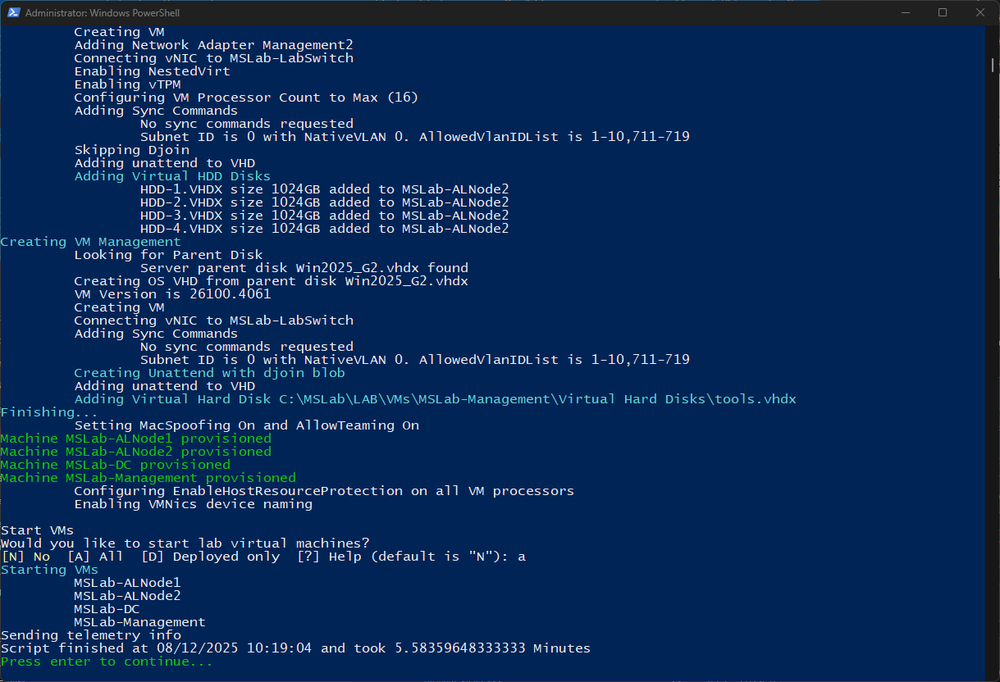

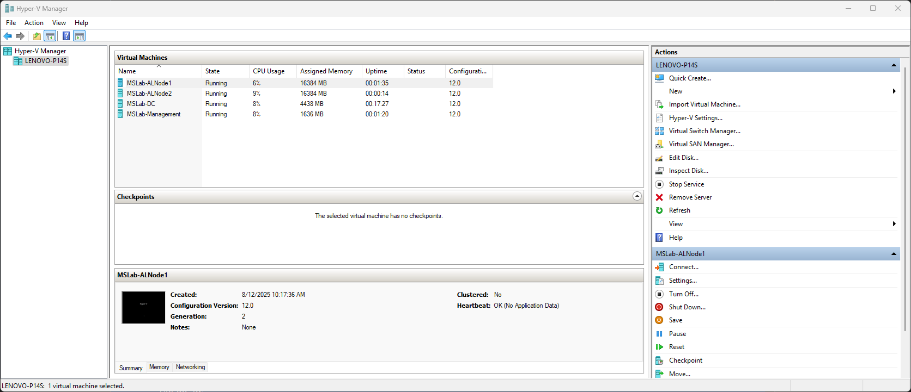


### NTP Prerequisite (Virtual Lab)

To successfully configure NTP server it's necessary to disable time synchronization from Hyper-V host.

Run following code **from hyper-v host** to disable time sync

```PowerShell
Get-VM *ALNode* | Disable-VMIntegrationService -Name "Time Synchronization"

```

### Example Initial Config (AX Nodes) - Example, needs to be modified

If you receive servers from factory and you don't have DHCP, by default there's no Password set. Just log in, and configure password. Next thing is to configure Server Name, and IP config (+VLAN if needed)

Here is code example that you can use if you provision multiple servers, so you can just populate pscustomobject and have one universal script.

```PowerShell
$Servers=@()
$Servers+=[PSCustomObject]@{SerialNumber="asdfgh" ; ComputerName="Node1" ; NICName="Integrated NIC 1 Port 1-1" ;  IPAddress= "10.0.0.101" <# ; VLANID=101 #> }
$Servers+=[PSCustomObject]@{SerialNumber="qwerty" ; ComputerName="Node2" ; NICName="Integrated NIC 1 Port 1-1" ;  IPAddress= "10.0.0.102" <# ; VLANID=101 #> }
$DefaultGateway="10.0.0.1"
$DNSServerAddresses=("10.0.0.1","10.0.0.2")

$Serialnumber=(Get-CimInstance -ClassName win32_bios).SerialNumber
#lookup server in PSCustomObject
$Server=($Servers | Where-Object Serialnumber -EQ $Serialnumber)

Rename-Computer -NewName $Server.ComputerName
New-NetIPAddress -InterfaceAlias $Server.NICName -IPAddress $Server.IPAddress -PrefixLength 24 -DefaultGateway $DefaultGateway -Confirm:$false
Set-DnsClientServerAddress -InterfaceAlias $Server.NICName  -ServerAddresses $DNSServerAddresses
if ($Server.VLANID){
    Set-NetAdapter -VlanID $Server.VLANID -InterfaceAlias $Server.NicName
    #note: you should also configure VLAN for second NIC in Management intent (as it's checked in prerequisites - technically not needed, but still checked as for now (02/2025))
}
Restart-Computer
 
```

## The Lab

**Run all commands from Management machine**

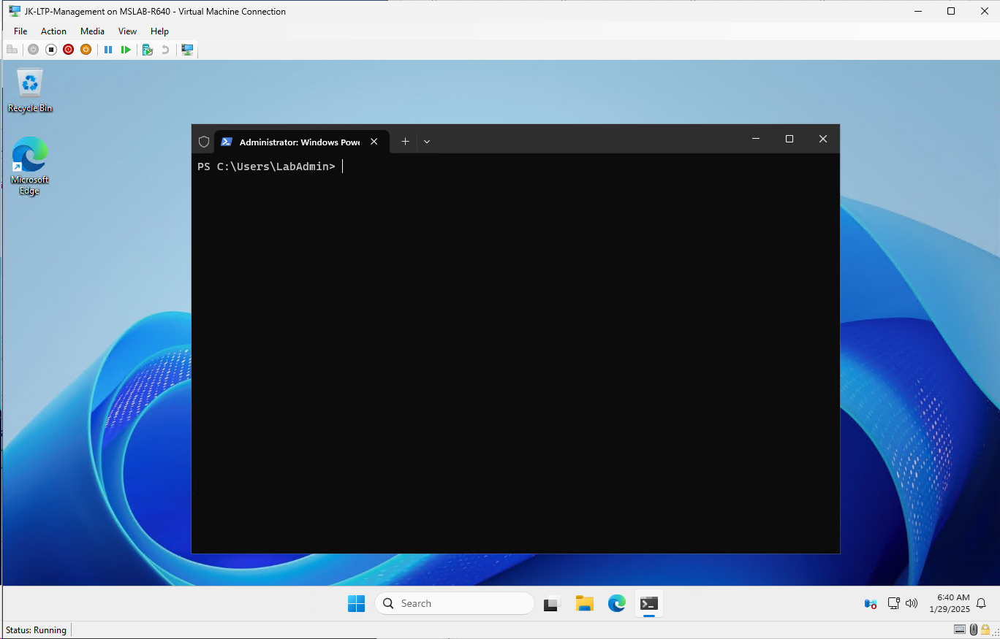

### Define your lab variables

```PowerShell
#variables for Azure Local cluster nodes
$Servers="ALNode1","ALNode2"
$UserName="Administrator"
$Password="LS1setup!"
$SecuredPassword = ConvertTo-SecureString $password -AsPlainText -Force
$Credentials= New-Object System.Management.Automation.PSCredential ($UserName,$SecuredPassword)

#variables for AD Preparation 
$AsHCIOUName="OU=ALClus01,DC=Corp,DC=contoso,DC=com"
$LCMUserName="ALClus01-LCMUser"
$LCMPassword="LS1setup!LS1setup!"

#Create LCM credentials
$SecuredPassword = ConvertTo-SecureString $LCMPassword -AsPlainText -Force
$LCMCredentials= New-Object System.Management.Automation.PSCredential ($LCMUserName,$SecuredPassword)

#Arc Gateway variables
$GatewayName="ALClus01-ArcGW"
$ResourceGroupName="ALClus01-RG"
$Location="eastus" #list of supported regions: https://learn.microsoft.com/en-us/azure/azure-local/concepts/system-requirements-23h2?view=azloc-2507&tabs=azure-public#azure-requirements
```


### Task01 - Validate connectivity to servers

#### Step 1 Test name resolution works with simple ping

> If name resolution does not work, simply add IPs to hosts file  you can even use [Host File Editor](https://learn.microsoft.com/en-us/windows/powertoys/hosts-file-editor)

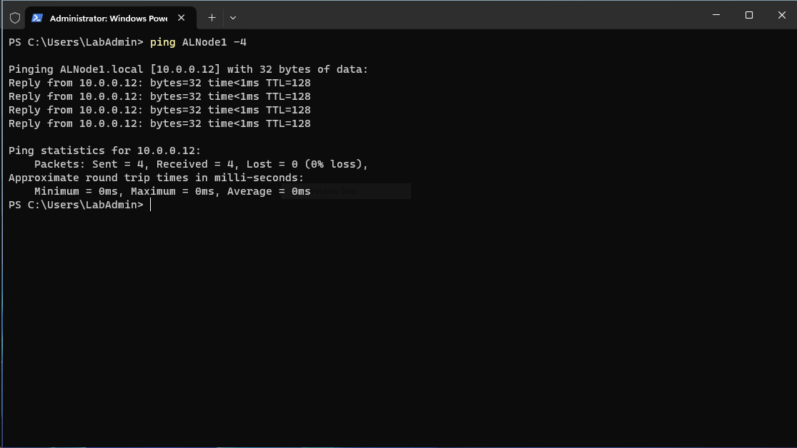

Notice, that host is replying. Latest image Azure Local already allows ICMP packets. Important is, that name resolution works

#### Step 2 Check WinRM connectivity

```PowerShell
foreach ($Server in $Servers){
    Test-NetConnection -ComputerName $Server -CommonTCPPort WINRM
}
```

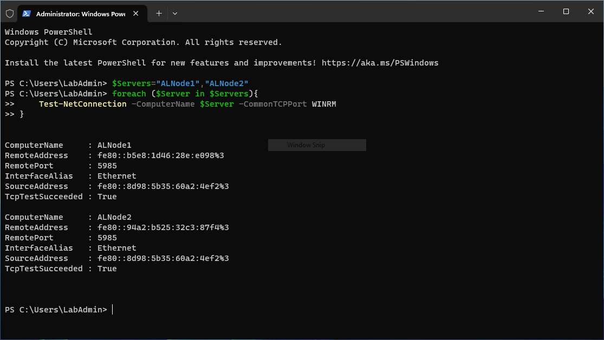

> If WINRM fails and if your management is in different subnet, Windows Firewall is by default configured to accept connections on local subnet only

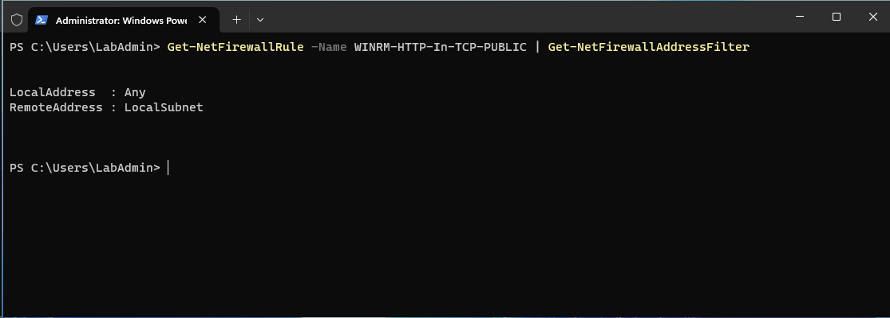

> you can modify it by running following code on every node (any, or just some IP address/range)

```Powershell
Get-NetFirewallRule -Name WINRM-HTTP-In-TCP-PUBLIC | Get-NetFirewallAddressFilter | Set-NetFirewallAddressFilter -RemoteAddress Any
 
```

#### Step 3 Connect to servers using WinRM

```PowerShell

#configure trusted hosts to be able to communicate with servers
$TrustedHosts=@()
$TrustedHosts+=$Servers
Set-Item WSMan:\localhost\Client\TrustedHosts -Value $($TrustedHosts -join ',') -Force

#Send some command to servers
Invoke-Command -ComputerName $Servers -ScriptBlock {
    Get-NetAdapter
} -Credential $Credentials

```

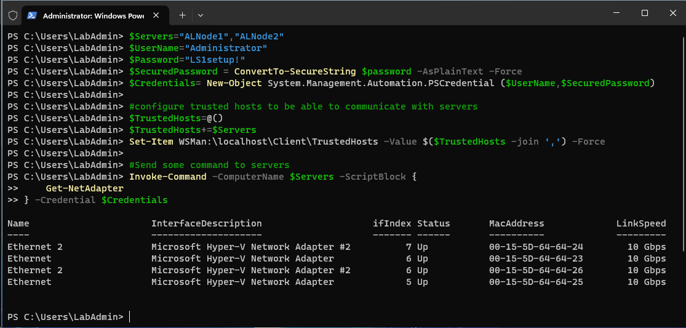

### Task02 - Install features & drivers 

If you receive servers from factory, drivers are already installed, you can completely skip this task

#### Step 1 Install server features - skip if you use latest media

Features are optional as features are already present in latest ISO.

```PowerShell
#install hyper-v and Failover-Clustering feature (this is useful if you use older ISO)
#failover clustering will enable firewall rules such as icmp, computer management, event log management... 

Invoke-Command -ComputerName $servers -ScriptBlock {
    Enable-WindowsOptionalFeature -FeatureName Microsoft-Hyper-V -Online -NoRestart
    Install-WindowsFeature -Name Failover-Clustering
} -Credential $Credentials

```

#### Step 2 Install Network Drivers - AXnodes - only if you are not using Dell media

```PowerShell
#you can lookup latest driver in https://dell.github.io/azurestack-docs/docs/hci/supportmatrix/

    #region check version first
        $NICs=Invoke-Command -ComputerName $Servers -Credential $Credentials -ScriptBlock {get-NetAdapter}
        $NICs | Where-Object {$_.InterfaceDescription -like "Intel*" -or $_.InterfaceDescription -Like "Mellanox*"} | Select-Object Driver*
    #endregion

    #region check if NICs are Intel or Mellanox
        $NICs=Invoke-Command -ComputerName $servers -ScriptBlock {
            Get-NetAdapter
        } -Credential $Credentials
        If ($NICs | Where InterfaceDescription -like "Mellanox*" ){
            #nvidia/mellanox
            $URL="https://dl.dell.com/FOLDER13036121M/1/Network_Driver_3G71F_WN64_25.1_A00.EXE"
        }else{
            #intel
            $URL="https://dl.dell.com/FOLDER13356094M/2/Network_Driver_J4YG9_WN64_24.0.0_A00.EXE"
        }
    #endregion

    #region download
        #Set up web client to download files with authenticated web request in case there's a proxy
        $WebClient = New-Object System.Net.WebClient
        #$proxy = new-object System.Net.WebProxy
        $proxy = [System.Net.WebRequest]::GetSystemWebProxy()
        $proxy.Credentials = [System.Net.CredentialCache]::DefaultCredentials
        #$proxy.Address = $proxyAdr
        #$proxy.useDefaultCredentials = $true
        $WebClient.proxy = $proxy
        #add headers wihth user-agent as some versions of SBE requires it for download
        $webclient.Headers.Add("User-Agent", "WhateverUser-AgentString/1.0")
        $FileName=$($URL.Split("/")| Select-Object -Last 1)
        $WebClient.DownloadFile($URL,"$env:userprofile\Downloads\$FileName")
    #endregion

    #region copy driver to nodes and install
        $sessions = New-PSSession -ComputerName $Servers -Credential $Credentials
        foreach ($Session in $Sessions){
            Copy-Item -Path $env:userprofile\Downloads\$FileName -Destination c:\users\$UserName\Downloads\$FileName -ToSession $session
        }
        
        #install
        Invoke-Command -ComputerName $Servers -ScriptBlock {
            Start-Process -FilePath c:\users\$Using:UserName\Downloads\$using:FileName -ArgumentList "/i /s" -Wait
        } -Credential $Credentials
    #endregion

    #region check version again
        $NICs=Invoke-Command -ComputerName $Servers -Credential $Credentials -ScriptBlock {get-NetAdapter}
        $NICs | Where-Object {$_.InterfaceDescription -like "Intel*" -or $_.InterfaceDescription -Like "Mellanox*"} | Select-Object Driver*
    #endregion

```

Before

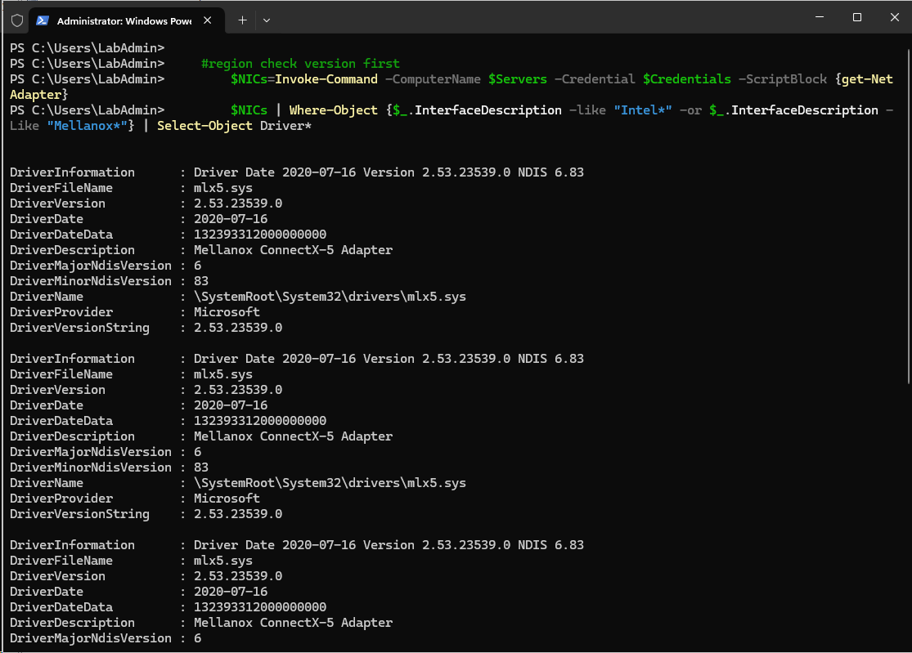

After

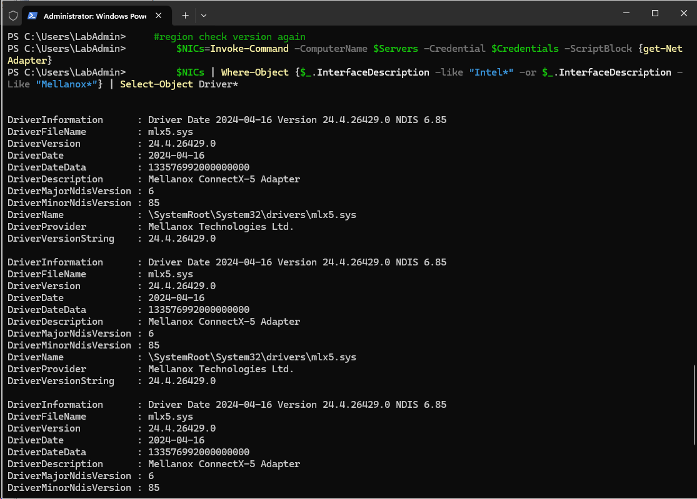


#### Step 3 Install Dell Drivers - only if you are not using Dell media, or if you need to downgrade firmware

Following example installs all drivers and in case you have newer drivers, it will downgrade. You can simply modify the code to just scan for compliance and display status. This will also make your life easier if for some reason you updated to newer drivers than SBE. SBE would fail as firmware extension can't downgrade.

```PowerShell
#region Dell AX Nodes
    #region update servers with latest hardware updates
        $DSUDownloadFolder="$env:USERPROFILE\Downloads\DSU"

        #Set up web client to download files with authenticated web request
        $WebClient = New-Object System.Net.WebClient
        #$proxy = new-object System.Net.WebProxy
        $proxy = [System.Net.WebRequest]::GetSystemWebProxy()
        $proxy.Credentials = [System.Net.CredentialCache]::DefaultCredentials
        #$proxy.Address = $proxyAdr
        #$proxy.useDefaultCredentials = $true
        $WebClient.proxy = $proxy

        #Download DSU
        #https://github.com/DellProSupportGse/Tools/blob/main/DART.ps1
        #download latest DSU to Downloads
            $LatestDSU="https://dl.dell.com/FOLDER10889507M/1/Systems-Management_Application_RPW7K_WN64_2.0.2.3_A00.EXE"
            if (-not (Test-Path $DSUDownloadFolder -ErrorAction Ignore)){New-Item -Path $DSUDownloadFolder -ItemType Directory}
            #Start-BitsTransfer -Source $LatestDSU -Destination $DSUDownloadFolder\DSU.exe
            $WebClient.DownloadFile($LatestDSU,"$DSUDownloadFolder\DSU.exe")

        #Download catalog and unpack
            #Start-BitsTransfer -Source "https://downloads.dell.com/catalog/ASHCI-Catalog.xml.gz" -Destination "$DSUDownloadFolder\ASHCI-Catalog.xml.gz"
            $WebClient.DownloadFile("https://downloads.dell.com/catalog/ASHCI-Catalog.xml.gz","$DSUDownloadFolder\ASHCI-Catalog.xml.gz")     

            #unzip gzip to a folder https://scatteredcode.net/download-and-extract-gzip-tar-with-powershell/
            Function Expand-GZipArchive{
                Param(
                    $infile,
                    $outfile = ($infile -replace '\.gz$','')
                    )
                $input = New-Object System.IO.FileStream $inFile, ([IO.FileMode]::Open), ([IO.FileAccess]::Read), ([IO.FileShare]::Read)
                $output = New-Object System.IO.FileStream $outFile, ([IO.FileMode]::Create), ([IO.FileAccess]::Write), ([IO.FileShare]::None)
                $gzipStream = New-Object System.IO.Compression.GzipStream $input, ([IO.Compression.CompressionMode]::Decompress)
                $buffer = New-Object byte[](1024)
                while($true){
                    $read = $gzipstream.Read($buffer, 0, 1024)
                    if ($read -le 0){break}
                    $output.Write($buffer, 0, $read)
                    }
                $gzipStream.Close()
                $output.Close()
                $input.Close()
            }
            Expand-GZipArchive "$DSUDownloadFolder\ASHCI-Catalog.xml.gz" "$DSUDownloadFolder\ASHCI-Catalog.xml"

        #upload DSU and catalog to servers
        $Sessions=New-PSSession -ComputerName $Servers -Credential $Credentials
        Invoke-Command -Session $Sessions -ScriptBlock {
            if (-not (Test-Path $using:DSUDownloadFolder -ErrorAction Ignore)){New-Item -Path $using:DSUDownloadFolder -ItemType Directory}
        }
        foreach ($Session in $Sessions){
            Copy-Item -Path "$DSUDownloadFolder\DSU.exe" -Destination "$DSUDownloadFolder" -ToSession $Session -Force -Recurse
            Copy-Item -Path "$DSUDownloadFolder\ASHCI-Catalog.xml" -Destination "$DSUDownloadFolder" -ToSession $Session -Force -Recurse
        }

        #install DSU
        Invoke-Command -Session $Sessions -ScriptBlock {
            Start-Process -FilePath "$using:DSUDownloadFolder\DSU.exe" -ArgumentList "/silent" -Wait 
        }

        #Check compliance
        Invoke-Command -Session $Sessions -ScriptBlock {
            & "C:\Program Files\Dell\DELL System Update\DSU.exe" --compliance --output-format="json" --output="$using:DSUDownloadFolder\Compliance.json" --catalog-location="$using:DSUDownloadFolder\ASHCI-Catalog.xml"
        }

        #collect results
        $Compliance=@()
        foreach ($Session in $Sessions){
            $json=Invoke-Command -Session $Session -ScriptBlock {Get-Content "$using:DSUDownloadFolder\Compliance.json"}
            $object = $json | ConvertFrom-Json 
            $components=$object.SystemUpdateCompliance.UpdateableComponent
            $components | Add-Member -MemberType NoteProperty -Name "ClusterName" -Value $ClusterName
            $components | Add-Member -MemberType NoteProperty -Name "ServerName" -Value $Session.ComputerName
            $Compliance+=$Components
        }

        #display results
        $Compliance | Out-GridView

        #Or just choose what updates to install
        #$Compliance=$Compliance | Out-GridView -OutputMode Multiple

        #or Select only NIC drivers/firmware (as the rest will be processed by SBE)
        #$Compliance=$Compliance | Where-Object categoryType -eq "NI"

        #Install Dell updates https://www.dell.com/support/home/en-us/product-support/product/system-update/docs
        Invoke-Command -Session $Sessions -ScriptBlock {
            $Packages=(($using:Compliance | Where-Object {$_.ServerName -eq $env:computername -and $_.compliancestatus -eq $false}))
            if ($Packages){
                $UpdateNames=($packages.PackageFilePath | Split-Path -Leaf) -join ","
                & "C:\Program Files\Dell\DELL System Update\DSU.exe" --catalog-location="$using:DSUDownloadFolder\ASHCI-Catalog.xml" --update-list="$UpdateNames" --apply-upgrades --apply-downgrades
            }
        }
        $Sessions | Remove-PSSession
#endregion
 
```

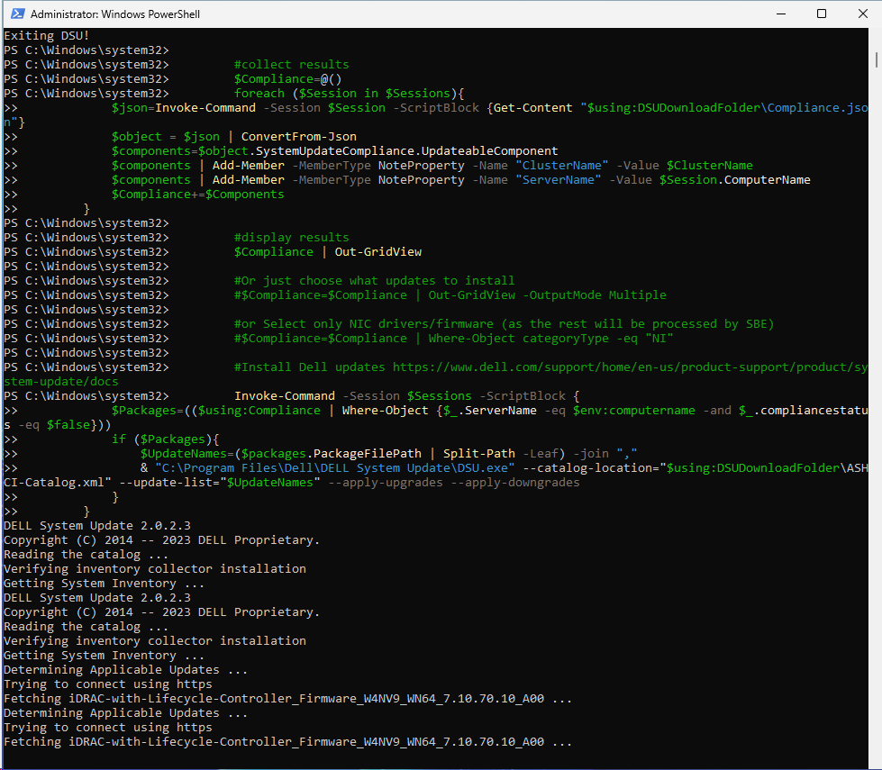

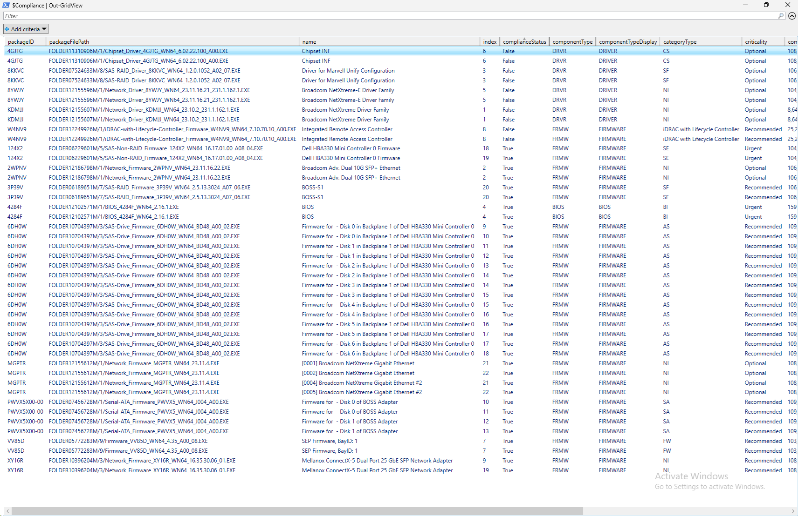

#### Step 4 Restart servers to apply changes

Needed only if you installed features and all dell drivers (as firmware update requires reboot)

```PowerShell
#region restart servers to apply changes
    Restart-Computer -ComputerName $Servers -Credential $Credentials -WsmanAuthentication Negotiate -Wait -For PowerShell
    Start-Sleep 20 #Failsafe as Hyper-V needs 2 reboots and sometimes it happens, that during the first reboot the restart-computer evaluates the machine is up
    #make sure computers are restarted
    Foreach ($Server in $Servers){
        do{$Test= Test-NetConnection -ComputerName $Server -CommonTCPPort WINRM}while ($test.TcpTestSucceeded -eq $False)
    }
#endregion

```


#### Step 5 Rename Network adapters - Optional

Since new ISO is renaming adapters to simply Port 0, Port1, ... it might be useful to revert back to original names that describe physical position

```PowerShell
Invoke-Command -ComputerName $Servers -ScriptBlock {
    $AdaptersHWInfo=Get-NetAdapterHardwareInfo
    foreach ($Adapter in $AdaptersHWInfo){
        #PCIe NICs do not have PCIDeviceLabelString
        if ($adapter.Slot){
            $NewName="Slot $($Adapter.Slot) Port $($Adapter.Function +1)"
        #then the remaining NICs should have PCIDeviceLabelString
        }elseif ($adapter.PCIDeviceLabelString){
            $NewName=$adapter.PCIDeviceLabelString
        }else{
        #just in case there is not any nic with conditions above.
            $NewName="NIC$($Adapter.Function +1)"
        }
        $adapter | Rename-NetAdapter -NewName $NewName
    }
} -Credential $Credentials
 
```

Before

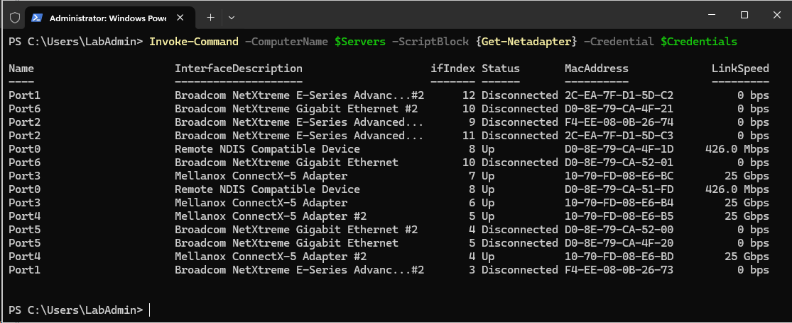

After

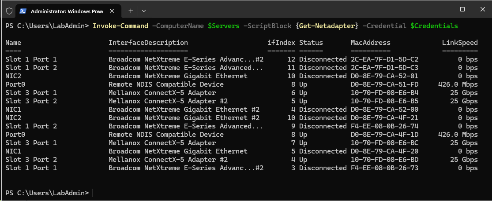

### Task03 - Validate environment using Environment Checker tool

* about: https://learn.microsoft.com/en-in/azure/azure-local/manage/use-environment-checker?tabs=connectivity

Since we already have credentials and TrustedHosts configured in Powershell from Task01, we can run the following code

> for some reason I was not able to run it using sessions as it complained about not being able to create PSDrive

```PowerShell
#install modules (Not needed with latest media
<#
Invoke-Command -ComputerName $Servers -Scriptblock {
    Install-PackageProvider -Name NuGet -MinimumVersion 2.8.5.201 -Force
    Install-Module PowerShellGet -AllowClobber -Force
    Install-Module -Name AzStackHci.EnvironmentChecker -Force
} -Credential $Credentials
#>
#validate environment
$result=Invoke-Command -ComputerName $Servers -Scriptblock {
    Invoke-AzStackHciConnectivityValidation -PassThru
} -Credential $Credentials
$result | Out-GridView

```

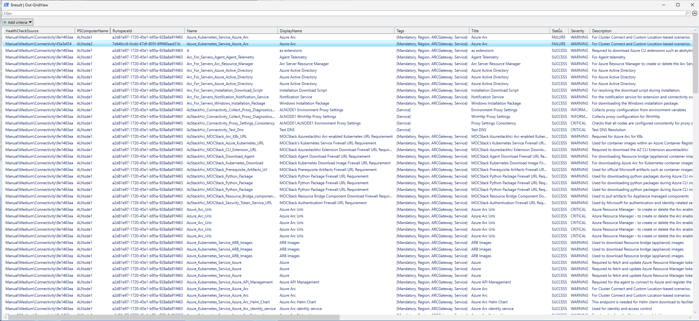

You can select just failed URLs with this PowerShell

```PowerShell
($result | Where-Object Status -eq Failure).TargetResourceName | Select-Object -Unique
 
```

### Task04 - Create AD Prerequisites

Simply run the following PowerShell script to create objects

> LCM = LifeCycle Management account. Account that will be used to domain join machines and create CAU account.

```PowerShell
#create objects for Azure Local in Active Directory
    #install posh module for prestaging Active Directory
    Install-PackageProvider -Name NuGet -Force
    Install-Module AsHciADArtifactsPreCreationTool -Repository PSGallery -Force

    #make sure active directory module and GPMC is installed
    Install-WindowsFeature -Name RSAT-AD-PowerShell,GPMC

    #populate objects
    New-HciAdObjectsPreCreation -AzureStackLCMUserCredential $LCMCredentials -AsHciOUName $AsHCIOUName

    #to check OU (and future cluster) in GUI install management tools
    Install-WindowsFeature -Name "RSAT-ADDS","RSAT-Clustering"

```

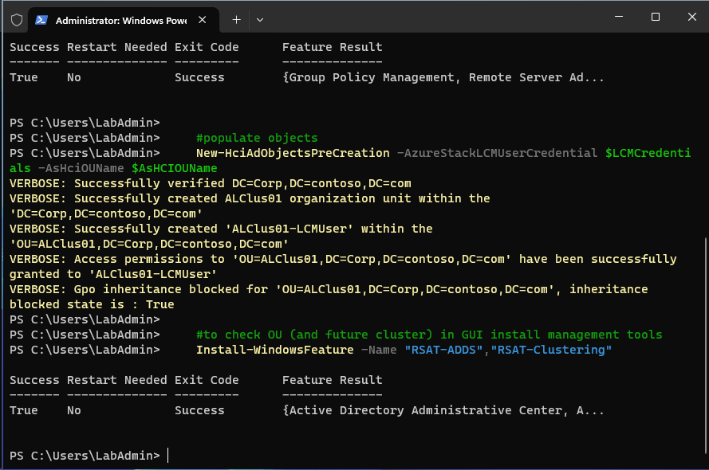


### Task05 - Create Azure Resources

Following script will simply create Resource Group and Arc Gateway (optional).

```PowerShell
#login to azure
    #download Azure module
    Install-PackageProvider -Name NuGet -MinimumVersion 2.8.5.201 -Force
    if (!(Get-InstalledModule -Name az.accounts -ErrorAction Ignore)){
        Install-Module -Name Az.Accounts -Force 
    }
    #login using device authentication
    Connect-AzAccount -UseDeviceAuthentication

    #assuming new az.accounts module was used and it asked you what subscription to use - then correct subscription is selected for context
    $Subscription=(Get-AzContext).Subscription

    #install az resources module
        if (!(Get-InstalledModule -Name az.resources -ErrorAction Ignore)){
            Install-Module -Name az.resources -Force
        }

    #create resource group
        if (-not(Get-AzResourceGroup -Name $ResourceGroupName -ErrorAction Ignore)){
            New-AzResourceGroup -Name $ResourceGroupName -Location $location
        }
#region (Optional) configure Arc Gateway
<#
    #install az.arcgateway module
        if (!(Get-InstalledModule -Name az.arcgateway -ErrorAction Ignore)){
            Install-Module -Name az.arcgateway -Force
        }
    #make sure "Microsoft.HybridCompute" is registered (and possibly other RPs)
        Register-AzResourceProvider -ProviderNamespace "Microsoft.HybridCompute"
        Register-AzResourceProvider -ProviderNamespace "Microsoft.GuestConfiguration"
        Register-AzResourceProvider -ProviderNamespace "Microsoft.HybridConnectivity"
        Register-AzResourceProvider -ProviderNamespace "Microsoft.AzureStackHCI"

    #create GW
    if (Get-AzArcGateway -Name $gatewayname -ResourceGroupName $ResourceGroupName -ErrorAction Ignore){
        $ArcGWInfo=Get-AzArcGateway -Name $gatewayname -ResourceGroupName $ResourceGroupName
    }else{
        $ArcGWInfo=New-AzArcGateway -Name $GatewayName -ResourceGroupName $ResourceGroupName -Location $Location -SubscriptionID $Subscription.ID
    }
#>
#endregion

#generate variables for use in this window
$SubscriptionID=$Subscription.ID
$Region=$Location
$TenantID=$Subscription.TenantID
$ArcGatewayID=$ArcGWInfo.ID

#output variables (so you can just copy it and have powershell code to create variables in another session or you can copy it to WebUI deployment)
Write-Host -ForegroundColor Cyan @"
    #Variables to copy
    `$SubscriptionID=`"$($Subscription.ID)`"
    `$ResourceGroupName=`"$ResourceGroupName`"
    `$Region=`"$Location`"
    `$TenantID=`"$($subscription.tenantID)`"
    `$ArcGatewayID=`"$(($ArcGWInfo).ID)`"
"@ 
```

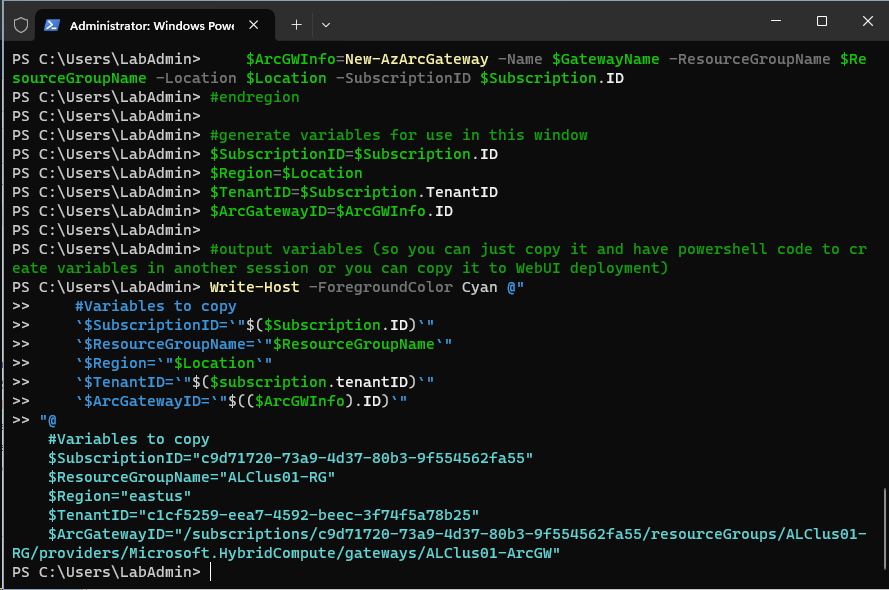

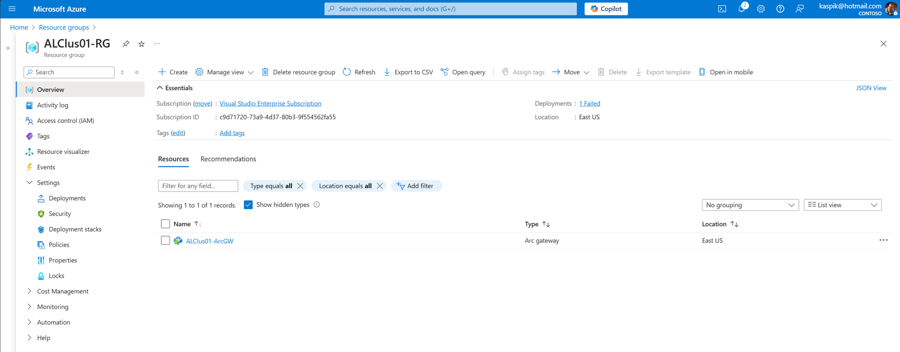


### Task 06a - Connect nodes to Azure - Configurator App

https://learn.microsoft.com/en-us/azure/azure-local/deploy/deployment-arc-register-configurator-app?view=azloc-2505

As you now have all variables needed from Task03, you can proceed with installing and running [Configurator App](https://aka.ms/ConfiguratorAppForHCI) on management machine.

Log in with **Administrator/LS1setup!** and proceed with all steps to register nodes to Azure.

### Task 06b - Connect nodes to Azure - PowerShell

Assuming you have still variables from Task03, you can continue with following PowerShell

More info: https://learn.microsoft.com/en-us/azure/azure-local/deploy/deployment-Arc-register-server-permissions?tabs=powershell

```PowerShell
#Make sure resource providers are registered
Register-AzResourceProvider -ProviderNamespace "Microsoft.AzureArcData"
Register-AzResourceProvider -ProviderNamespace "Microsoft.HybridCompute" 
Register-AzResourceProvider -ProviderNamespace "Microsoft.GuestConfiguration" 
Register-AzResourceProvider -ProviderNamespace "Microsoft.HybridConnectivity" 
Register-AzResourceProvider -ProviderNamespace "Microsoft.AzureStackHCI" 
Register-AzResourceProvider -ProviderNamespace "Microsoft.Kubernetes" 
Register-AzResourceProvider -ProviderNamespace "Microsoft.KubernetesConfiguration" 
Register-AzResourceProvider -ProviderNamespace "Microsoft.ExtendedLocation" 
Register-AzResourceProvider -ProviderNamespace "Microsoft.ResourceConnector" 
Register-AzResourceProvider -ProviderNamespace "Microsoft.HybridContainerService"
Register-AzResourceProvider -ProviderNamespace "Microsoft.Attestation"
Register-AzResourceProvider -ProviderNamespace "Microsoft.Storage"
Register-AzResourceProvider -ProviderNamespace "Microsoft.Insights"

#deploy Arc Agent (with Arc Gateway, without proxy. For more examples visit https://learn.microsoft.com/en-us/azure/azure-local/deploy/deployment-arc-register-server-permissions?tabs=powershell)
    $armtoken = (Get-AzAccessToken).Token
    $id = (Get-AzContext).Account.Id
    $Cloud="AzureCloud"

<# no longer needed
    #check if token is plaintext (older module version outputs plaintext, version 5 outputs secure string)
    # Check if the token is a SecureString
    if ($armtoken -is [System.Security.SecureString]) {
        # Convert SecureString to plaintext
        $armtoken = [System.Runtime.InteropServices.Marshal]::PtrToStringAuto([System.Runtime.InteropServices.Marshal]::SecureStringToBSTR($armtoken))
        Write-Output "Token converted to plaintext."
    }else {
        Write-Output "Token is already plaintext."
    }
#>

<# no longer needed
    #check if ImageCustomizationScheduledTask is not in disabled state (if it's "ready", run it) - will be fixed in 2506
    Invoke-Command -ComputerName $Servers -ScriptBlock {
        $task=Get-ScheduledTask -TaskName ImageCustomizationScheduledTask
        if ($task.State -ne "Disabled" -and $task.State -ne "Running"){
            Write-Output "Starting Scheduled task ImageCustomizationScheduledTask on $env:ComputerName"
            $task | Start-ScheduledTask
        }
    } -Credential $Credentials
    #wait until it's disabled
    Invoke-Command -ComputerName $Servers -ScriptBlock {
        $task=Get-ScheduledTask -TaskName ImageCustomizationScheduledTask
        if ($task.state -eq "running"){
            do {
                Write-Output "Waiting for ImageCustomizationScheduledTask on $env:computerName to finish"
                Start-Sleep 1
                $task=Get-ScheduledTask -TaskName ImageCustomizationScheduledTask
            } while ($task.state -ne "Disabled")
        }
    } -Credential $Credentials
#> 
    #register servers
    Invoke-Command -ComputerName $Servers -ScriptBlock {
        Invoke-AzStackHciArcInitialization -SubscriptionID $using:SubscriptionID -ResourceGroup $using:ResourceGroupName -TenantID $using:TenantID -Cloud $using:Cloud -Region $Using:Location -ArmAccessToken $using:ARMtoken -AccountID $using:id #-ArcGatewayID $using:ArcGatewayID
    } -Credential $Credentials
 
```

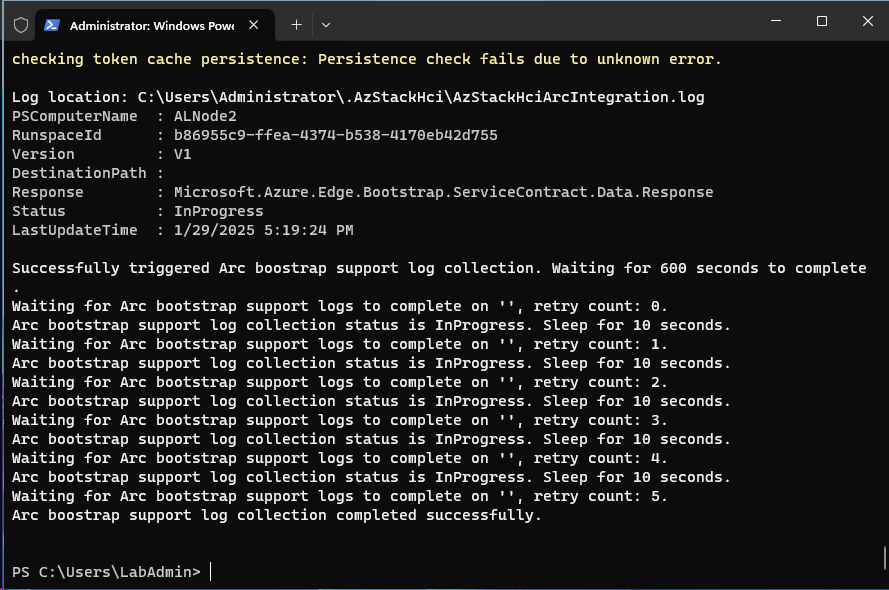

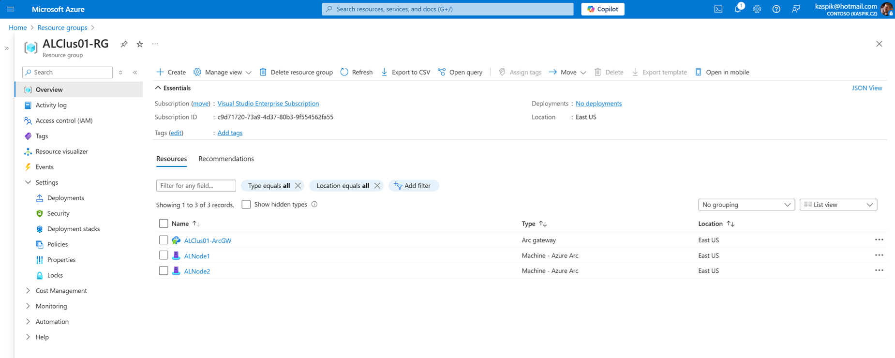


### Task07 - Validation Prerequisites

#### Step 1 Password complexity (in MSLab is password not complex enough)

In MSLab password is not complex enough. You can change password using following script.

```PowerShell
#region and make sure password is complex and long enough (12chars at least)
    $NewPassword="LS1setup!LS1setup!"
    Invoke-Command -ComputerName $servers -ScriptBlock {
        Set-LocalUser -Name Administrator -AccountNeverExpires -Password (ConvertTo-SecureString $Using:NewPassword -AsPlainText -Force)
    } -Credential $Credentials
    #create new credentials
    $UserName="Administrator"
    $SecuredPassword = ConvertTo-SecureString $NewPassword -AsPlainText -Force
    $Credentials= New-Object System.Management.Automation.PSCredential ($UserName,$SecuredPassword)
#endregion

```

#### Step 2 IP Configuration

In MSLab is DHCP enabled. This script will make sure there's just one GW and DHCP address is converted to Static.

```PowerShell
#region to successfully validate you need make sure there's just one GW
    #make sure there is only one management NIC with IP address (setup is complaining about multiple gateways)
    Invoke-Command -ComputerName $servers -ScriptBlock {
        Get-NetIPConfiguration | Where-Object IPV4defaultGateway | Get-NetAdapter | Sort-Object Name | Select-Object -Skip 1 | Set-NetIPInterface -Dhcp Disabled
    } -Credential $Credentials
#endregion

#region Convert DHCP address to Static (since 2411 there's a check for static IP)
    Invoke-Command -ComputerName $Servers -ScriptBlock {
        $InterfaceAlias=(Get-NetIPAddress -AddressFamily IPv4 | Where-Object {$_.IPAddress -NotLike "169*" -and $_.PrefixOrigin -eq "DHCP"}).InterfaceAlias
        $IPConf=Get-NetIPConfiguration -InterfaceAlias $InterfaceAlias
        $IPAddress=Get-NetIPAddress -AddressFamily IPv4 -InterfaceAlias $InterfaceAlias
        $IP=$IPAddress.IPAddress
        $Index=$IPAddress.InterfaceIndex
        $GW=$IPConf.IPv4DefaultGateway.NextHop
        $Prefix=$IPAddress.PrefixLength
        $DNSServers=@()
        $ipconf.dnsserver | ForEach-Object {if ($_.addressfamily -eq 2){$DNSServers+=$_.ServerAddresses}}
        Set-NetIPInterface -InterfaceIndex $Index -Dhcp Disabled
        New-NetIPAddress -InterfaceIndex $Index -AddressFamily IPv4 -IPAddress $IP -PrefixLength $Prefix -DefaultGateway $GW -ErrorAction SilentlyContinue
        Set-DnsClientServerAddress -InterfaceIndex $index -ServerAddresses $DNSServers
    } -Credential $Credentials
#endregion
 
```

#### Step 3 NTP Server (if NTP protocol is blocked by firewall and servers time is not synced)

This script simply tests if offset between management machine and any of the servers is greater than 2s. If so, it will configure NTP server. Just provide your NTP server (you can use domain controller)

```PowerShell
$NTPServer="DC.corp.contoso.com"  

#test if there is an time offset on servers
Foreach ($Server in $Servers){
    $localtime=get-date
    $delay=Measure-Command -Expression {
        $remotetime=Invoke-Command -ComputerName $Server -ScriptBlock {get-date} -Credential $Credentials
    }

    $Offset=$localtime-$remotetime+$Delay
    if ([math]::Abs($Offset.Seconds) -gt 10){
        $SyncNeeded=$True
    }else{
        $SyncNeeded=$false
    }
}

#if offset is greater than 10 seconds (I pulled this number out of thin air. I guess it should be less than 5 minutes or so), simply configure NTP servers

If ($SyncNeeded){
    Write-Output "Time offset found, NTP Server needs to be configured."
    #Configure NTP
    Invoke-Command -ComputerName $servers -ScriptBlock {
            w32tm /config /manualpeerlist:$using:NTPServer /syncfromflags:manual /update
            Restart-Service w32time
    } -Credential $Credentials
}

```

### Task 08 - Deploy Azure Local from Azure Portal

Use values below for virtual cluster

```
Basics:
    Resource Group: ALClus01-RG
    ClusterName:    ALClus01
    Keyvaultname:   <Just generate new>

Configuration:
    New Configuration

Networking
    Network Switch for storage
    Group All traffic

    Network adapter 1:          Ethernet
    Network adapter 1 VLAN ID:  711 (default)
    Network adapter 2:          Ethernet 2
    Network adapter 2 VLAN ID:  712 (default)

    RDMA Protocol:              Disabled (in case you are running lab in VMs)
    Jumbo Frames:               1514 (in case you are running lab in VMs as hyper-v does not by default support Jumbo Frames)

    Starting IP:                10.0.0.111
    ENding IP:                  10.0.0.116
    Subnet mask:                255.255.255.0
    Default Gateway:            10.0.0.1
    DNS Server:                 10.0.0.1

Management
    Custom location name:       ALClus01

    Azure storage account name: <just generate new>

    Domain:                     corp.contoso.com
    Computer name prefix:       ALClus01
    OU:                         OU=ALClus01,DC=Corp,DC=contoso,DC=com

    Deployment account:
        Username:               ALClus01-LCMUser
        Password:               LS1setup!LS1setup!

    Local Administrator
        Username:               Administrator
    Password:                   LS1setup!LS1setup!

Security:
    Customized security settings
        Unselect Bitlocker for data volumes (would consume too much space)

Advanced:
    Create workload volumes (Default)

    **Please understand that the workload volumes will use thin provisioning, but their default max size is about 2x larger than the pool capacity. This is by-design.**


Tags:
    <keep default>
```

