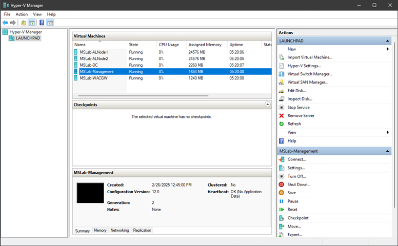
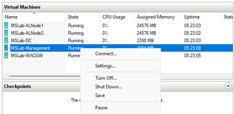

# Azure Local Cloud Deployment - Simplified lab

<!-- TOC -->

- [Azure Local Cloud Deployment - Simplified lab](#azure-local-cloud-deployment---simplified-lab)
    - [About the lab](#about-the-lab)
    - [Prerequisites](#prerequisites)
    - [Task 01 - Navigating in the lab](#task-01---navigating-in-the-lab)
        - [Step 01 - Explore Hyper-V VMs](#step-01---explore-hyper-v-vms)
        - [Step 02 - Explore Management VM](#step-02---explore-management-vm)
    - [Task 02 - Register servers into Azure](#task-02---register-servers-into-azure)
        - [Step 01 - Create Azure Prerequisites](#step-01---create-azure-prerequisites)
    - [Task 03 - Register servers to Azure](#task-03---register-servers-to-azure)
        - [Step 01 - Navigate to webUI](#step-01---navigate-to-webui)
        - [Step 02 - Log in](#step-02---log-in)
        - [Step 03 - Initiate Arc Agent Setup](#step-03---initiate-arc-agent-setup)
        - [Step 04 - Change IP to static](#step-04---change-ip-to-static)
        - [Step 05 - Arc Agent Setup](#step-05---arc-agent-setup)
        - [Step 06 - Repeat steps 01-05 for ALNode2](#step-06---repeat-steps-01-05-for-alnode2)
    - [Task 04 - Explore what was done](#task-04---explore-what-was-done)
        - [Step 01 - Open Azure Portal](#step-01---open-azure-portal)
        - [Step 02 - Explore ALClus01-RG Resource Group](#step-02---explore-alclus01-rg-resource-group)
    - [Task 05 - Configure prerequisites](#task-05---configure-prerequisites)
        - [Step 01 - Create AD Prerequisites](#step-01---create-ad-prerequisites)
        - [Step 02 - Explore what was created](#step-02---explore-what-was-created)
        - [Step 03 - Fix some servers settings](#step-03---fix-some-servers-settings)
    - [Task 06 - Deploy Azure Local cluster](#task-06---deploy-azure-local-cluster)
        - [Step 01 - Navigate to Azure Local in Azure Portal](#step-01---navigate-to-azure-local-in-azure-portal)
        - [Step 02 - Deploy Azure Local - Basics tab](#step-02---deploy-azure-local---basics-tab)
        - [Step 03 - Deploy Azure Local - Configuration tab](#step-03---deploy-azure-local---configuration-tab)
        - [Step 04 - Deploy Azure Local - Networking tab](#step-04---deploy-azure-local---networking-tab)
        - [Step 03 - Deploy Azure Local - Management tab](#step-03---deploy-azure-local---management-tab)
        - [Step 04 - Deploy Azure Local - Management tab](#step-04---deploy-azure-local---management-tab)
        - [Step 05 - Deploy Azure Local - Advanced & Tags tab](#step-05---deploy-azure-local---advanced--tags-tab)
        - [Step 06 - Deploy Azure Local - Validation tab](#step-06---deploy-azure-local---validation-tab)
    - [Task 07 - Explore Azure Local cluster in Portal](#task-07---explore-azure-local-cluster-in-portal)
        - [Step 01 - Explore deployment process](#step-01---explore-deployment-process)
    - [Summary](#summary)

<!-- /TOC -->


## About the lab

In this lab you will learn about the Azure Local Deployment process. This process is simplified to fit 30 minutes lab.

This lab is based on [MSLab Scripts](https://aka.ms/MSLab) that deploys Azure Local lab in virtual environment.

If you want to understand full, end-to-end process, it is described in following lab: https://github.com/DellGEOS/AzureLocalHOLs/tree/main/lab-guides/01-AzureLocalCloudDeployment

## Prerequisites

As a Prerequisite, you will need Azure Subscription, where Azure Local will be registered to. You can create free trial with 200$ credit [here](https://azure.microsoft.com/en-in/pricing/offers/ms-azr-0044p/?msockid=28655156ab7063912aa24529aada62da)

If you have your Azure Local Subscription, then make sure you have [required permissions](https://learn.microsoft.com/en-us/azure/azure-local/concepts/system-requirements-23h2?view=azloc-24112#azure-requirements) to be able to register Azure Local.

## Task 01 - Navigating in the lab

### Step 01 - Explore Hyper-V VMs

When logged in the lab (Default username and password is LabAdmin/LS1setup!) notice, that there's a Hyper-V Manager on the desktop.


If you open Hyper-V manager, you will notice, that there are several Virtual Machines running in Hyper-V representing the physical infrastructure for Azure Local.

**MSLab-ALNode1**,**MSLab-ALNode2** - Azure Local nodes.

**MSLab-DC** - Active Directory Domain Controller

**MSLab-Management** - Management machine, from where all management/installation tasks will be performed

**MSLab-WAC** - Windows Admin Center (optional)




Note: the Virtual machines are located in folder MSLab on Volume D:


### Step 02 - Explore Management VM

From Hyper-V manager, right-click on MSLab-Management and select Connect.



When prompted for resolution, slide to Full Screen and click connect


When prompted for Credentials, use the following:

**Username:** Corp\LabAdmin

**Password:** LS1setup!


This machine is now your workspace.

## Task 02 - Register servers into Azure

### Step 01 - Create Azure Prerequisites

You can perform this step "Manually" from Azure Portal (simply creating a Resource Group) or this step can be performed from PowerShell - to be more consistent and easier to document

To perform this task from PowerShell, simply right-click on Start icon in **Management machine** and run **Terminal (Admin)**


Following script will make sure all required modules are installed, will log you in into azure (you can provide device code into https://www.microsoft.com/devicelogin from your phone to not send credentials into Management machine).

You can simply copy it and right-click into Terminal you just opened.

Note: supported regions are:

    East US
    West Europe
    Australia East
    Southeast Asia
    India Central
    Canada Central
    Japan East
    South Central US


```PowerShell
$ResourceGroupName="ALClus01-RG"
$Location="eastus"

#login to azure
    #download Azure module
    Install-PackageProvider -Name NuGet -MinimumVersion 2.8.5.201 -Force
    if (!(Get-InstalledModule -Name az.accounts -ErrorAction Ignore)){
        Install-Module -Name Az.Accounts -Force 
    }
    #login using device authentication
    Connect-AzAccount -UseDeviceAuthentication

    #assuming new az.accounts module was used and it asked you what subscription to use - then correct subscription is selected for context
    $Subscription=(Get-AzContext).Subscription

    #install az resources module
        if (!(Get-InstalledModule -Name az.resources -ErrorAction Ignore)){
            Install-Module -Name az.resources -Force
        }

    #create resource group
        if (-not(Get-AzResourceGroup -Name $ResourceGroupName -ErrorAction Ignore)){
            New-AzResourceGroup -Name $ResourceGroupName -Location $location
        }

#output all info
 Write-Host "" ; Write-Host "SubscriptionID: " -ForegroundColor Cyan -NoNewLine ; Write-Host "$($Subscription.ID)" ; Write-Host "ResourceGroup Name : " -ForegroundColor Cyan -NoNewLine ; Write-Host "$ResourceGroupName" ; Write-Host "Region: " -ForegroundColor Cyan -NoNewLine ; Write-Host "$Location" ; Write-Host "TenantID: " -ForegroundColor Cyan -NoNewLine ; Write-Host "$($Subscription.TenantID)" ;

```

Tip: you can use just use code in your personal device to not provide your credentials.


Example output


Keep the terminal open for next steps.

## Task 03 - Register servers to Azure

### Step 01 - Navigate to webUI

While logged in Management machine, open Edge browser and navigate to https://ALNode1.

When prompted about security issue, simply expand Advanced option and select "Continue to alnode1 (unsafe)" as the web is using self-signed certificate.


Note: When new server is installed, it's renamed to Serial Number. In this lab we use names ALNode1 and ALNode2, but in production you would simply navigate to serial number or IP address.

### Step 02 - Log in

Sign in with following credentials:

    Username: Administrator
    Password: LS1setup!


### Step 03 - Initiate Arc Agent Setup

In the web browser click on Start.


### Step 04 - Change IP to static

In Arc Agent Setup Page 1 - Basics, click on edit button next to the IP address


In Network settings, change Allocation to Static, keep the values and click apply


Note: In advanced settings on this page you can further customize server (Timezone, Name,...)

Once finished, click on Next

### Step 05 - Arc Agent Setup

In this step, provide information from PowerShell script you ran in Task 02 and click Next.


Confirm by clicking at Finish

Once requested, authenticate with device authentication.

### Step 06 - Repeat steps 01-05 for ALNode2

## Task 04 - Explore what was done

### Step 01 - Open Azure Portal

Open browser, and navigate to Azure Portal into Resource Groups https://portal.azure.com/#browse/resourcegroups

### Step 02 - Explore ALClus01-RG Resource Group

From Resource Groups select ALClus01-RG and notice, that ALNode1 and ALNode2 are now in Azure Portal.


## Task 05 - Configure prerequisites

As a prerequisite, it's required to create objects in Active Directory. Following script will create organization unit and Lifecycle account.

It's also needed to fix few things that would prevent deployment.

### Step 01 - Create AD Prerequisites

Run following script to populate objects using Microsoft PowerShell module

```PowerShell
$AsHCIOUName="OU=ALClus01,DC=Corp,DC=contoso,DC=com"
$LCMUserName="ALClus01-LCMUser"
$LCMPassword="LS1setup!LS1setup!"
#Create LCM credentials
$SecuredPassword = ConvertTo-SecureString $LCMPassword -AsPlainText -Force
$LCMCredentials= New-Object System.Management.Automation.PSCredential ($LCMUserName,$SecuredPassword)

#create objects in Active Directory
    #install posh module for prestaging Active Directory
    Install-PackageProvider -Name NuGet -Force
    Install-Module AsHciADArtifactsPreCreationTool -Repository PSGallery -Force

    #make sure active directory module and GPMC is installed
    Install-WindowsFeature -Name RSAT-AD-PowerShell,GPMC

    #populate objects
    New-HciAdObjectsPreCreation -AzureStackLCMUserCredential $LCMCredentials -AsHciOUName $AsHCIOUName

    #to check OU (and future cluster) in GUI install management tools
    Install-WindowsFeature -Name "RSAT-ADDS","RSAT-Clustering"

```


### Step 02 - Explore what was created

run dsa.msc from commandline to open Active Directory Users and Computers mmc snap-in and open ALClus01 organization unit to display ALClus01-LCMUser object.

As you can see, script just created OU and one user. It also delegated permissions. To learn more you can explore this article https://learn.microsoft.com/en-us/azure/azure-local/plan/configure-custom-settings-active-directory?view=azloc-24112


You can also open gpmc.msc to explore that group policy inheritance was blocked.


### Step 03 - Fix some servers settings

There are several things that needs to be considered and if needed fixed. This is just a demonstration on how to connect to remote systems before domain join

Run following script to configure to remove IP address from second network adapter and script will also configure strong password

```PowerShell
$Servers="ALNode1","ALNode2"
$UserName="Administrator"
$Password="LS1setup!"
$SecuredPassword = ConvertTo-SecureString $password -AsPlainText -Force
$Credentials= New-Object System.Management.Automation.PSCredential ($UserName,$SecuredPassword)

#configure trusted hosts to be able to communicate with servers
$TrustedHosts=@()
$TrustedHosts+=$Servers
Set-Item WSMan:\localhost\Client\TrustedHosts -Value $($TrustedHosts -join ',') -Force

#region and make sure password is complex and long enough (12chars at least)
    $NewPassword="LS1setup!LS1setup!"
    Invoke-Command -ComputerName $servers -ScriptBlock {
        Set-LocalUser -Name Administrator -AccountNeverExpires -Password (ConvertTo-SecureString $Using:NewPassword -AsPlainText -Force)
    } -Credential $Credentials
    #create new credentials
    $UserName="Administrator"
    $SecuredPassword = ConvertTo-SecureString $NewPassword -AsPlainText -Force
    $Credentials= New-Object System.Management.Automation.PSCredential ($UserName,$SecuredPassword)
#endregion

#region to successfully validate you need make sure there's just one GW
    #make sure there is only one management NIC with IP address (setup is complaining about multiple gateways)
    Invoke-Command -ComputerName $servers -ScriptBlock {
        Get-NetIPConfiguration | Where-Object IPV4defaultGateway | Get-NetAdapter | Sort-Object Name | Select-Object -Skip 1 | Set-NetIPInterface -Dhcp Disabled
    } -Credential $Credentials
#endregion

```

## Task 06 - Deploy Azure Local cluster

### Step 01 - Navigate to Azure Local in Azure Portal

Navigate to https://portal.azure.com/#view/Microsoft_Azure_ArcCenterUX/ArcCenterMenuBlade/~/hciGetStarted to run Azure Local wizard and click on "Create Instance" button


### Step 02 - Deploy Azure Local - Basics tab

In **Resource Group** select ALClus01-RG

In **Instance Name** fill: ALClus01

In **Select machines to use and validate** click on Add machines and add ALNode1 and ALNode2 and click on Validate selected machine.

Note: if arc extensions are not yet installed, you need to wait a bit. You can check progress at https://portal.azure.com/#view/Microsoft_Azure_ArcCenterUX/ArcCenterMenuBlade/~/servers when you click on ALNode1 or ALNode2 and navigate to Extensions

In **Key vault name** click on **Create a new key vault** and type ALClus01kv-12345 as keyvault name (or any different number as it needs to be unique).

Make sure you click on **Grant Key Vault Permissions** to add required permissions to add/read secrets.

Click on **Next: Configuration** button once ready


### Step 03 - Deploy Azure Local - Configuration tab

In Configuration Tab click on **Next: Networking**

Note: in this tab you can specify your own template you saved before.

### Step 04 - Deploy Azure Local - Networking tab

In **Storage ConnectivityU** select **Network switch for storage**

In **Group network traffic types by intent** keep **Group all traffic**

In **Provide Intent Details** add Ethernet and ethernet 2 adapters and keep default VLANs.

In **Provide Intent Details** click on **Customize network settings** and in **RDMA Protocol** select **disabled** (as this is virtual environment)

In **Allocate IP addresses to the system and services** provide following:

    Starting IP: 10.0.0.101 
    Ending IP: 10.0.0.106
    Subnet Mask: 255.255.255.0
    Default Gateway: 10.0.0.1
    DNS Server: 10.0.0.1

After all info is provided, click on **Validate** and then **Next: Management**


### Step 03 - Deploy Azure Local - Management tab

In **Custom location name** type **ALClus01**

In **Cloud witness** click on **create new** and keep defaults (or add some random number if storage account already exists)

In **Domain** type **corp.contoso.com**

In **OU** type **OU=ALClus01,DC=corp,DC=contoso,DC=com**

In **Deployment account** provide **ALClus01-LCMUser** as username and **LS1setup!LS1setup!** as password

In **Administrator account** provide **Administrator** as username and **LS1setup!LS1setup!** as password

Click **Next: Security**


### Step 04 - Deploy Azure Local - Management tab

In security settings click on  **Customized security settings** and remove **Bitlocker for data volumes** 

Note: If you encrypt data volumes in this virtual environment, you would most likely fill the disk as volumes would be expanded during encryption.


Click **Next: Advanced**

### Step 05 - Deploy Azure Local - Advanced & Tags tab

Keep defaults (Create volumes and required infrastructure volumes) and click **Next: Tags**

In tags tab click **Next: Validation**

### Step 06 - Deploy Azure Local - Validation tab

Wait for Resource creation and once finished, click on **Start validation**

once validation finishes, click on **Review and create** and then **Create**. This will initiate cloud deployment


## Task 07 - Explore Azure Local cluster in Portal

### Step 01 - Explore deployment process

In Azure Portal navigate to [Azure Arc Clusters](https://portal.azure.com/#view/Microsoft_Azure_ArcCenterUX/ArcCenterMenuBlade/~/allClusters) to explore new Cluster.

Under deployments you should be able to see ongoing deployment. The deployment itself takes ~4hours.


It does not make sense to wait. But after successful deployment you should be able to see your cluster in your subscription, until lab will be destroyed.

## Summary 

As result you should see successful cluster deployment


