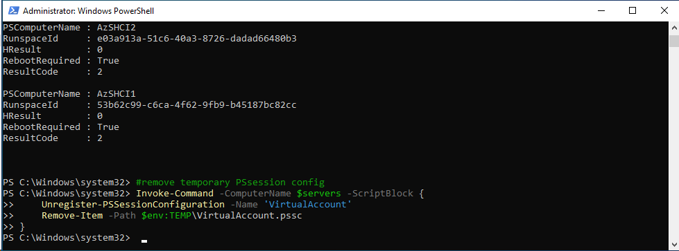
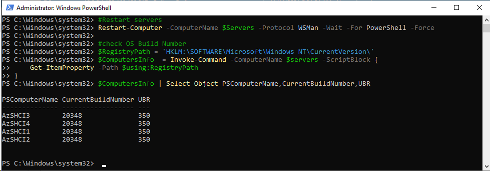
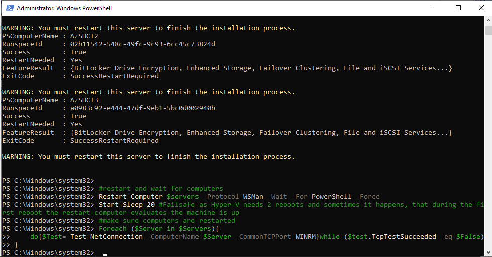
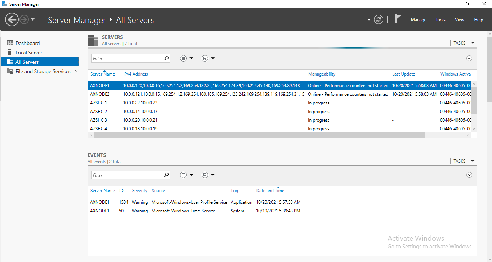
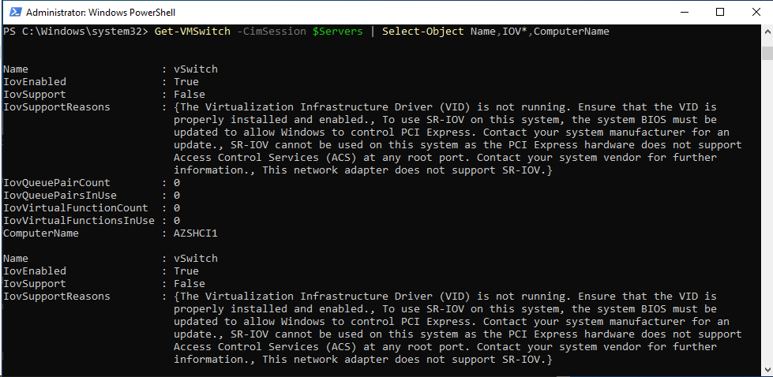
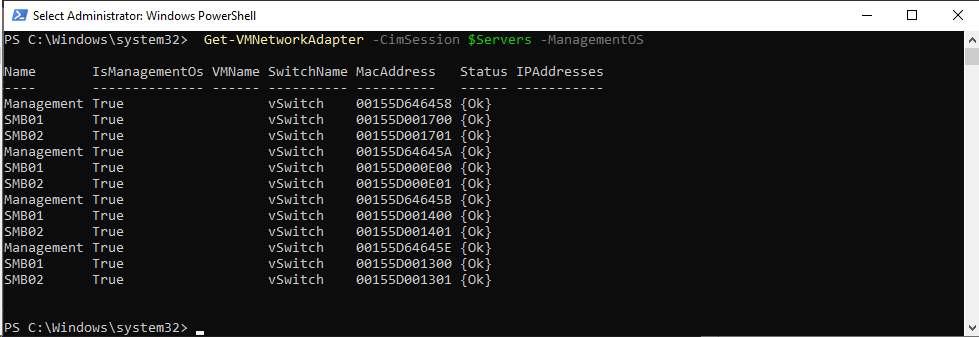

# Deploy Azure Stack HCI Cluster with PowerShell

<!-- TOC -->

- [Deploy Azure Stack HCI Cluster with PowerShell](#deploy-azure-stack-hci-cluster-with-powershell)
    - [About the lab](#about-the-lab)
    - [Prerequisites](#prerequisites)
    - [LabConfig](#labconfig)
    - [Task01 - Install management tools](#task01---install-management-tools)
    - [Task02 - Perform Windows Update](#task02---perform-windows-update)
    - [Task03 - Configure basic settings on servers](#task03---configure-basic-settings-on-servers)
    - [Task04 - Configure Networking](#task04---configure-networking)

<!-- /TOC -->

## About the lab

In this lab you will deploy 4 node Azure Stack HCI cluster using PowerShell. It will demonstrate end-to-end configuration including all details that are not covered by Windows Admin Center deployment.

You can pratice this with Dell AX nodes or in Virtual Machines.

Lab is based on [MSLab Azure Stack HCI deployment scenario](https://github.com/microsoft/MSLab/tree/master/Scenarios/AzSHCI%20Deployment)

## Prerequisites

* Hydrated MSLab with LabConfig from [01-HydrateMSLab](admin-guides/01-HydrateMSLab/readme.md)

* Understand [how MSLab works](admin-guides/02-WorkingWithMSLab/readme.md)

* Optional - [OS deployed on hardware](admin-guides/03-DeployPhysicalServersWithMSLab/readme.md)

## LabConfig

Below LabConfig will deploy 4 nodes for Azure Stack HCI 21H2. You can modify number of Virtual Machines by modyfing number. You can also modify Parent Disk Name by modifying ParentVHD property - so you can deploy Azure Stack HCI 21H2 or 22H2 that is currently in preview.

You can uncomment the code for using nested virtualization. By default there are 4 nodes with just 1GB RAM to conserve memory of the host if running in laptop. You can also re

```PowerShell
$LabConfig=@{ DomainAdminName='LabAdmin'; AdminPassword='LS1setup!'; DCEdition='4'; Internet=$true ; VMs=@()}

#with nested virtualization disabled
1..4 | ForEach-Object {$VMNames="AzSHCI" ; $LABConfig.VMs += @{ VMName = "$VMNames$_" ; Configuration = 'S2D' ; ParentVHD = 'AzSHCI21H2_G2.vhdx' ; HDDNumber = 12; HDDSize= 4TB ; MemoryStartupBytes= 1GB}}

#with nested virtualization enabled
#1..4 | ForEach-Object {$VMNames="AzSHCI" ; $LABConfig.VMs += @{ VMName = "$VMNames$_" ; Configuration = 'S2D' ; ParentVHD = 'AzSHCI21H2_G2.vhdx' ; HDDNumber = 12; HDDSize= 4TB ; MemoryStartupBytes= 4GB; NestedVirt=$true}}

#optional Windows Admin Center gateway
$LabConfig.VMs += @{ VMName = 'WACGW' ; ParentVHD = 'Win2022Core_G2.vhdx' ; MGMTNICs=1 }
 
```

Deployment result


## Task01 - Install management tools

Depending where you are running PowerShell from, you need to install management tools and PowerShell modules that will be used. It differs if management machine

**1.** Connect to DC virtual machine and open PowerShell from start menu (or by right-clicking on Start button, and selecting run PowerShell as Administrator)


**2.** In PowerShell paste following code to install management tools for Windows Server. Keep PowerShell open for next task.

```PowerShell
Install-WindowsFeature -Name RSAT-Clustering,RSAT-Clustering-Mgmt,RSAT-Clustering-PowerShell,RSAT-Hyper-V-Tools,RSAT-Feature-Tools-BitLocker-BdeAducExt,RSAT-Storage-Replica
 
```

## Task02 - Perform Windows Update

**1.** Run following code to check minor os build number. Do not close PowerShell as same window should be used for entire lab.

```PowerShell
#Define servers as variable
$Servers="AzSHCI1","AzSHCI2","AzSHCI3","AzSHCI4"
#$Servers="AxNode1","AxNode2"

#check OS Build Number
$RegistryPath = 'HKLM:\SOFTWARE\Microsoft\Windows NT\CurrentVersion\'
$ComputersInfo  = Invoke-Command -ComputerName $servers -ScriptBlock {
    Get-ItemProperty -Path $using:RegistryPath
}
$ComputersInfo | Select-Object PSComputerName,CurrentBuildNumber,UBR
 
```

> Update level is determined by minor build number value. You can check it online [here](https://support.microsoft.com/en-us/topic/release-notes-for-azure-stack-hci-64c79b7f-d536-015d-b8dd-575f01090efd)


**2.** To update servers, you can run following PowerShell command. It will download and install patch tuesday updates.

```PowerShell
# create temporary virtual account to avoid double-hop issue while keeping secrets locally (unlike CredSSP)
Invoke-Command -ComputerName $servers -ScriptBlock {
    New-PSSessionConfigurationFile -RunAsVirtualAccount -Path $env:TEMP\VirtualAccount.pssc
    Register-PSSessionConfiguration -Name 'VirtualAccount' -Path $env:TEMP\VirtualAccount.pssc -Force
} -ErrorAction Ignore
# Run Windows Update via ComObject.
Invoke-Command -ComputerName $servers -ConfigurationName 'VirtualAccount' {
    $Searcher = New-Object -ComObject Microsoft.Update.Searcher
    $SearchCriteriaAllUpdates = "IsInstalled=0 and DeploymentAction='Installation' or
    IsPresent=1 and DeploymentAction='Uninstallation' or
    IsInstalled=1 and DeploymentAction='Installation' and RebootRequired=1 or
    IsInstalled=0 and DeploymentAction='Uninstallation' and RebootRequired=1"
    $SearchResult = $Searcher.Search($SearchCriteriaAllUpdates).Updates
    $Session = New-Object -ComObject Microsoft.Update.Session
    $Downloader = $Session.CreateUpdateDownloader()
    $Downloader.Updates = $SearchResult
    $Downloader.Download()
    $Installer = New-Object -ComObject Microsoft.Update.Installer
    $Installer.Updates = $SearchResult
    $Result = $Installer.Install()
    $Result
}
#remove temporary PSsession config
Invoke-Command -ComputerName $servers -ScriptBlock {
    Unregister-PSSessionConfiguration -Name 'VirtualAccount'
    Remove-Item -Path $env:TEMP\VirtualAccount.pssc
}
 
```



**3.** Optional - you can now reboot and validate version again. It is not necessary as reboot will be done later after installing features.

```PowerShell
#Restart servers
 Restart-Computer -ComputerName $Servers -Protocol WSMan -Wait -For PowerShell -Force

#check OS Build Number
$RegistryPath = 'HKLM:\SOFTWARE\Microsoft\Windows NT\CurrentVersion\'
$ComputersInfo  = Invoke-Command -ComputerName $servers -ScriptBlock {
    Get-ItemProperty -Path $using:RegistryPath
}
$ComputersInfo | Select-Object PSComputerName,CurrentBuildNumber,UBR
 
```



## Task03 - Configure basic settings on servers

**1.** Run following PowerShell script to configure Memory Dump settings and High Performance power plan.

```PowerShell
#Define servers as variable
$Servers="AzSHCI1","AzSHCI2","AzSHCI3","AzSHCI4"
#$Servers="AxNode1","AxNode2"

#Configure Active memory dump
Invoke-Command -ComputerName $servers -ScriptBlock {
    Set-ItemProperty -Path HKLM:\System\CurrentControlSet\Control\CrashControl -Name CrashDumpEnabled -value 1
    Set-ItemProperty -Path HKLM:\System\CurrentControlSet\Control\CrashControl -Name FilterPages -value 1
}

#Configure high performance power plan
    #set high performance if not VM
    Invoke-Command -ComputerName $servers -ScriptBlock {
        if ((Get-ComputerInfo).CsSystemFamily -ne "Virtual Machine"){
            powercfg /SetActive 8c5e7fda-e8bf-4a96-9a85-a6e23a8c635c
        }
    }
    #check settings
    Invoke-Command -ComputerName $servers -ScriptBlock {powercfg /list}
 
```

**2.** Run following script to install features and restart computers

> You can notice, that Hyper-V is installed with command "Enable-WindowsOptionalFeature". This will use DISM to push feature even it is not supported by hardware (in case it is nested, without exposing virtualization extensions)

```PowerShell
#install Hyper-V using DISM if Install-WindowsFeature fails (if nested virtualization is not enabled install-windowsfeature fails)
Invoke-Command -ComputerName $servers -ScriptBlock {
    $Result=Install-WindowsFeature -Name "Hyper-V" -ErrorAction SilentlyContinue
    if ($result.ExitCode -eq "failed"){
        Enable-WindowsOptionalFeature -FeatureName Microsoft-Hyper-V -Online -NoRestart 
    }
}

#define and install features
$features="Failover-Clustering","Hyper-V-PowerShell","Bitlocker","RSAT-Feature-Tools-BitLocker","Storage-Replica","RSAT-Storage-Replica","FS-Data-Deduplication","System-Insights","RSAT-System-Insights"
Invoke-Command -ComputerName $servers -ScriptBlock {Install-WindowsFeature -Name $using:features}

#restart and wait for computers
Restart-Computer $servers -Protocol WSMan -Wait -For PowerShell -Force
Start-Sleep 20 #Failsafe as Hyper-V needs 2 reboots and sometimes it happens, that during the first reboot the restart-computer evaluates the machine is up
#make sure computers are restarted
Foreach ($Server in $Servers){
    do{$Test= Test-NetConnection -ComputerName $Server -CommonTCPPort WINRM}while ($test.TcpTestSucceeded -eq $False)
}
 
```



## Task04 - Configure Networking

This lab assumes you have 2 or more network adapters converged. It means traffic for Management,Storage and VMs is using the same physical adapters and is splitted in logic defined in vSwitch.

Best practices are covered in Microsoft Documentation http://aka.ms/ConvergedRDMA 

You can also review deep dive into networking [MSLab scenario](https://github.com/microsoft/MSLab/tree/master/Scenarios/S2D%20and%20Networks%20deep%20dive) for more PowerShell examples.

**1.** Disable unused adapters - run following PowerShell code. In Virtual Environment there just two. In real systems, there might me multiple as you can see on screenshot below. It is useful to disable those as in Server Manager it will show with APIPA if not disabled

```PowerShell
#Define servers as variable
$Servers="AzSHCI1","AzSHCI2","AzSHCI3","AzSHCI4"
#$Servers="AxNode1","AxNode2"

Get-Netadapter -CimSession $Servers | Where-Object Status -ne "Up" | Disable-NetAdapter -Confirm:0
 
```

Before



After


> note: there is still one APIPA address on physical server. It is iDRAC USB network adapter that is used by OMIMSWAC extension.

**2.** First let's check if all fastest adapters support SR-IOV. If not, you can enable it in BIOS (not in iDRAC, has to be configured at interface level). If environment is virtual, script will return error as SRIOV is not available at all.

> to learn more about SR-IOV here: https://docs.microsoft.com/en-us/windows-hardware/drivers/network/overview-of-single-root-i-o-virtualization--sr-iov- and here https://www.youtube.com/watch?v=w-NBulzW_zE

```PowerShell
$FastestLinkSpeed=(get-netadapter -cimsession $Servers | Where-Object Status -eq Up).Speed | Sort-Object -Descending | Select-Object -First 1
Get-NetAdapter -CimSession $Servers | Where-Object Status -eq Up | where-object Speed -eq $FastestLinkSpeed | Get-NetAdapterSRIOV -ErrorAction Ignore | Format-Table Name,Description,SriovSupport,Enabled,PSComputerName
 
```

Output on real servers


**3.** Grab fastest adapters and create virtual switch (you can notice $SRIOVSupport variable that can be adjusted). Script will attempt to create SR-IOV enabled vSwitch. If SR-IOV is not available, it will fail only enabling it (to enable you will need to recreate switch)

> note: we can safely assume, that NICs used in converged setup will be the ones that are connected and are the fastest.

```PowerShell
$SRIOVSupport=$True
#If SR-IOV is configured to $True, create vSwitch with SR-IOV
$vSwitchName="vSwitch"
Invoke-Command -ComputerName $servers -ScriptBlock {
    $FastestLinkSpeed=(get-netadapter | Where-Object Status -eq Up).Speed | Sort-Object -Descending | Select-Object -First 1
    $NetAdapters=Get-NetAdapter | Where-Object Status -eq Up | Where-Object Speed -eq $FastestLinkSpeed | Sort-Object Name
    if ($using:SRIOVSupport){
        New-VMSwitch -Name $using:vSwitchName -EnableEmbeddedTeaming $TRUE -EnableIov $true -NetAdapterName $NetAdapters.Name
    }else{
        New-VMSwitch -Name $using:vSwitchName -EnableEmbeddedTeaming $TRUE -NetAdapterName $NetAdapters.Name
    }
}
 
```

**4.** To validate vSwitch and SR-IOV support you can run following command

```PowerShell
Get-VMSwitch -CimSession $Servers | Select-Object Name,IOV*,ComputerName
 
```

Virtual Servers



Physical servers with SR-IOV enabled in BIOS


**5.** Configure vNICs. Each server should have vNIC for management and then NICs for SMB traffic (same amount of physical NICs to distribute traffic). So let's rename management vNIC and create SMB NICs.

```PowerShell
#rename Management vNIC first
Rename-VMNetworkAdapter -ManagementOS -Name $vSwitchName -NewName Management -CimSession $Servers


foreach ($Server in $Servers){
    #add SMB vNICs (number depends on how many NICs are connected to vSwitch)
    $SMBvNICsCount=(Get-VMSwitch -CimSession $Server -Name $vSwitchName).NetAdapterInterfaceDescriptions.Count
    foreach ($number in (1..$SMBvNICsCount)){
        $TwoDigitNumber="{0:D2}" -f $Number
        Add-VMNetworkAdapter -ManagementOS -Name "SMB$TwoDigitNumber" -SwitchName $vSwitchName -CimSession $Server
    }
}
 
```

**6.** Validate vNICs that were just created. You should see one Management and one SMB per physical NIC (in this case SMB01 and SMB02 on each server)

```PowerShell
Get-VMNetworkAdapter -CimSession $Servers -ManagementOS
 
```



**7.** Configure IP Addresses.

> Let's assume that there will be two subnets. Each subnet will be used only in one switch. Same will apply for VLANs. Let's say VLAN 01, Subnet 172.16.1.0 for Switch 1 and VLAN 02, Subnet 172.16.2.0 for Switch 2

```PowerShell
$Stornet1="172.16.1."
$Stornet2="172.16.2."
$IP=1 #Start IP
foreach ($Server in $Servers){
    $SMBvNICsCount=(Get-VMSwitch -CimSession $Server -Name $vSwitchName).NetAdapterInterfaceDescriptions.Count
    foreach ($number in (1..$SMBvNICsCount)){
        $TwoDigitNumber="{0:D2}" -f $Number
        if ($number % 2 -eq 1){
            New-NetIPAddress -IPAddress ($StorNet1+$IP.ToString()) -InterfaceAlias "vEthernet (SMB$TwoDigitNumber)" -CimSession $Server -PrefixLength 24
        }else{
            New-NetIPAddress -IPAddress ($StorNet2+$IP.ToString()) -InterfaceAlias "vEthernet (SMB$TwoDigitNumber)" -CimSession $Server -PrefixLength 24
            $IP++
        }
    }
}
 
```

**8.** Validate IP Addresses

```PowerShell

```

