# Testing Azure Stack HCI Performance with VMFleet

<!-- TOC -->

- [Testing Azure Stack HCI Performance with VMFleet](#testing-azure-stack-hci-performance-with-vmfleet)
    - [Prerequsites](#prerequsites)
    - [Task 01 - Create Windows Server 2022 Core VHD](#task-01---create-windows-server-2022-core-vhd)
    - [Task 02 - Create vmfleet image](#task-02---create-vmfleet-image)
    - [Task 02 - Configure VMFleet prerequsites](#task-02---configure-vmfleet-prerequsites)
    - [Task 03 - Deploy VMFleet and measure performance](#task-03---deploy-vmfleet-and-measure-performance)
    - [Task 04 - Cleanup VMFleet](#task-04---cleanup-vmfleet)

<!-- /TOC -->
## Prerequsites

The main prerequisite is to have Azure Stack HCI cluster where you can deploy VMFleet.

Next you'll need Windows Server ISO and three scripts [CreateParentDisk.ps1](https://github.com/microsoft/MSLab/blob/master/Tools/CreateParentDisk.ps1),[Convert-WindowsImage.ps1 (downloaded automatically)](https://github.com/microsoft/MSLab/blob/master/Tools/Convert-WindowsImage.ps1),[CreateVMFleetDisk.ps1](https://github.com/microsoft/MSLab/blob/master/Tools/CreateVMFleetDisk.ps1)

The machine where these tasks will be executed needs to have Hyper-V, and Hyper-V PowerShell module installed.

In the lab several PowerShell modules will be downloaded.

## Task 01 - Create Windows Server 2022 Core VHD (WS2025 does not work)

To create Windows Server 2022 VHD you will need ISO file. Both ISO and VHD can be downloaded from [Windows Server Evaluation Center](https://www.microsoft.com/en-us/evalcenter/download-windows-server-2022), however I would recommend creating your own VHD as VHD is 127GB. Since during VMFLeet creation is VHD converted to fixed VHD, it will expand and may consume your storage. It's better to create your own taht is smaller (like 30GB)

You can also use any other ISO, just make sure it contains install.wim in sources directory.

**Step 1** Download [CreateParentDisk.ps1](https://github.com/microsoft/MSLab/blob/master/Tools/CreateParentDisk.ps1) script. 

> This script will also download [Convert-WindowsImage.ps1](https://github.com/microsoft/MSLab/blob/master/Tools/Convert-WindowsImage.ps1) script. If you are working in offline environment, simply download it too and place into same directory. 

> Converting image needs Hyper-V PowerShell module and also Hyper-V itself (to work with VHDs.). If you work with these images inside a VM, you might need to install Hyper-V with following script

```PowerShell
    #install Hyper-V using DISM
    Enable-WindowsOptionalFeature -FeatureName Microsoft-Hyper-V -Online -All -NoRestart
 
```

**Step 2** Run CreateParentDisk.ps1 by right-clicking and selecting "Run with PowerShell".

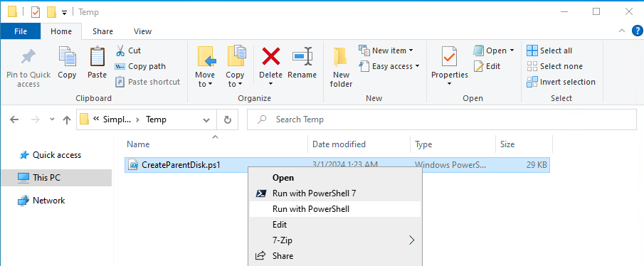

**Step 3** Once asked, provide Windows Server 2022 ISO. Hit cancel to skip msu (cumulative update).

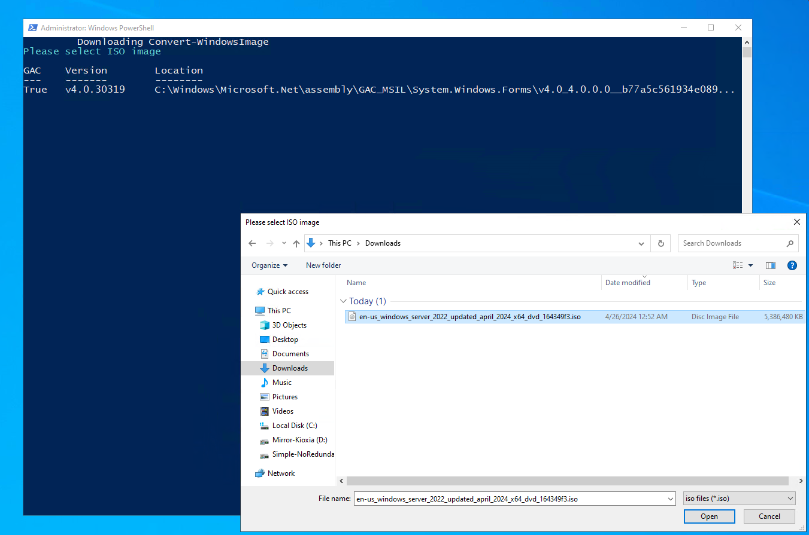

**Step 4** Select Windows Server 2022 Datacenter or Standard (core)

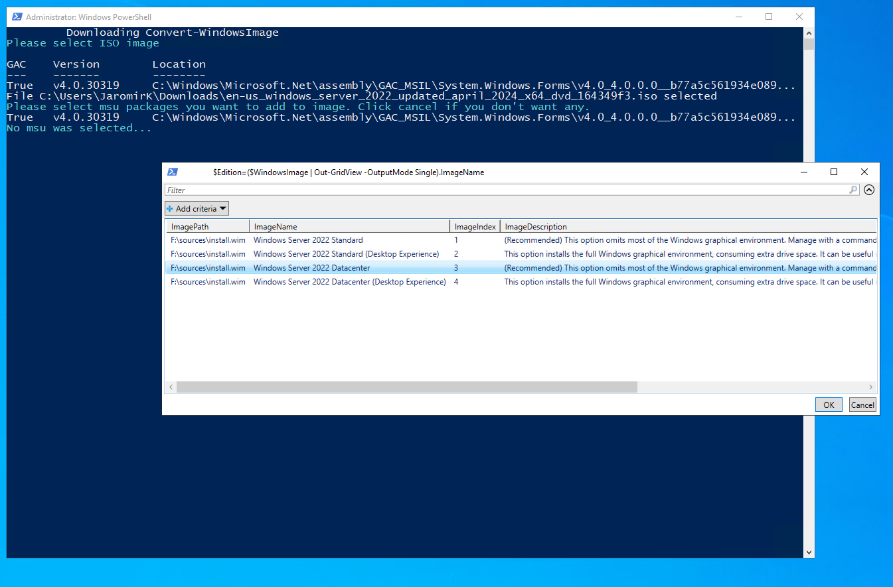

**Step 5** Hit Enter (keep default name) and type 30 for 30GB vhd size


as result, VHD will be created


## Task 02 - Create vmfleet image

**Step 1** Download [CreateVMFleetDisk.ps1](https://github.com/microsoft/MSLab/blob/master/Tools/CreateVMFleetDisk.ps1) script. 

**Step 2** Run CreateVMFleetDisk.ps1 by right-clicking and selecting run with PowerShell

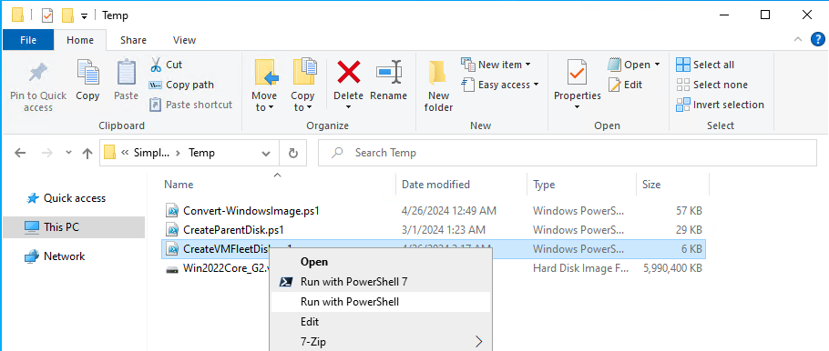

**Step 3** Once asked, provide VHD create in previous step

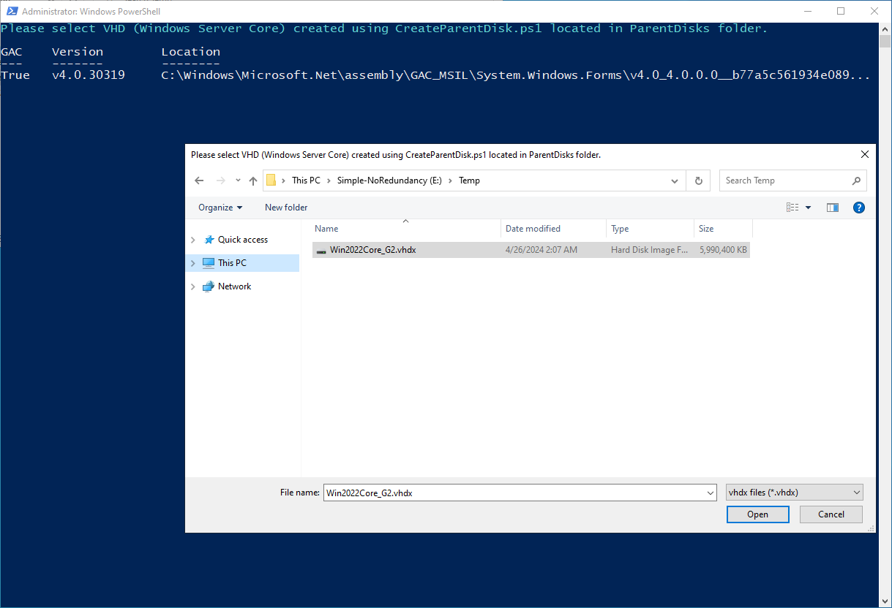

**Step 4** Script will ask for password that will be used for administrator. Provide **P@ssw0rd** as administrator password. VMFleet image will be created.

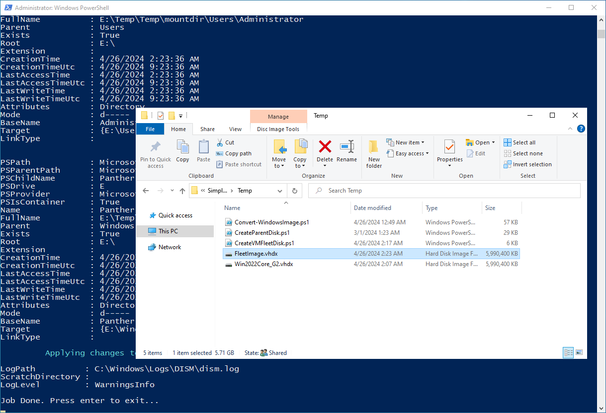


## Task 02 - Configure VMFleet prerequsites

> Note: Run all steps from your management machine

**Step 1** While logged into management machine, Install required PowerShell modules using following PowerShell Script

```PowerShell
    Install-PackageProvider -Name NuGet -MinimumVersion 2.8.5.201 -Force
    Install-Module -Name VMFleet -Force
    Install-Module -Name PrivateCloud.DiagnosticInfo -Force
 
```

**Step 2** Define variables and create Volumes

```PowerShell
    $ClusterName="AzSHCI-Cluster"
    $Nodes=(Get-ClusterNode -Cluster $ClusterName).Name
    $VolumeSize=1TB
    $StoragePool=Get-StoragePool -CimSession mcclus02 | Where-Object OtherUsageDescription -eq "Reserved for S2D"

    #Create Volumes for VMs (thin provisioned)
    Foreach ($Node in $Nodes){
        if (-not (Get-Virtualdisk -CimSession $ClusterName -FriendlyName $Node -ErrorAction Ignore)){
            New-Volume -CimSession $Node -StoragePool $StoragePool -FileSystem CSVFS_ReFS -FriendlyName $Node -Size $VolumeSize -ProvisioningType Thin
        }
    }

    #Create Collect volume (thin provisioned)
    if (-not (Get-Virtualdisk -CimSession $ClusterName -FriendlyName Collect -ErrorAction Ignore)){
        New-Volume -CimSession $CLusterName -StoragePool $StoragePool -FileSystem CSVFS_ReFS -FriendlyName Collect -Size 100GB -ProvisioningType Thin
    }
 
```

Expected result

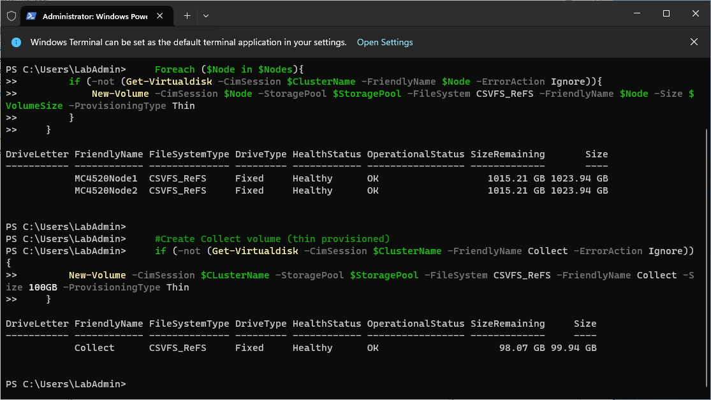

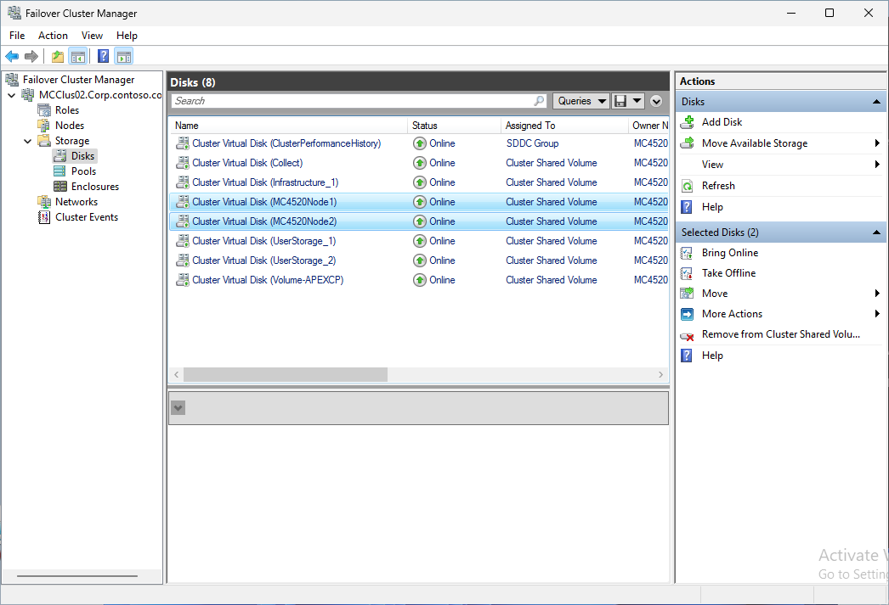

**Step 3** Ask for FleetImage VHD and copy it to collect folder using following script. Keep PowerShell window open for next task.

> Note: Script will also copy VMFleet PowerShell module into each cluster node.

```PowerShell
#Ask for VHD
    Write-Output "Please select VHD created using CreateVMFleetDisk.ps1"
    [reflection.assembly]::loadwithpartialname("System.Windows.Forms")
    $openFile = New-Object System.Windows.Forms.OpenFileDialog -Property @{
        Title="Please select VHD created using CreateVMFleetDisk.ps1"
    }
    $openFile.Filter = "vhdx files (*.vhdx)|*.vhdx|All files (*.*)|*.*" 
    If($openFile.ShowDialog() -eq "OK"){
        Write-Output  "File $($openfile.FileName) selected"
    }
    $VHDPath=$openfile.FileName

#Copy VHD to collect folder
    Copy-Item -Path $VHDPath -Destination \\$ClusterName\ClusterStorage$\Collect\
#Copy VMFleet to cluster nodes
    $Sessions=New-PSSession -ComputerName $Nodes
    Foreach ($Session in $Sessions){
        Copy-Item -Recurse -Path "C:\Program Files\WindowsPowerShell\Modules\VMFleet" -Destination "C:\Program Files\WindowsPowerShell\Modules\" -ToSession $Session -Force
    }
 
```

Expected result

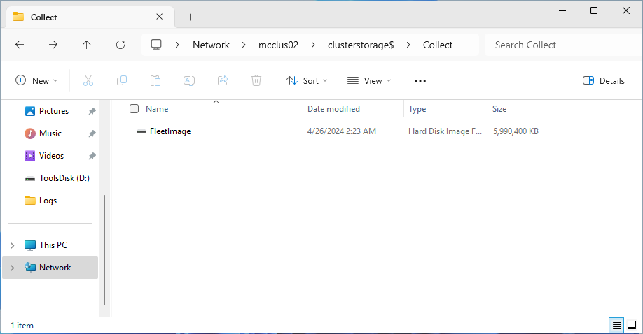

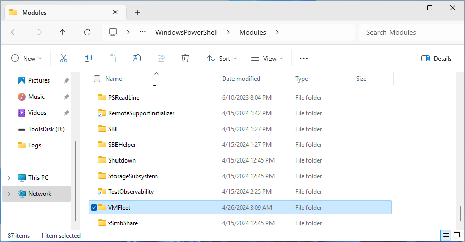

## Task 03 - Deploy VMFleet and measure performance

**Step 1** Generate Variables

```PowerShell
    #generate variables
        #generate VHD Name from path (path was created when you were asked for VHD)
        $VHDName=$VHDPath | Split-Path -Leaf

        #domain account credentials
        $AdminUsername="CORP\LabAdmin"
        $AdminPassword="LS1setup!"
        $securedpassword = ConvertTo-SecureString $AdminPassword -AsPlainText -Force
        $Credentials = New-Object System.Management.Automation.PSCredential ($AdminUsername, $securedpassword)
        #Or simply ask for credentials
        #$Credentials=Get-Credential
        #credentials for local admin located in FleetImage VHD
        $VHDAdminPassword="P@ssw0rd"
 
```

**Step 2** Enable CredSSP and Install VMFleet

> Note: CredSSP has to be enabled, as command to install VMFleet does not (yet) work correctly against Cluster. Therefore command Install-Fleet has to be invoked to one of the nodes. https://github.com/microsoft/diskspd/issues/172

> Note: Installing VMFLeet will create folder structure (and copy diskspd and few scripts) in Cluster Shared Volume "Collect" that was created before.

```PowerShell
    #Enable CredSSP
    # Temporarily enable CredSSP delegation to avoid double-hop issue
    foreach ($Node in $Nodes){
        Enable-WSManCredSSP -Role "Client" -DelegateComputer $Node -Force
    }
    Invoke-Command -ComputerName $Nodes -ScriptBlock { Enable-WSManCredSSP Server -Force }

    #
    Invoke-Command -ComputerName $Nodes[0] -Credential $Credentials -Authentication Credssp -ScriptBlock {
        Install-Fleet
    }
 
```

Expected result


**Step 3** Deploy new VMFleet environment and disable CredSSP

> Note: This step will create Virtual Machines. The same number as number of cores in failover cluster.

```PowerShell
    # Deploy VMFleet
    Invoke-Command -ComputerName $Nodes[0] -Credential $Credentials -Authentication Credssp -ScriptBlock {
        New-Fleet -BaseVHD "c:\ClusterStorage\Collect\$using:VHDName" -AdminPass $using:VHDAdminPassword -Admin Administrator -ConnectUser $using:AdminUsername -ConnectPass $using:AdminPassword
    }
 
```

Expected result

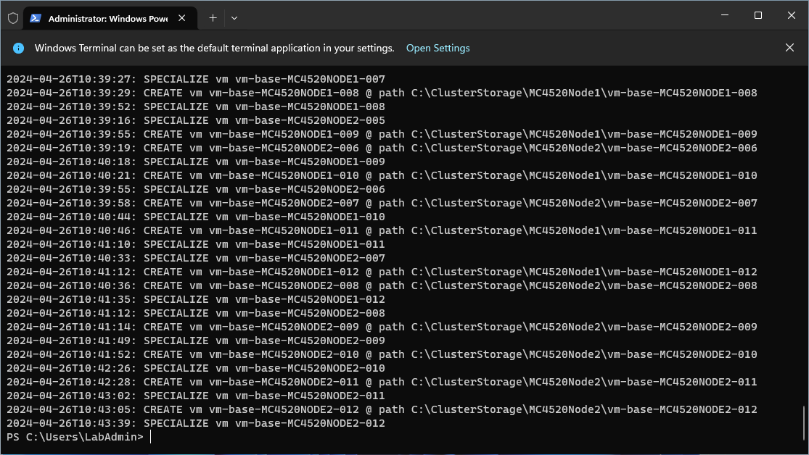

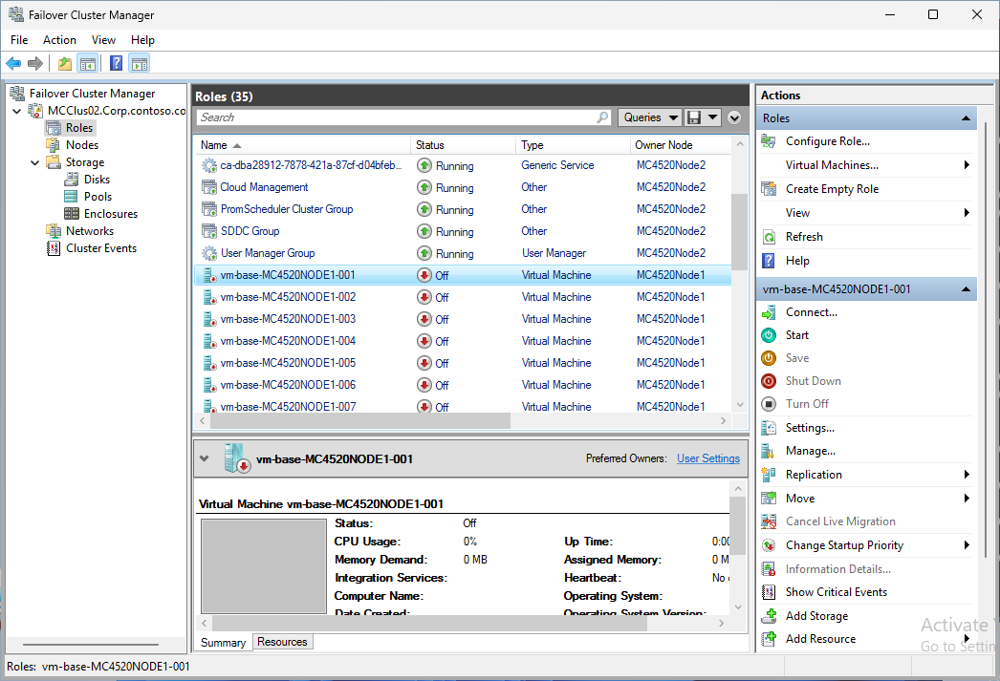

**Step 4** Copy PrivateCloud.DiagnosticInfo PowerShell module to cluster nodes

```PowerShell
    $Sessions=New-PSSession $Nodes
    foreach ($Session in $Sessions){
        Copy-Item -Path 'C:\Program Files\WindowsPowerShell\Modules\PrivateCloud.DiagnosticInfo' -Destination 'C:\Program Files\WindowsPowerShell\Modules\' -ToSession $Session -Recurse -Force
    }
    $Sessions | Remove-PSSession
 
```

**Step 5** Measure performance

> Note: Measuring performance (Measuer-FleetCoreWorkload) will take several hours. Once finished, TSV file will be generated at \\<ClusterName>\ClusterStorage$\Collect\result\result.tsv

```PowerShell
    Invoke-Command -ComputerName $Nodes[0] -Credential $Credentials -Authentication Credssp -ScriptBlock {
        Measure-FleetCoreWorkload
    }
 
```

Expected result

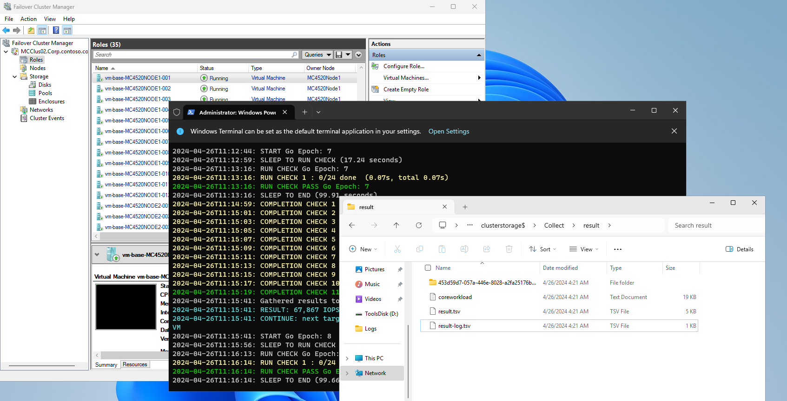

**Step 6** Monitor progress - run following command to open Watch-FleetCluster dashboard

```PowerShell
Watch-FleetCluster -Cluster <ClusterName> -Sets *
 
```

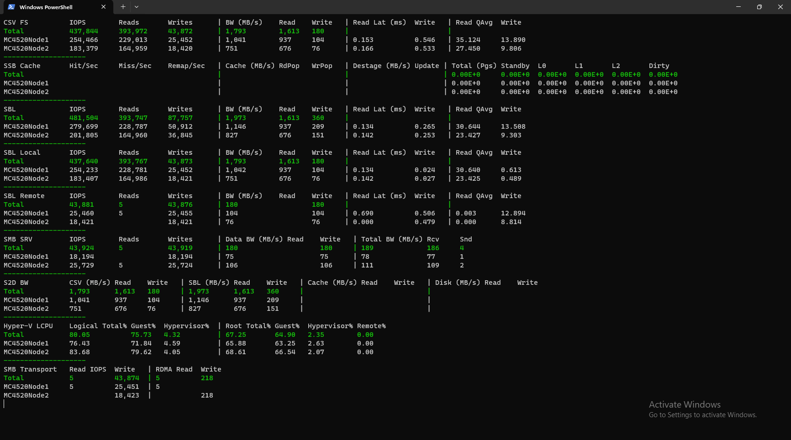

**Step 7** Explore performance results by copying result.tsv to a computer, where excel is installed. Open result in excel and insert a table. You can review [sample result](./media/MC760-All-Flash-8NVMes-4Node.txt). 

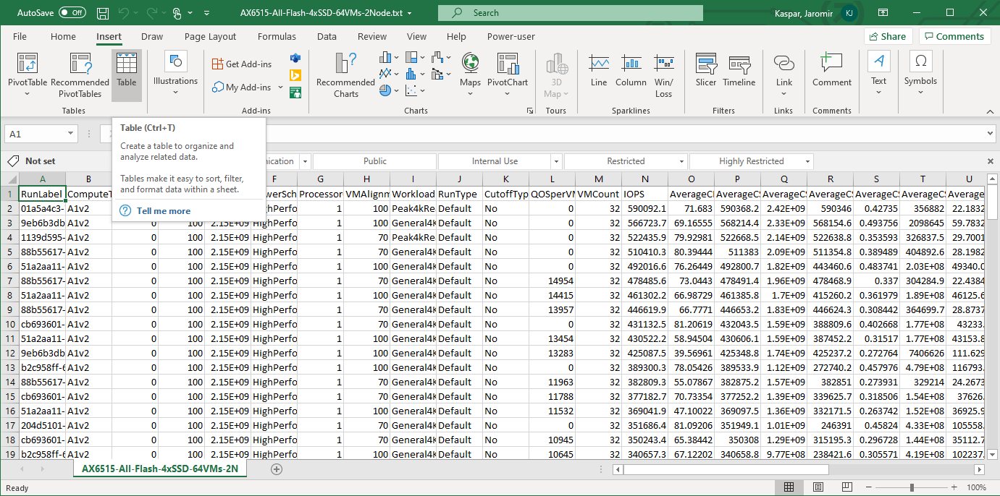

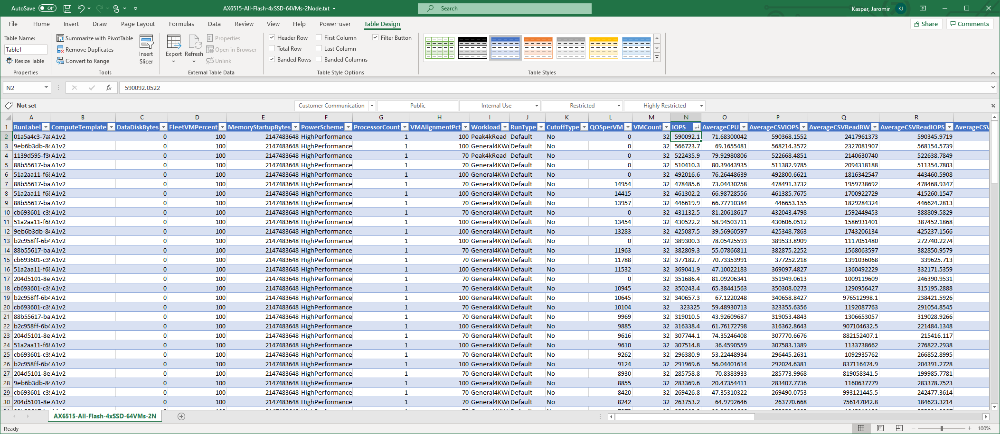

## Task 04 - Cleanup VMFleet

**Step 1** Generate variables (if PowerShell was closed) and remove VMFleet

> Note: Remove-VMFleet command will remove all virtual machines from cluster and will also remove VMFleet virtual switch.

```PowerShell
    #generate variables
        #generate VHD Name from path (path was created when you were asked for VHD)
        $ClusterName="AzSHCI-Cluster"
        $Nodes=(Get-ClusterNode -Cluster $ClusterName).Name

        #domain account credentials
        $AdminUsername="CORP\LabAdmin"
        $AdminPassword="LS1setup!"
        $securedpassword = ConvertTo-SecureString $AdminPassword -AsPlainText -Force
        $Credentials = New-Object System.Management.Automation.PSCredential ($AdminUsername, $securedpassword)

    # Temporarily enable CredSSP delegation to avoid double-hop issue
    foreach ($Node in $Nodes){
        Enable-WSManCredSSP -Role "Client" -DelegateComputer $Node -Force
    }
    Invoke-Command -ComputerName $Nodes -ScriptBlock { Enable-WSManCredSSP Server -Force }

    #Remove VMFleet
    Invoke-Command -ComputerName $Nodes[0] -Credential $Credentials -Authentication Credssp -ScriptBlock {
        Remove-Fleet
    }

    # Disable CredSSP
    Disable-WSManCredSSP -Role Client
    Invoke-Command -ComputerName $nodes -ScriptBlock { Disable-WSManCredSSP Server }
 
```

**Step 2** Delete Volumes

```PowerShell
foreach ($Node in $Nodes){
    Remove-VirtualDisk -FriendlyName $Node -CimSession $ClusterName -Confirm:0
}
Remove-VirtualDisk -FriendlyName Collect -CimSession $ClusterName -Confirm:0
 
```
