# Deploy Azure Stack HCI 22H2 Cluster with PowerShell and NetATC

<!-- TOC -->

- [Deploy Azure Stack HCI 22H2 Cluster with PowerShell and NetATC](#deploy-azure-stack-hci-22h2-cluster-with-powershell-and-netatc)
    - [About the lab](#about-the-lab)
    - [Prerequisites](#prerequisites)
    - [LabConfig](#labconfig)
    - [Task 01 - Validate servers connectivity with Azure Stack HCI Environment Checker](#task-01---validate-servers-connectivity-with-azure-stack-hci-environment-checker)
    - [Task 02 - Perform Windows Update](#task-02---perform-windows-update)
    - [Task 03 - Install required roles and features](#task-03---install-required-roles-and-features)
    - [Task 04 - Configure OS Settings](#task-04---configure-os-settings)
    - [Task 05 - optional - Delete Storage Pool if there is any from last install](#task-05---optional---delete-storage-pool-if-there-is-any-from-last-install)
    - [Task 06 - Configure OS Security](#task-06---configure-os-security)
    - [Task 07 - optional - Install Dell Drivers](#task-07---optional---install-dell-drivers)
    - [Task 08 - Restart servers to apply all changes](#task-08---restart-servers-to-apply-all-changes)
    - [Task 09 - Create and configure Cluster](#task-09---create-and-configure-cluster)
    - [Task 10 - Configure Cluster Aware Updating](#task-10---configure-cluster-aware-updating)
    - [Task 11 - Configure Networking with NetATC](#task-11---configure-networking-with-netatc)
    - [Task 12 - Configure Network HUD](#task-12---configure-network-hud)
    - [Task 13 - Configure network settings that were not configured with NetATC](#task-13---configure-network-settings-that-were-not-configured-with-netatc)
    - [Task 14 - Adjust NetATC Global overrides](#task-14---adjust-netatc-global-overrides)
    - [Task 15 - Configure fault domains](#task-15---configure-fault-domains)
    - [Task 16 - Enable Storage Spaces Direct and create sample volumes](#task-16---enable-storage-spaces-direct-and-create-sample-volumes)
    - [Task 17 - Register Azure Stack HCI into Azure](#task-17---register-azure-stack-hci-into-azure)
    - [Task 18 - Configure iDRAC USB NICs on Dell Servers only if you are running it on physical servers](#task-18---configure-idrac-usb-nics-on-dell-servers-only-if-you-are-running-it-on-physical-servers)
    - [Task 19 - Install Windows Admin Center on WACGW VM](#task-19---install-windows-admin-center-on-wacgw-vm)

<!-- /TOC -->

## About the lab

In this lab you will deploy 4 node Azure Stack HCI cluster using PowerShell. It will demonstrate end-to-end configuration including all details that are not covered by Windows Admin Center deployment. All steps are the same as you would do in production. This lab also demonstrates how to deploy Network configuration using ATC.

You can practice this with Dell AX nodes or in Virtual Machines.

Lab is based on [MSLab Azure Stack HCI deployment scenario 22H2 edition](https://github.com/microsoft/MSLab/tree/master/Scenarios/AzSHCI%20Deployment%2022H2%20Edition). You will find even more details there - it is very useful if you want to go in fine details, or if you just want to paste scripts region by region. This guide is more or less to give it a try if you are new into the Azure Stack HCI deployment, as it shows expected PowerShell output. If you are experienced with MSLab scenarios, just use link above.

In each task in first PowerShell script are all variables used in task defined - just in case you close PowerShell window, or you need to provide link to someone on how to configure something.

If you are running physical lab, review configuration provided in [Network Configuration Guide](https://github.com/DellGEOS/AzureStackHOLs/tree/main/admin-guides/05-NetworkConfiguration)

## Prerequisites

* Hydrated MSLab with LabConfig from [01-HydrateMSLab](../../admin-guides/01-HydrateMSLab/readme.md)

* Understand [how MSLab works](../../admin-guides/02-WorkingWithMSLab/readme.md)

* Optional - [OS deployed on hardware](../../admin-guides/03-DeployPhysicalServersWithMSLab/readme.md)

If you have your own environment, this lab assumes that you already domain joined Azure Stack HCI nodes and it also assumes network adapters are connected to port, where management VLAN is native VLAN (Access VLAN).

## LabConfig

Below LabConfig will deploy 4 nodes for Azure Stack HCI 22H2. You can modify number of Virtual Machines by modifying number. You can also modify Parent Disk Name by modifying ParentVHD property - so you can deploy Azure Stack HCI 21H2 or 22H2 that is currently in preview.

You can uncomment the code for using nested virtualization. By default there are 4 nodes with just 1GB RAM to conserve memory of the host if running in laptop. You can also reconfigure number of CPUs

```PowerShell
$LabConfig=@{AllowedVLANs="1-10,711-719" ; DomainAdminName='LabAdmin'; AdminPassword='LS1setup!' ; DCEdition='4'; Internet=$true; TelemetryLevel='Full' ; TelemetryNickname='' ; AdditionalNetworksConfig=@(); VMs=@()}

#Azure Stack HCI 22H2
1..4 | ForEach-Object {$LABConfig.VMs += @{ VMName="AzSHCI$_" ; Configuration='S2D' ; ParentVHD='AzSHCI22H2_G2.vhdx' ; HDDNumber=4 ; HDDSize=2TB ; MemoryStartupBytes=1GB; VMProcessorCount=4 ; vTPM=$true}}

#Azure Stack HCI 22H2 with nested virtualization
#1..4 | ForEach-Object {$LABConfig.VMs += @{ VMName="AzSHCI$_" ; Configuration='S2D' ; ParentVHD='AzSHCI22H2_G2.vhdx' ; HDDNumber=4 ; HDDSize=2TB ; MemoryStartupBytes=8GB ; VMProcessorCount=4 ; vTPM=$true ; NestedVirt=$true}}

#Windows Admin Center in GW mode
$LabConfig.VMs += @{ VMName = 'WACGW' ; ParentVHD = 'Win2022Core_G2.vhdx'; MGMTNICs=1}

#Management machine
$LabConfig.VMs += @{ VMName = 'Management' ; ParentVHD = 'Win2022_G2.vhdx'; MGMTNICs=1}
 
```

Deployment result

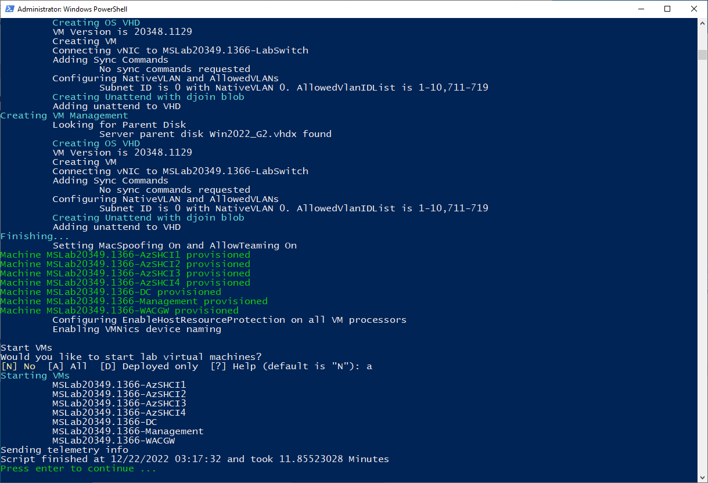

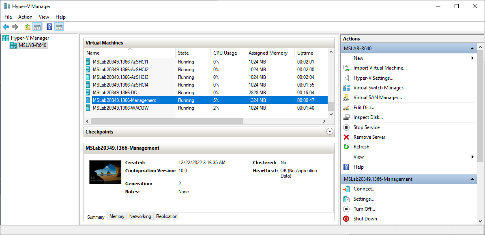

## Task 01 - Validate servers connectivity with Azure Stack HCI Environment Checker

Azure Stack HCI requires connectivity to Azure - https://learn.microsoft.com/en-us/azure-stack/hci/concepts/firewall-requirements. To check connectivity status you can use AzStackHCI environment checker https://www.powershellgallery.com/packages/AzStackHci.EnvironmentChecker

Depending where you are running PowerShell from, you need to install management tools and PowerShell modules that will be used. It differs if management machine is DC or dedicated Management machine. Management machine is used to demonstrate what all features you need to install to be able to successfully deploy Azure Stack HCI as this Management machine is vanilla with no features installed.

**Step 1** Connect to Management virtual machine and open PowerShell from start menu (or by right-clicking on Start button, and selecting run PowerShell as Administrator). Keep PowerShell open for next tasks.

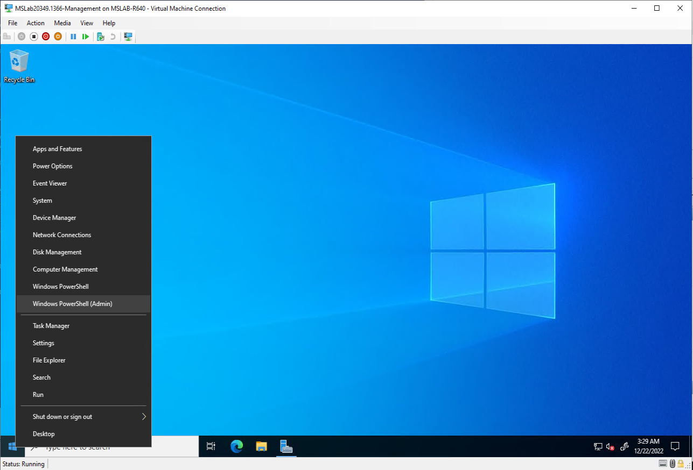

**Step 2** In PowerShell paste following code to run validation on Azure Stack HCI nodes.

```PowerShell
$Servers="AzSHCI1","AzSHCI2","AzSHCI3","AzSHCI4"

#region validate servers connectivity with Azure Stack HCI Environment Checker https://www.powershellgallery.com/packages/AzStackHci.EnvironmentChecker
    Install-PackageProvider -Name NuGet -Force
    Install-Module -Name AzStackHci.EnvironmentChecker -Force -AllowClobber

    $PSSessions=New-PSSession $Servers
    Invoke-AzStackHciConnectivityValidation -PsSession $PSSessions
 
```


> you can also specify what individual service you want to test by using **-Service** Parameter 


## Task 02 - Perform Windows Update

In this task is the same code used as in sconfig. Unfortunately you cannot just invoke this command or use cimsession, as it would fail. Instead it, this code uses temporary PowerShell virtual account (that effectively runs code as local system).

**Step 1** Run following code to check minor os build number. Do not close PowerShell as same window should be used for entire lab.

```PowerShell
$Servers="AzSHCI1","AzSHCI2","AzSHCI3","AzSHCI4"

#check OS Build Number
$RegistryPath = 'HKLM:\SOFTWARE\Microsoft\Windows NT\CurrentVersion\'
$ComputersInfo  = Invoke-Command -ComputerName $servers -ScriptBlock {
    Get-ItemProperty -Path $using:RegistryPath
}
$ComputersInfo | Select-Object PSComputerName,CurrentBuildNumber,UBR
 
```

> Update level is determined by minor build number value. You can check it online [here](https://support.microsoft.com/en-us/topic/release-notes-for-azure-stack-hci-version-22h2-fea63106-a0a9-4b6c-bb72-a07985c98a56)


**Step 2** To update servers, you can run following PowerShell command. It will download and install patch tuesday updates.

```PowerShell
# create temporary virtual account to avoid double-hop issue while keeping secrets locally (unlike CredSSP)
Invoke-Command -ComputerName $servers -ScriptBlock {
    New-PSSessionConfigurationFile -RunAsVirtualAccount -Path $env:TEMP\VirtualAccount.pssc
    Register-PSSessionConfiguration -Name 'VirtualAccount' -Path $env:TEMP\VirtualAccount.pssc -Force
} -ErrorAction Ignore
# Run Windows Update via ComObject.
Invoke-Command -ComputerName $servers -ConfigurationName 'VirtualAccount' {
    $Searcher = New-Object -ComObject Microsoft.Update.Searcher
    $SearchCriteriaAllUpdates = "IsInstalled=0 and DeploymentAction='Installation' or
    IsPresent=1 and DeploymentAction='Uninstallation' or
    IsInstalled=1 and DeploymentAction='Installation' and RebootRequired=1 or
    IsInstalled=0 and DeploymentAction='Uninstallation' and RebootRequired=1"
    $SearchResult = $Searcher.Search($SearchCriteriaAllUpdates).Updates
    $Session = New-Object -ComObject Microsoft.Update.Session
    $Downloader = $Session.CreateUpdateDownloader()
    $Downloader.Updates = $SearchResult
    $Downloader.Download()
    $Installer = New-Object -ComObject Microsoft.Update.Installer
    $Installer.Updates = $SearchResult
    $Result = $Installer.Install()
    $Result
}
#remove temporary PSsession config
Invoke-Command -ComputerName $servers -ScriptBlock {
    Unregister-PSSessionConfiguration -Name 'VirtualAccount'
    Remove-Item -Path $env:TEMP\VirtualAccount.pssc
}
 
```


**Step 3** Optional - you can now reboot and validate version again. It is not necessary as reboot will be done later after installing features.

```PowerShell
#Restart servers
Restart-Computer -ComputerName $Servers -Protocol WSMan -Wait -For PowerShell -Force

#check OS Build Number
$RegistryPath = 'HKLM:\SOFTWARE\Microsoft\Windows NT\CurrentVersion\'
$ComputersInfo  = Invoke-Command -ComputerName $servers -ScriptBlock {
    Get-ItemProperty -Path $using:RegistryPath
}
$ComputersInfo | Select-Object PSComputerName,CurrentBuildNumber,UBR
 
```

## Task 03 - Install required roles and features

Depending where you are running PowerShell from, you need to install management tools and PowerShell modules that will be used. It differs if management machine is DC or dedicated Management machine. Management machine is used to demonstrate what all features you need to install to be able to successfully deploy Azure Stack HCI as this Management machine is vanilla with no features installed.

**Step 1** In PowerShell on Management machine paste following code to install management tools for Windows Server.

```PowerShell
#install features for management (assuming you are running these commands on Windows Server with GUI)
Install-WindowsFeature -Name RSAT-Clustering,RSAT-Clustering-Mgmt,RSAT-Clustering-PowerShell,RSAT-Hyper-V-Tools,RSAT-Feature-Tools-BitLocker-BdeAducExt,RSAT-Storage-Replica
 
```

**Step 2** In the same PowerShell window as previous step paste following code to install Hyper-V and other required features on Azure Stack HCI nodes

```PowerShell
$Servers="AzSHCI1","AzSHCI2","AzSHCI3","AzSHCI4"

#install roles and features on servers
#install Hyper-V using DISM if Install-WindowsFeature fails (if nested virtualization is not enabled install-windowsfeature fails)
Invoke-Command -ComputerName $servers -ScriptBlock {
    $Result=Install-WindowsFeature -Name "Hyper-V" -ErrorAction SilentlyContinue
    if ($result.ExitCode -eq "failed"){
        Enable-WindowsOptionalFeature -FeatureName Microsoft-Hyper-V -Online -NoRestart 
    }
}
#define and install other features
$features="Failover-Clustering","RSAT-Clustering-PowerShell","Hyper-V-PowerShell","NetworkATC","NetworkHUD","Data-Center-Bridging","RSAT-DataCenterBridging-LLDP-Tools","FS-SMBBW"
#optional - affects perf even if not enabled on volumes as filter driver is attached (Bitlocker,SR,Dedup)
#$features+="RSAT-Feature-Tools-BitLocker","Storage-Replica","RSAT-Storage-Replica","FS-Data-Deduplication","System-Insights","RSAT-System-Insights"

Invoke-Command -ComputerName $servers -ScriptBlock {Install-WindowsFeature -Name $using:features}
 
```

> There are few new features in 22H2. NetworkATC, NetworkHUD. Network ATC also requires Data-Center-Bridging and FS-SMBBW, so it is also installed in this step.

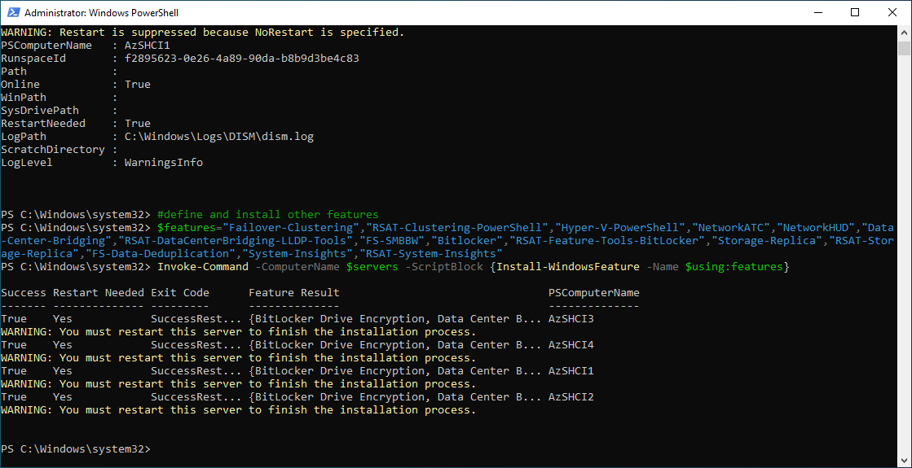

## Task 04 - Configure OS Settings

**Step 1** Configure [Active memory dump](https://docs.microsoft.com/en-us/windows-hardware/drivers/debugger/varieties-of-kernel-mode-dump-files) and high performance power plan on Azure Stack HCI hosts

>note: High performance power plan will be configured only on real hardware (if hardware is virtual machine, it will not change settings and will keep Balanced)

```PowerShell
$Servers="AzSHCI1","AzSHCI2","AzSHCI3","AzSHCI4"

#Configure Active memory dump https://docs.microsoft.com/en-us/windows-hardware/drivers/debugger/varieties-of-kernel-mode-dump-files
Invoke-Command -ComputerName $servers -ScriptBlock {
    Set-ItemProperty -Path HKLM:\System\CurrentControlSet\Control\CrashControl -Name CrashDumpEnabled -value 1
    Set-ItemProperty -Path HKLM:\System\CurrentControlSet\Control\CrashControl -Name FilterPages -value 1
}

#Configure high performance power plan
#set high performance if not VM
Invoke-Command -ComputerName $servers -ScriptBlock {
    if ((Get-ComputerInfo).CsSystemFamily -ne "Virtual Machine"){
        powercfg /SetActive 8c5e7fda-e8bf-4a96-9a85-a6e23a8c635c
        #check settings
        Invoke-Command -ComputerName $servers -ScriptBlock {powercfg /list}
    }
}
 
```

**Step 2** Configure Maxenvelope size. 

> The size of envelope is there to be able to transfer larger files using PowerShell session. It is useful because two things - Dell OpenManage extension and Copy-Item -ToSession/-FromSession.

```PowerShell
#Configure max evenlope size to be 8kb to be able to copy files using PSSession (useful for dell drivers update region and Windows Admin Center)
Invoke-Command -ComputerName $servers -ScriptBlock {Set-Item -Path WSMan:\localhost\MaxEnvelopeSizekb -Value 8192}
 
```

**Step 3** Configure max timeout (time after when the unresponsive disk is considered unhealthy)

> in Dell deployment guide is still recommendation to increase to 10s.

```PowerShell
#Configure MaxTimeout (10s for Dell hardware, 30s for Virtual environment https://learn.microsoft.com/en-us/windows-server/storage/storage-spaces/storage-spaces-direct-in-vm)
if ((Get-CimInstance -ClassName win32_computersystem -CimSession $servers[0]).Manufacturer -like "*Dell Inc."){
    Invoke-Command -ComputerName $servers -ScriptBlock {Set-ItemProperty -Path HKLM:\SYSTEM\CurrentControlSet\Services\spaceport\Parameters -Name HwTimeout -Value 0x00002710}
}
if ((Get-CimInstance -ClassName win32_computersystem -CimSession $servers[0]).Model -eq "Virtual Machine"){
    Invoke-Command -ComputerName $servers -ScriptBlock {Set-ItemProperty -Path HKLM:\SYSTEM\CurrentControlSet\Services\spaceport\Parameters -Name HwTimeout -Value 0x00007530}
}
```

## Task 05 - (optional) - Delete Storage Pool if there is any from last install

> this script will simply grab all storage pools, will remove it and then wipe all disks

```PowerShell
$Servers="AzSHCI1","AzSHCI2","AzSHCI3","AzSHCI4"

#Grab pools
$StoragePools=Get-StoragePool -CimSession $Servers -IsPrimordial $False -ErrorAction Ignore
#remove pools if any
if ($StoragePools){
    $StoragePools | Remove-StoragePool -Confirm:0
}
#Reset disks (to clear spaces metadata)
Invoke-Command -ComputerName $Servers -ScriptBlock {
    Get-PhysicalDisk -CanPool $True | Reset-PhysicalDisk
}
 
```

## Task 06 - Configure OS Security

There are several things that you can consider to configure, but at least you should configure Secured core. There is a Microsoft Security Baseline for Azure Stack HCI available (here)[https://aka.ms/hci-securitybase].

> notice, that locks are commented out. Lock means, that if you decide to remove the setting, you need to confirm it on next reboot (prompt that UEFI firmware will show during boot)

```PowerShell
$Servers="AzSHCI1","AzSHCI2","AzSHCI3","AzSHCI4"

#Device Guard
#REG ADD "HKLM\SYSTEM\CurrentControlSet\Control\DeviceGuard" /v "Locked" /t REG_DWORD /d 1 /f 
REG ADD "HKLM\SYSTEM\CurrentControlSet\Control\DeviceGuard" /v "EnableVirtualizationBasedSecurity" /t REG_DWORD /d 1 /f
REG ADD "HKLM\SYSTEM\CurrentControlSet\Control\DeviceGuard" /v "RequirePlatformSecurityFeatures" /t REG_DWORD /d 3 /f
REG ADD "HKLM\SYSTEM\CurrentControlSet\Control\DeviceGuard" /v "RequireMicrosoftSignedBootChain" /t REG_DWORD /d 1 /f

#Cred Guard
REG ADD "HKLM\SYSTEM\CurrentControlSet\Control\Lsa" /v "LsaCfgFlags" /t REG_DWORD /d 1 /f

#System Guard Secure Launch
#https://docs.microsoft.com/en-us/windows/security/threat-protection/windows-defender-system-guard/system-guard-secure-launch-and-smm-protection
REG ADD "HKLM\SYSTEM\CurrentControlSet\Control\DeviceGuard\Scenarios\SystemGuard" /v "Enabled" /t REG_DWORD /d 1 /f

#HVCI
REG ADD "HKLM\SYSTEM\CurrentControlSet\Control\DeviceGuard\Scenarios\HypervisorEnforcedCodeIntegrity" /v "Enabled" /t REG_DWORD /d 1 /f
#REG ADD "HKLM\SYSTEM\CurrentControlSet\Control\DeviceGuard\Scenarios\HypervisorEnforcedCodeIntegrity" /v "Locked" /t REG_DWORD /d 1 /f
REG ADD "HKLM\SYSTEM\CurrentControlSet\Control\DeviceGuard\Scenarios\HypervisorEnforcedCodeIntegrity" /v "HVCIMATRequired" /t REG_DWORD /d 1 /f
 
```

## Task 07 - (optional) - Install Dell Drivers

> you can skip this step as can install Dell drivers with OpenManage extension after you create cluster

> you can find more details in (MSLab Sceario)[https://github.com/microsoft/MSLab/tree/master/Scenarios/AzSHCI%20and%20Dell%20Servers%20Update]

> this part was inspired by (Dell pro support tools)[https://github.com/DellProSupportGse/Tools/blob/main/DART.ps1] 

**Step 1** Prepare Dell System Update binaries and download it to Azure Stack HCI Nodes and Install DSU

```PowerShell
$Servers="AzSHCI1","AzSHCI2","AzSHCI3","AzSHCI4"

$DSUDownloadFolder="$env:USERPROFILE\Downloads\DSU"
$DSUPackageDownloadFolder="$env:USERPROFILE\Downloads\DSUPackage"

#Download DSU
    #https://github.com/DellProSupportGse/Tools/blob/main/DART.ps1

    #grab DSU links from Dell website
    $URL="https://dl.dell.com/omimswac/dsu/"
    $Results=Invoke-WebRequest $URL -UseDefaultCredentials
    $Links=$results.Links.href | Select-Object -Skip 1
    #create PSObject from results
    $DSUs=@()
    foreach ($Link in $Links){
        $DSUs+=[PSCustomObject]@{
            Link = "https://dl.dell.com$Link"
            Version = $link -split "_" | Select-Object -Last 2 | Select-Object -First 1
        }
    }
    #download latest to separate folder
    $LatestDSU=$DSUs | Sort-Object Version | Select-Object -Last 1
    if (-not (Test-Path $DSUDownloadFolder -ErrorAction Ignore)){New-Item -Path $DSUDownloadFolder -ItemType Directory}
    Start-BitsTransfer -Source $LatestDSU.Link -Destination $DSUDownloadFolder\DSU.exe

    #upload DSU to servers
    $Sessions=New-PSSession -ComputerName $Servers
    Invoke-Command -Session $Sessions -ScriptBlock {
        if (-not (Test-Path $using:DSUDownloadFolder -ErrorAction Ignore)){New-Item -Path $using:DSUDownloadFolder -ItemType Directory}
    }
    foreach ($Session in $Sessions){
        Copy-Item -Path "$DSUDownloadFolder\DSU.exe" -Destination "$DSUDownloadFolder" -ToSession $Session -Force -Recurse
    }
    $Sessions | Remove-PSSession
    #install DSU
    Invoke-Command -ComputerName $Servers -ScriptBlock {
        Start-Process -FilePath "$using:DSUDownloadFolder\DSU.exe" -ArgumentList "/silent" -Wait 
    }

#download catalog and copy DSU Package to servers
    #Dell Azure Stack HCI driver catalog https://downloads.dell.com/catalog/ASHCI-Catalog.xml.gz
    #Download catalog
    Start-BitsTransfer -Source "https://downloads.dell.com/catalog/ASHCI-Catalog.xml.gz" -Destination "$env:UserProfile\Downloads\ASHCI-Catalog.xml.gz"
    #unzip gzip to a folder https://scatteredcode.net/download-and-extract-gzip-tar-with-powershell/
    if (-not (Test-Path $DSUPackageDownloadFolder -ErrorAction Ignore)){New-Item -Path $DSUPackageDownloadFolder -ItemType Directory}
    Function Expand-GZipArchive{
        Param(
            $infile,
            $outfile = ($infile -replace '\.gz$','')
            )
        $input = New-Object System.IO.FileStream $inFile, ([IO.FileMode]::Open), ([IO.FileAccess]::Read), ([IO.FileShare]::Read)
        $output = New-Object System.IO.FileStream $outFile, ([IO.FileMode]::Create), ([IO.FileAccess]::Write), ([IO.FileShare]::None)
        $gzipStream = New-Object System.IO.Compression.GzipStream $input, ([IO.Compression.CompressionMode]::Decompress)
        $buffer = New-Object byte[](1024)
        while($true){
            $read = $gzipstream.Read($buffer, 0, 1024)
            if ($read -le 0){break}
            $output.Write($buffer, 0, $read)
            }
        $gzipStream.Close()
        $output.Close()
        $input.Close()
    }
    Expand-GZipArchive "$env:UserProfile\Downloads\ASHCI-Catalog.xml.gz" "$DSUPackageDownloadFolder\ASHCI-Catalog.xml"
    #create answerfile for DU
    $content='@
    a
    c
    @'
    Set-Content -Path "$DSUPackageDownloadFolder\answer.txt" -Value $content -NoNewline
    $content='"C:\Program Files\Dell\DELL System Update\DSU.exe" --catalog-location=ASHCI-Catalog.xml --apply-upgrades <answer.txt'
    Set-Content -Path "$DSUPackageDownloadFolder\install.cmd" -Value $content -NoNewline

    #upload DSU package to servers
    $Sessions=New-PSSession -ComputerName $Servers
    foreach ($Session in $Sessions){
        Copy-Item -Path $DSUPackageDownloadFolder -Destination $DSUPackageDownloadFolder -ToSession $Session -Recurse -Force
    }
    $Sessions | Remove-PSSession
 
```

**Step 2** Check if there are any updates needed

```PowerShell
$ScanResult=Invoke-Command -ComputerName $Servers -ScriptBlock {
    & "C:\Program Files\Dell\DELL System Update\DSU.exe" --catalog-location="$using:DSUPackageDownloadFolder\ASHCI-Catalog.xml" --preview | Out-Null
    $Result=(Get-content "C:\ProgramData\Dell\DELL System Update\dell_dup\DSU_STATUS.json" | ConvertFrom-JSon).systemupdatestatus.invokerinfo.statusmessage
    if ($Result -like "No Applicable Update*" ){
        $DellUpdateRequired=$False
    }else{
        $DellUpdateRequired=$true
    }

    #scan for microsoft updates
    $SearchCriteriaAllUpdates = "IsInstalled=0 and DeploymentAction='Installation' or
    IsPresent=1 and DeploymentAction='Uninstallation' or
    IsInstalled=1 and DeploymentAction='Installation' and RebootRequired=1 or
    IsInstalled=0 and DeploymentAction='Uninstallation' and RebootRequired=1"
    $Searcher = New-Object -ComObject Microsoft.Update.Searcher
    $SearchResult = $Searcher.Search($SearchCriteriaAllUpdates).Updates
    if ($SearchResult.Count -gt 0){
        $MicrosoftUpdateRequired=$True
    }else{
        $MicrosoftUpdateRequired=$False
    }

    #grab windows version
    $ComputersInfo  = Get-ItemProperty -Path 'HKLM:\SOFTWARE\Microsoft\Windows NT\CurrentVersion\'

    $Output=@()
    $Output += [PSCustomObject]@{
            "DellUpdateRequired"      = $DellUpdateRequired
            "MicrosoftUpdateRequired" = $MicrosoftUpdateRequired
            "MicrosoftUpdates"        = $SearchResult
            "ComputerName"            = $env:COMPUTERNAME
            "CurrentBuildNumber"      = $ComputersInfo.CurrentBuildNumber
            "UBR"                     = $ComputersInfo.UBR
    }
    return $Output
}
$ScanResult
 
```


> As you can see, the $ScanResult variable will show if there is Microsoft Update or Dell Update available.

**Step 3** Install Dell updates

> following script will simply run DSU scan with files you prepared in Step 1

```PowerShell
foreach ($Server in $Servers){
    #Install Dell updates https://dl.dell.com/content/manual36290092-dell-emc-system-update-version-1-9-3-0-user-s-guide.pdf?language=en-us&ps=true
    if (($ScanResult | Where-Object ComputerName -eq $Server).DellUpdateRequired){
        Write-Output "$($Server): Installing Dell System Updates"
        Invoke-Command -ComputerName $Server -ScriptBlock {
            #install DSU updates
            Start-Process -FilePath "install.cmd" -Wait -WorkingDirectory $using:DSUPackageDownloadFolder
            #display result
            $json=Get-Content "C:\ProgramData\Dell\DELL System Update\dell_dup\DSU_STATUS.json" | ConvertFrom-Json
            $output=$json.SystemUpdateStatus.updateablecomponent | Select-Object Name,Version,Baselineversion,UpdateStatus,RebootRequired
            Return $output
        }
    }else{
        Write-Output "$($Server): Dell System Updates not required"
    }
}
 
```


## Task 08 - Restart servers to apply all changes

> you can see, that there is also another test that will make sure that all servers are up and running

```PowerShell
$Servers="AzSHCI1","AzSHCI2","AzSHCI3","AzSHCI4"

Restart-Computer $servers -Protocol WSMan -Wait -For PowerShell -Force
Start-Sleep 20 #Failsafe as Hyper-V needs 2 reboots and sometimes it happens, that during the first reboot the restart-computer evaluates the machine is up
#make sure computers are restarted
Foreach ($Server in $Servers){
    do{$Test= Test-NetConnection -ComputerName $Server -CommonTCPPort WINRM}while ($test.TcpTestSucceeded -eq $False)
}
 
```

## Task 09 - Create and configure Cluster

**Step 1** Test Cluster

> To validate cluster without errors, it might be good idea to disable iDRAC adapters first as validation report would complain as Cluster would not be able to communicate using this network (for obvious reasons)

```PowerShell
$Servers="AzSHCI1","AzSHCI2","AzSHCI3","AzSHCI4"

if ((Get-CimInstance -ClassName win32_computersystem -CimSession $Servers[0]).Manufacturer -like "*Dell*"){
    #Disable USB NIC used by iDRAC to communicate to host just for test-cluster
    Disable-NetAdapter -CimSession $Servers -InterfaceDescription "Remote NDIS Compatible Device" -Confirm:0
}

Test-Cluster -Node $servers -Include "Storage Spaces Direct","Inventory","Network","System Configuration","Hyper-V Configuration"

if ((Get-CimInstance -ClassName win32_computersystem -CimSession $Servers[0]).Manufacturer -like "*Dell*"){
    #Enable USB NIC used by iDRAC
    Enable-NetAdapter -CimSession $Servers -InterfaceDescription "Remote NDIS Compatible Device"
}
 
```

**Step 2** Create Cluster

> DistributedManagementPoint is very nice feature, where cluster does not need an extra IP Address. I found that some PowerShell modules have problems (because when using "Invoke-Command -ComputerName $ClusterName" is resolved every time to different node). Sometimes Scripts are written the way that it invokes command to $clustername, and then it assumes it works on cluster core resources owner, so Invoking -ClusterName in invoked command would normally resolve to localhost, but with DistributedManagemenPoint it resolves elsewhere resulting in double-hop issue)

> clearing DNS cache also helps, as sometimes you might have negative dns cache record for $ClusterName

```PowerShell
$ClusterName="AzSHCI-Cluster"

$ClusterIP="10.0.0.111"

New-Cluster -Name $ClusterName -Node $servers -StaticAddress $ClusterIP

#Or Distributed
#New-Cluster -Name $ClusterName -Node $servers -ManagementPointNetworkType "Distributed"
#Or IP from DHCP
#New-Cluster -Name $ClusterName -Node $servers

Start-Sleep 5
Clear-DnsClientCache
 
```

**Step 3** Configure CSV Cache

> there is not many systems with Storage Class Memory, but I kept it here just for fun. Also in Virtual machines CSV cache does not make sense. By default is CSV cache 512 (512MB)

```PowerShell
    #Configure CSV Cache (value is in MB) - disable if SCM or VM is used. For VM it's just for labs - to save some RAM.
    if (Get-PhysicalDisk -cimsession $servers[0] | Where-Object bustype -eq SCM){
        #disable CSV cache if SCM storage is used
        (Get-Cluster $ClusterName).BlockCacheSize = 0
    }elseif ((Invoke-Command -ComputerName $servers[0] -ScriptBlock {(get-wmiobject win32_computersystem).Model}) -eq "Virtual Machine"){
        #disable CSV cache for virtual environments
        (Get-Cluster $ClusterName).BlockCacheSize = 0
    }
 
```

**Step 4** Configure witness

You can configure FileShare or Cloud Witness. To configure Cloud witness you can provide  

```PowerShell
#Witness type
$WitnessType="FileShare" #or Cloud
$WitnessServer="DC" #name of server where witness will be configured
#if cloud then configure following (use your own, these are just examples)
<#cls
$CloudWitnessStorageAccountName="MyStorageAccountName"
$CloudWitnessStorageKey="qi8QB/VSHHiA9lSvz1kEIEt0JxIucPL3l99nRHhkp+n1Lpabu4Ydi7Ih192A4VW42vccIgUnrXxxxxxxxxxxxx=="
$CloudWitnessEndpoint="core.windows.net"
#>

if ($WitnessType -eq "FileShare"){
    ##Configure Witness on WitnessServer
    #Create new directory
        $WitnessName=$Clustername+"Witness"
        Invoke-Command -ComputerName $WitnessServer -ScriptBlock {new-item -Path c:\Shares -Name $using:WitnessName -ItemType Directory -ErrorAction Ignore}
        $accounts=@()
        $accounts+="$env:userdomain\$ClusterName$"
        $accounts+="$env:userdomain\$env:USERNAME"
        #$accounts+="$env:userdomain\Domain Admins"
        New-SmbShare -Name $WitnessName -Path "c:\Shares\$WitnessName" -FullAccess $accounts -CimSession $WitnessServer
    #Set NTFS permissions 
        Invoke-Command -ComputerName $WitnessServer -ScriptBlock {(Get-SmbShare $using:WitnessName).PresetPathAcl | Set-Acl}
    #Set Quorum
        Set-ClusterQuorum -Cluster $ClusterName -FileShareWitness "\\$WitnessServer\$WitnessName"
}elseif($WitnessType -eq $Cloud){
    Set-ClusterQuorum -Cluster $ClusterName -CloudWitness -AccountName $CloudWitnessStorageAccountName -AccessKey $CloudWitnessStorageKey -Endpoint $CloudWitnessEndpoint 
}
 
```

You can notice FileShare witness is now configured

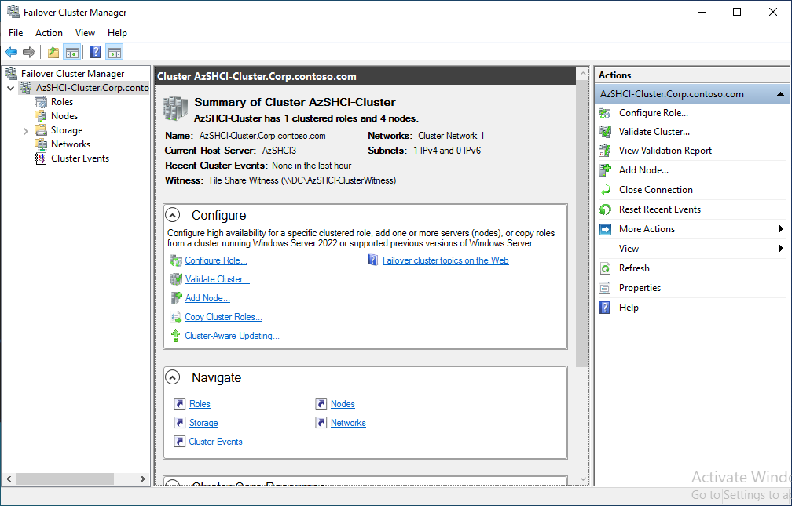

And fileshare was configured and witness file added


## Task 10 - Configure Cluster Aware Updating

Cluster Aware Updating is useful as you will have cluster role, that will be able to perform updating. Automatic Self-Updating will be disabled. But cluster role will be used when performing update (as update orchestrator).

**Step 1** Configure Cluster-Aware-Updating role

```PowerShell
$Servers="AzSHCI1","AzSHCI2","AzSHCI3","AzSHCI4"
$ClusterName="AzSHCI-Cluster"
$CAURoleName="AzSHCI-Cl-CAU"

#Make sure RSAT-Clustering-PowerShell is installed on nodes
    Invoke-Command -ComputerName $Servers -ScriptBlock {
        Install-WindowsFeature -Name RSAT-Clustering-PowerShell
    }
#add role
    Add-CauClusterRole -ClusterName $ClusterName -MaxFailedNodes 0 -RequireAllNodesOnline -EnableFirewallRules -GroupName $CAURoleName -VirtualComputerObjectName $CAURoleName -Force -CauPluginName Microsoft.WindowsUpdatePlugin -MaxRetriesPerNode 3 -CauPluginArguments @{ 'IncludeRecommendedUpdates' = 'False' } -StartDate "3/2/2017 3:00:00 AM" -DaysOfWeek 4 -WeeksOfMonth @(3) -verbose
#disable self-updating
    Disable-CauClusterRole -ClusterName $ClusterName -Force
 
```

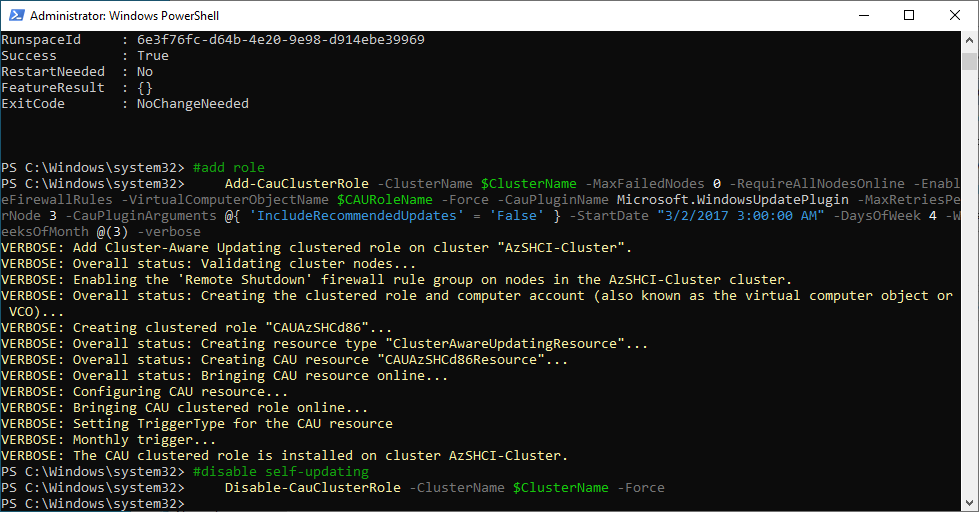

**Step 2** (Optional) Configure Kernel Soft Reboot for CAU

Kernel Soft Reboot is available on Azure Stack HCI since version 21H2. It allows reboots without starting POST. Following script will configure CAU to always use KSR. However you should note, that in Dell OpenManage Integration 3.0.0 is KSR not being disabled after running firmware patch, effectively disabling firmware patching until proper reboot. You can read about KSR [here](https://learn.microsoft.com/en-us/azure-stack/hci/manage/kernel-soft-reboot)


```PowerShell
#list cluster parameters - as you can see, CauEnableSoftReboot does not exist
Get-Cluster -Name $ClusterName | Get-ClusterParameter
#let's create the value and validate
Get-Cluster -Name $ClusterName | Set-ClusterParameter -Name CauEnableSoftReboot -Value 1 -Create
Get-Cluster -Name $ClusterName | Get-ClusterParameter -Name CauEnableSoftReboot
#to delete it again you can run following command
#Get-Cluster -Name $ClusterName | Set-ClusterParameter -Name CauEnableSoftReboot -Delete
 
```


## Task 11 - Configure Networking with NetATC

**Step 1** Configure Prerequisites - install roles and copy PowerShell module

> NetATC requires DCB and FS-SMBBW features installed as it is configuring both DCB and SMB constraints.

> NetATC PowerShell is not available in Windows Server, following script will copy it from Azure Stack HCI to Windows Server.

```PowerShell
$Servers="AzSHCI1","AzSHCI2","AzSHCI3","AzSHCI4"
$ClusterName="AzSHCI-Cluster"

#make sure NetATC,FS-SMBBW and other required features are installed on servers
Invoke-Command -ComputerName $Servers -ScriptBlock {
    Install-WindowsFeature -Name NetworkATC,Data-Center-Bridging,RSAT-Clustering-PowerShell,RSAT-Hyper-V-Tools,FS-SMBBW
}

#since ATC is not available on management machine, copy PowerShell module over to management machine from cluster. However global intents will not be automatically added as in C:\Windows\System32\WindowsPowerShell\v1.0\Modules\NetworkATC\NetWorkATC.psm1 is being checked if NetATC feature is installed [FabricManager.FeatureStaging]::Feature_NetworkATC_IsEnabled()
$session=New-PSSession -ComputerName $ClusterName
$items="C:\Windows\System32\WindowsPowerShell\v1.0\Modules\NetworkATC","C:\Windows\System32\NetworkAtc.Driver.dll","C:\Windows\System32\Newtonsoft.Json.dll","C:\Windows\System32\NetworkAtcFeatureStaging.dll"
foreach ($item in $items){
    Copy-Item -FromSession $session -Path $item -Destination $item -Recurse -Force
}
 
```

**Step 2** Configure Converged Intent

> following script will configure converged intent from 2 adapters in VMs (assuming you are using MSLab). In VMs it will skip DCB. In case Azure Stack HCI nodes are physical servers, it will grab the fastest NICs and create new intent out of fastest NICs available (it assumes you connected only fastest NICs)


```PowerShell
#if virtual environment, then skip RDMA config
if ((Get-CimInstance -ClassName win32_computersystem -CimSession $servers[0]).Model -eq "Virtual Machine"){
    Import-Module NetworkATC
    #virtual environment (skipping RDMA config)
    $AdapterOverride = New-NetIntentAdapterPropertyOverrides
    $AdapterOverride.NetworkDirect = 0
    Add-NetIntent -ClusterName $ClusterName -Name ConvergedIntent -Management -Compute -Storage -AdapterName "Ethernet","Ethernet 2" -AdapterPropertyOverrides $AdapterOverride -Verbose #-StorageVlans 1,2
}else{
#on real hardware you can configure RDMA
    #grab fastest adapters names (assuming that we are deploying converged intent with just Mellanox or Intel E810)
    $FastestLinkSpeed=(get-netadapter -CimSession $Servers | Where-Object {$_.Status -eq "up" -and $_.HardwareInterface -eq $True}).Speed | Sort-Object -Descending | Select-Object -First 1
    #grab adapters
    $AdapterNames=(Get-NetAdapter -CimSession $ClusterName | Where-Object {$_.Status -eq "up" -and $_.HardwareInterface -eq $True} | where-object Speed -eq $FastestLinkSpeed | Sort-Object Name).Name
    #$AdapterNames="SLOT 3 Port 1","SLOT 3 Port 2"
    Import-Module NetworkATC
    Add-NetIntent -ClusterName $ClusterName -Name ConvergedIntent -Management -Compute -Storage -AdapterName $AdapterNames -Verbose #-StorageVlans 1,2
}
 
```

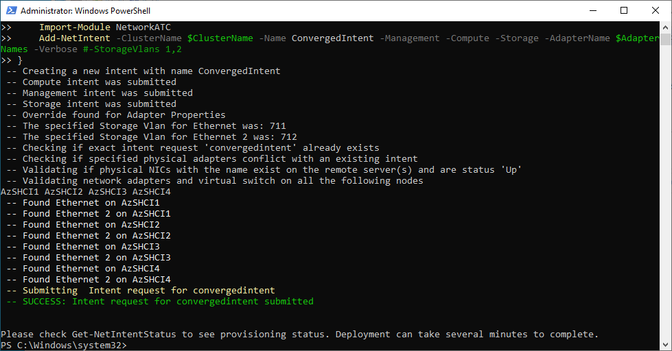

> if you want to configure switchless Network Intent with dedicated NICs for east-west traffic, you can use code below (note: it's all commented, so you will not break your lab if you will accidentally run it)

```PowerShell
<#
#if virtual environment, then skip RDMA config
if ((Get-CimInstance -ClassName win32_computersystem -CimSession $servers[0]).Model -eq "Virtual Machine"){
    Import-Module NetworkATC
    #virtual environment (skipping RDMA config)
    $AdapterOverride = New-NetIntentAdapterPropertyOverrides
    $AdapterOverride.NetworkDirect = 0
    Add-NetIntent -ClusterName $ClusterName -Name compute_management -Management -Compute -AdapterName "Ethernet","Ethernet 2" -AdapterPropertyOverrides $AdapterOverride -Verbose
    Add-NetIntent -ClusterName $ClusterName -Name storage -Storage -AdapterName "Ethernet 3","Ethernet 4" -AdapterPropertyOverrides $AdapterOverride -Verbose #-StorageVlans 1,2
}else{
#on real hardware you can configure RDMA
    Import-Module NetworkATC
    $AdapterNames="SLOT 1 Port 1","SLOT 1 Port 2"
    Add-NetIntent -ClusterName $ClusterName -Name compute_management -Management -Compute -AdapterName $AdapterNames -Verbose
    $AdapterNames="SLOT 3 Port 1","SLOT 3 Port 2"
    Add-NetIntent -ClusterName $ClusterName -Name storage -Storage -AdapterName $AdapterNames -Verbose
}
#>
 
```
**Step 3** Add default Global Intent

> it would be normally added if the Add-Intent script was executed from one of the nodes. But since it's executed from Windows Server, global intent has to be added as extra step.

```PowerShell
#Add default global intent
#since when configuring from Management machine there is a test [FabricManager.FeatureStaging]::Feature_NetworkATC_IsEnabled() to make global intents available, it will not be configured, so it has to be configured manually with invoke command
Invoke-Command -ComputerName $servers[0] -ScriptBlock {
    Import-Module NetworkATC
    $overrides=New-NetIntentGlobalClusterOverrides
    #add empty intent
    Add-NetIntent -GlobalClusterOverrides $overrides
}
 
```


**Step 4** Validate Cluster Status

> in virtual environment for some reason one or two nodes goes into quarantined state, so it needs to be cleared.


```PowerShell
Get-ClusterNode -Cluster $ClusterName | Where-Object State -eq down |Start-ClusterNode -ClearQuarantine
 
```


**Step 5 validate Intent Status

```PowerShell
#Validate Intent
Invoke-Command -ComputerName $servers[0] -ScriptBlock {Get-NetIntentStatus}

#Validate Global Intent
Invoke-Command -ComputerName $servers[0] -ScriptBlock {Get-NetIntentStatus -GlobalOverrides}
 
```

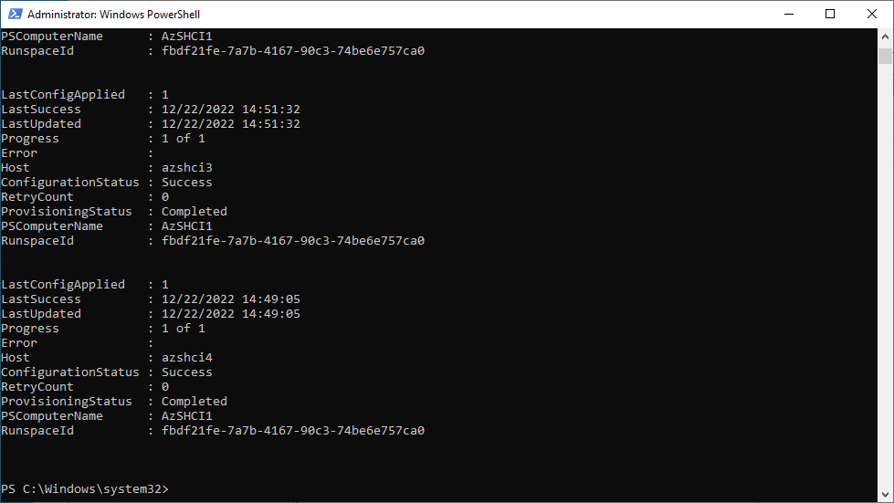

## Task 12 - Configure Network HUD

**Step 1** Install Network HUD

> Installing Network HUD is not only installing NetworkHUD feature, but it also requires Test-NetStack and az.stackhci.networkhud modules.

```PowerShell
$Servers="AzSHCI1","AzSHCI2","AzSHCI3","AzSHCI4"

#make sure NetworkHUD features are installed and network HUD is started on servers
Invoke-Command -ComputerName $Servers -ScriptBlock {
    Install-WindowsFeature -Name "NetworkHUD","Hyper-V","Hyper-V-PowerShell","Data-Center-Bridging", "RSAT-DataCenterBridging-LLDP-Tools","NetworkATC","Failover-Clustering"
    #make sure service is started and running (it is)
    #Set-Service -Name NetworkHUD -StartupType Automatic 
    #Start-Service -Name NetworkHUD
}
#install Network HUD modules (Test-NetStack and az.stackhci.networkhud) on nodes
    $Modules="Test-NetStack","az.stackhci.networkhud"
    Install-PackageProvider -Name NuGet -MinimumVersion 2.8.5.201 -Force
    foreach ($Module in $Modules){
        #download module to management node
        Save-Module -Name $Module -Path $env:Userprofile\downloads\
        #copy it to servers
        foreach ($Server in $Servers){
            Copy-Item -Path "$env:Userprofile\downloads\$module" -Destination "\\$Server\C$\Program Files\WindowsPowerShell\Modules\" -Recurse -Force
        }
    }
#restart NetworkHUD service to activate
Invoke-Command -ComputerName $Servers -ScriptBlock {
    Restart-Service NetworkHUD
}
 
```

**Step 2** Check Network HUD event log if NetworkHUD started sucessfully

```PowerShell
#check event logs
$events=Invoke-Command -ComputerName $Servers -ScriptBlock {
    Get-WinEvent -FilterHashtable @{"ProviderName"="Microsoft-Windows-Networking-NetworkHUD";Id=105}
}
$events | Format-Table -AutoSize
 
```

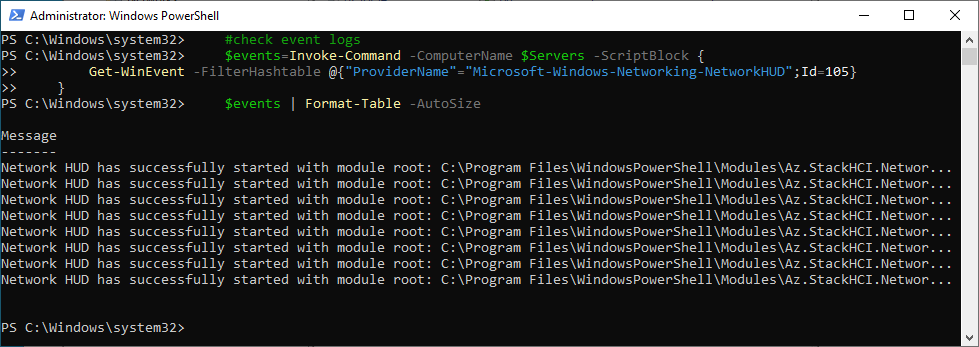

## Task 13 - Configure network settings that were not configured with NetATC

> all these settings applies to physical clusters only

**Step 1** Disable disconnected adapters

```PowerShell
$Servers="AzSHCI1","AzSHCI2","AzSHCI3","AzSHCI4"

#disable unused adapters
Get-Netadapter -CimSession $Servers | Where-Object Status -ne "Up" | Disable-NetAdapter -Confirm:0
 
```

**Step 2** Rename iDRAC cluster networks

```PowerShell
#Rename and Configure USB NICs (iDRAC Network)
$USBNics=get-netadapter -CimSession $Servers -InterfaceDescription "Remote NDIS Compatible Device" -ErrorAction Ignore
if ($USBNics){
    $Network=(Get-ClusterNetworkInterface -Cluster $ClusterName | Where-Object Adapter -eq "Remote NDIS Compatible Device").Network | Select-Object -Unique
    $Network.Name="iDRAC"
    $Network.Role="none"
}
 
```

> Following screenshot is from Physical Cluster

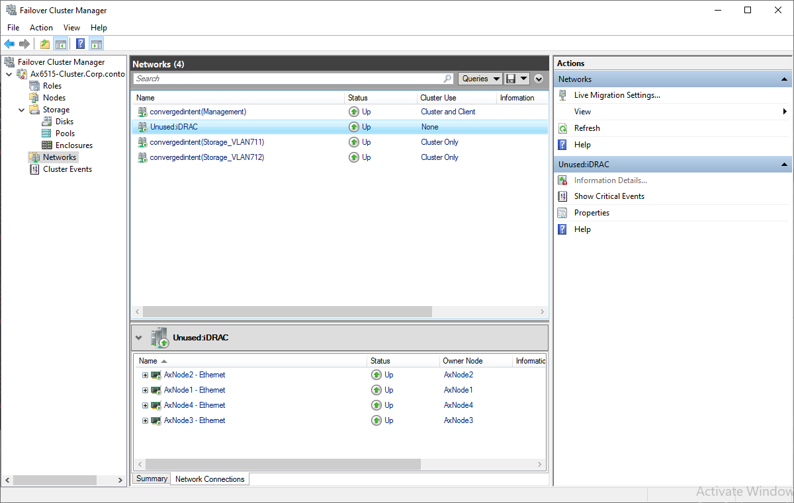

**Step 3** Configure DCBX Mode - Host in charge

```PowerShell
#Configure dcbxmode to be host in charge (default is firmware in charge) on mellanox adapters (Dell recommendation)
#Caution: This disconnects adapters!
if ((Get-CimInstance -ClassName win32_computersystem -CimSession $servers[0]).Manufacturer -like "*Dell Inc."){
    if (Get-NetAdapter -CimSession $Servers -InterfaceDescription Mellanox*){
        Set-NetAdapterAdvancedProperty -CimSession $Servers -InterfaceDescription Mellanox* -DisplayName 'Dcbxmode' -DisplayValue 'Host in charge'
    }
}
 
```

## Task 14 - Adjust NetATC Global overrides

> this task is little bit deep dive just to showcase Global overrides. After netATC will be patched, it will not be necessary to adjust these settings anymore as defaults will be OK.

**Step 1** Check what was configured

```PowerShell
$Servers="AzSHCI1","AzSHCI2","AzSHCI3","AzSHCI4"
$ClusterName="AzSHCI-Cluster"

#Check what networks were excluded from Live Migration
$Networks=(Get-ClusterResourceType -Cluster $clustername -Name "Virtual Machine" | Get-ClusterParameter -Name MigrationExcludeNetworks).Value -split ";"
foreach ($Network in $Networks){Get-ClusterNetwork -Cluster $ClusterName | Where-Object ID -Match $Network}

#check Live Migration option (probably bug, because it should default to SMB - version tested 1366)
Get-VMHost -CimSession $Servers | Select-Object *Migration*

#Check smbbandwith limit cluster settings (notice for some reason is SetSMBBandwidthLimit=1)
Get-Cluster -Name $ClusterName | Select-Object *SMB*

#check SMBBandwidthLimit settings (should be pouplated already with defaults on physical cluster - it calculated 1562500000 bytes per second on 2x25Gbps NICs, or empty (VMs))
Get-SmbBandwidthLimit -CimSession $Servers

#check VLAN settings (notice it's using Adapter Isolation, not VLAN)
Get-VMNetworkAdapterIsolation -CimSession $Servers -ManagementOS

#check number of live migrations (default is 1)
get-vmhost -CimSession $Servers | Select-Object Name,MaximumVirtualMachineMigrations

 
```

> in output you will notice, that there were several settings that will need adjust. Some I believe are simply bugs (like SMB not used for Live Migration)

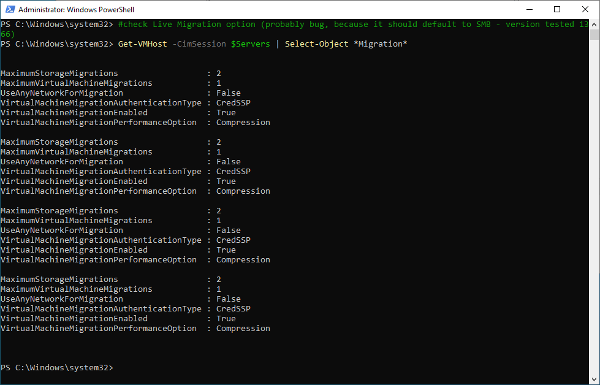

> you can also notice, that VLAN is configured with VMNetworkAdapterIsolation commandlet, not with VMNetworkAdapterVlan


**Step 2** Adjust global override

> following script will adjust SMB Migration traffic to 40% of total link capacity. It will also switch from Compression to SMB as there is most likely bug that miscalculates capacity

```PowerShell
$vSwitchNics=(Get-VMSwitch -CimSession $Servers[0]).NetAdapterInterfaceDescriptions
$LinkCapacityInGbps=(Get-NetAdapter -CimSession $Servers[0] -InterfaceDescription $vSwitchNics | Measure-Object Speed -Sum).sum/1000000000
Invoke-Command -ComputerName $Servers[0] -ScriptBlock {
    Import-Module NetworkATC
    $overrides=New-NetIntentGlobalClusterOverrides
    $overrides.MaximumVirtualMachineMigrations=4
    $overrides.MaximumSMBMigrationBandwidthInGbps=$using:LinkCapacityInGbps*0.4 #40%, if one switch is down, LM will not saturate bandwidth
    $overrides.VirtualMachineMigrationPerformanceOption="SMB"
    Set-NetIntent -GlobalClusterOverrides $overrides
}

Start-Sleep 20 #let intent propagate a bit
Write-Output "applying overrides intent"
do {
    $status=Invoke-Command -ComputerName $Servers[0] -ScriptBlock {Get-NetIntentStatus -Globaloverrides}
    Write-Host "." -NoNewline
    Start-Sleep 5
} while ($status.ConfigurationStatus -contains "Provisioning" -or $status.ConfigurationStatus -contains "Retrying")
 
```

**Step 3** Validate settings - check ClusterOverride in GlobalOverrides 

```PowerShell
#check ClusterOverride in GlobalOverrides intent 
Invoke-Command -ComputerName $Servers[0] -ScriptBlock {(Get-NetIntent -GlobalOverrides).ClusterOverride}
 
```

> you can see that intent was overriden with custom values.

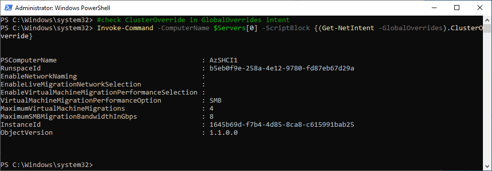


**Step 4** Check if there were not any errors 

```PowerShell
#check NetworkATC admin event log
$events=Invoke-Command -ComputerName $Servers -ScriptBlock {
    Get-WinEvent -FilterHashtable @{"LogName"="Microsoft-Windows-Networking-NetworkATC/Admin";StartTime=(get-date).AddMinutes(-15)}
}
$events | Select-Object MachineName,Level,Message | Format-List
 
```

> as you can see on the screenshot, there might be a bug as in message you can see that discovered bandwidth is only 2.4Gbps (not true)


**Step 5** Check if the settings were applied

```PowerShell
#check Live Migration option (Will be SMB now)
Get-VMHost -CimSession $Servers | Select-Object *Migration*

#Check smbbandwith limit cluster settings (SetSMBBandwidthLimit is now 0)
Get-Cluster -Name $ClusterName | Select-Object *SMB*

#check SMBBandwidthLimit settings
Get-SmbBandwidthLimit -CimSession $Servers

#check number of live migrations
get-vmhost -CimSession $Servers | Select-Object Name,MaximumVirtualMachineMigrations
 
```

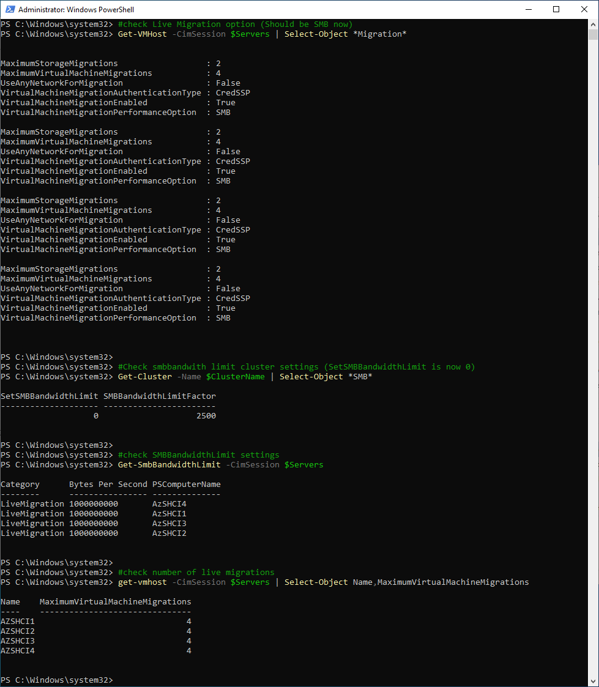


## Task 15 - Configure fault domains

> fault domains are very useful when failure occurs. Health service will generate a message with details about node (name, location...).

**Step 1** Create Fault Domains

```PowerShell
$Servers="AzSHCI1","AzSHCI2","AzSHCI3","AzSHCI4"
$ClusterName="AzSHCI-Cluster"

#Describe Rack
$RackFD=New-ClusterFaultDomain -Name "Rack01" -FaultDomainType Rack -Location "Contoso HQ, Room 4010, Aisle A, Rack 01" -CimSession $ClusterName

#describe Site
$SiteFD=New-ClusterFaultDomain -Name "SEA" -FaultDomainType Site -Location "Contoso HQ, 123 Example St, Room 4010, Seattle" -CimSession $ClusterName

#Add nodes to rack
Foreach ($Server in $Servers) {
    Set-ClusterFaultDomain -Name $Server  -Parent $RackFD.Name -CimSession $ClusterName
}

#Add rack to site
Set-ClusterFaultDomain -Name $RackFD.Name -Parent $SiteFD.Name -CimSession $ClusterName
 
```

**Step 2** Validate Fault Domain

```PowerShell
Get-ClusterFaultDomain -CimSession $ClusterName
 
```

> you can see, that nodes are in Rack01 as ChildrenNames and that Rack01 (rack) is in SEA (site)


**Step 3** Validate Fault Domain XML and GUI

```PowerShell
Get-ClusterFaultDomainXML -CimSession $ClusterName
 
```

> you can see, that this view is bit more user friendly


You can also see fault domains in Failover Cluster Manager

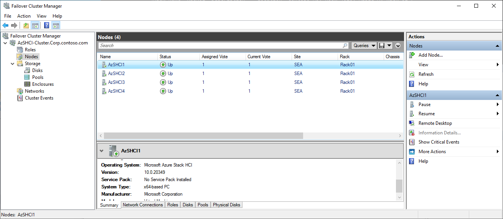

## Task 16 - Enable Storage Spaces Direct and create sample volumes

**Step 1** Enable Storage Spaces Direct

```PowerShell
$ClusterName="AzSHCI-Cluster"

Enable-ClusterS2D -CimSession $ClusterName -confirm:0 -Verbose
 
```


**Step 2** Configure Thin volumes as deafault

> by default when you create a volume without parameter specyfing ProvisioningType, fixed will be used as it's configured as default in pool.

```PowerShell
#configure
Get-StoragePool -FriendlyName "S2D on $ClusterName" -CimSession $ClusterName | Set-StoragePool -ProvisioningTypeDefault Thin
#Validate
Get-StoragePool -FriendlyName "S2D on $ClusterName" -CimSession $ClusterName | Select-Object *
 
```

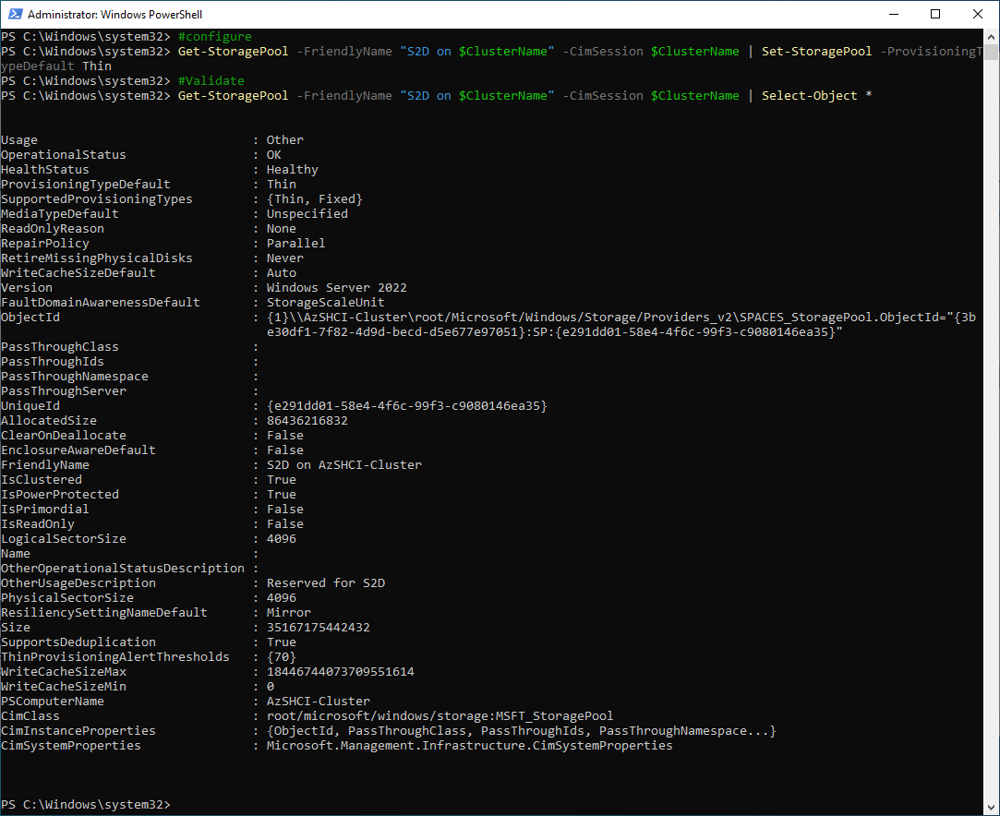

**Step 3** Create 1TB volume on each node (with name of the node to keep it simple)

```PowerShell
#create 1TB volume on each node
foreach ($Server in $Servers){
    New-Volume -StoragePoolFriendlyName  "S2D on $ClusterName" -FriendlyName $Server -Size 1TB -CimSession $ClusterName
}

#align volumes ownership to with servers
foreach ($Server in $Servers){
    Move-ClusterSharedVolume -Name "Cluster Virtual Disk ($Server)" -Node $Server -Cluster $ClusterName
}
 
```

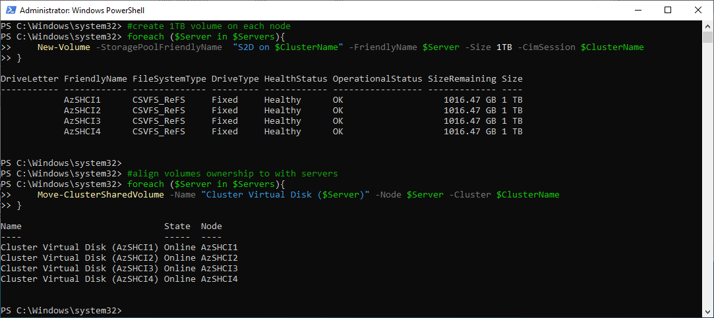

## Task 17 - Register Azure Stack HCI into Azure

**Step 1** Download prerequisites and log in into Azure

> You can notice, that log in is using device authentication. This means you will not have to log in on the machine you are running script, but in another - like the one you trust.

```PowerShell
    $ClusterName="AzSHCI-Cluster"

    #download Azure module
    Install-PackageProvider -Name NuGet -MinimumVersion 2.8.5.201 -Force
    if (!(Get-InstalledModule -Name Az.StackHCI -ErrorAction Ignore)){
        Install-Module -Name Az.StackHCI -Force -AllowClobber
    }

    #login to azure
    #download Azure module
    if (!(Get-InstalledModule -Name az.accounts -ErrorAction Ignore)){
        Install-Module -Name Az.Accounts -Force
    }
    Login-AzAccount -UseDeviceAuthentication

    #select context if more available
    $context=Get-AzContext -ListAvailable
    if (($context).count -gt 1){
        $context=$context | Out-GridView -OutputMode Single
        $context | Set-AzContext
    }
    #load subscription ID into variable
    $subscriptionID=$context.subscription.id
 
```

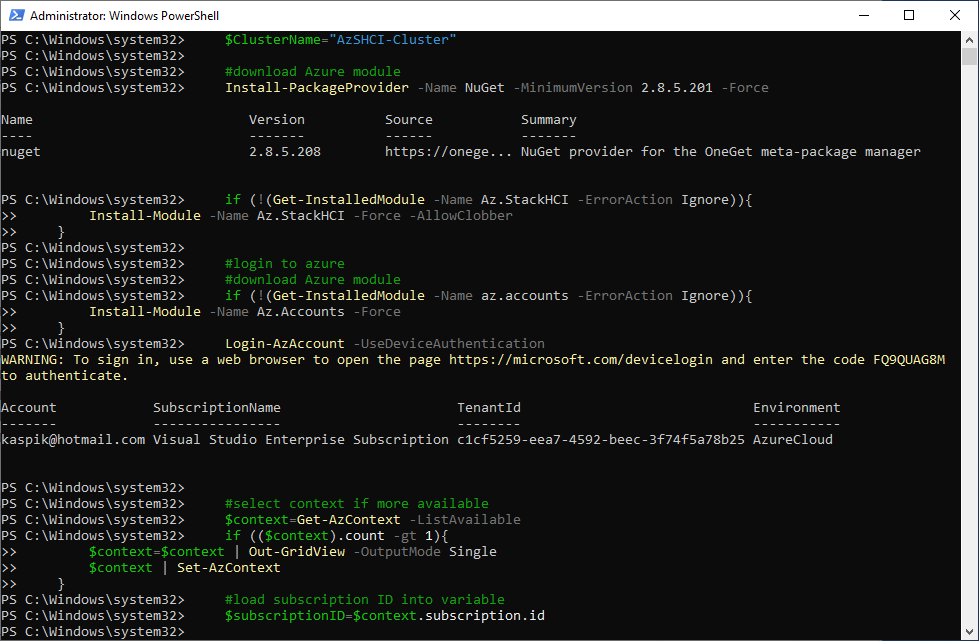

**Step 2** Register Azure Stack HCI without asking for credentials again and with Resource Group of your choice.

> Notice in following script, that you will be able to choose location for Azure Stack HCI based on availability.

```PowerShell
$ResourceGroupName="" #Optional, if not specified, default will be used
if (!(Get-InstalledModule -Name Az.Resources -ErrorAction Ignore)){
    Install-Module -Name Az.Resources -Force
}
#choose location for cluster (and RG)
$region=(Get-AzLocation | Where-Object Providers -Contains "Microsoft.AzureStackHCI" | Out-GridView -OutputMode Single -Title "Please select Location for AzureStackHCI metadata").Location
if ($ResourceGroupName){
    If (-not (Get-AzResourceGroup -Name $ResourceGroupName -ErrorAction Ignore)){
        New-AzResourceGroup -Name $ResourceGroupName -Location $region
    }
}

#Register AzSHCI with prompting for auth
if ($ResourceGroupName){
    Register-AzStackHCI -Region $Region -SubscriptionID $subscriptionID -ComputerName $ClusterName -UseDeviceAuthentication -ResourceGroupName $ResourceGroupName
}else{
    Register-AzStackHCI -Region $Region -SubscriptionID $subscriptionID -ComputerName $ClusterName -UseDeviceAuthentication
}

#Register AZSHCi without prompting for auth again
<# 
$armTokenItemResource = "https://management.core.windows.net/"
#$graphTokenItemResource = "https://graph.windows.net/"
$azContext = Get-AzContext
$authFactory = [Microsoft.Azure.Commands.Common.Authentication.AzureSession]::Instance.AuthenticationFactory
$armToken = $authFactory.Authenticate($azContext.Account, $azContext.Environment, $azContext.Tenant.Id, $null, [Microsoft.Azure.Commands.Common.Authentication.ShowDialog]::Never, $null, $armTokenItemResource).AccessToken
$id = $azContext.Account.Id
if ($ResourceGroupName){
    Register-AzStackHCI -Region $Region -SubscriptionID $subscriptionID -ArmAccessToken $armToken -ComputerName $ClusterName -AccountId $id -ResourceName $ClusterName -ResourceGroupName $ResourceGroupName #-ArmAccessToken $armToken
}else{
    Register-AzStackHCI -Region $Region -SubscriptionID $subscriptionID -ArmAccessToken $armToken -ComputerName $ClusterName -AccountId $id -ResourceName $ClusterName
}
#>

```

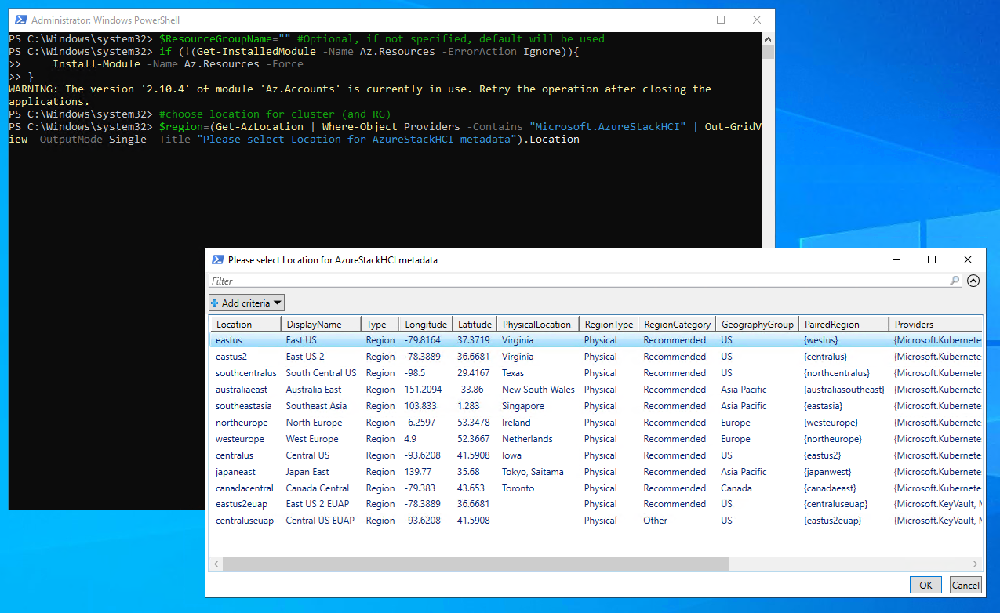

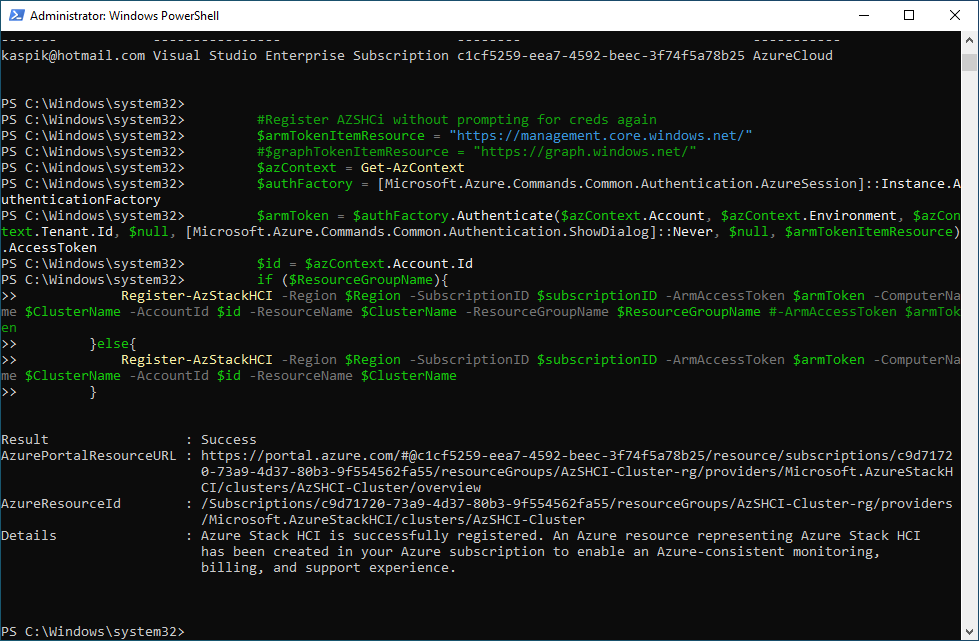

**Step 3** Validate registration

> As you can see in below command, there is AzureStackHCI module on each node. Register-AzStackHCI module that is installed on management machine is just a "wrapper".

```PowerShell
#grab available commands for registration
Invoke-Command -ComputerName $ClusterName -ScriptBlock {Get-Command -Module AzureStackHCI}
#validate cluster registration
Invoke-Command -ComputerName $ClusterName -ScriptBlock {Get-AzureStackHCI}
#validate certificates
Invoke-Command -ComputerName $ClusterName -ScriptBlock {Get-AzureStackHCIRegistrationCertificate}
#validate Arc integration
Invoke-Command -ComputerName $ClusterName -ScriptBlock {Get-AzureStackHCIArcIntegration}

```


> as result you can see cluster registered in Azure Portal


## Task 18 - Configure iDRAC USB NICs on Dell Servers (only if you are running it on physical servers)

> when server is shipped from factory, the OS to iDRAC Pass-through is disabled and on all servers is same IP configured. Pass-through has to be enabed, and on each server needs to be uniqe IP Address for OpenManage integration to work correctly. Below example is from real lab environment. Just change your credentials and IP Address of iDRACs (where you will connect to.)

```PowerShell
#Variables
#$iDRACCredentials=Get-Credential #grab iDRAC credentials
$iDracUsername="LabAdmin"
$iDracPassword="LS1setup!"
$SecureStringPassword = ConvertTo-SecureString $iDracPassword -AsPlainText -Force
$iDRACCredentials = New-Object System.Management.Automation.PSCredential ($iDracUsername, $SecureStringPassword)
#IP = Idrac IP Address, USBNICIP = IP Address of  that will be configured in OS to iDRAC Pass-through USB interface
$iDRACs=@()
$iDRACs+=@{IP="192.168.100.130" ; USBNICIP="169.254.11.1"}
$iDRACs+=@{IP="192.168.100.131" ; USBNICIP="169.254.11.3"}
$iDRACs+=@{IP="192.168.100.139" ; USBNICIP="169.254.11.5"}
$iDRACs+=@{IP="192.168.100.140" ; USBNICIP="169.254.11.7"}

#ignoring cert is needed for posh5. In 6 and newer you can just add -SkipCertificateCheck to Invoke-WebRequest
function Ignore-SSLCertificates {
    $Provider = New-Object Microsoft.CSharp.CSharpCodeProvider
    $Compiler = $Provider.CreateCompiler()
    $Params = New-Object System.CodeDom.Compiler.CompilerParameters
    $Params.GenerateExecutable = $False
    $Params.GenerateInMemory = $true
    $Params.IncludeDebugInformation = $False
    $Params.ReferencedAssemblies.Add("System.DLL") > $null
    $TASource=@'
    namespace Local.ToolkitExtensions.Net.CertificatePolicy
    {
        public class TrustAll : System.Net.ICertificatePolicy
        {
            public bool CheckValidationResult(System.Net.ServicePoint sp,System.Security.Cryptography.X509Certificates.X509Certificate cert, System.Net.WebRequest req, int problem)
            {
                return true;
            }
        }
    }
'@ 
    $TAResults=$Provider.CompileAssemblyFromSource($Params,$TASource)
    $TAAssembly=$TAResults.CompiledAssembly
    $TrustAll = $TAAssembly.CreateInstance("Local.ToolkitExtensions.Net.CertificatePolicy.TrustAll")
    [System.Net.ServicePointManager]::CertificatePolicy = $TrustAll
}
Ignore-SSLCertificates

#Patch Enable OS to iDrac Pass-through and configure IP
$Headers=@{"Accept"="application/json"}
$ContentType='application/json'
foreach ($iDRAC in $iDRACs){
    $uri="https://$($idrac.IP)/redfish/v1/Managers/iDRAC.Embedded.1/Attributes"
    $JSONBody=@{"Attributes"=@{"OS-BMC.1.UsbNicIpAddress"="$($iDRAC.USBNICIP)";"OS-BMC.1.AdminState"="Enabled"}} | ConvertTo-Json -Compress
    Invoke-WebRequest -Body $JsonBody -Method Patch -ContentType $ContentType -Headers $Headers -Uri $uri -Credential $iDRACCredentials
}

#wait a bit to propagate
Start-Sleep 5

#Check if it was patched
$Headers=@{"Accept"="application/json"}
$ContentType='application/json'
$results=@()
foreach ($IP in $Idracs.IP){
    $uri="https://$IP/redfish/v1/Managers/iDRAC.Embedded.1/Attributes"
    $Result=Invoke-RestMethod -Method Get -ContentType $ContentType -Headers $Headers -Uri $uri -Credential $iDRACCredentials
    $uri="https://$IP/redfish/v1/Systems/System.Embedded.1/"
    $HostName=(Invoke-RestMethod -Method Get -ContentType $ContentType -Headers $Headers -Uri $uri -Credential $iDRACCredentials).HostName
    $IPInsideOS=(get-Netadapter -CimSession $HostName -InterfaceDescription "Remote NDIS Compatible Device" | Get-NetIPAddress -AddressFamily IPv4 -ErrorAction Ignore).IPAddress
    $Result.Attributes | Add-Member -NotePropertyName HostName -NotePropertyValue $HostName
    $Result.Attributes | Add-Member -NotePropertyName IPInsideOS -NotePropertyValue $IPInsideOS
    $results+=$Result.Attributes
}
$Results | Select-Object "HostName","CurrentIPv4.1.Address","OS-BMC.1.UsbNicIpAddress","IPInsideOS","OS-BMC.1.AdminState"
 
```

> screenshot is from Dell lab environment

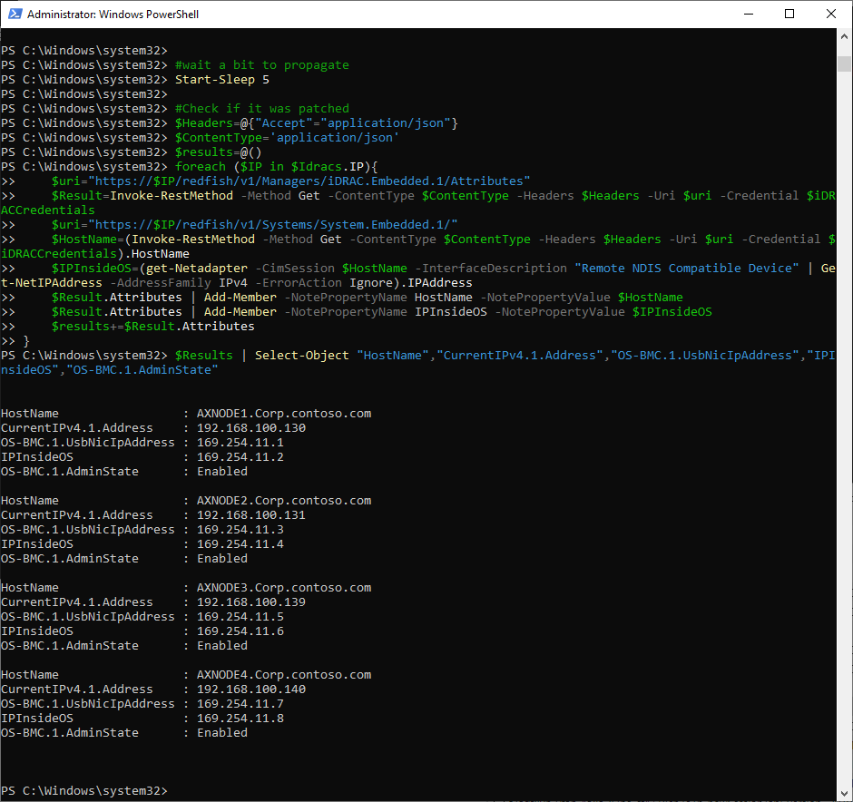

## Task 19 - Install Windows Admin Center on WACGW VM

> This example is demonstration of Windows Admin Center deployed with self-signed certificate. Self-signed cert will be valid for limited time, therefore you should use signed certificate in production, or use Windows Admin Center on Windows Client machine

**Step 1** Download and install Windows Admin Center

```PowerShell
    ##Install Windows Admin Center Gateway 
    $GatewayServerName="WACGW"
    #Download Windows Admin Center if not present
    if (-not (Test-Path -Path "$env:USERPROFILE\Downloads\WindowsAdminCenter.msi")){
        Start-BitsTransfer -Source https://aka.ms/WACDownload -Destination "$env:USERPROFILE\Downloads\WindowsAdminCenter.msi"
        #Or preview (not updated for some time)
        #Start-BitsTransfer -Source https://aka.ms/WACInsiderDownload -Destination "$env:USERPROFILE\Downloads\WindowsAdminCenter.msi"
    }
    #Create PS Session and copy install files to remote server
    #make sure maxevenlope is 8k
    Invoke-Command -ComputerName $GatewayServerName -ScriptBlock {Set-Item -Path WSMan:\localhost\MaxEnvelopeSizekb -Value 8192}
    $Session=New-PSSession -ComputerName $GatewayServerName
    Copy-Item -Path "$env:USERPROFILE\Downloads\WindowsAdminCenter.msi" -Destination "$env:USERPROFILE\Downloads\WindowsAdminCenter.msi" -ToSession $Session

    #Install Windows Admin Center
    Invoke-Command -Session $session -ScriptBlock {
        Start-Process msiexec.exe -Wait -ArgumentList "/i $env:USERPROFILE\Downloads\WindowsAdminCenter.msi /qn /L*v log.txt REGISTRY_REDIRECT_PORT_80=1 SME_PORT=443 SSL_CERTIFICATE_OPTION=generate"
    } -ErrorAction Ignore

    $Session | Remove-PSSession

    #add certificate to trusted root certs (workaround to trust HTTPs cert on WACGW)
    start-sleep 30
    $cert = Invoke-Command -ComputerName $GatewayServerName -ScriptBlock {Get-ChildItem Cert:\LocalMachine\My\ |where subject -eq "CN=Windows Admin Center"}
    $cert | Export-Certificate -FilePath $env:TEMP\WACCert.cer
    Import-Certificate -FilePath $env:TEMP\WACCert.cer -CertStoreLocation Cert:\LocalMachine\Root\
 
```

**Step 2** Configure Resource-Based constrained delegation

> to trust delegated credentials, you must configure nodes to trust delegated credentials from windows admin center. Following code will do that for all Azure Stack HCI servers in domain. If not configured, you would see constant pop-ups for password when connecting to servers.

```PowerShell
#Configure Resource-Based constrained delegation
Install-WindowsFeature -Name RSAT-AD-PowerShell
$gatewayObject = Get-ADComputer -Identity $GatewayServerName
$computers = (Get-ADComputer -Filter {OperatingSystem -eq "Azure Stack HCI"}).Name

foreach ($computer in $computers){
    $computerObject = Get-ADComputer -Identity $computer
    Set-ADComputer -Identity $computerObject -PrincipalsAllowedToDelegateToAccount $gatewayObject
}
 
```

**Step 3** Update Installed Extensions

```PowerShell
#update installed extensions
#https://docs.microsoft.com/en-us/windows-server/manage/windows-admin-center/configure/use-powershell
    #Copy Posh Modules from wacgw
    $Session=New-PSSession -ComputerName $GatewayServerName
    Copy-Item -Path "C:\Program Files\Windows Admin Center\PowerShell\" -Destination "C:\Program Files\Windows Admin Center\PowerShell\" -Recurse -FromSession $Session
    $Session | Remove-PSSession

    #Import Posh Modules
    $Items=Get-ChildItem -Path "C:\Program Files\Windows Admin Center\PowerShell\Modules" -Recurse | Where-Object Extension -eq ".psm1"
    foreach ($Item in $Items){
        Import-Module $Item.fullName
    }

    #list commands
    Get-Command -Module ExtensionTools

    #grab installed extensions 
    $InstalledExtensions=Get-Extension -GatewayEndpoint https://$GatewayServerName  | Where-Object status -eq Installed
    $ExtensionsToUpdate=$InstalledExtensions | Where-Object IsLatestVersion -eq $False

    foreach ($Extension in $ExtensionsToUpdate){
        Update-Extension -GatewayEndpoint https://$GatewayServerName -ExtensionId $Extension.ID
    }
 
```

**Step 4** (Optional) Install Dell OpenManage Extension

```PowerShell
Install-Extension -GatewayEndpoint https://$GatewayServerName -ExtensionId dell-emc.openmanage-integration
 
```