# Exploring Dell OpenManage integration with Windows Admin Center (OMIMSWAC)

<!-- TOC -->

- [Exploring Dell OpenManage integration with Windows Admin Center OMIMSWAC](#exploring-dell-openmanage-integration-with-windows-admin-center-omimswac)
    - [About the lab](#about-the-lab)
    - [Prerequsites](#prerequsites)
    - [Task 01 - Install Extension](#task-01---install-extension)
    - [Task 02 - Explore extension features](#task-02---explore-extension-features)
        - [Health](#health)
        - [Inventory](#inventory)
        - [iDRAC](#idrac)
        - [Security](#security)
        - [Configure](#configure)
    - [Task 03 - Update nodes with offline catalog](#task-03---update-nodes-with-offline-catalog)
        - [Task 03a - Configure file share with DSU binaries](#task-03a---configure-file-share-with-dsu-binaries)
        - [Task 03b - Upload drivers from catalog to fileshare](#task-03b---upload-drivers-from-catalog-to-fileshare)
        - [Perform update](#perform-update)
    - [Task 04 - Deep dive](#task-04---deep-dive)
        - [Task 04a - Collecting logs](#task-04a---collecting-logs)
        - [Task 04b - Collecting HAR log](#task-04b---collecting-har-log)

<!-- /TOC -->

## About the lab

In this lab you will learn about Dell OpenManage integration for Windows Admin Center, how you can install it, what features are available and how to troubleshoot issues (if any) will happen.

Following lab will demonstrate OMIMSWAC features on two clusters - Azure Stack HCI 21H2 and Windows Server 2022

## Prerequsites

Main prerequisite to have extension working is to have Azure Stack HCI cluster or Windows Server cluster with Dell hardware with proper OMIMSWAC license. This lab also assumes Windows Admin Center was already installed (more info in [Azure Stack HCI deployment guide](lab-guides/02-DeployAzureStackHCICluster-PowerShell/readme.md))

To perform following lab you can setup cluster using guides below:

* Hydrate MSLab with LabConfig from [01-HydrateMSLab](../../admin-guides/01-HydrateMSLab/readme.md)

* [Learn How MSLab works](../../admin-guides/02-WorkingWithMSLab/readme.md)

* [Deploy OS on hardware](../../admin-guides/03-DeployPhysicalServersWithMSLab/readme.md)

* [Deploy Azure Stack HCI with PowerShell](../../lab-guides/02-DeployAzureStackHCICluster-PowerShell/readme.md)


## Task 01 - Install Extension

**Step 1** In Windows Admin Center, navigate to settings (sprocket in top right corner).

**Step 2** In Settings, navigate to Extensions

**Step 3** In Extensions select Dell EMC OpenManage Integration and click on Install. Extension will be now installed


**Step 4** Once Extension is installed, it will be automatically available in Cluster view. You can navigate there and accept terms. 

Notice, that OMIMSWAC is using iDRAC USB. It also uses temporary iDRAC account to collect inventory data.

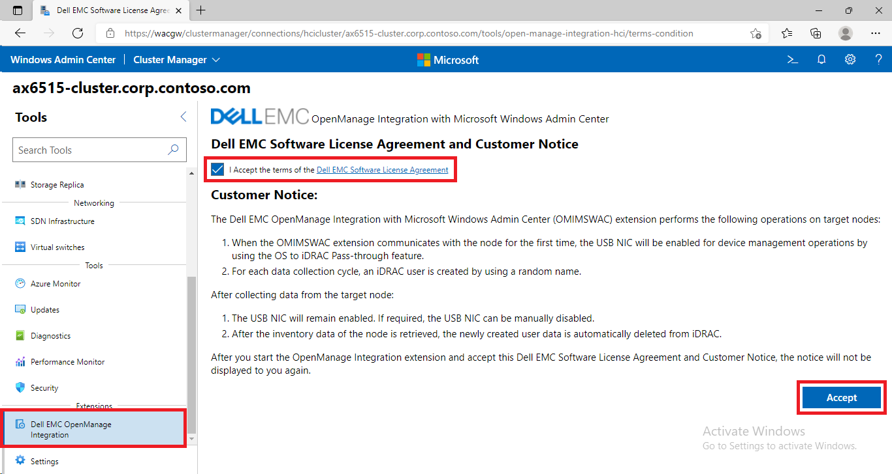

**Step 5** You may receive error about collecting information about Secured-core. To fix it, you can navigate to Security tab and provide run-as credentials.


**Step 6** You may also receive an error when running compliance report under update. To mitigate this one, you may need to increase MaxEvenlope size.

```PowerShell
$Servers="AxNode1","AxNode2"
Invoke-Command -ComputerName $Servers -ScriptBlock {
    Set-Item -Path WSMan:\localhost\MaxEnvelopeSizekb -Value 4096
}
 
```

before

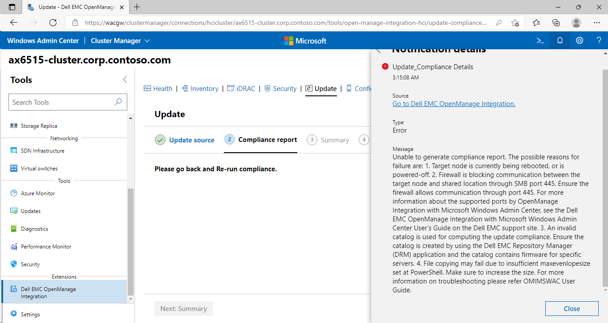

after

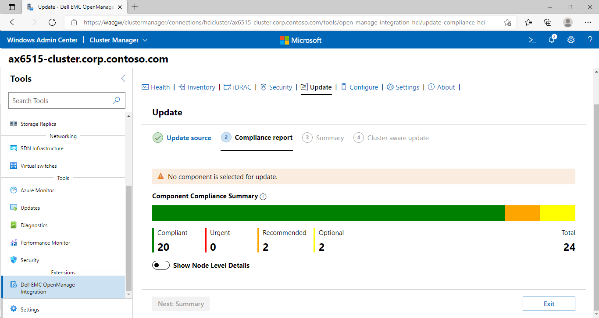


## Task 02 - Explore extension features

[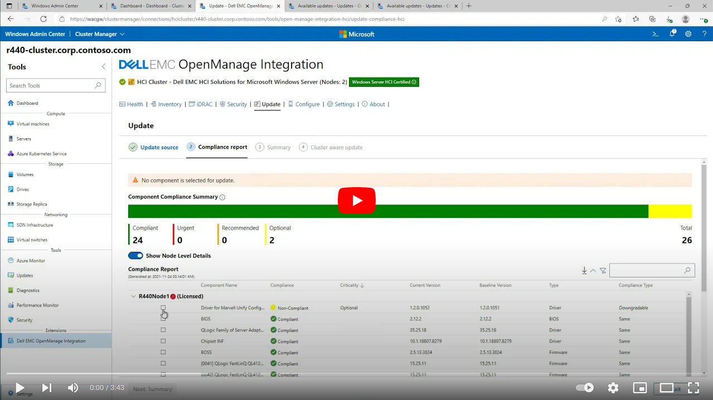](https://youtu.be/xFltFX_OJoo)

### Health

Health provides overview of all hardware components from all nodes. Information is collected using iDRAC USB NICs and RedFish that is running on iDRAC.

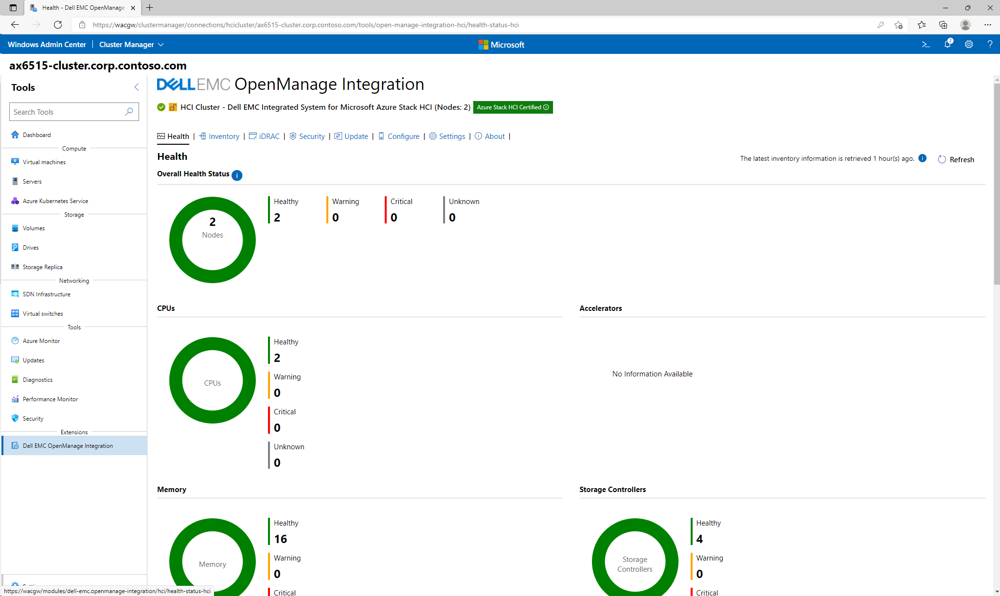


### Inventory

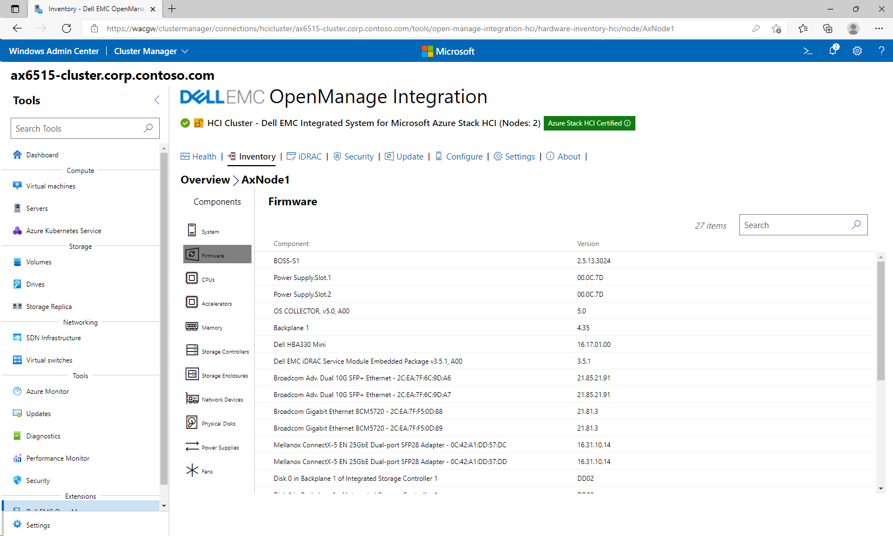

### iDRAC

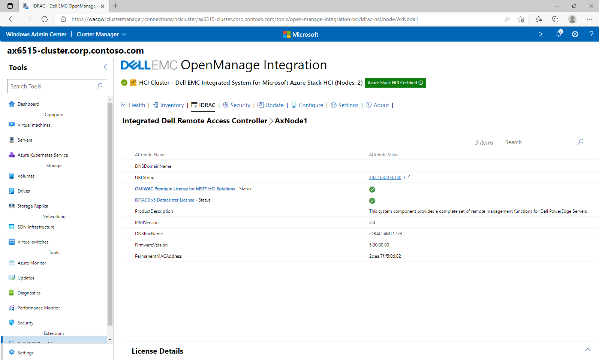

### Security

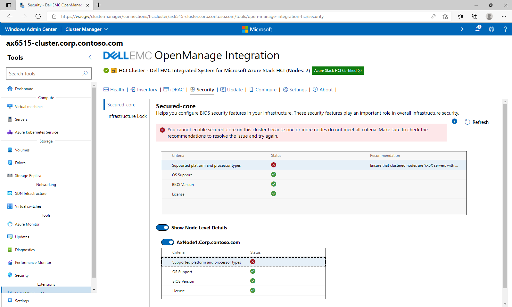

### Configure

As you can see, number of cores and CCDs (Core Chiplet Dies) can be configured.

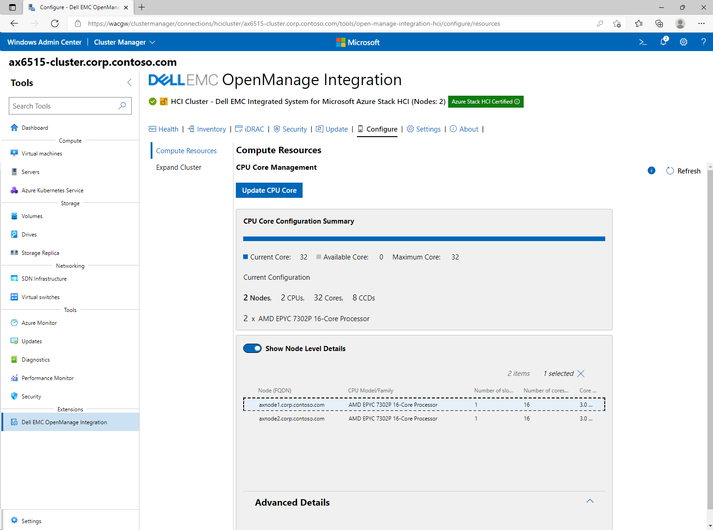


## Task 03 - Update nodes with offline catalog

In Settings tab you can see, that offline catalog can be used. But two components needs to be provided - Inventory Collector and Dell EMC System Update (DSU). Let's do that with PowerShell

### Task 03a - Configure file share with DSU binaries

**Step 1** Paste below script to PowerShell to create a File Share with latest DSU and IC.

```PowerShell
$FileServer="WACGW"
$FileShareName="DellUpdate"
$Account="Corp\LabAdmin"

#Create File Share
    Invoke-Command -ComputerName $FileServer -ScriptBlock {new-item -Path c:\Shares -Name $using:FileShareName -ItemType Directory}
    $accounts=@()
    $accounts+=$account
    New-SmbShare -Name $FileShareName -Path "c:\Shares\$FileShareName" -FullAccess $accounts -CimSession $FileServer
    #Set NTFS permissions 
    Invoke-Command -ComputerName $FileServer -ScriptBlock {(Get-SmbShare $using:FileShareName).PresetPathAcl | Set-Acl}

#Download latest IC to fileshare
    #grab IC links from Dell website
    $URL="https://downloads.dell.com/omimswac/ic/"
    $Results=Invoke-WebRequest $URL -UseDefaultCredentials
    $Links=$results.Links.href | Select-Object -Skip 1
    #create PSObject from results
    $ICs=@()
    foreach ($Link in $Links){
        $ICs+=[PSCustomObject]@{
            Link = "https://dl.dell.com$Link"
            Version = [int]($link -split "_" | Select-Object -Last 2 | Select-Object -First 1)
        }
    }
    #download latest to separate folder
    $LatestIC=$ICs | Sort-Object Version | Select-Object -Last 1
    Start-BitsTransfer -Source $LatestIC.Link -Destination \\$FileServer\$FileShareName\IC.exe

#Download latest DSU
    #grab DSU links from Dell website
    $URL="https://dl.dell.com/omimswac/dsu/"
    $Results=Invoke-WebRequest $URL -UseDefaultCredentials
    $Links=$results.Links.href | Select-Object -Skip 1
    #create PSObject from results
    $DSUs=@()
    foreach ($Link in $Links){
        $DSUs+=[PSCustomObject]@{
            Link = "https://dl.dell.com$Link"
            Version = ($link -split "_" | Select-Object -Last 2 | Select-Object -First 1)
        }
    }
    #download latest to separate folder
    $LatestDSU=$DSUs | Sort-Object Version | Select-Object -Last 1
    Start-BitsTransfer -Source $LatestDSU.Link -Destination \\$FileServer\$FileShareName\DSU.exe

#Download Azure Stack HCI Catalog
    #Dell Azure Stack HCI driver catalog https://downloads.dell.com/catalog/ASHCI-Catalog.xml.gz
    #Download catalog
    Start-BitsTransfer -Source "https://downloads.dell.com/catalog/ASHCI-Catalog.xml.gz" -Destination "$env:UserProfile\Downloads\ASHCI-Catalog.xml.gz"
    #unzip gzip to a folder https://scatteredcode.net/download-and-extract-gzip-tar-with-powershell/
    Function Expand-GZipArchive{
        Param(
            $infile,
            $outfile = ($infile -replace '\.gz$','')
            )
        $input = New-Object System.IO.FileStream $inFile, ([IO.FileMode]::Open), ([IO.FileAccess]::Read), ([IO.FileShare]::Read)
        $output = New-Object System.IO.FileStream $outFile, ([IO.FileMode]::Create), ([IO.FileAccess]::Write), ([IO.FileShare]::None)
        $gzipStream = New-Object System.IO.Compression.GzipStream $input, ([IO.Compression.CompressionMode]::Decompress)
        $buffer = New-Object byte[](1024)
        while($true){
            $read = $gzipstream.Read($buffer, 0, 1024)
            if ($read -le 0){break}
            $output.Write($buffer, 0, $read)
            }
        $gzipStream.Close()
        $output.Close()
        $input.Close()
    }
    Expand-GZipArchive "$env:UserProfile\Downloads\ASHCI-Catalog.xml.gz" "\\$FileServer\$FileShareName\ASHCI-Catalog.xml"
 
```

Result


**Step 2** You can now configure your fileshare in Windows Admin Center and click Save.

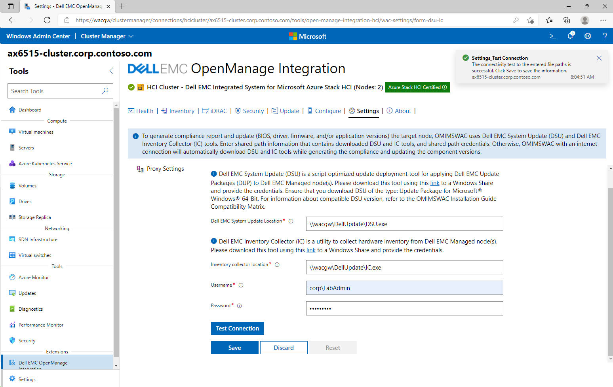

**Step 3** To configure catalog, navigate to Update tab and click on DRM settings under Offline - Dell EMC Repository Manager Catalog.

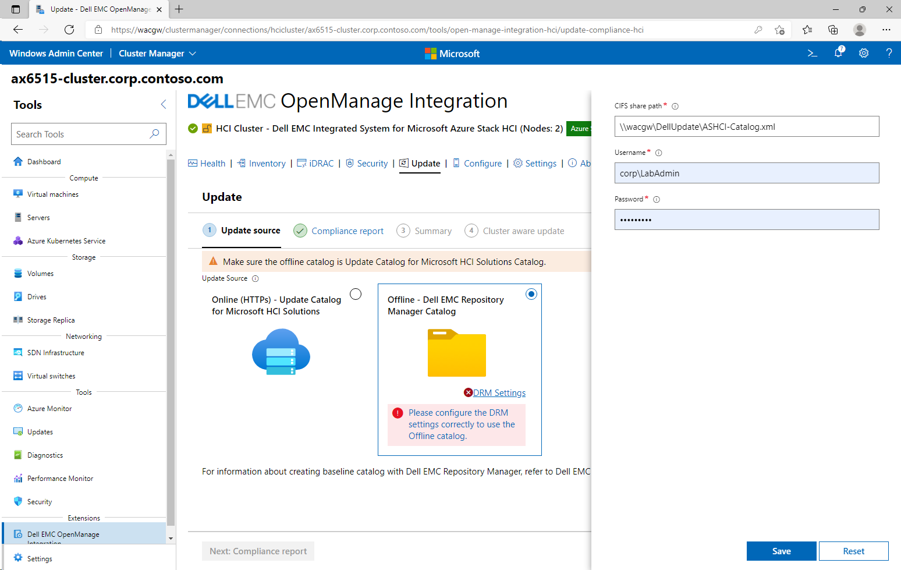

### Task 03b - Upload drivers from catalog to fileshare

**Step 1** Following script will simply let you download any component from catalog you select and upload it to fileshare. Script will let you select (filter, sort), or you can simply select all.

```PowerShell
$FileServer="WACGW"
$FileShareName="DellUpdate"
#load catalog file
[xml]$XML=Get-Content "\\$FileServer\$FileShareName\ASHCI-Catalog.xml"

#ask for what items should be downloaded to fileshare
$items=$xml.manifest.softwarecomponent | Out-GridView -OutputMode Multiple -Title "Please Select components you want to download"

#download
foreach ($item in $items){
    $Path=$item.path.replace("/","\")
    $Folder=$Path | Split-Path
    New-Item -Path \\$FileServer\$FileShareName\ -Name $Folder -ItemType Directory -Force
    Start-BitsTransfer -Source "https://downloads.dell.com/$($item.path)" -Destination "\\$FileServer\$FileShareName\$Path" -DisplayName "Downloading $Path releasedate $($item.releaseDate)"
}
 
```

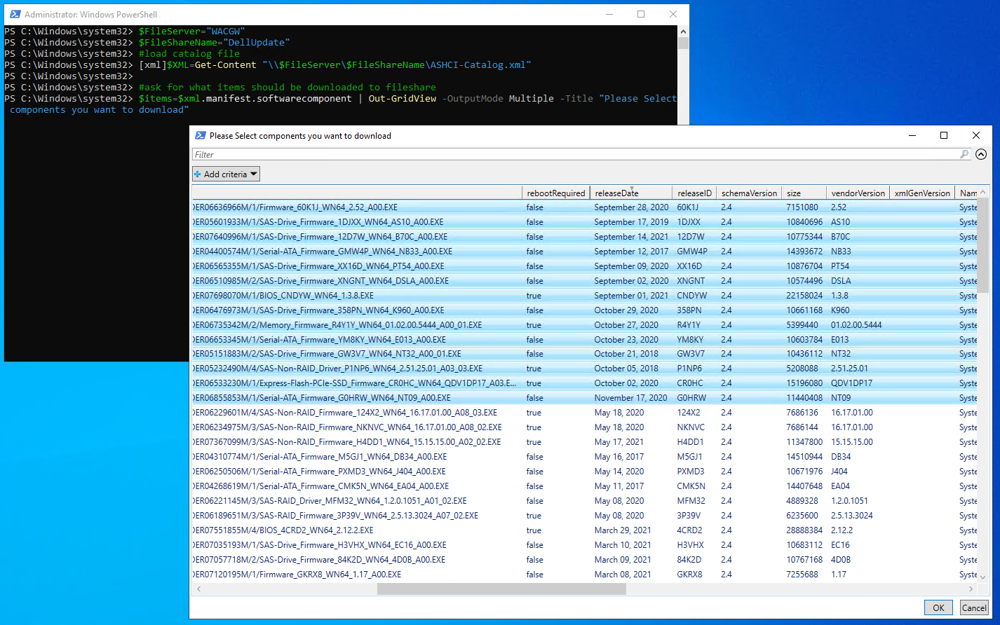

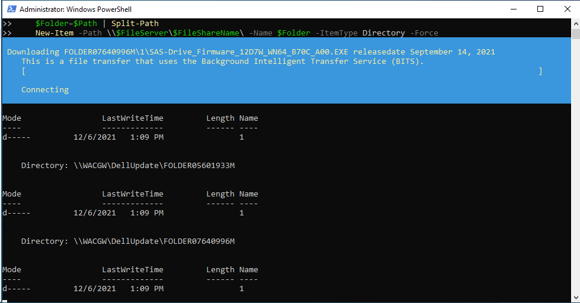

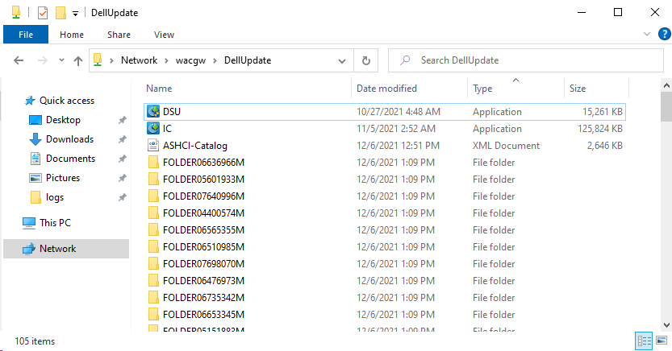

### Perform update

Once all tools, catalog and drivers were populated, DRM Settings configured, cluster can be now offline updated.

**Step 1** Navigate to Update Tab, and select Offline - Dell EMC Repository Manager Catalog and click on Next: Compliance Report

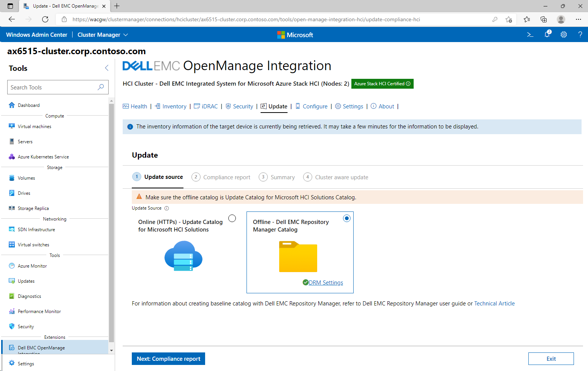

**Step 2** In compliance report, select updates you want to apply, and click Next: Summary

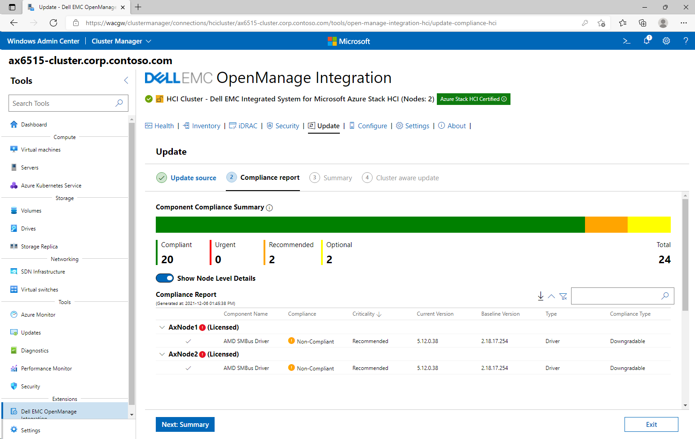

**Step 3** In Summary view, notice, that two options are available - Run now, or Schedule Update. Keep defaults and click Next: Cluster aware update

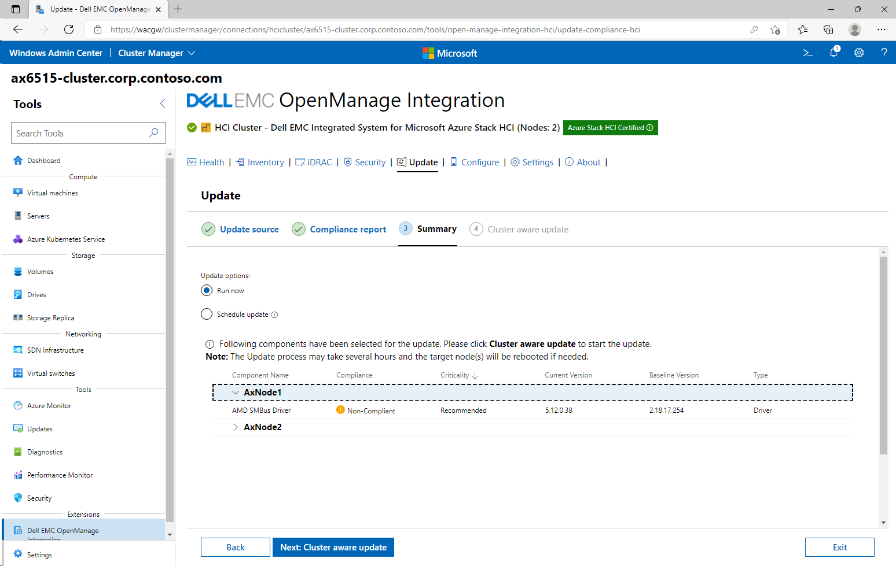

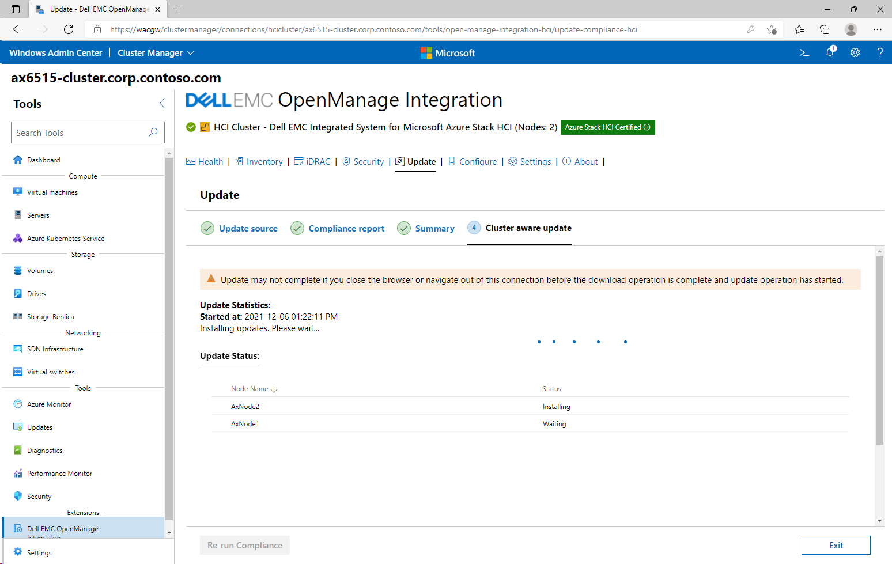

**Step 4** If you navigate out and then back to cluster view, you can navigate to Updates tool, and you will see, that there is a CAU run in progress

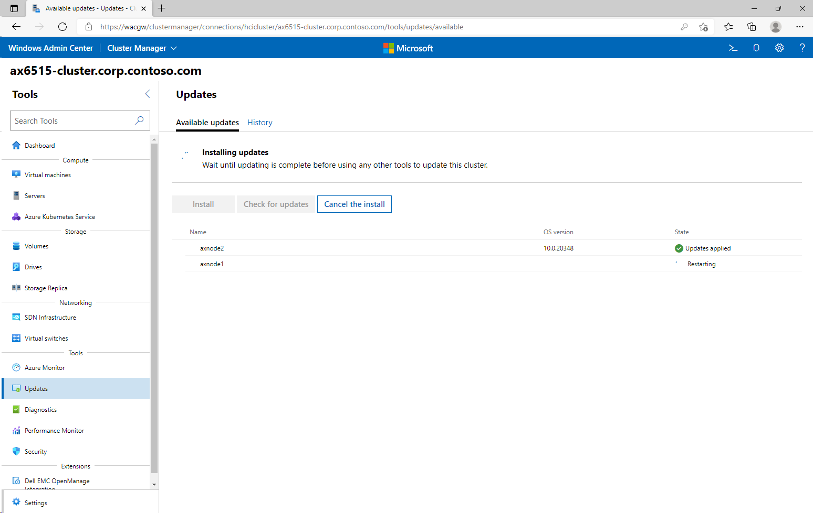

## Task 04 - Deep dive

### Task 04a - Collecting logs

If something goes wrong, there are multiple places to look for logs. Let's explore logs with following script, that will collect all logs from WAC and cluster nodes.

```PowerShell
$WAC="WACGW"
$ClusterName="Ax6515-Cluster"
$ClusterNodes=(Get-ClusterNode -Cluster $ClusterName).Name
$RunAsUserName="LabAdmin"

#Download logs from WACGW
    #create session
    $WACSession=New-PSSession -ComputerName $WAC
    #zip logs
    Invoke-Command -Session $WACSession -ScriptBlock {Compress-Archive -Path c:\Windows\ServiceProfiles\NetworkService\AppData\Local\Temp\generated\logs -DestinationPath c:\Windows\ServiceProfiles\NetworkService\AppData\Local\Temp\Generated\logs.zip -Force}
    #copy
    Copy-Item -Path c:\Windows\ServiceProfiles\NetworkService\AppData\Local\Temp\Generated\logs.zip -Destination $env:UserProfile\Downloads\waclogs.zip -FromSession $WACSession
    #remove session
    $WACSession | Remove-PSSession

#Explore DSU log on Nodes
#logs are available only when HCI update (CAU) is in progress
#Logs are available under c:\Users\UserName\AppData\Roaming\Update\Log
    #Check if CAU is running
    Get-CauRun -ClusterName $ClusterName
    #explore logs
    Invoke-Command -ComputerName $ClusterNodes -ScriptBlock {
        $path="c:\Users\$using:RunAsUserName\AppData\Roaming\Update\Log\dsu_Update_$($env:ComputerName).log"
        If (test-path $path){
            Get-Content $Path
        }
    }
 
```

WAC Logs are zipped and downloaded into downloads.

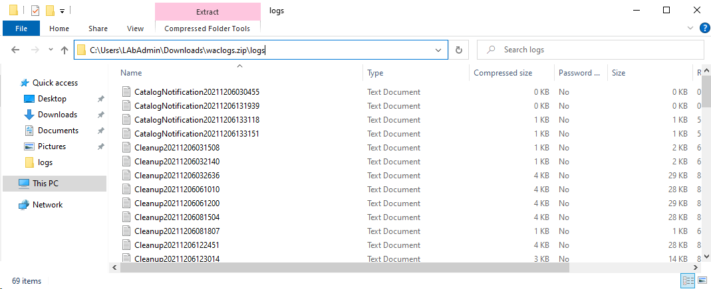

Content of DSU log is displayed (only once install is running on node and log is present) in PowerShell.

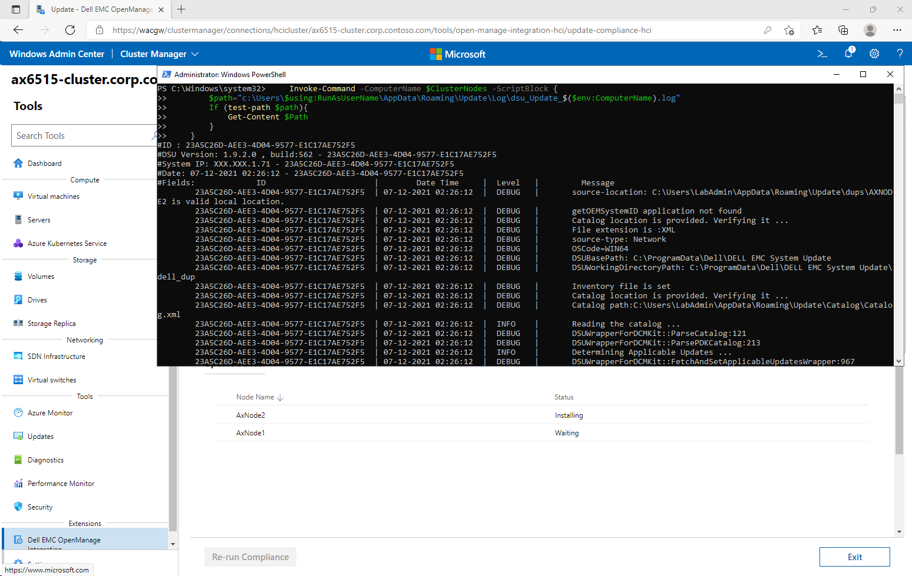

### Task 04b - Collecting HAR log

**Step 1** In Edge browser, click on "three dots" in top right conrner and select More tools. In More tools select Developer tools.

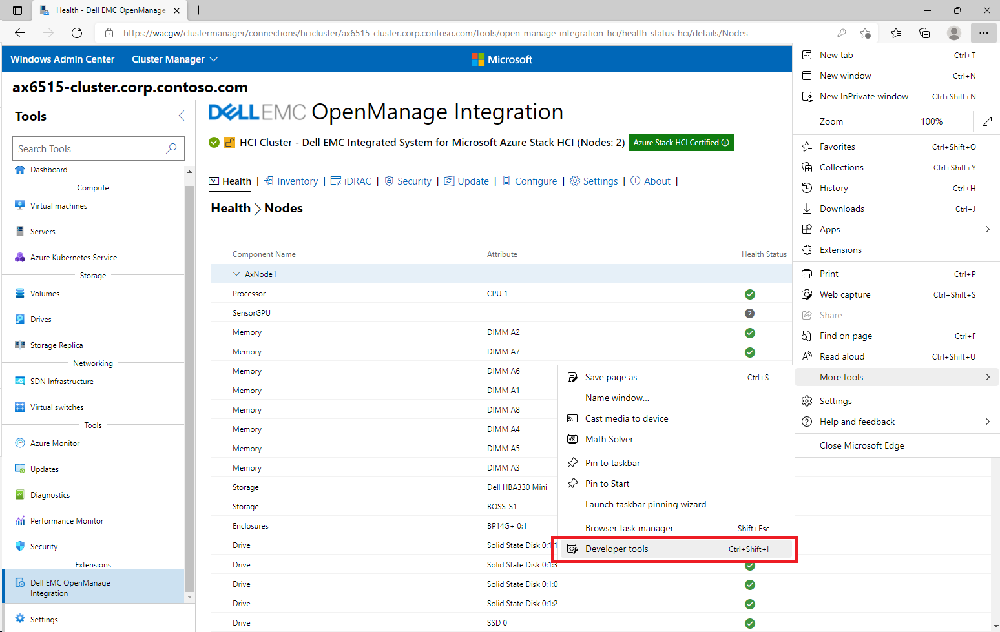

**Step 2** In developer tools, click in "three dots" and select network from more tools.

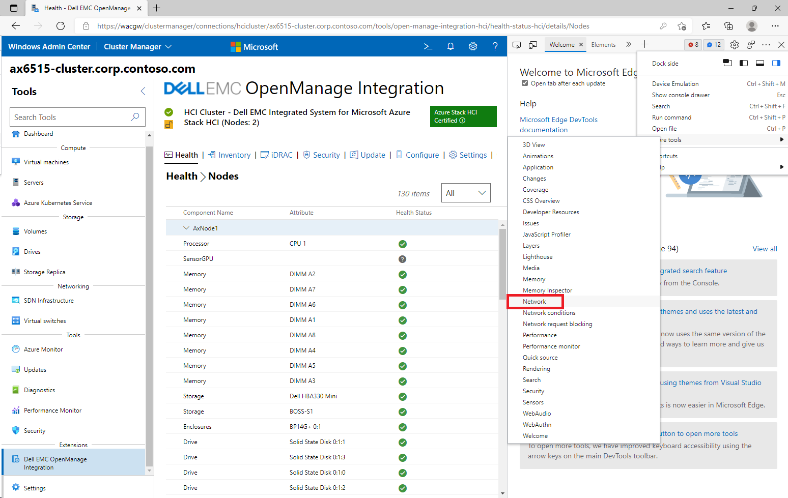

**Step 3** Now the recording has started, you can navigate around in extension, so data will start populating. Once you collect data, you can click on pointing down arrow, that will let you download HAR log.

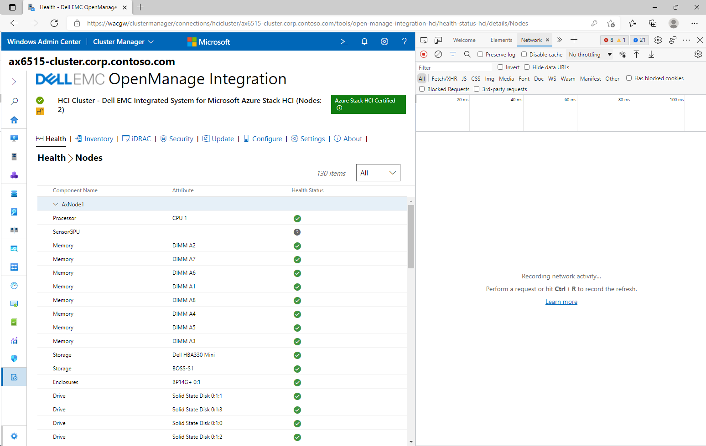

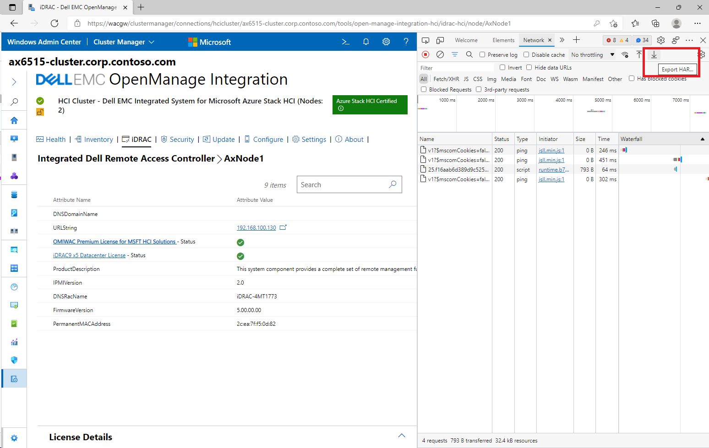
