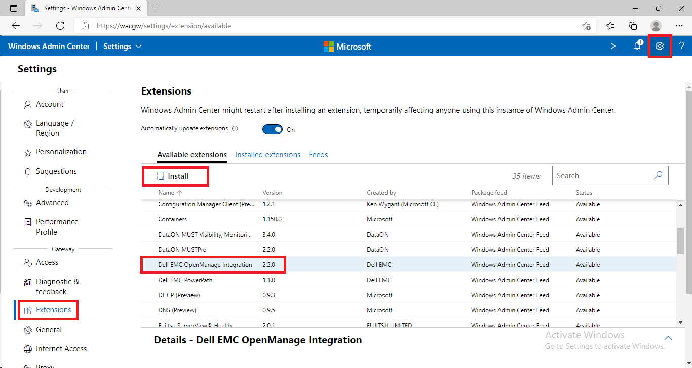
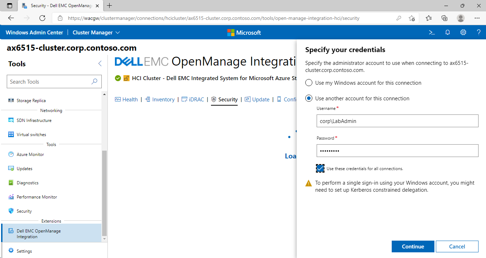

# Exploring Dell OpenManage integration with Windows Admin Center (OMIMWAC)

## About the lab

In this lab you will learn about Dell OpenManage integration for Windows Admin Center, how you can install it, what features are available and how to troubleshoot issues (if any) will happen.

Following lab will demonstrate OMIMWAC features on two clusters - Azure Stack HCI 21H2 and Windows Server 2022

## Prerequsites

Main prerequisite to have extension working is to have Azure Stack HCI cluster or Windows Server cluster with Dell hardware with proper OMIMWAC license. This lab also assumes Windows Admin Center was already installed (more info in [Azure Stack HCI deployment guide](lab-guides/02-DeployAzureStackHCICluster-PowerShell/readme.md))

To perform following lab you can setup cluster using guides below:

* MSLab with LabConfig from [01-HydrateMSLab](admin-guides/01-HydrateMSLab/readme.md)

* [How MSLab works](admin-guides/02-WorkingWithMSLab/readme.md)

* [OS deployed on hardware](admin-guides/03-DeployPhysicalServersWithMSLab/readme.md)

* [Azure Stack HCI deployment guide](lab-guides/02-DeployAzureStackHCICluster-PowerShell/readme.md)


## Installing Extension

**1.** In Windows Admin Center, navigate to settings (sprocket in top right corner).

**2.** In Settings, navigate to Extensions

**3.** In Extensions select Dell EMC OpenManage Integration and click on Install. Extension will be now installed



**4.** Once Extension is installed, it will be automatically available in Cluster view. You can navigate there and accept terms. 

Notice, that OMIMWAC is using iDRAC USB. It also uses temporary iDRAC account to collect inventory data.


**5.** You may receive error about collecting information about Secured-core. To fix it, you can navigate to Security tab and provide run-as credentials.





**6** You may also receive an error when running compliance report under update. To mitigate this one, you may need to increase MaxEvenlope size.

```PowerShell
$Servers="AxNode1","AxNode2"
Invoke-Command -ComputerName $Servers -ScriptBlock {
    Set-Item -Path WSMan:\localhost\MaxEnvelopeSizekb -Value 4096
}
 
```

before


after


## Exploring extension features

