# Deploying Azure Virtual Desktop on Azure Stack HCI Cluster

<!-- TOC -->

- [Deploying Azure Virtual Desktop on Azure Stack HCI Cluster](#deploying-azure-virtual-desktop-on-azure-stack-hci-cluster)
    - [About the lab](#about-the-lab)
    - [Prerequsites](#prerequsites)
    - [Task 01 - Define Variables](#task-01---define-variables)
    - [Task 02 - Prepare cluster](#task-02---prepare-cluster)
    - [Task 03 - Create Host Pool in Azure](#task-03---create-host-pool-in-azure)
    - [Task 04 - Grab VHD from Azure, and copy it to Library Share](#task-04---grab-vhd-from-azure-and-copy-it-to-library-share)
        - [Task 04a - Explore available disks in Azure](#task-04a---explore-available-disks-in-azure)
        - [Task 04b - Export image to managed disk and download](#task-04b---export-image-to-managed-disk-and-download)
    - [Task 05 - Create VMs on Azure Stack HCI Cluster](#task-05---create-vms-on-azure-stack-hci-cluster)
    - [Task 06 - Connect VMs to Azure](#task-06---connect-vms-to-azure)
        - [Task 06a - Connect VMs to Azure Arc](#task-06a---connect-vms-to-azure-arc)
        - [Task 06b - Connect VMs to Azure Virtual Desktop Host Pool](#task-06b---connect-vms-to-azure-virtual-desktop-host-pool)

<!-- /TOC -->

## About the lab

In this lab you will learn about how to deploy Azure Virtual Desktop (currently in preview) on Azure Stack HCI. All with PowerShell.

The lab is based on [AzSHCI and AVD](https://github.com/microsoft/MSLab/tree/dev/Scenarios/AzSHCI%20and%20AVD) MSLab scenario.

Entire lab can be run from management machine or from DC (in MSLab).

Keep PowerShell window open for entire lab

## Prerequsites

The main prerequisite is to have Azure Stack HCI cluster where you can deploy session hosts.

To perform following lab you can setup cluster using guides below:

* Hydrate MSLab with LabConfig from [01-HydrateMSLab](admin-guides/01-HydrateMSLab/readme.md)

* [Learn How MSLab works](admin-guides/02-WorkingWithMSLab/readme.md)

* [Deploy OS on hardware](admin-guides/03-DeployPhysicalServersWithMSLab/readme.md)

* [Deploy Azure Stack HCI with PowerShell](lab-guides/02-DeployAzureStackHCICluster-PowerShell/readme.md)

## Task 01 - Define Variables

**Step 1** While logged into Management machine (or DC in MSLab), run following code to define variables that will be used in this lab. It will also let you log in into Azure and will install all modules that will be needed.

> Note: you can adjust code to fit your lab/environment - such as cluster name, OU, vSwitch name ...

```PowerShell
$ClusterName="ax6515-cluster"
$ClusterNodes=(Get-ClusterNode -Cluster $ClusterName).Name
$LibraryVolumeName="Library" #volume for images for VMs
$VMsVolumeSize=1TB #size of volumes for AVD VMs
$OUPath="OU=Workshop,DC=Corp,DC=contoso,DC=com" #OU where AVD VMs will be djoined
$vSwitchName="vSwitch"
$MountDir="c:\temp\MountDir" #cannot be CSV. Location for temporary mount of VHD to inject answer file

$AVDResourceGroupName="MSLabAVD"
$AVDHostPoolName="MSLabAVDPool"
$AVDWorkspaceName="MSLabAVDWorkspace"

$ManagedDiskName = "AVD_OS_Disk_Windows11_m365"
$Offer="windows11preview"
$SKU="win11-21h2-avd-m365"

#Install Azure packages
    Install-PackageProvider -Name NuGet -MinimumVersion 2.8.5.201 -Force
    $ModuleNames="Az.Accounts","Az.Compute","Az.Resources","Az.DesktopVirtualization"
    foreach ($ModuleName in $ModuleNames){
        if (!(Get-InstalledModule -Name $ModuleName -ErrorAction Ignore)){
            Install-Module -Name $ModuleName -Force
        }
    }

#login to Azure
    if (-not (Get-AzContext)){
        Login-AzAccount -UseDeviceAuthentication
    }

#select context
    $context=Get-AzContext -ListAvailable
    if (($context).count -gt 1){
        $context=$context | Out-GridView -OutputMode Single
        $context | Set-AzContext
    }

#location (all locations where HostPool can be created)
    $region=(Get-AzLocation | Where-Object Providers -Contains "Microsoft.DesktopVirtualization" | Out-GridView -OutputMode Single -Title "Please select Location for AVD Host Pool metadata").Location

#register provider
    $Provider="Microsoft.DesktopVirtualization"
    Register-AzResourceProvider -ProviderNamespace $Provider
    #wait for provider to finish registration
    do {
        $Status=Get-AzResourceProvider -ProviderNamespace $Provider
        Write-Output "Registration Status - $Provider : $(($status.RegistrationState -match 'Registered').Count)/$($Status.Count)"
        Start-Sleep 1
    } while (($status.RegistrationState -match "Registered").Count -ne ($Status.Count))

#Generate list of VMs to be created
    #Session hosts
    $VMs=@()
    $VMsPerNode=4
    Foreach ($ClusterNode in $ClusterNodes){
        foreach ($number in 1..$VMsPerNode){
            $VMs+=@{VMName="$($ClusterNode)_AVD$("{0:D2}" -f $Number)"; MemoryStartupBytes=1GB ; DynamicMemory=$true ; NumberOfCPUs=4 ; AdminPassword="LS1setup!" ; CSVPath="c:\ClusterStorage\$ClusterNode" ; Owner=$ClusterNode}
        }
    }
    #fileserver (fileservers)
    $ServerVMs=@()
    $ServerVMs+=@{VMName="FileServer"; MemoryStartupBytes=1GB ; DynamicMemory=$true ; NumberOfCPUs=4 ; AdminPassword="LS1setup!" ; CSVPath="c:\ClusterStorage\$($ClusterNodes[0])" ; Owner=$($ClusterNodes[0])}
 
```

## Task 02 - Prepare cluster

**Step 1** Configure cluster to use Thin provisioning as default (if thin provisioning is available)

```PowerShell
#configure thin volumes a default if available (because why not :)
    $OSInfo=Invoke-Command -ComputerName $ClusterName -ScriptBlock {
        Get-ItemProperty -Path 'HKLM:\SOFTWARE\Microsoft\Windows NT\CurrentVersion\'
    }
    if ($OSInfo.productname -eq "Azure Stack HCI" -and $OSInfo.CurrentBuildNumber -ge 20348){
        Get-StoragePool -CimSession $ClusterName -FriendlyName S2D* | Set-StoragePool -ProvisioningTypeDefault Thin
    }
#validate pool setting
    Get-StoragePool -CimSession $ClusterName -FriendlyName S2D* | Select FriendlyName,ProvisioningTypeDefault
 
```


**Step 2** Now let's create Volumes (virtual disks) where VMs will be placed. And also one for "Library", where VHDs for VMs can be stored.

> Note: the script will create one volume per node for VMs with the same name as node.

```PowerShell
#Create library volume
    if (-not (Get-VirtualDisk -CimSession $ClusterName -FriendlyName $LibraryVolumeName -ErrorAction Ignore)){
        New-Volume -StoragePoolFriendlyName "S2D*" -FriendlyName $LibraryVolumeName -FileSystem CSVFS_ReFS -Size 500GB -ResiliencySettingName Mirror -CimSession $ClusterName
    }

# Create volumes for VMs
    #note - for easier tracking, we will create volume names with same name as node
    foreach ($ClusterNode in $ClusterNodes){
        if (-not (Get-VirtualDisk -CimSession $ClusterName -FriendlyName $ClusterNode -ErrorAction Ignore)){
            New-Volume -StoragePoolFriendlyName S2D* -FriendlyName $ClusterNode -FileSystem CSVFS_ReFS -Size $VMsVolumeSize -ResiliencySettingName Mirror -CimSession $ClusterName
        }
    }
 
```

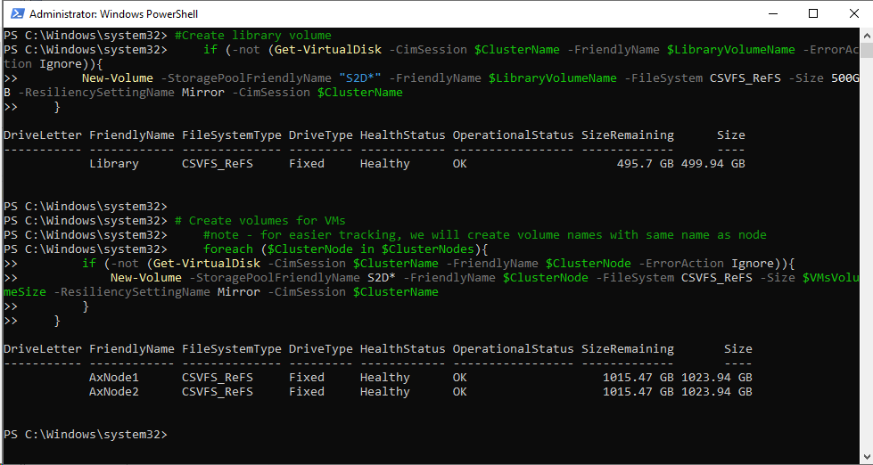

## Task 03 - Create Host Pool in Azure

**Step 1** Create Azure Virtual Desktop Host Pool. You will be asked for Region where to create Resource Group and Host Pool.

```PowerShell
#Create resource Group
    If (-not (Get-AzResourceGroup -Name $AVDResourceGroupName -ErrorAction Ignore)){
        New-AzResourceGroup -Name $AVDResourceGroupName -Location $region
    }

#Create Host Pool
    New-AzWvdHostPool -Name $AVDHostPoolName -ResourceGroupName $AVDResourceGroupName -HostPoolType "Pooled" -LoadBalancerType "BreadthFirst" -PreferredAppGroupType "Desktop" -Location $Region -WorkspaceName $AVDWorkspaceName -DesktopAppGroupName "Desktop"
 
```

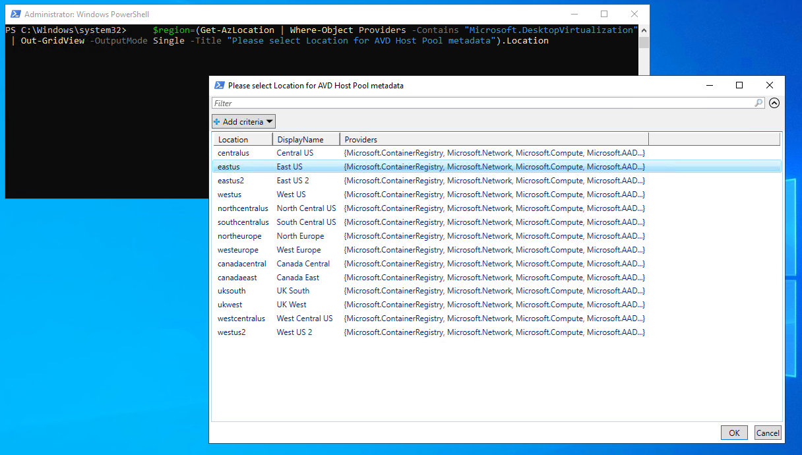


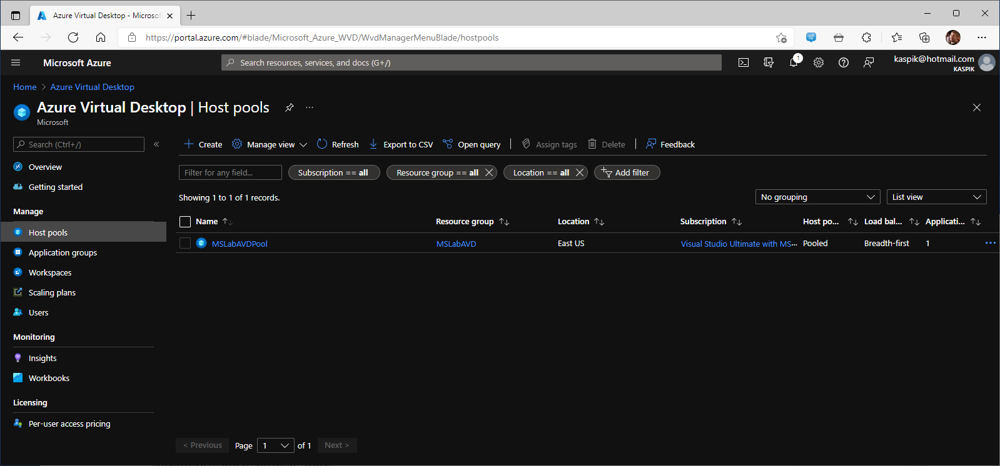

## Task 04 - Grab VHD from Azure, and copy it to Library Share

### Task 04a - Explore available disks in Azure

**Step 1** First, you need to explore what publishers are available in Azure

```PowerShell
Get-AzVMImagePublisher -Location $region | Out-GridView
 
```

As you can see, there is quite some number of publishers available. Just Microsoft has quite extensive list.


**Step 2** Since we know we are after "microsoftwindowsdesktop", let's list all Offers from this publisher

```PowerShell
Get-AzVMImageOffer -Location $region -PublisherName  "microsoftwindowsdesktop"
 
```


**Step 3** Let's explore what images are available for Windows 11 (Teams and Office were available only in preview win11 offer when this HOL was written) and Windows 10

```PowerShell
#list win10 SKUs
    Get-AzVMImageSku -Location $region -PublisherName  "microsoftwindowsdesktop" -Offer "Windows-10"
#list win11 preview SKUs
    Get-AzVMImageSku -Location $region -PublisherName  "microsoftwindowsdesktop" -Offer "Windows11preview"
 
```


**Step 4** And now we can finally explore what images are available under SKU.

```PowerShell
Get-AzVMImage -Location $region -PublisherName "microsoftwindowsdesktop" -Offer $Offer -SKU $SKU
 
```


### Task 04b - Export image to managed disk and download

**Step 1** Let's work with image and export it into managed disk

```PowerShell
    $image=Get-AzVMImage -Location $region -PublisherName  "microsoftwindowsdesktop" -Offer $Offer -SKU $SKU | Sort-Object Version -Descending |Select-Object -First 1
    $ImageVersionID = $image.id

# Export the OS disk
    $imageOSDisk = @{Id = $ImageVersionID}
    $OSDiskConfig = New-AzDiskConfig -Location $region -CreateOption "FromImage" -ImageReference $imageOSDisk
    New-AzDisk -ResourceGroupName $AVDResourceGroupName -DiskName $ManagedDiskName -Disk $OSDiskConfig
 
```

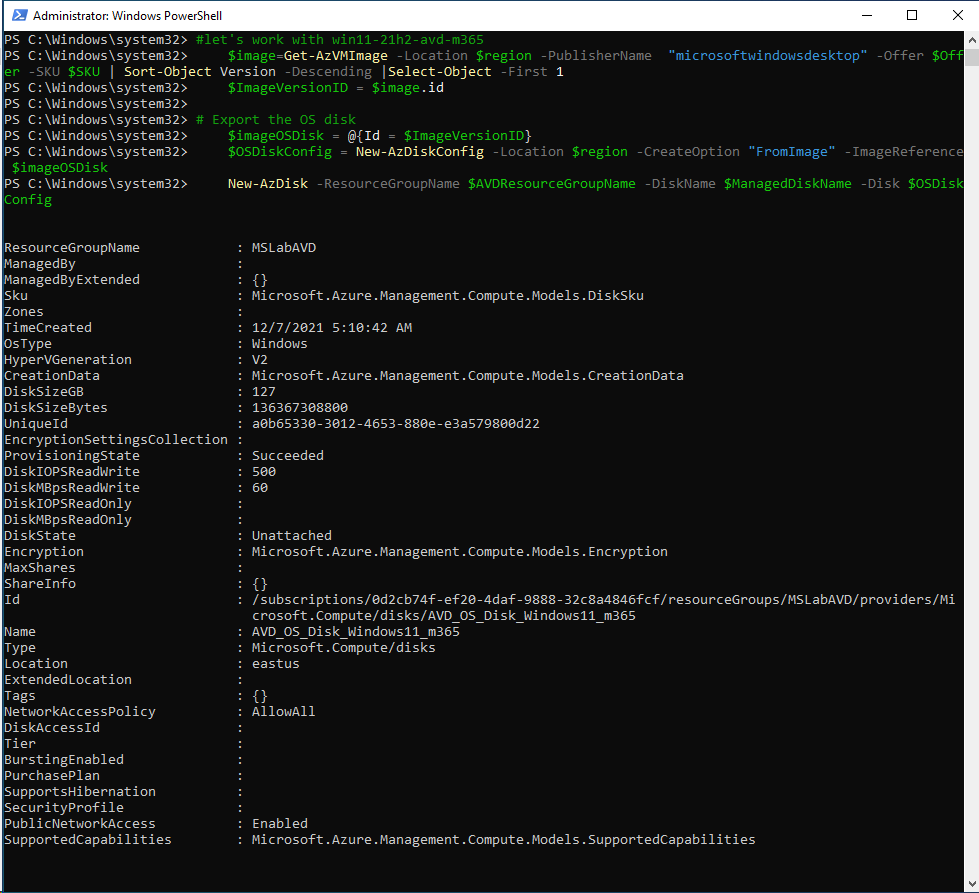

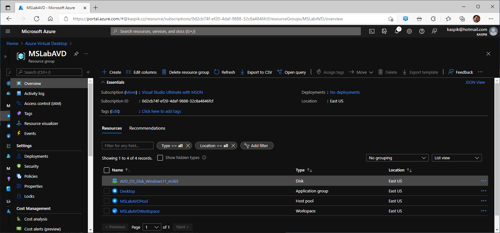


**Step 2** Grant access to disk, so disk will be downloadable from internet.

```PowerShell
#Grant Access https://docs.microsoft.com/en-us/azure/storage/common/storage-sas-overview
$output=Grant-AzDiskAccess -ResourceGroupName $AVDResourceGroupName -DiskName $ManagedDiskName -Access 'Read' -DurationInSecond 3600
#Grab shared access signature
$SAS=$output.accesssas
$SAS
 
```


**Step 3** The next step would be to download image from Azure. To do that, Start-BitsTransfer can be used, but let's use tool that was designed to transfer files from/to azure - AZCopy

> Note: the following example demonstrates copy with cap limited to 500MBps

> Note: the following example copies VHD directly to the library on the cluster

```PowerShell
#Start-BitsTransfer -Source $SAS -Destination "\\$ClusterName\ClusterStorage$\$LibraryVolumeName\$SKU.vhd"
    #download using AzCopy as it's faster than bits transfer
    #https://aka.ms/downloadazcopy-v10-windows\
        # Download the package 
        Start-BitsTransfer -Source "https://aka.ms/downloadazcopy-v10-windows" -Destination "$env:UserProfile\Downloads\AzCopy.zip"
        Expand-Archive -Path "$env:UserProfile\Downloads\AzCopy.zip" -DestinationPath "$env:UserProfile\Downloads\AZCopy" -Force
        $item=Get-ChildItem -Name azcopy.exe -Recurse -Path "$env:UserProfile\Downloads\AZCopy" 
        Move-Item -Path "$env:UserProfile\Downloads\AZCopy\$item" -Destination "$env:UserProfile\Downloads\"
        Remove-Item -Path "$env:UserProfile\Downloads\AZCopy\" -Recurse
        Remove-Item -Path "$env:UserProfile\Downloads\AzCopy.zip"
        #download VHD to library
        & $env:UserProfile\Downloads\azcopy.exe copy $sas "\\$ClusterName\ClusterStorage$\$LibraryVolumeName\$SKU.vhd" --check-md5 NoCheck --cap-mbps 500
 
```

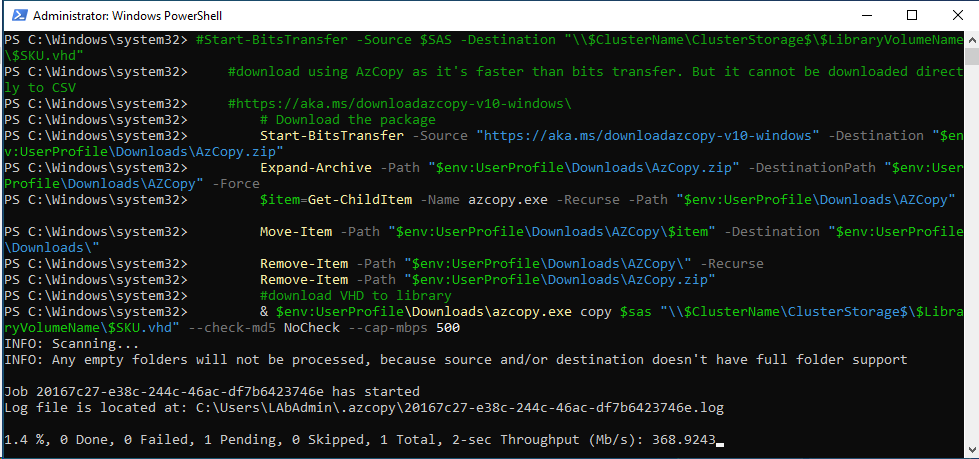

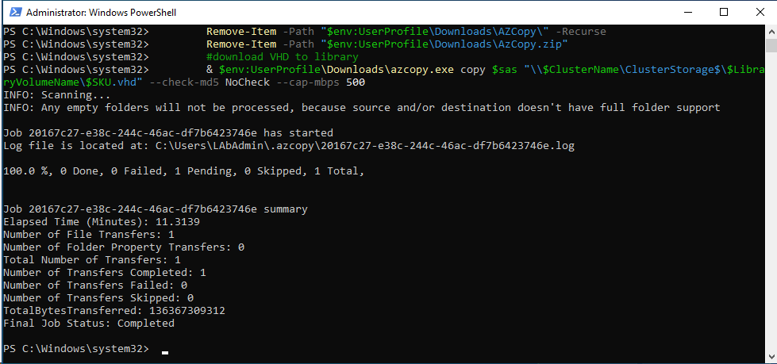

**Step 4** Once Image is downloaded, access can be revoked and image can be deleted.

```PowerShell
#once disk is downloaded, disk access can be revoked
    Revoke-AzDiskAccess -ResourceGroupName  $AVDResourceGroupName -Name $ManagedDiskName
#and disk itself can be removed
    Remove-AzDisk -ResourceGroupName $AVDResourceGroupName -DiskName $ManagedDiskName -Force
 
```


**Step 5** Since disk is static VHD, it is useful to convert it into VHDx and compress.

```PowerShell
#convert image to dynamic VHDx
    Invoke-Command -ComputerName $ClusterName -ScriptBlock {
        Convert-VHD -Path "c:\clusterstorage\$using:LibraryVolumeName\$using:sku.vhd" -DestinationPath "c:\clusterstorage\$using:LibraryVolumeName\$using:sku.vhdx" -VHDType Dynamic -DeleteSource
        Optimize-VHD -Path "c:\clusterstorage\$using:LibraryVolumeName\$using:sku.vhdx" -Mode Full
    }
 
```

Before


After


## Task 05 - Create VMs on Azure Stack HCI Cluster

Following code is more a "Paste and forget", but let's go deep dive into what is really happening

**Step 1** Generate list of VMs that will be created

> Note: you can see from the output, that following script will generate list of VMs and it's names. You can easily adjust size of VMs and number of VMs per node.

```PowerShell
#Generate list of VMs to be created
    #Session hosts
    $VMs=@()
    $VMsPerNode=4
    Foreach ($ClusterNode in $ClusterNodes){
        foreach ($number in 1..$VMsPerNode){
            $VMs+=@{VMName="$($ClusterNode)_AVD$("{0:D2}" -f $Number)"; MemoryStartupBytes=1GB ; DynamicMemory=$true ; NumberOfCPUs=4 ; AdminPassword="LS1setup!" ; CSVPath="c:\ClusterStorage\$ClusterNode" ; Owner=$ClusterNode}
        }
    }
 
```

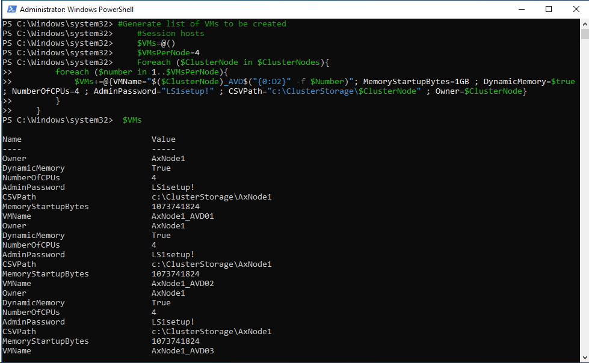

**Step 2** Create VMs

> Note: The script will use VHD from library, will provision answer file with domain join information (using offline domain join) and inject it into VHD. Once VHD is generated, it will create a VM, add it as clustered role and will start it

>Note: You can also notice in answer file, that PowerShell remoting will be enabled. This is useful as Windows Client edition does not enable PowerShell remoting by default (as opposite from Windows Server)

```PowerShell
<#In case you have your own VHD you can provide it
#Ask for VHD
Write-Output "Please select VHD for AVD created using CreateParentDisk.ps1"
[reflection.assembly]::loadwithpartialname("System.Windows.Forms")
$openFile = New-Object System.Windows.Forms.OpenFileDialog -Property @{
    Title="Please select VHD created using CreateParentDisk.ps1"
}
$openFile.Filter = "vhdx files (*.vhdx)|*.vhdx|All files (*.*)|*.*" 
If($openFile.ShowDialog() -eq "OK"){
    Write-Output  "File $($openfile.FileName) selected"
}
$VHDPath=$openfile.FileName
#Copy image
Copy-Item -Path $VHDPath -Destination "\\$ClusterName\ClusterStorage$\$LibraryVolumeName\"
#Generate Image Name
$ImageName=$VHDPath | Split-Path -Leaf
#>

#or the image that was downloaded from Azure 
    $ImageName="$SKU.vhdx"

#Create VMs
    foreach ($VM in $VMs){
        #Copy VHD to destination
        Invoke-Command -ComputerName $VM.Owner -ScriptBlock {
            New-Item -Path "$($using:VM.CSVPath)\$($using:VM.VMName)\Virtual Hard Disks\" -ItemType Directory -Force
            Copy-Item -Path "c:\ClusterStorage\$using:LibraryVolumeName\$using:ImageName" -Destination "$($using:VM.CSVPath)\$($using:VM.VMName)\Virtual Hard Disks\$($using:VM.VMName).vhdx"
        }
        #Create Answer File
        $djointemp=New-TemporaryFile
        & djoin.exe /provision /domain $env:USERDOMAIN /machine $VM.VMName /savefile $djointemp.fullname /machineou $OUPath
        #extract blob blob from temp file
        $Blob=get-content $djointemp
        $Blob=$blob.Substring(0,$blob.Length-1)
        #remove temp file
        $djointemp | Remove-Item

        #Generate Unattend file with WINRM Enabled
    $unattend = @"
<?xml version='1.0' encoding='utf-8'?>
<unattend xmlns="urn:schemas-microsoft-com:unattend" xmlns:wcm="http://schemas.microsoft.com/WMIConfig/2002/State" xmlns:xsi="http://www.w3.org/2001/XMLSchema-instance">
  <settings pass="offlineServicing">
    <component name="Microsoft-Windows-UnattendedJoin" processorArchitecture="amd64" publicKeyToken="31bf3856ad364e35" language="neutral" versionScope="nonSxS">
        <OfflineIdentification>
           <Provisioning>
             <AccountData>$Blob</AccountData>
           </Provisioning>
         </OfflineIdentification>
    </component>
  </settings>
  <settings pass="oobeSystem">
    <component name="Microsoft-Windows-Shell-Setup" processorArchitecture="amd64" publicKeyToken="31bf3856ad364e35" language="neutral" versionScope="nonSxS">
      <UserAccounts>
        <AdministratorPassword>
           <Value>$($VM.AdminPassword)</Value>
           <PlainText>true</PlainText>
        </AdministratorPassword>
      </UserAccounts>
      <OOBE>
       <HideEULAPage>true</HideEULAPage>
       <SkipMachineOOBE>true</SkipMachineOOBE>
       <SkipUserOOBE>true</SkipUserOOBE>
      </OOBE>
    </component>
  </settings>
  <settings pass="specialize">
    <component name="Microsoft-Windows-Shell-Setup" processorArchitecture="amd64" publicKeyToken="31bf3856ad364e35" language="neutral" versionScope="nonSxS">
      <RegisteredOwner>GEOSRules!</RegisteredOwner>
      <RegisteredOrganization>GEOSRules!</RegisteredOrganization>
    </component>
    <component name="Microsoft-Windows-Deployment" processorArchitecture="amd64" publicKeyToken="31bf3856ad364e35" language="neutral" versionScope="nonSxS" xmlns:wcm="http://schemas.microsoft.com/WMIConfig/2002/State" xmlns:xsi="http://www.w3.org/2001/XMLSchema-instance">
      <RunSynchronous>
        <RunSynchronousCommand wcm:action="add">
          <Path>cmd.exe /c winrm quickconfig -q -force</Path>
          <Description>enable winrm</Description>
          <Order>1</Order>
        </RunSynchronousCommand>
      </RunSynchronous>
    </component>
  </settings>
</unattend>
"@

#Mount VHD and Apply answer file
    Invoke-Command -ComputerName $ClusterName -ScriptBlock {
        New-Item -Path "$using:Mountdir" -ItemType Directory -Force
        Mount-WindowsImage -Path "$using:Mountdir" -ImagePath "$($using:VM.CSVPath)\$($using:VM.VMName)\Virtual Hard Disks\$($using:VM.VMName).vhdx" -Index 1
        New-item -type directory  "$using:Mountdir\Windows\Panther"
        Set-Content -Value $using:unattend -Path "$using:Mountdir\Windows\Panther\Unattend.xml"
        Use-WindowsUnattend -Path "$using:Mountdir" -UnattendPath "$using:Mountdir\Windows\Panther\Unattend.xml"
        Dismount-WindowsImage -Path "$using:Mountdir" -Save
        Remove-Item -Path "$using:Mountdir"
    }

#Create VM
    Invoke-Command -ComputerName $VM.Owner -ScriptBlock {
        $VM=$using:vm
        $VMTemp=New-VM -Name $VM.VMName -MemoryStartupBytes $VM.MemoryStartupBytes -Generation 2 -Path "$($using:VM.CSVPath)" -VHDPath "$($using:VM.CSVPath)\$($VM.VMName)\Virtual Hard Disks\$($VM.VMName).vhdx" -SwitchName $Using:vSwitchName
        $VMTemp | Set-VMProcessor -Count $VM.NumberOfCPUs
        if ($VM.DynamicMemory){
            $VMTemp | Set-VM -DynamicMemory
        }
        $VMTemp | Start-VM
    }
#add VM as clustered role
    Add-ClusterVirtualMachineRole -VMName $VM.VMName -Cluster $ClusterName
}
 
```

result

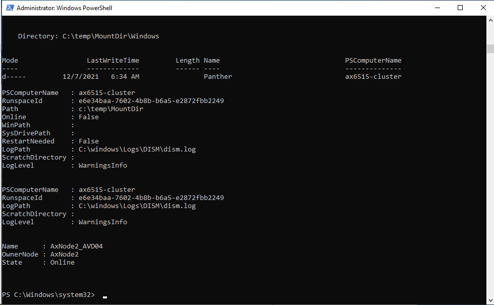

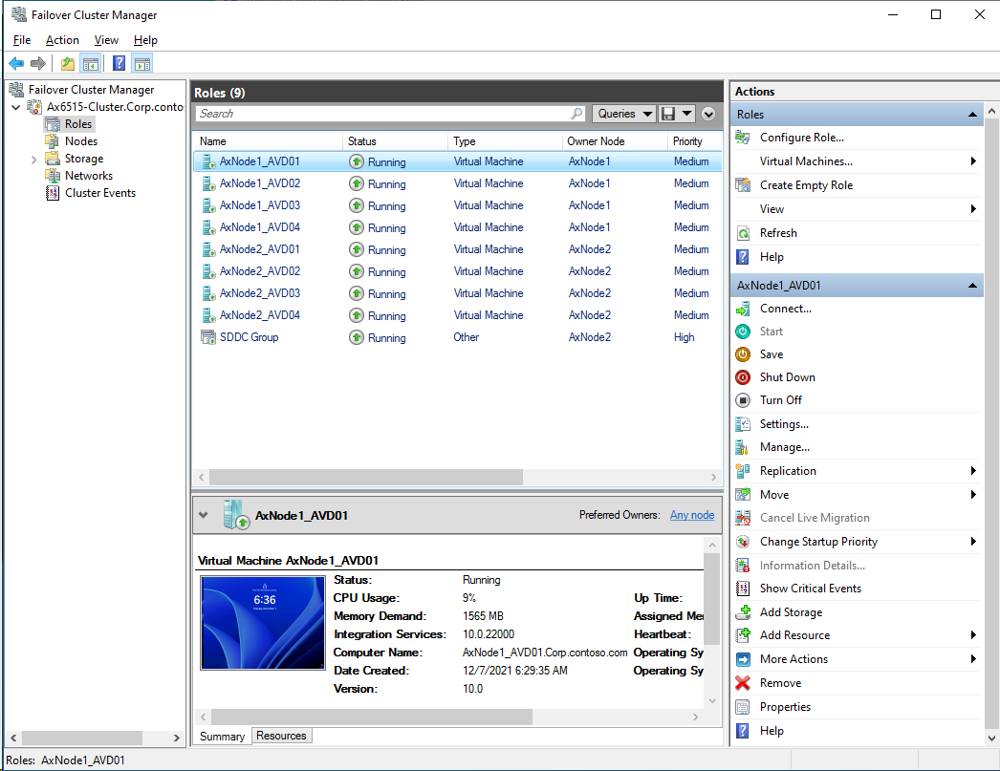

## Task 06 - Connect VMs to Azure

To connect VMs to Azure, there are two agents needed. One is for connecting VMs to Azure Arc, and second is to connect VMs to Azure Virtual Desktop Host Pool.

### Task 06a - Connect VMs to Azure Arc

Connecting Azure Stack HCI to Azure arc has two parts. One is to install Arc Agent itself, and second is to hook agent into azure using Azure Service Principal (identity to join machines to Azure).

This part is based on [Azure Arc for Servers](https://github.com/microsoft/MSLab/tree/master/Scenarios/Azure%20Arc%20for%20Servers) MSLab scenario.

> Note: Since it is based on above mentioned scenario, the code is almost 1:1, so it's bit rough.

**Step 1** Download and install package to Virtual Machines

> Since we enabled WINRM (PowerShell remoting) using script in answer file, files can be copied using PS Session.

```PowerShell
$servers=$VMs.VMName

# Download the package
Start-BitsTransfer -Source https://aka.ms/AzureConnectedMachineAgent -Destination "$env:UserProfile\Downloads\AzureConnectedMachineAgent.msi"
#Copy ARC agent to VMs
#increase max evenlope size first
Invoke-Command -ComputerName $servers -ScriptBlock {Set-Item -Path WSMan:\localhost\MaxEnvelopeSizekb -Value 4096}
#create sessions
$sessions=New-PSSession -ComputerName $servers
#copy ARC agent
foreach ($session in $sessions){
    Copy-Item -Path "$env:USERPROFILE\Downloads\AzureConnectedMachineAgent.msi" -Destination "$env:USERPROFILE\Downloads\" -tosession $session -force
}

$Sessions | Remove-PSSession

#install package
Invoke-Command -ComputerName $servers -ScriptBlock {
    Start-Process -FilePath "msiexec.exe" -ArgumentList "/i $env:USERPROFILE\Downloads\AzureConnectedMachineAgent.msi /l*v $env:USERPROFILE\Downloads\ACMinstallationlog.txt /qn" -Wait
}
<#uninstall if needed
Invoke-Command -ComputerName $servers -ScriptBlock {
    Start-Process -FilePath "msiexec.exe" -ArgumentList "/uninstall $env:USERPROFILE\Downloads\AzureConnectedMachineAgent.msi /qn" -Wait
}
#>
 
```

**Step 2** Create [Service Principal](https://docs.microsoft.com/en-us/azure/active-directory/develop/app-objects-and-service-principals) that will be used for registering into Azure

```PowerShell
#Some variables
    $ResourceGroupName=$AVDResourceGroupName
    $ServicePrincipalName="Arc-for-servers"
    $TenantID=(Get-AzContext).Tenant.ID
    $SubscriptionID=(Get-AzContext).Subscription.ID
    $location=(Get-AzResourceGroup -Name $ResourceGroupName).Location
    $tags="Platform=Windows"
    $password="" #here goes ADApp password. If empty, script will generate new secret. Make sure this secret is the same as in Azure


#Register ARC Resource provider
    Register-AzResourceProvider -ProviderNamespace Microsoft.HybridCompute
    Register-AzResourceProvider -ProviderNamespace Microsoft.GuestConfiguration

#Create AzADServicePrincipal if it does not already exist
    $SP=Get-AZADServicePrincipal -DisplayName $ServicePrincipalName
    if (-not $SP){
        $SP=New-AzADServicePrincipal -DisplayName "Arc-for-servers" -Role "Azure Connected Machine Onboarding"
        #remove default cred
        Remove-AzADAppCredential -ApplicationId $SP.AppId
    }
 
```

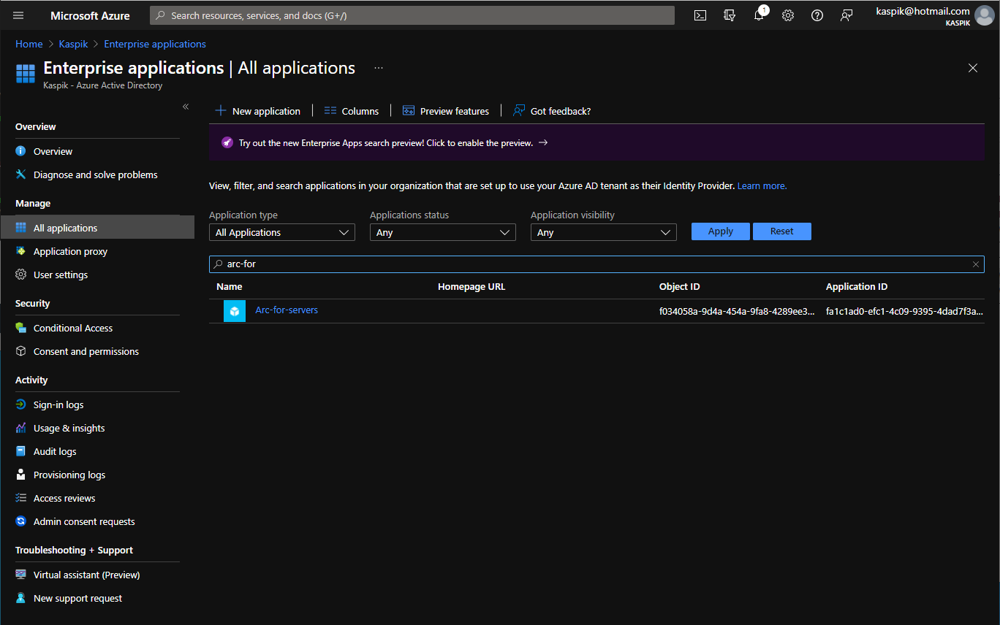

**Step 3** Create new password for ADServicePrincipal

```PowerShell
#Create new password
    if (-not ($password)){
        $credential = New-Object -TypeName "Microsoft.Azure.PowerShell.Cmdlets.Resources.MSGraph.Models.ApiV10.MicrosoftGraphPasswordCredential" -Property @{
            "KeyID"         = (new-guid).Guid ;
            "EndDateTime" = [DateTime]::UtcNow.AddYears(10)
        }
        $Creds=New-AzADAppCredential -PasswordCredentials $credential -ApplicationID $SP.AppID
        $password=$Creds.SecretText
        Write-Host "Your Password is: " -NoNewLine ; Write-Host $password -ForegroundColor Cyan
    }

#sleep for 1m just to let ADApp password to propagate
Start-Sleep 60
 
```


**Step 4** Configure Arc Agents on VMs to connect to your Azure Subscription

```PowerShell
#configure Azure ARC agent on servers
    Invoke-Command -ComputerName $Servers -ScriptBlock {
        Start-Process -FilePath "$env:ProgramFiles\AzureConnectedMachineAgent\azcmagent.exe" -ArgumentList "connect --service-principal-id $($using:SP.AppID) --service-principal-secret $using:password --resource-group $using:ResourceGroupName --tenant-id $using:TenantID --location $($using:Location) --subscription-id $using:SubscriptionID --tags $using:Tags" -Wait
    }

#Validate if agents are connected
    Invoke-Command -ComputerName $Servers -ScriptBlock {
        & "C:\Program Files\AzureConnectedMachineAgent\azcmagent.exe" show
    }
 
```

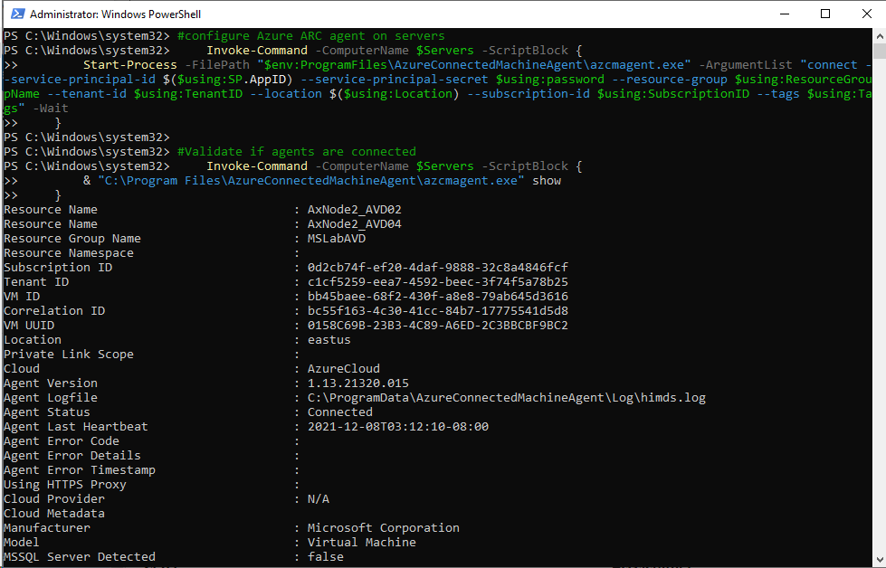


### Task 06b - Connect VMs to Azure Virtual Desktop Host Pool

**Step 1** Download AVD Agent and Bootloader agent and copy to VMs

> Note: More information cabout registering AVD machines can be found [here](https://docs.microsoft.com/en-us/azure/virtual-desktop/create-host-pools-powershell?tabs=azure-powershell#register-the-virtual-machines-to-the-azure-virtual-desktop-host-pool
)

```PowerShell
#Download Agent and Bootloader
    Start-BitsTransfer -Source https://query.prod.cms.rt.microsoft.com/cms/api/am/binary/RWrmXv -Destination "$env:UserProfile\Downloads\AVDAgent.msi"
    Start-BitsTransfer -Source https://query.prod.cms.rt.microsoft.com/cms/api/am/binary/RWrxrH -Destination "$env:UserProfile\Downloads\AVDAgentBootloader.msi"

#Copy agent and bootloader to VMs
    #create sessions
    $sessions=New-PSSession -ComputerName $VMs.VMName
    #copy ARC agent
    foreach ($session in $sessions){
        Copy-Item -Path "$env:USERPROFILE\Downloads\AVDAgent.msi" -Destination "$env:USERPROFILE\Downloads\" -tosession $session -force
        Copy-Item -Path "$env:USERPROFILE\Downloads\AVDAgentBootloader.msi" -Destination "$env:USERPROFILE\Downloads\" -tosession $session -force
    }
    $sessions | Remove-PSSession
 
```

**Step 2** Install agents with Registration Token

> Note: Registration token is a secret, that is used to communicate to Azure

```PowerShell
#Install agents
    #Grab registration token
    $Token=(Get-AzWvdHostPoolRegistrationToken -HostPoolName $AVDHostPoolName -ResourceGroupName $AVDResourceGroupName).Token
    if (-not ($Token)){
        $Token=(New-AzWvdRegistrationInfo -ResourceGroupName $AVDResourceGroupName -HostPoolName $AVDHostPoolName -ExpirationTime $((get-date).ToUniversalTime().AddDays(30).ToString('yyyy-MM-ddTHH:mm:ss.fffffffZ'))).TOken
    }

    #Install agents
    Invoke-Command -ComputerName $VMs.VMName -ScriptBlock {
        Start-Process -FilePath "msiexec.exe" -ArgumentList "/i $env:USERPROFILE\Downloads\AVDAgent.msi /l*v $env:USERPROFILE\Downloads\AVDAgentInstallationLog.txt /qn /norestart REGISTRATIONTOKEN=$using:token RDInfraAgent=BYODesktop" -Wait -PassThru
        Start-Process -FilePath "msiexec.exe" -ArgumentList "/i $env:USERPROFILE\Downloads\AVDAgentBootloader.msi /l*v $env:USERPROFILE\Downloads\AVDAgentBootloaderInstallationLog.txt /qn /norestart" -Wait -PassThru
    }
 
```

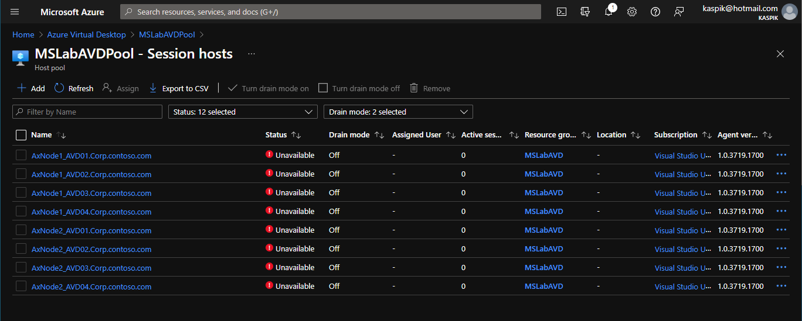


**Step 3** Restart AVD Hosts (VMs)

```PowerShell
#Restart VMs to finish installation
    Restart-Computer -ComputerName $VMs.VMName -Protocol WSMan -Wait -For PowerShell
 
```

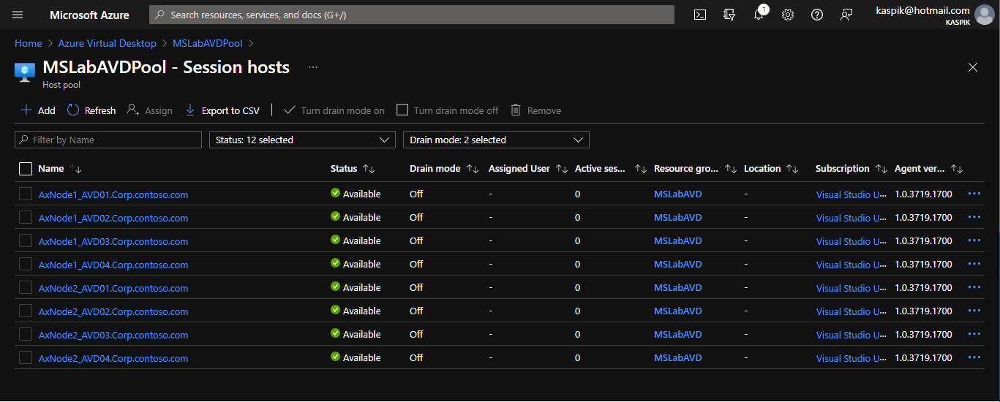