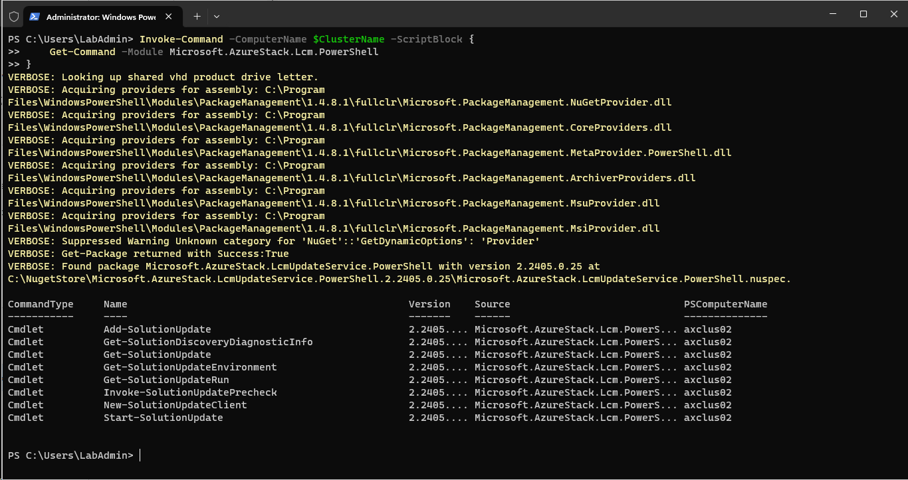
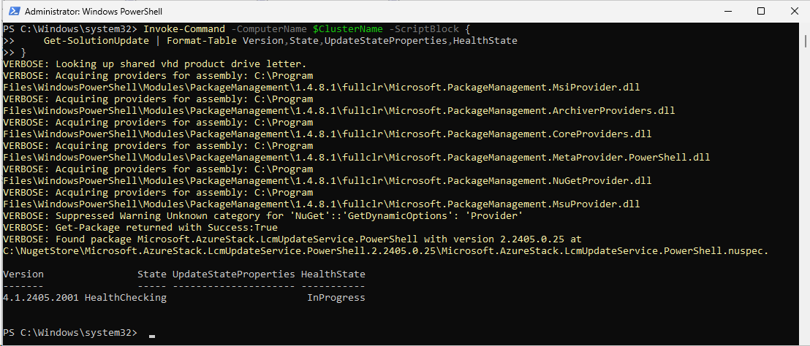
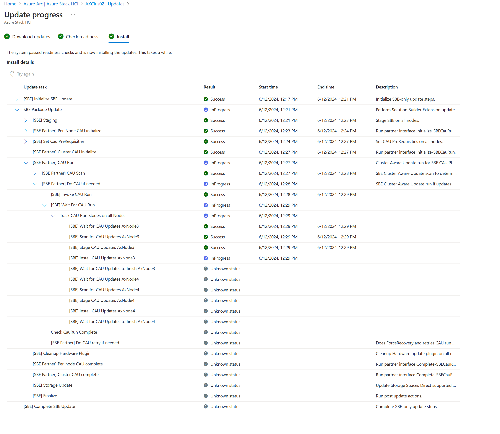
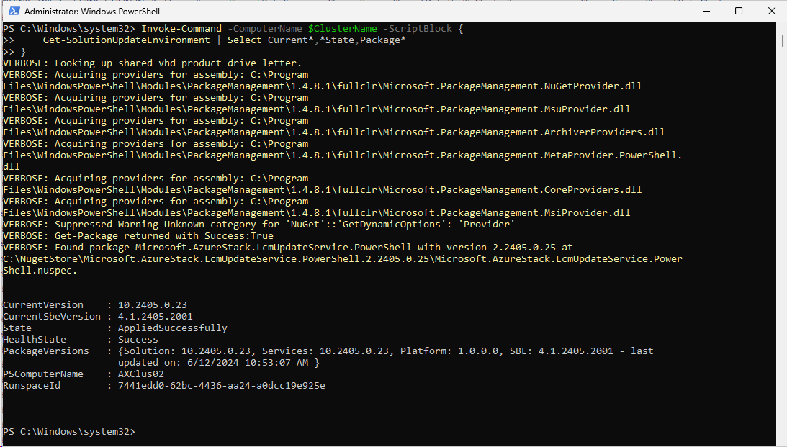

# Azure Stack HCI 23H2 Lifecycle Manager Deep Dive

<!-- TOC -->

- [Azure Stack HCI 23H2 Lifecycle Manager Deep Dive](#azure-stack-hci-23h2-lifecycle-manager-deep-dive)
    - [About the lab](#about-the-lab)
    - [SBE Packages](#sbe-packages)
    - [Getting into Azure Stack PowerShell modules](#getting-into-azure-stack-powershell-modules)
    - [Sideload SBE package](#sideload-sbe-package)
    - [Check versions and status](#check-versions-and-status)

<!-- /TOC -->

## About the lab

In this lab you will learn about SBE packages and how to sideload them using Azure Stack HCI PowerShell modules.

## SBE Packages

SBE package is a package provided by OEM to consistently update Azure Stack HCI solutions.

**Minimal**
    Package, that contains only WDAC Policy. OEM can select the minimal level and keep using WAC Extension to update Azure Stack HCI Nodes (HPE).

**Standard**
    Package contains both WDAC policy and Firmware/Drivers/Other software that is updated with CAU.
    This path was selected by DataON (only latest models), Lenovo (MX455 V3, MX450) and Dell (Both AX and MC nodes). Therefore Dell is the only OEM that provides SBE (with drivers and firmware) for N-1 Generation.

For more information about SBE visit https://learn.microsoft.com/en-us/azure-stack/hci/update/solution-builder-extension

## Getting into Azure Stack PowerShell modules

Let's list all posh modules related to Azure Stack

```PowerShell
$ClusterName="AXClus02"
Invoke-Command -ComputerName $ClusterName -ScriptBlock {
    Get-Command -Module Microsoft.a*
}
 
```


As you can see, there are Microsoft.AS.* and Microsoft.AzureStack* modules. Related to Lifecycle Management is Microsoft.AzureStack.Lcm.PowerShell

```PowerShell
Invoke-Command -ComputerName $ClusterName -ScriptBlock {
    Get-Command -Module Microsoft.AzureStack.Lcm.PowerShell
}
 
```



There is one interesting command that gives you more insight on how SBE and updating works - Get-SolutionDiscoveryDiagnosticInfo

```PowerShell
Invoke-Command -ComputerName $ClusterName -ScriptBlock {
Get-SolutionDiscoveryDiagnosticInfo | Format-List
}

```


As you can see, there is Solution and SBE manifest

    Solution    https://aka.ms/AzureEdgeUpdates
    SBE         https://aka.ms/AzureStackSBEUpdate/DellEMC

Each OEM has it's own URL for SBE:
    
    Dell        https://aka.ms/AzureStackSBEUpdate/DellEMC
    DataOn      https://aka.ms/AzureStackSBEUpdate/DataOn
    Lenovo      https://aka.ms/AzureStackSBEUpdate/Lenovo
    HPE         https://aka.ms/AzureStackSBEUpdate/HPE

## Sideload SBE package

https://aka.ms/AzureStackHci/SBE/Sideload


Download and copy to Azure Stack HCI cluster

```PowerShell
#download SBE
$ProgressPreference="SilentlyContinue" #Just to make download faster
Invoke-WebRequest -Uri https://dl.dell.com/protected/drivers/FOLDER11833185M/1/Bundle_SBE_Dell_AS-HCI-AX_4.1.2406.3001.zip -OutFile $env:userprofile\Downloads\Bundle_SBE_Dell_AS-HCI-AX_4.1.2406.3001.zip -UserAgent "DellGEOS"

$ProgressPreference="Continue" #Just to revert it back to default

#expand archive
Expand-Archive -Path $env:userprofile\Downloads\Bundle_SBE_Dell_AS-HCI-AX_4.1.2406.3001.zip -DestinationPath $env:userprofile\Downloads\SBE

#replace metadata file with latest metadata from SBEUpdate address
Invoke-WebRequest -Uri https://aka.ms/AzureStackSBEUpdate/DellEMC -OutFIle $env:userprofile\Downloads\SBE\SBE_Discovery_Dell.xml


#transfer into the cluster
New-Item -Path "\\$ClusterName\ClusterStorage$\Infrastructure_1\Shares\SU1_Infrastructure_1" -Name sideload -ItemType Directory -ErrorAction Ignore
Copy-Item -Path $env:userprofile\Downloads\SBE\*.* -Destination "\\$ClusterName\ClusterStorage$\Infrastructure_1\Shares\SU1_Infrastructure_1\sideload"
 
```

Add Solution Update

```PowerShell
Invoke-Command -ComputerName $ClusterName -ScriptBlock {
    Add-SolutionUpdate -SourceFolder C:\ClusterStorage\Infrastructure_1\Shares\SU1_Infrastructure_1\sideload
    Get-SolutionUpdate | Format-Table DisplayName, Version, State 
}
 
```


Note: after executiong Add-Solution update, package is transfered into C:\ClusterStorage\Infrastructure_1\Shares\SU1_Infrastructure_1\Updates\Packages. To remove it, you can simply delete package from packages folder as there's no "Remove-SolutinUpdate" command


Let's check all details versions

```PowerShell
Invoke-Command -ComputerName $ClusterName -ScriptBlock {
    Get-SolutionUpdate | ConvertTo-Json -Depth 4
}
 
```


You can also check, if system is ready for update (HealthCheck Result)


```PowerShell
Invoke-Command -ComputerName $ClusterName -ScriptBlock {
    Get-SolutionUpdateEnvironment | Select-Object -ExpandProperty HealthCheckResult
} | Out-Gridview
 
```


Let's initiate installation

```PowerShell
Invoke-Command -ComputerName $ClusterName -ScriptBlock {
    Get-SolutionUpdate | Start-SolutionUpdate
}
 
```

Note: if this is the first time and you run it from powershell, you might need to add CAU role to your cluster

```PowerShell
    if (-not (Get-CAUClusterRole -ClusterName $ClusterName -ErrorAction Ignore)){
        Add-CauClusterRole -ClusterName $ClusterName -MaxFailedNodes 0 -RequireAllNodesOnline -EnableFirewallRules -GroupName "$ClusterName-CAU" -VirtualComputerObjectName "$ClusterName-CAU" -Force -CauPluginName Microsoft.WindowsUpdatePlugin -MaxRetriesPerNode 3 -CauPluginArguments @{ 'IncludeRecommendedUpdates' = 'False' } -StartDate "3/2/2017 3:00:00 AM" -DaysOfWeek 4 -WeeksOfMonth @(3) -verbose
    #disable self-updating
        Disable-CauClusterRole -ClusterName $ClusterName -Force
    }
 
```

To check status you can run following code


```PowerShell
Invoke-Command -ComputerName $ClusterName -ScriptBlock {
    Get-SolutionUpdate | Format-Table Version,State,UpdateStateProperties,HealthState
}
 
```



Or to have detailed status you can query Get-SolutionUpdateRun

```PowerShell
Invoke-Command -ComputerName $ClusterName -ScriptBlock {
    Get-SolutionUpdate | Get-SolutionUpdateRun  | ConvertTo-Json -Depth 8
}
 
```


Or check in portal



## Check versions and status


```PowerShell
Invoke-Command -ComputerName $ClusterName -ScriptBlock {
    Get-SolutionUpdateEnvironment | Select Current*,*State,Package*
}
 
```

