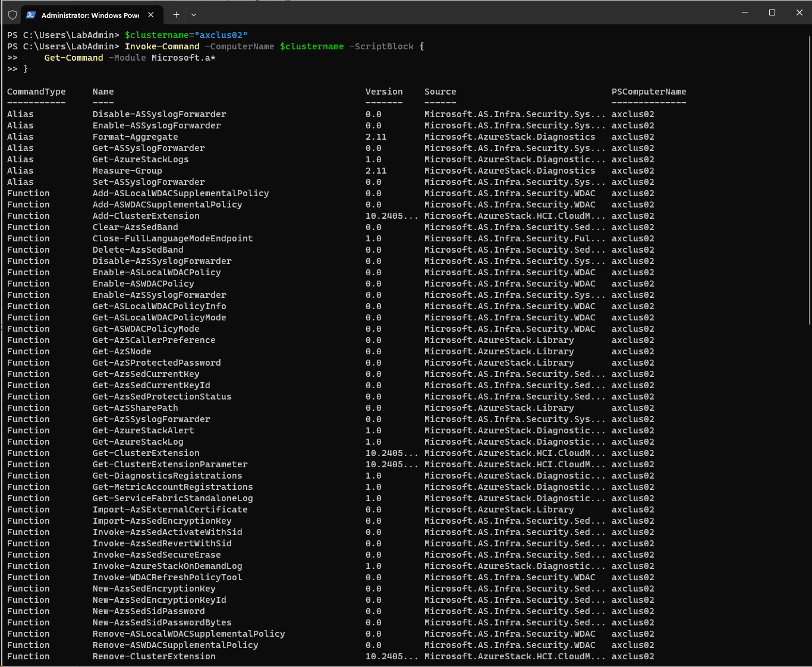
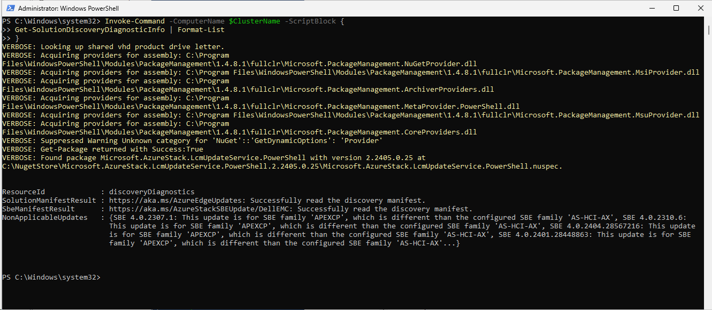
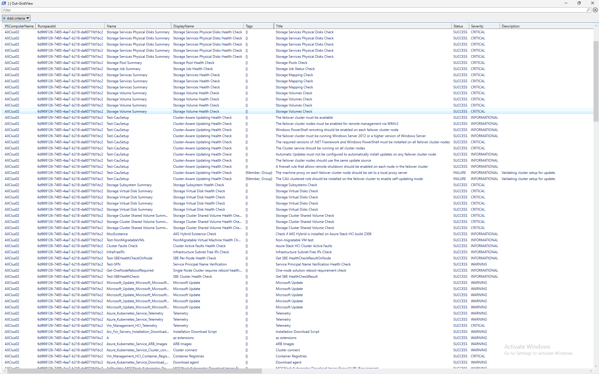

# About the lab

<!-- TOC -->

- [About the lab](#about-the-lab)
- [Getting into Azure Stack PowerShell modules](#getting-into-azure-stack-powershell-modules)
- [Sideload SBE package](#sideload-sbe-package)

<!-- /TOC -->

**Standard**
    Package contains both WDAC policy and Firmware/Drivers/Other software that is updated with CAU.
    This path was selected by DataON (only latest models), Lenovo (MX455 V3, MX450) and Dell (Both AX nodes and MC). Therefore Dell is the only OEM that provides SBE (with drivers and firmware) for N-1 Generation.


# Getting into Azure Stack PowerShell modules

Let's list all posh modules related to Azure Stack

```PowerShell
$ClusterName="AXClus02"
Invoke-Command -ComputerName $ClusterName -ScriptBlock {
    Get-Command -Module Microsoft.a*
}
 
```



As you can see, there are Microsoft.AS.* and Microsoft.AzureStack* modules. Related to Lifecycle Management is Microsoft.AzureStack.Lcm.PowerShell

```PowerShell
Invoke-Command -ComputerName $ClusterName -ScriptBlock {
    Get-Command -Module Microsoft.AzureStack.Lcm.PowerShell
}
 
```


There is one interesting command that gives you more insight on how SBE and updating works - Get-SolutionDiscoveryDiagnosticInfo

```PowerShell
Invoke-Command -ComputerName $ClusterName -ScriptBlock {
Get-SolutionDiscoveryDiagnosticInfo | Format-List
}

```



As you can see, there is Solution and SBE manifest

Solution:   https://aka.ms/AzureEdgeUpdates
SBE:        https://aka.ms/AzureStackSBEUpdate/DellEMC

Each OEM has it's own URL for SBE:
https://aka.ms/AzureStackSBEUpdate/DellEMC
https://aka.ms/AzureStackSBEUpdate/DataOn
https://aka.ms/AzureStackSBEUpdate/Lenovo
https://aka.ms/AzureStackSBEUpdate/HPE

For more information about SBE visit https://learn.microsoft.com/en-us/azure-stack/hci/update/solution-builder-extension


# Sideload SBE package

https://aka.ms/AzureStackHci/SBE/Sideload


Download and copy to Azure Stack HCI cluster

```PowerShell
#download SBE
 Start-BitsTransfer -Source https://dl.dell.com/FOLDER11684237M/1/Bundle_SBE_Dell_AS-HCI-AX_4.1.2405.2001.zip -Destination $env:userprofile\DOwnloads\Bundle_SBE_Dell_AS-HCI-AX_4.1.2405.2001.zip

#expand archive
Expand-Archive -Path $env:userprofile\DOwnloads\Bundle_SBE_Dell_AS-HCI-AX_4.1.2405.2001.zip -DestinationPath $env:userprofile\DOwnloads\SBE

#transfer into the cluster
New-Item -Path "\\$ClusterName\ClusterStorage$\Infrastructure_1\Shares\SU1_Infrastructure_1" -Name sideload -ItemType Directory -ErrorAction Ignore
Copy-Item -Path $env:userprofile\DOwnloads\SBE\*.* -Destination "\\$ClusterName\ClusterStorage$\Infrastructure_1\Shares\SU1_Infrastructure_1\sideload"
 
```

Add Solution Update

```PowerShell
Invoke-Command -ComputerName $ClusterName -ScriptBlock {
    Add-SolutionUpdate -SourceFolder C:\ClusterStorage\Infrastructure_1\Shares\SU1_Infrastructure_1\sideload
    Get-SolutionUpdate | Format-Table DisplayName, Version, State 
}
 
```


Let's check all details versions

```PowerShell
Invoke-Command -ComputerName $ClusterName -ScriptBlock {
    Get-SolutionUpdate | ConvertTo-Json -Depth 4
}
 
```


You can also check, if system is ready for update (HealthCheck Result)


```PowerShell
Invoke-Command -ComputerName $ClusterName -ScriptBlock {
    Get-SolutionUpdateEnvironment | Select-Object -ExpandProperty HealthCheckResult
} | Out-Gridview
 
```





Let's initiate installation

```PowerShell
Invoke-Command -ComputerName $ClusterName -ScriptBlock {
    Get-SolutionUpdate | Start-SolutionUpdate
}
 
```

To check status you can run following code


```PowerShell
Invoke-Command -ComputerName $ClusterName -ScriptBlock {
    Get-SolutionUpdate | Format-Table Version,State,UpdateStateProperties,HealthState
}
 
```


Or to have detailed status you can query Get-SolutionUpdateRun

Invoke-Command -ComputerName $ClusterName -ScriptBlock {
    Get-SolutionUpdate | Get-SolutionUpdateRun  | ConvertTo-Json -Depth 8
}


Or check in portal

