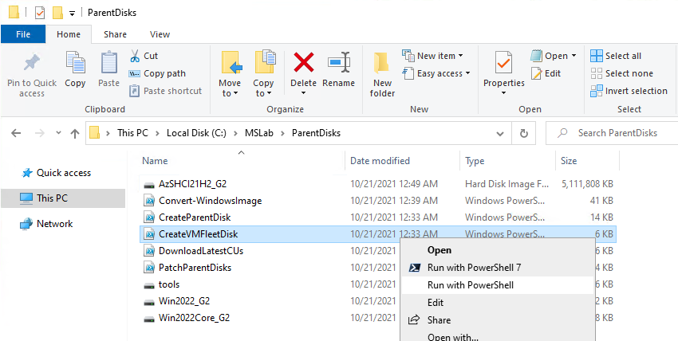
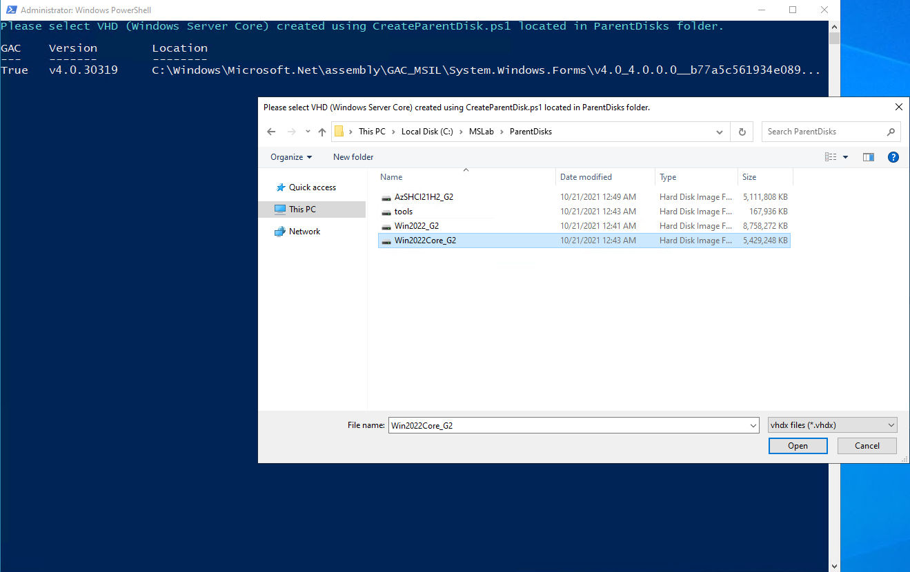
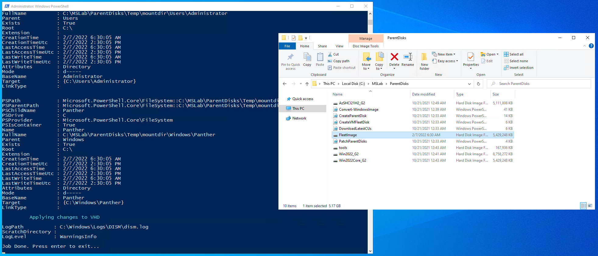
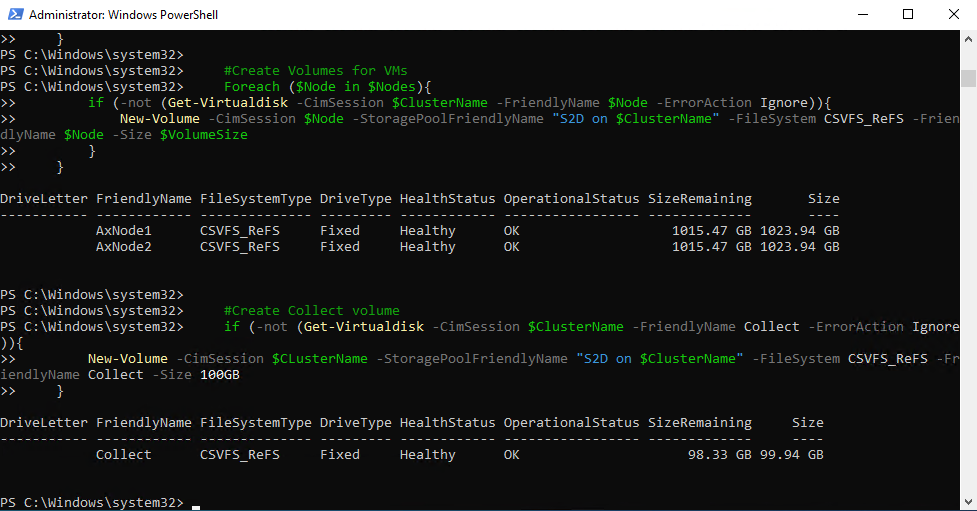
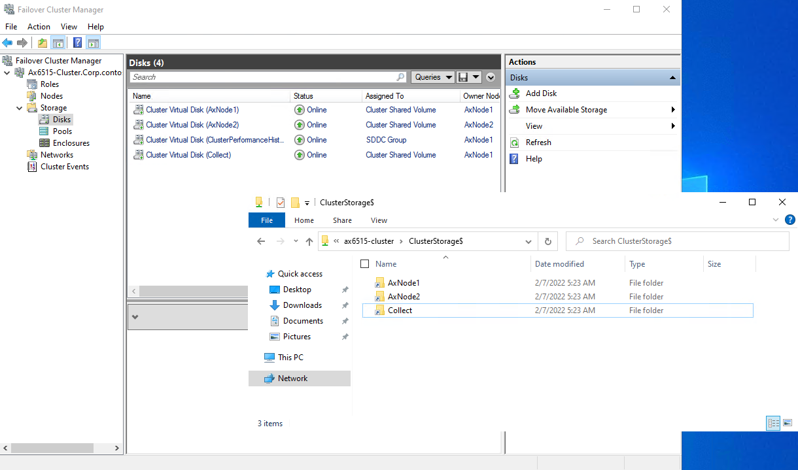
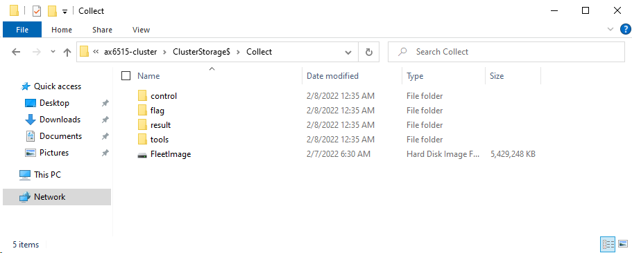
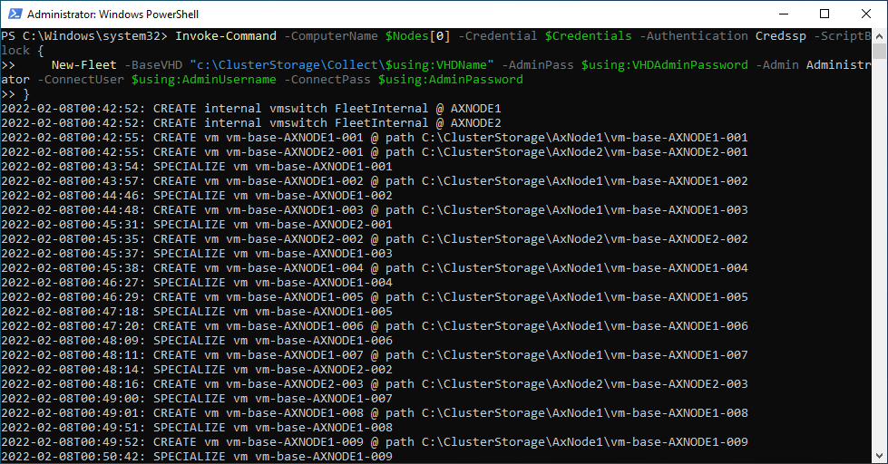
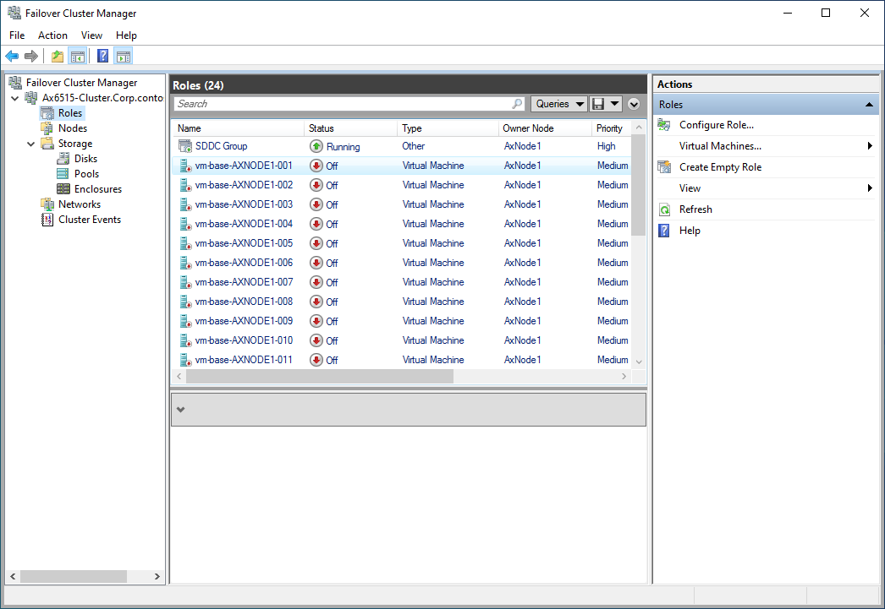

# Testing Azure Stack HCI Performance with VMFleet

<!-- TOC -->

- [Testing Azure Stack HCI Performance with VMFleet](#testing-azure-stack-hci-performance-with-vmfleet)
    - [About the lab](#about-the-lab)
    - [Prerequsites](#prerequsites)
    - [Task 01 - Create vmfleet image](#task-01---create-vmfleet-image)
    - [Task 02 - Configure VMFleet prerequsites](#task-02---configure-vmfleet-prerequsites)
    - [Task 03 - Deploy VMFleet and measure performance](#task-03---deploy-vmfleet-and-measure-performance)
    - [Task 04 - Cleanup VMFleet](#task-04---cleanup-vmfleet)

<!-- /TOC -->

## About the lab

In this lab you will learn about how to test performance of Azure Stack HCI cluster with VMFleet 2.045

The lab is based on [AzSHCI and VMFleet](https://github.com/microsoft/MSLab/tree/dev/Scenarios/AzSHCI%20and%20VMFleet) MSLab scenario.

Creating vmfleet image needs to be performed from parentdisks folder.

Ther rest of lab can be run from management machine or from DC (in MSLab).

Keep PowerShell window open for entire lab

## Prerequsites

The main prerequisite is to have Azure Stack HCI cluster where you can deploy VMFleet

To perform following lab you can setup cluster using guides below:

* Hydrate MSLab with LabConfig from [01-HydrateMSLab](https://github.com/DellGEOS/AzureStackHOLs/tree/main/admin-guides/01-HydrateMSLab/readme.md)

* [Learn How MSLab works](https://github.com/DellGEOS/AzureStackHOLs/tree/main/admin-guides/02-WorkingWithMSLab/readme.md)

* [Deploy OS on hardware](https://github.com/DellGEOS/AzureStackHOLs/tree/main/admin-guides/03-DeployPhysicalServersWithMSLab/readme.md)

* [Deploy Azure Stack HCI with PowerShell](https://github.com/DellGEOS/AzureStackHOLs/tree/main/lab-guides/02-DeployAzureStackHCICluster-PowerShell/readme.md)

## Task 01 - Create vmfleet image

> Note: Microsoft docs are documenting vmfleet image creation with manual steps including capturing state. In MSLab is helper script that helps creating vmfleet image from any other parent VHD.

**Step 1** In MSLab folder, navigate into parentdisks folder and run [CreateVMFleetDisk.ps1](https://github.com/microsoft/MSLab/blob/master/Tools/CreateVMFleetDisk.ps1) by right-clicking it and selecting run with PowerShell.



**Step 2** Script will ask for VHD. Since VMFleet requires Windows Server Core, you can provide Win2022Core_G2.vhdx.

> Note: Windows Server Core VHD can be created using [CreateParentDisk.ps1](https://github.com/microsoft/MSLab/blob/master/Tools/CreateParentDisk.ps1). The similar process (but how to create Azure Stack HCI VHD) is described in [Hydrate MSLab guide](https://github.com/DellGEOS/AzureStackHOLs/tree/main/admin-guides/01-HydrateMSLab#task-4---create-azure-stack-hci-parent-disk)



**Step 3** Script will ask for password that will be used for administrator. Provide **P@ssw0rd** as administrator password. VMFleet image will be created.



**Step 4** Copy FleetImage.vhdx into DC (or management machine). You can use ctrl+c/ctrl+v. 


## Task 02 - Configure VMFleet prerequsites

> Note: Run all steps from DC or Management machine

**Step 1** While logged into DC or management machine, Install required PowerShell modules using following PowerShell Script

```PowerShell
    Install-PackageProvider -Name NuGet -MinimumVersion 2.8.5.201 -Force
    Install-Module -Name VMFleet -Force
    Install-Module -Name PrivateCloud.DiagnosticInfo -Force
 
```

**Step 2** Define variables and create Volumes

```PowerShell
    $ClusterName="AzSHCI-Cluster"
    $Nodes=(Get-ClusterNode -Cluster $ClusterName).Name
    $VolumeSize=1TB

    #configure thin volumes a default if available (because why not :)
    $OSInfo=Invoke-Command -ComputerName $ClusterName -ScriptBlock {
        Get-ItemProperty -Path 'HKLM:\SOFTWARE\Microsoft\Windows NT\CurrentVersion\'
    }
    if ($OSInfo.productname -eq "Azure Stack HCI" -and $OSInfo.CurrentBuildNumber -ge 20348){
        Get-StoragePool -CimSession $ClusterName -FriendlyName S2D* | Set-StoragePool -ProvisioningTypeDefault Thin
    }

    #Create Volumes for VMs
    Foreach ($Node in $Nodes){
        if (-not (Get-Virtualdisk -CimSession $ClusterName -FriendlyName $Node -ErrorAction Ignore)){
            New-Volume -CimSession $Node -StoragePoolFriendlyName "S2D on $ClusterName" -FileSystem CSVFS_ReFS -FriendlyName $Node -Size $VolumeSize
        }
    }

    #Create Collect volume
    if (-not (Get-Virtualdisk -CimSession $ClusterName -FriendlyName Collect -ErrorAction Ignore)){
        New-Volume -CimSession $CLusterName -StoragePoolFriendlyName "S2D on $ClusterName" -FileSystem CSVFS_ReFS -FriendlyName Collect -Size 100GB
    }
 
```

Expected result





**Step 3** Ask for FleetImage VHD and copy it to collect folder using following script. Keep PowerShell window open for next task.

> Note: Script will also copy VMFleet PowerShell module into each cluster node.

```PowerShell
#Ask for VHD
    Write-Output "Please select VHD created using CreateVMFleetDisk.ps1"
    [reflection.assembly]::loadwithpartialname("System.Windows.Forms")
    $openFile = New-Object System.Windows.Forms.OpenFileDialog -Property @{
        Title="Please select VHD created using CreateVMFleetDisk.ps1"
    }
    $openFile.Filter = "vhdx files (*.vhdx)|*.vhdx|All files (*.*)|*.*" 
    If($openFile.ShowDialog() -eq "OK"){
        Write-Output  "File $($openfile.FileName) selected"
    }
    $VHDPath=$openfile.FileName

#Copy VHD to collect folder
    Copy-Item -Path $VHDPath -Destination \\$ClusterName\ClusterStorage$\Collect\
#Copy VMFleet to cluster nodes
    $Sessions=New-PSSession -ComputerName $Nodes
    Foreach ($Session in $Sessions){
        Copy-Item -Recurse -Path "C:\Program Files\WindowsPowerShell\Modules\VMFleet" -Destination "C:\Program Files\WindowsPowerShell\Modules\" -ToSession $Session -Force
    }
 
```

Expected result


## Task 03 - Deploy VMFleet and measure performance

**Step 1** Generate Variables

```PowerShell
    #generate variables
        #generate VHD Name from path (path was created when you were asked for VHD)
        $VHDName=$VHDPath | Split-Path -Leaf

        $ClusterName="AzSHCI-Cluster"
        $Nodes=(Get-ClusterNode -Cluster $ClusterName).Name

        #domain account credentials
        $AdminUsername="CORP\LabAdmin"
        $AdminPassword="LS1setup!"
        $securedpassword = ConvertTo-SecureString $AdminPassword -AsPlainText -Force
        $Credentials = New-Object System.Management.Automation.PSCredential ($AdminUsername, $securedpassword)
        #credentials for local admin located in FleetImage VHD
        $VHDAdminPassword="P@ssw0rd"
 
```

**Step 2** Enable CredSSP and Install VMFleet

> Note: CredSSP has to be enabled, as command to install VMFleet does not (yet) work correctly against Cluster. Therefore command Install-Fleet has to be invoked to one of the nodes. https://github.com/microsoft/diskspd/issues/172

> Note: Installing VMFLeet will create folder structure (and copy diskspd and few scripts) in Cluster Shared Volume "Collect" that was created before.

```PowerShell
    #Enable CredSSP
    # Temporarily enable CredSSP delegation to avoid double-hop issue
    foreach ($Node in $Nodes){
        Enable-WSManCredSSP -Role "Client" -DelegateComputer $Node -Force
    }
    Invoke-Command -ComputerName $Nodes -ScriptBlock { Enable-WSManCredSSP Server -Force }

    #
    Invoke-Command -ComputerName $Nodes[0] -Credential $Credentials -Authentication Credssp -ScriptBlock {
        Install-Fleet
    }
 
```

Expected result



**Step 3** Deploy new VMFleet environment and disable CredSSP

> Note: This step will create Virtual Machines. The same number as number of cores in failover cluster.

```PowerShell
    # Deploy VMFleet
    Invoke-Command -ComputerName $Nodes[0] -Credential $Credentials -Authentication Credssp -ScriptBlock {
        New-Fleet -BaseVHD "c:\ClusterStorage\Collect\$using:VHDName" -AdminPass $using:VHDAdminPassword -Admin Administrator -ConnectUser $using:AdminUsername -ConnectPass $using:AdminPassword
    }
 
```

Expected result





**Step 4** Copy PrivateCloud.DiagnosticInfo PowerShell module to cluster nodes

```PowerShell
    $Sessions=New-PSSession $Nodes
    foreach ($Session in $Sessions){
        Copy-Item -Path 'C:\Program Files\WindowsPowerShell\Modules\PrivateCloud.DiagnosticInfo' -Destination 'C:\Program Files\WindowsPowerShell\Modules\' -ToSession $Session -Recurse -Force
    }
    $Sessions | Remove-PSSession
 
```

**Step 5** Measure performance

> Note: Measuring performance (Measuer-FleetCoreWorkload) will take several hours. Once finished, TSV file will be generated at \\<ClusterName>\ClusterStorage$\Collect\result\result.tsv

```PowerShell
    Invoke-Command -ComputerName $Nodes[0] -Credential $Credentials -Authentication Credssp -ScriptBlock {
        Measure-FleetCoreWorkload
    }
 
```

Expected result


**Step 6** Explore performance results by copying result.tsv to a computer, where excel is installed. Open result in excel and insert a table. You can review [sample result](./media/AX6515-All-Flash-4xSSD-32VMs-2Node.txt). 


## Task 04 - Cleanup VMFleet

**Step 1** Generate variables (if PowerShell was closed) and remove VMFleet

> Note: Remove-VMFleet command will remove all virtual machines from cluster and will also remove VMFleet virtual switch.

```PowerShell
    #generate variables
        #generate VHD Name from path (path was created when you were asked for VHD)
        $ClusterName="AzSHCI-Cluster"
        $Nodes=(Get-ClusterNode -Cluster $ClusterName).Name

        #domain account credentials
        $AdminUsername="CORP\LabAdmin"
        $AdminPassword="LS1setup!"
        $securedpassword = ConvertTo-SecureString $AdminPassword -AsPlainText -Force
        $Credentials = New-Object System.Management.Automation.PSCredential ($AdminUsername, $securedpassword)

    # Temporarily enable CredSSP delegation to avoid double-hop issue
    foreach ($Node in $Nodes){
        Enable-WSManCredSSP -Role "Client" -DelegateComputer $Node -Force
    }
    Invoke-Command -ComputerName $Nodes -ScriptBlock { Enable-WSManCredSSP Server -Force }

    #Remove VMFleet
    Invoke-Command -ComputerName $Nodes[0] -Credential $Credentials -Authentication Credssp -ScriptBlock {
        Remove-Fleet
    }

    # Disable CredSSP
    Disable-WSManCredSSP -Role Client
    Invoke-Command -ComputerName $nodes -ScriptBlock { Disable-WSManCredSSP Server }
 
```

**Step 2** Delete Volumes

```PowerShell
foreach ($Node in $Nodes){
    Remove-VirtualDisk -FriendlyName $Node -CimSession $ClusterName -Confirm:0
}
Remove-VirtualDisk -FriendlyName Collect -CimSession $ClusterName -Confirm:0
 
```
