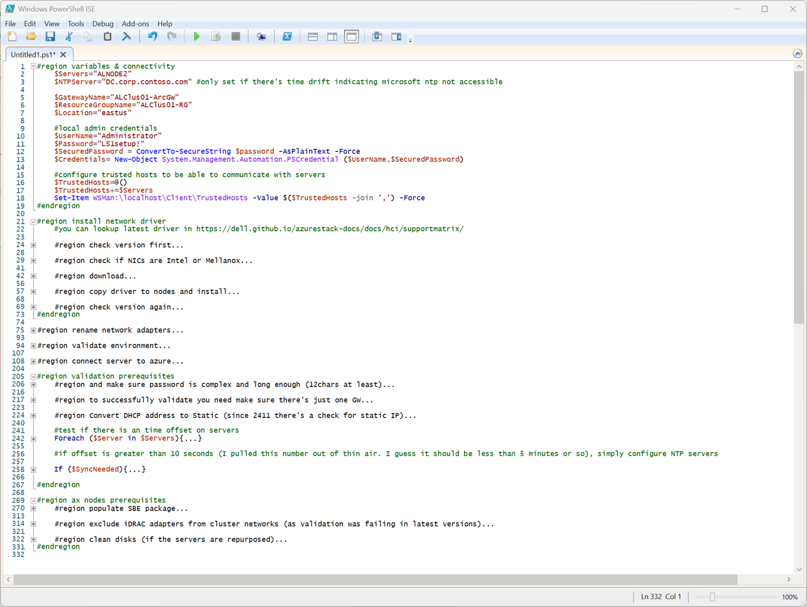

# Expanding Azure Stack HCI

<!-- TOC -->

- [Expanding Azure Stack HCI](#expanding-azure-stack-hci)
    - [About the lab](#about-the-lab)
    - [Prepare server](#prepare-server)
    - [Add server](#add-server)
    - [Synchronize changes with Azure](#synchronize-changes-with-azure)

<!-- /TOC -->

## About the lab

In this Hands-on lab you will expand one-node solution to two nodes. Just to illustrate rebuilding volumes, adding witness and more.

You can simply follow [Cloud-based deployment HOL](https://github.com/DellGEOS/AzureStackHOLs/tree/main/lab-guides/01a-DeployAzureStackHCICluster-CloudBasedDeployment) and simply deploying one node.

[Official documentation](https://learn.microsoft.com/en-us/azure-stack/hci/manage/add-server)

I performed steps on AX nodes (physical servers), but code snippets are kept with virtual lab variables.

Note: During one node creation you can also select separate storage intent or no intent for storage at all. I'll add example for back to back connectivity below.


## Prepare server

Following code is more or less same as in cloud-based deployment HOL. Just few sections are removed (Creating objects in AD and Azure)

You can copy code into PowerShell ISE or Visual Studio Code and collapse all regions (in PowerShell ISE it's ctrl+m)



Note: as you can see, it also contains some steps for AXNodes. In virtual environment these are obviously not necessary.

```PowerShell
#region variables & connectivity
    $Servers="ALNODE2"
    $NTPServer="DC.corp.contoso.com" #only set if there's time drift indicating microsoft ntp not accessible

    $GatewayName="ALClus01-ArcGW"
    $ResourceGroupName="ALClus01-RG"
    $Location="eastus"

    #local admin credentials
    $UserName="Administrator"
    $Password="LS1setup!"
    $SecuredPassword = ConvertTo-SecureString $password -AsPlainText -Force
    $Credentials= New-Object System.Management.Automation.PSCredential ($UserName,$SecuredPassword)

    #configure trusted hosts to be able to communicate with servers
    $TrustedHosts=@()
    $TrustedHosts+=$Servers
    Set-Item WSMan:\localhost\Client\TrustedHosts -Value $($TrustedHosts -join ',') -Force
#endregion

#region install network driver
    #you can lookup latest driver in https://dell.github.io/azurestack-docs/docs/hci/supportmatrix/

    #region check version first
        $NICs=Invoke-Command -ComputerName $Servers -Credential $Credentials -ScriptBlock {get-NetAdapter}
        $NICs | Where-Object {$_.InterfaceDescription -like "Intel*" -or $_.InterfaceDescription -Like "Mellanox*"} | Select-Object Driver*
    #endregion

    #region check if NICs are Intel or Mellanox
        $NICs=Invoke-Command -ComputerName $servers -ScriptBlock {
            Get-NetAdapter
        } -Credential $Credentials
        If ($NICs | Where InterfaceDescription -like "Mellanox*" ){
            #nvidia/mellanox
            $URL="https://dl.dell.com/FOLDER11591518M/2/Network_Driver_G6M58_WN64_24.04.03_01.EXE"
        }else{
            #intel
            $URL="https://dl.dell.com/FOLDER11890492M/1/Network_Driver_6JHVK_WN64_23.0.0_A00.EXE"
        }
    #endregion

    #region download
        #Set up web client to download files with authenticated web request in case there's a proxy
        $WebClient = New-Object System.Net.WebClient
        #$proxy = new-object System.Net.WebProxy
        $proxy = [System.Net.WebRequest]::GetSystemWebProxy()
        $proxy.Credentials = [System.Net.CredentialCache]::DefaultCredentials
        #$proxy.Address = $proxyAdr
        #$proxy.useDefaultCredentials = $true
        $WebClient.proxy = $proxy
        #add headers wihth user-agent as some versions of SBE requires it for download
        $webclient.Headers.Add("User-Agent", "WhateverUser-AgentString/1.0")
        $FileName=$($URL.Split("/")| Select-Object -Last 1)
        $WebClient.DownloadFile($URL,"$env:userprofile\Downloads\$FileName")
    #endregion

    #region copy driver to nodes and install
        $sessions = New-PSSession -ComputerName $Servers -Credential $Credentials
        foreach ($Session in $Sessions){
            Copy-Item -Path $env:userprofile\Downloads\$FileName -Destination c:\users\$UserName\Downloads\$FileName -ToSession $session
        }
        
        #install
        Invoke-Command -ComputerName $Servers -ScriptBlock {
            Start-Process -FilePath c:\users\$Using:UserName\Downloads\$using:FileName -ArgumentList "/i /s" -Wait
        } -Credential $Credentials
    #endregion

    #region check version again
        $NICs=Invoke-Command -ComputerName $Servers -Credential $Credentials -ScriptBlock {get-NetAdapter}
        $NICs | Where-Object {$_.InterfaceDescription -like "Intel*" -or $_.InterfaceDescription -Like "Mellanox*"} | Select-Object Driver*
    #endregion
#endregion

#region rename network adapters
    Invoke-Command -ComputerName $Servers -ScriptBlock {
        $AdaptersHWInfo=Get-NetAdapterHardwareInfo
        foreach ($Adapter in $AdaptersHWInfo){
            #PCIe NICs do not have PCIDeviceLabelString
            if ($adapter.Slot){
                $NewName="Slot $($Adapter.Slot) Port $($Adapter.Function +1)"
            #then the remaining NICs should have PCIDeviceLabelString
            }elseif ($adapter.PCIDeviceLabelString){
                $NewName=$adapter.PCIDeviceLabelString
            }else{
            #just in case there is not any nic with conditions above.
                $NewName="NIC$($Adapter.Function +1)"
            }
            $adapter | Rename-NetAdapter -NewName $NewName
        }
    } -Credential $Credentials
#endregion

#region validate environment
    #install modules
    Invoke-Command -ComputerName $Servers -Scriptblock {
        Install-PackageProvider -Name NuGet -MinimumVersion 2.8.5.201 -Force
        Install-Module PowerShellGet -AllowClobber -Force
        Install-Module -Name AzStackHci.EnvironmentChecker -Force
    } -Credential $Credentials
    #validate environment
    $result=Invoke-Command -ComputerName $Servers -Scriptblock {
        Invoke-AzStackHciConnectivityValidation -PassThru
    } -Credential $Credentials
    $result | Out-GridView
#endregion

#region connect server to azure
    #login to azure
        #download Azure module
        Install-PackageProvider -Name NuGet -MinimumVersion 2.8.5.201 -Force
        if (!(Get-InstalledModule -Name az.accounts -ErrorAction Ignore)){
            Install-Module -Name Az.Accounts -Force 
        }
        #login using device authentication
        Connect-AzAccount -UseDeviceAuthentication

        #assuming new az.accounts module was used and it asked you what subscription to use - then correct subscription is selected for context
        $Subscription=(Get-AzContext).Subscription

        #install az resources module
            if (!(Get-InstalledModule -Name az.resources -ErrorAction Ignore)){
                Install-Module -Name az.resources -Force
            }

        #create resource group
            if (-not(Get-AzResourceGroup -Name $ResourceGroupName -ErrorAction Ignore)){
                New-AzResourceGroup -Name $ResourceGroupName -Location $location
            }
    #region (Optional) configure ARC Gateway
        if ($GatewayName){
            #install az.arcgateway module
                if (!(Get-InstalledModule -Name az.arcgateway -ErrorAction Ignore)){
                    Install-Module -Name az.arcgateway -Force
                }
            #make sure "Microsoft.HybridCompute" is registered (and possibly other RPs)
                Register-AzResourceProvider -ProviderNamespace "Microsoft.HybridCompute"
                Register-AzResourceProvider -ProviderNamespace "Microsoft.GuestConfiguration"
                Register-AzResourceProvider -ProviderNamespace "Microsoft.HybridConnectivity"
                Register-AzResourceProvider -ProviderNamespace "Microsoft.AzureStackHCI"

            #create GW
            if (Get-AzArcGateway -Name $gatewayname -ResourceGroupName $ResourceGroupName -ErrorAction Ignore){
                $ArcGWInfo=Get-AzArcGateway -Name $gatewayname -ResourceGroupName $ResourceGroupName
            }else{
                $ArcGWInfo=New-AzArcGateway -Name $GatewayName -ResourceGroupName $ResourceGroupName -Location $Location -SubscriptionID $Subscription.ID
            }
        }
    #endregion

    #generate variables for use in this window
    $SubscriptionID=$Subscription.ID
    $Region=$Location
    $TenantID=$Subscription.TenantID
    $ArcGatewayID=$ArcGWInfo.ID


    #region install modules (latest ISO already contains modules, but does not hurt installing it)
        #make sure nuget is installed on nodes
        Invoke-Command -ComputerName $Servers -ScriptBlock {
            Install-PackageProvider -Name NuGet -MinimumVersion 2.8.5.201 -Force
        } -Credential $Credentials

        #make sure azshci.arcinstaller is installed on nodes
        Invoke-Command -ComputerName $Servers -ScriptBlock {
            Install-Module -Name azshci.arcinstaller -Force
        } -Credential $Credentials

        #make sure Az.Resources module is installed on nodes
        Invoke-Command -ComputerName $Servers -ScriptBlock {
            Install-Module -Name Az.Resources -Force
        } -Credential $Credentials

        #make sure az.accounts module is installed on nodes
        Invoke-Command -ComputerName $Servers -ScriptBlock {
            Install-Module -Name az.accounts -Force
        } -Credential $Credentials

        #make sure az.accounts module is installed on nodes
        Invoke-Command -ComputerName $Servers -ScriptBlock {
            Install-Module -Name Az.ConnectedMachine -Force
        } -Credential $Credentials
    #endregion

    #Make sure resource providers are registered
    Register-AzResourceProvider -ProviderNamespace "Microsoft.HybridCompute"
    Register-AzResourceProvider -ProviderNamespace "Microsoft.GuestConfiguration"
    Register-AzResourceProvider -ProviderNamespace "Microsoft.HybridConnectivity"
    Register-AzResourceProvider -ProviderNamespace "Microsoft.AzureStackHCI"

    #deploy ARC Agent (with Arc Gateway, without proxy. For more examples visit https://learn.microsoft.com/en-us/azure/azure-local/deploy/deployment-arc-register-server-permissions?tabs=powershell)
        $ARMtoken = (Get-AzAccessToken).Token
        $id = (Get-AzContext).Account.Id
        $Cloud="AzureCloud"

        Invoke-Command -ComputerName $Servers -ScriptBlock {
            if ($using:ArcGatewayID){
                Invoke-AzStackHciArcInitialization -SubscriptionID $using:SubscriptionID -ResourceGroup $using:ResourceGroupName -TenantID $using:TenantID -Cloud $using:Cloud -Region $Using:Location -ArmAccessToken $using:ARMtoken -AccountID $using:id -ArcGatewayID $using:ArcGatewayID
            }else{
                Invoke-AzStackHciArcInitialization -SubscriptionID $using:SubscriptionID -ResourceGroup $using:ResourceGroupName -TenantID $using:TenantID -Cloud $using:Cloud -Region $Using:Location -ArmAccessToken $using:ARMtoken -AccountID $using:id
            }
        } -Credential $Credentials
#endregion

#region validation prerequisites
    #region and make sure password is complex and long enough (12chars at least)
        $NewPassword="LS1setup!LS1setup!"
        Invoke-Command -ComputerName $servers -ScriptBlock {
            Set-LocalUser -Name Administrator -AccountNeverExpires -Password (ConvertTo-SecureString $Using:NewPassword -AsPlainText -Force)
        } -Credential $Credentials
        #create new credentials
        $UserName="Administrator"
        $SecuredPassword = ConvertTo-SecureString $NewPassword -AsPlainText -Force
        $Credentials= New-Object System.Management.Automation.PSCredential ($UserName,$SecuredPassword)
    #endregion

    #region to successfully validate you need make sure there's just one GW
        #make sure there is only one management NIC with IP address (setup is complaining about multiple gateways)
        Invoke-Command -ComputerName $servers -ScriptBlock {
            Get-NetIPConfiguration | Where-Object IPV4defaultGateway | Get-NetAdapter | Sort-Object Name | Select-Object -Skip 1 | Set-NetIPInterface -Dhcp Disabled
        } -Credential $Credentials
    #endregion

    #region Convert DHCP address to Static (since 2411 there's a check for static IP)
        Invoke-Command -ComputerName $Servers -ScriptBlock {
            $InterfaceAlias=(Get-NetIPAddress -AddressFamily IPv4 | Where-Object {$_.IPAddress -NotLike "169*" -and $_.PrefixOrigin -eq "DHCP"}).InterfaceAlias
            $IPConf=Get-NetIPConfiguration -InterfaceAlias $InterfaceAlias
            $IPAddress=Get-NetIPAddress -AddressFamily IPv4 -InterfaceAlias $InterfaceAlias
            $IP=$IPAddress.IPAddress
            $Index=$IPAddress.InterfaceIndex
            $GW=$IPConf.IPv4DefaultGateway.NextHop
            $Prefix=$IPAddress.PrefixLength
            $DNSServers=@()
            $ipconf.dnsserver | ForEach-Object {if ($_.addressfamily -eq 2){$DNSServers+=$_.ServerAddresses}}
            Set-NetIPInterface -InterfaceIndex $Index -Dhcp Disabled
            New-NetIPAddress -InterfaceIndex $Index -AddressFamily IPv4 -IPAddress $IP -PrefixLength $Prefix -DefaultGateway $GW -ErrorAction SilentlyContinue
            Set-DnsClientServerAddress -InterfaceIndex $index -ServerAddresses $DNSServers
        } -Credential $Credentials
    #endregion
 
    #test if there is an time offset on servers
    Foreach ($Server in $Servers){
        $localtime=get-date
        $delay=Measure-Command -Expression {
            $remotetime=Invoke-Command -ComputerName $Server -ScriptBlock {get-date} -Credential $Credentials
        }

        $Offset=$localtime-$remotetime+$Delay
        if ([math]::Abs($Offset.Seconds) -gt 10){
            $SyncNeeded=$True
        }else{
            $SyncNeeded=$false
        }
    }

    #if offset is greater than 10 seconds (I pulled this number out of thin air. I guess it should be less than 5 minutes or so), simply configure NTP servers

    If ($SyncNeeded){
        Write-Output "Time offset found, NTP Server needs to be configured."
        #Configure NTP
        Invoke-Command -ComputerName $servers -ScriptBlock {
                w32tm /config /manualpeerlist:$using:NTPServer /syncfromflags:manual /update
                Restart-Service w32time
        } -Credential $Credentials
    }

#endregion

#region ax nodes prerequisites
    #region populate SBE package
        #15G 
        $LatestSBE="https://dl.dell.com/FOLDER12528657M/1/Bundle_SBE_Dell_AX-15G_4.1.2412.1201.zip"
        #or 16G
        #$LatestSBE="https://dl.dell.com/FOLDER12528644M/1/Bundle_SBE_Dell_AX-16G_4.1.2412.1202.zip"

        #Set up web client to download files with authenticated web request in case there's a proxy
        $WebClient = New-Object System.Net.WebClient
        #$proxy = new-object System.Net.WebProxy
        $proxy = [System.Net.WebRequest]::GetSystemWebProxy()
        $proxy.Credentials = [System.Net.CredentialCache]::DefaultCredentials
        #$proxy.Address = $proxyAdr
        #$proxy.useDefaultCredentials = $true
        $WebClient.proxy = $proxy
        #add headers wihth user-agent as some versions of SBE requires it for download
        $webclient.Headers.Add("User-Agent", "WhateverUser-AgentString/1.0")

        #Download SBE
            $FileName=$($LatestSBE.Split("/")| Select-Object -Last 1)
            $WebClient.DownloadFile($LatestSBE,"$env:userprofile\Downloads\$FileName")

            #Transfer to servers
            $Sessions=New-PSSession -ComputerName $Servers -Credential $Credentials
            foreach ($Session in $Sessions){
                Copy-Item -Path $env:userprofile\Downloads\$FileName -Destination c:\users\$UserName\Downloads\ -ToSession $Session
            }

        Invoke-Command -ComputerName $Servers -scriptblock {
            #unzip to c:\SBE
            New-Item -Path c:\ -Name SBE -ItemType Directory -ErrorAction Ignore
            Expand-Archive -LiteralPath $env:userprofile\Downloads\$using:FileName -DestinationPath C:\SBE -Force
        } -Credential $Credentials

        #populate latest metadata file
            #download
            Invoke-WebRequest -Uri https://aka.ms/AzureStackSBEUpdate/DellEMC -OutFile $env:userprofile\Downloads\SBE_Discovery_Dell.xml
            #copy to servers
            foreach ($Session in $Session){
                Copy-Item -Path $env:userprofile\Downloads\SBE_Discovery_Dell.xml -Destination C:\SBE -ToSession $Session
            }

        $Sessions | Remove-PSSession
    #endregion

    #region exclude iDRAC adapters from cluster networks (as validation was failing in latest versions)
    Invoke-Command -computername $Servers -scriptblock {
        New-Item -Path HKLM:\system\currentcontrolset\services\clussvc\parameters -ErrorAction Ignore
        New-ItemProperty -Path HKLM:\system\currentcontrolset\services\clussvc\parameters -Name ExcludeAdaptersByDescription -Value "Remote NDIS Compatible Device" -ErrorAction Ignore
        #Get-ItemProperty -Path HKLM:\system\currentcontrolset\services\clussvc\parameters -Name ExcludeAdaptersByDescription | Format-List ExcludeAdaptersByDescription
    } -Credential $Credentials
    #endregion

    #region clean disks (if the servers are repurposed)
        Invoke-Command -ComputerName $Servers -ScriptBlock {
            $disks=Get-Disk | Where-Object IsBoot -eq $false
            $disks | Set-Disk -IsReadOnly $false
            $disks | Set-Disk -IsOffline $false
            $disks | Clear-Disk -RemoveData -RemoveOEM -Confirm:0
            $disks | get-disk | Set-Disk -IsOffline $true
        } -Credential $Credentials
    #endregion
#endregion

```

## Add Network intent example - if there's no storage intent

Following is example for default network with just one NIC. You can modify it your way. This code assumes you use Windows Server 2025 as a management machine.

```PowerShell
$ClusterName="AXClus02"
$AdapterNames="Slot 3 Port 2"

#make sure netATC is installed
Add-WindowsFeature -Name NetworkATC
#add storage Intent with default VLAN
Add-NetIntent -ClusterName $ClusterName -AdapterName $AdapterNames -Storage

#just another example
<#
$AdapterNames="Slot 3 Port 1","Slot 3 Port 2"
$StorageVLANs="123","124"
Add-NetIntent -ClusterName $ClusterName -AdapterName $AdapterNames -Storage -StorageVlans $StorageVLANS 
#>
```

## Add server

```PowerShell

$ClusterName="ASClus01"

$Hostname="ASNode2"
$HostIPv4="10.0.0.12"
$Username="Administrator"
$Password="LS1setup!LS1setup!"

$SecuredPassword = ConvertTo-SecureString $password -AsPlainText -Force
$Credentials= New-Object System.Management.Automation.PSCredential ($UserName,$SecuredPassword)

Invoke-Command -ComputerName $ClusterName -ScriptBlock {
    Add-Server -Name $Using:Hostname -HostIPv4 $using:HostIPv4 -LocalAdminCredential  $using:Credentials
}

```


You can notice, that there is ActionPlanInstanceID on the last line.

Since I was updating from one node to 2 nodes, there was no witness configured and adding server failed.


Let's configure witness first

```PowerShell
    $ClusterName="ASClus01"
    $ResourceGroupName="ASClus01-RG"
    $Location="eastus"

    #generate name with random number
    $StorageAccountName="$($ClusterName.ToLower())witness$(Get-Random -Minimum 100000 -Maximum 999999)"

    if (-not ((Get-ClusterQuorum -Cluster $ClusterName).QuorumResource)){
        #let's configure qorum
        #first let's create storage account
            #install AZ Modules
                Install-PackageProvider -Name NuGet -MinimumVersion 2.8.5.201 -Force
                $ModuleNames="Az.Accounts","Az.Resources","Az.Storage"
                foreach ($ModuleName in $ModuleNames){
                    if (-not (Get-Module $ModuleName -ErrorAction Ignore)){
                        Install-Module $ModuleName
                    }
                }
            #login to Azure
            if (-not (Get-AzAccessToken -ErrorAction SilentlyContinue)){
                Connect-AzAccount -UseDeviceAuthentication
            }

            #create resource group first (if not exist)
            if (-not(Get-AzResourceGroup -Name $ResourceGroupName -ErrorAction Ignore)){
                New-AzResourceGroup -Name $ResourceGroupName -Location $Location
            }
            #create Storage Account
            If (-not(Get-AzStorageAccountKey -Name $StorageAccountName -ResourceGroupName $ResourceGroupName -ErrorAction Ignore)){
                New-AzStorageAccount -ResourceGroupName $ResourceGroupName -Name $StorageAccountName -SkuName Standard_LRS -Location $Location -Kind StorageV2 -AccessTier Cool 
            }
            $StorageAccountAccessKey=(Get-AzStorageAccountKey -Name $StorageAccountName -ResourceGroupName $ResourceGroupName | Select-Object -First 1).Value

            #Configure quorum
            Set-ClusterQuorum -Cluster $ClusterName -CloudWitness -AccountName $StorageAccountName -AccessKey $StorageAccountAccessKey -Endpoint "core.windows.net"
    }
```

Since it failed, we need to run the operation again. Now with -Rerun flag

```PowerShell
Invoke-Command -ComputerName $ClusterName -ScriptBlock {
    Add-Server -Rerun
}

```


After running Start-MonitoringActionplanInstanceToComplete, I was able to see the progress


As you can see, since SBE was populated, process is updating node with the provided SBE


Meanwhile we can check existing volumes (assuming before expanding this was one-node cluster). As you can see, this is two-way mirror (as you see from the capacity)


Additionally you can notice, that column isolation is physical disk (as it's one node only). After expanding we should see isolation to be StorageScaleUnit (so the volume will be mirrored across multiple servers)


When checking pool, you can see the same - FaultDomainAwarenessDefault set to PhysicalDisk


After deployment was complete, both Pool and Volume converted to StorageScaleUnit FaultDomainAwareness


## Synchronize changes with Azure

Since it can take several hours for the new server to appear in Azure Portal, let's force the synchronization.

```PowerShell
Invoke-Command -ComputerName $ClusterName -ScriptBlock {
    Sync-AzureStackHCI
}

```
before


after

