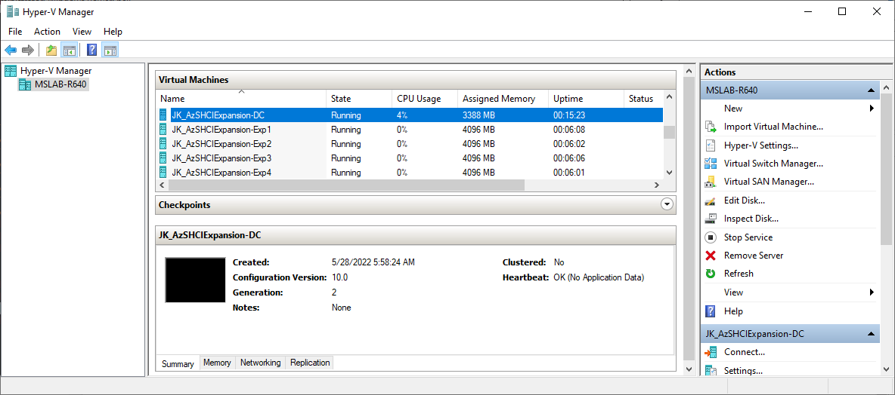
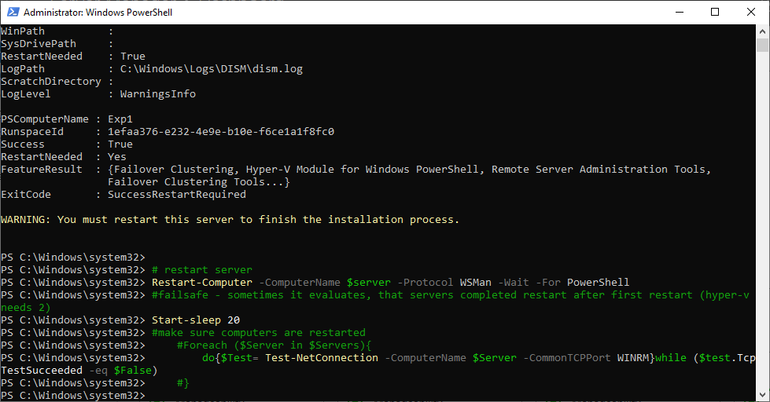
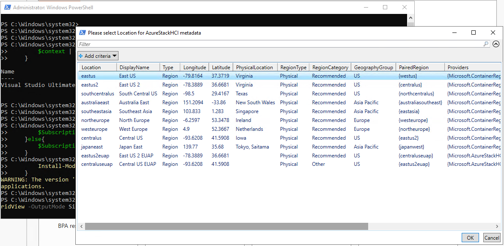
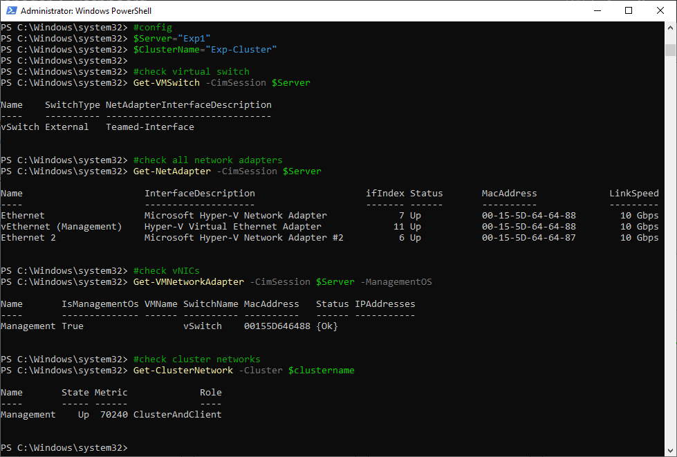
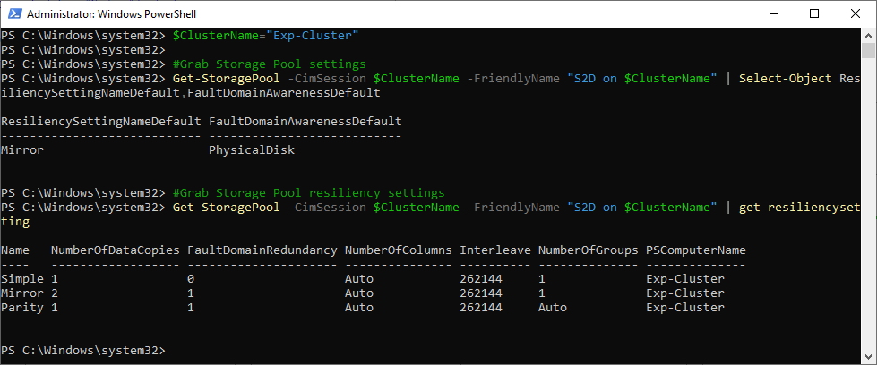
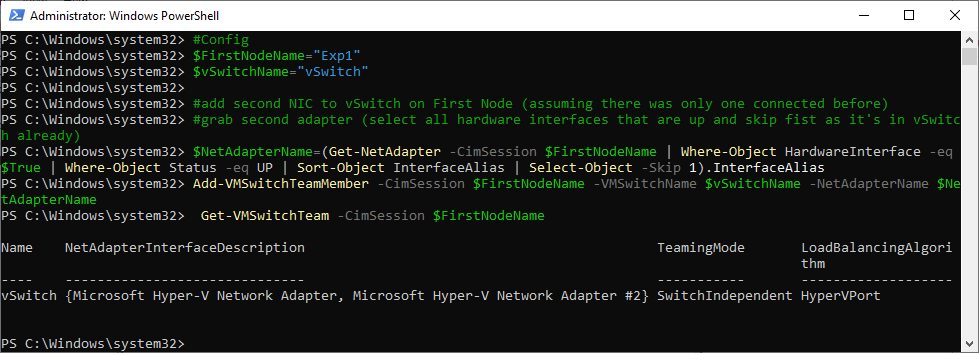
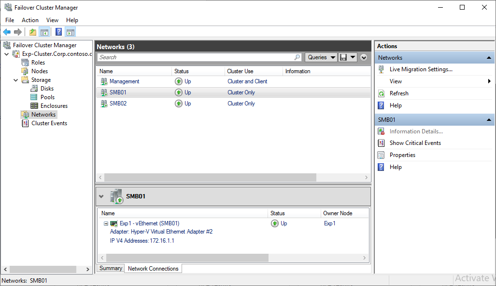
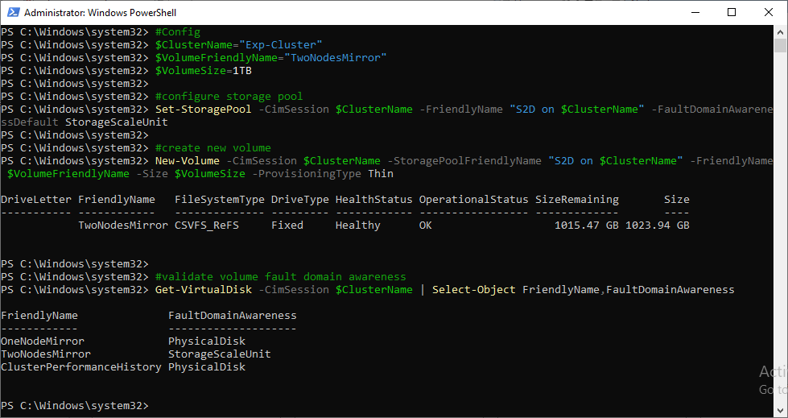
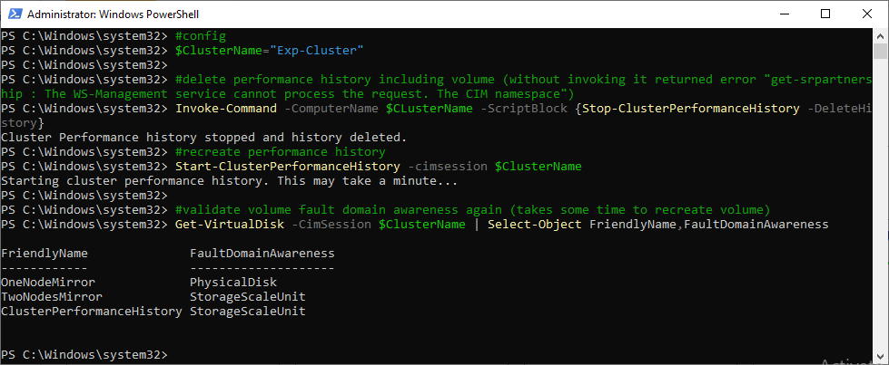
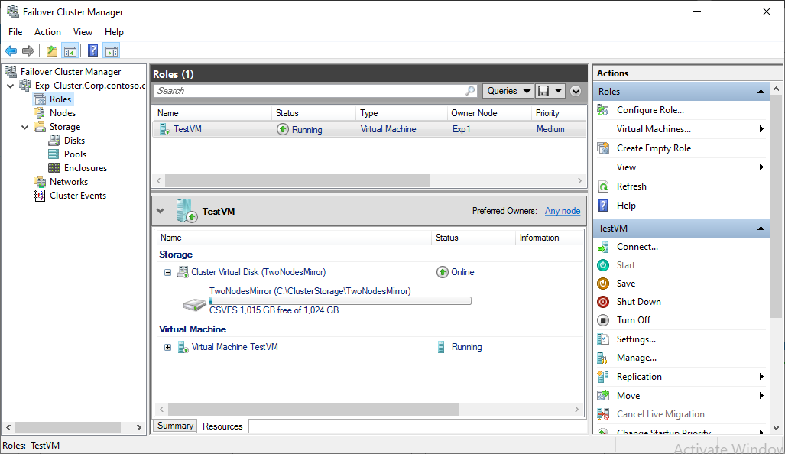

# Expanding Azure Stack HCI Cluster

<!-- TOC -->

- [Expanding Azure Stack HCI Cluster](#expanding-azure-stack-hci-cluster)
    - [About the lab](#about-the-lab)
    - [Prerequisites](#prerequisites)
    - [LabConfig](#labconfig)
    - [Task 01 - Create a single-node Azure Stack HCI cluster](#task-01---create-a-single-node-azure-stack-hci-cluster)
    - [Task 02 - Expand cluster 1node->2node](#task-02---expand-cluster-1node-2node)

<!-- /TOC -->

## About the lab

This lab will help you understand how to deploy a single-node cluster and how to expand it to 2node cluster and also how to expand 2 node to 3+ node cluster.

This lab is not going into every detail (there might be another settings that needs to be pushed to hosts such as security settings, agents, ...). For end-to-end setup review [MSLab Azure Stack HCI deployment scenario](https://github.com/microsoft/MSLab/tree/master/Scenarios/AzSHCI%20Deployment).

The lab is based on [AzSHCI and Cluster Expansion](https://github.com/microsoft/MSLab/tree/master/Scenarios/AzSHCI%20and%20Cluster%20Expansion) MSLab scenario.

## Prerequisites

To perform following lab you should know how to operate MSLab:

* Hydrate MSLab with LabConfig from [01-HydrateMSLab](admin-guides/01-HydrateMSLab/readme.md)

* [Learn How MSLab works](admin-guides/02-WorkingWithMSLab/readme.md)

## LabConfig

Below LabConfig will deploy 4 nodes for Azure Stack HCI 21H2 assuming you can give a try to expanding 2 node cluster with another 2 nodes in one run.

Following labconfig is using nested virtualization to be able to deploy running virtual machine. You can modify it and use light version to deploy a dummy VM.

```PowerShell
$LabConfig=@{ DomainAdminName='LabAdmin'; AdminPassword='LS1setup!' ; <#Prefix = 'MSLab-' ;#> DCEdition='4'; Internet=$true ; AdditionalNetworksConfig=@(); VMs=@()}

#4 nodes for AzSHCI Cluster with nested virtualization enabled
1..4 | ForEach-Object {$VMNames="Exp" ; $LABConfig.VMs += @{ VMName = "$VMNames$_" ; Configuration = 'S2D' ; ParentVHD = 'AzSHCI21H2_G2.vhdx' ; HDDNumber = 4 ; HDDSize= 4TB ; MemoryStartupBytes= 4GB; VMProcessorCount=4 ; NestedVirt=$true ; VirtualTPM=$true}}

#3 nodes for AzSHCI Cluster light - without nested virtualization
#1..3 | ForEach-Object {$VMNames="Exp" ; $LABConfig.VMs += @{ VMName = "$VMNames$_" ; Configuration = 'S2D' ; ParentVHD = 'AzSHCI21H2_G2.vhdx' ; HDDNumber = 4 ; HDDSize= 4TB ; VMProcessorCount=4 ; VirtualTPM=$true}}
 
```

Deployment result




## Task 01 - Create a single-node Azure Stack HCI cluster

> Note: Run all PowerShell code from DC or Management machine

**Step 1** Install features

> Note: Notice that even in single node AzureStackHCI is Failover Clustering installed. This is due to Enable-ClusterS2D requires failover cluster role as it also install SDDC role (required for Windows Admin Center) and also creates ClusterPerformance history Cluster Shared Volume.

> Note: You can also notice, that Hyper-V is installed using DISM PowerShell module. It's because of Install-Windows feature checks for hardware prerequisites.

```PowerShell
#Config
$Server="Exp1"

#Install features for management
Install-WindowsFeature -Name RSAT-DHCP,RSAT-Clustering,RSAT-Clustering-Mgmt,RSAT-Clustering-PowerShell,RSAT-Hyper-V-Tools

# Install features on server
Invoke-Command -computername $Server -ScriptBlock {
    Enable-WindowsOptionalFeature -FeatureName Microsoft-Hyper-V -Online -NoRestart 
    Install-WindowsFeature -Name "Failover-Clustering","RSAT-Clustering-Powershell","Hyper-V-PowerShell"
}

# restart server
Restart-Computer -ComputerName $server -Protocol WSMan -Wait -For PowerShell
#failsafe - sometimes it evaluates, that servers completed restart after first restart (hyper-v needs 2)
Start-sleep 20
#make sure computers are restarted
    #Foreach ($Server in $Servers){
        do{$Test= Test-NetConnection -ComputerName $Server -CommonTCPPort WINRM}while ($test.TcpTestSucceeded -eq $False)
    #}
 
```



**Step 2** Configure networking

> Note: we will assume only one pNIC is connected. This one NIC will be shared with virtual machines.

```PowerShell
#config
$Server="Exp1"
$vSwitchName="vSwitch"

# create vSwitch from first connected NIC
$NetAdapterName=(Get-NetAdapter -Cimsession $Server | Where-Object HardwareInterface -eq $True | Where-Object Status -eq UP | Sort-Object InterfaceAlias | Select-Object -First 1).InterfaceAlias
New-VMSwitch -Cimsession $Server -Name $vSwitchName -EnableEmbeddedTeaming $TRUE -NetAdapterName $NetAdapterName -EnableIov $true

#rename vNIC
Rename-VMNetworkAdapter -Cimsession $Server -ManagementOS -Name $vSwitchName -NewName Management
 
```


**Step 3** Create failover cluster and rename cluster network

> Note: Notice ManagementPointNetworkType Distributed parameter. Instead of using another IP address, Cluster Name Object will use Distributed Domain Name instead. It means that every cluster node IP address will be registered to DNS with Cluster Name. Therefore every time you will resolve DNS name of CNO, it will resolve different node each time (if multiple nodes are present)

```PowerShell
#config
$Server="Exp1"
$ClusterName="Exp-Cluster"

#create cluster with Distributed Network Name (to not consume extra IP, because why not)
New-Cluster -Name $ClusterName -Node $Server -ManagementPointNetworkType "Distributed"
Start-Sleep 5
Clear-DNSClientCache

#Rename Cluster Management Network
(Get-ClusterNetwork -Cluster $clustername | Where-Object Role -eq "ClusterAndClient").Name="Management"
 
```

**Step 4** Enable storage spaces direct and register cluster

> Note: following code might seem complex, but its just paste and forget. It will ask you for logging using device authentication and will ask you for location of Azure Stack HCI metadata. The script is bit longer as it won't ask for credentials twice.

```PowerShell
#Config
$ClusterName="Exp-Cluster"

#Enable-ClusterS2D
Enable-ClusterS2D -CimSession $ClusterName -confirm:0 -Verbose

#register Azure Stack HCI
    #download Azure module
    Install-PackageProvider -Name NuGet -MinimumVersion 2.8.5.201 -Force
    if (!(Get-InstalledModule -Name Az.StackHCI -ErrorAction Ignore)){
        Install-Module -Name Az.StackHCI -Force
    }

    #login to azure
    #download Azure module
    if (!(Get-InstalledModule -Name az.accounts -ErrorAction Ignore)){
        Install-Module -Name Az.Accounts -Force
    }
    Login-AzAccount -UseDeviceAuthentication

    #select context if more available
    $context=Get-AzContext -ListAvailable
    if (($context).count -gt 1){
        $context | Out-GridView -OutputMode Single | Set-AzContext
    }

    #select subscription if more available
    $subscriptions=Get-AzSubscription
    if (($subscriptions).count -gt 1){
        $SubscriptionID=($subscriptions | Out-GridView -OutputMode Single | Select-AzSubscription).Subscription.Id
    }else{
        $SubscriptionID=$subscriptions.id
    }
    if (!(Get-InstalledModule -Name Az.Resources -ErrorAction Ignore)){
        Install-Module -Name Az.Resources -Force
    }
    #choose location for cluster (and RG)
    $region=(Get-AzLocation | Where-Object Providers -Contains "Microsoft.AzureStackHCI" | Out-GridView -OutputMode Single -Title "Please select Location for AzureStackHCI metadata").Location

    #Register AZSHCi without prompting for creds again
    $armTokenItemResource = "https://management.core.windows.net/"
    $graphTokenItemResource = "https://graph.windows.net/"
    $azContext = Get-AzContext
    $authFactory = [Microsoft.Azure.Commands.Common.Authentication.AzureSession]::Instance.AuthenticationFactory
    $graphToken = $authFactory.Authenticate($azContext.Account, $azContext.Environment, $azContext.Tenant.Id, $null, [Microsoft.Azure.Commands.Common.Authentication.ShowDialog]::Never, $null, $graphTokenItemResource).AccessToken
    $armToken = $authFactory.Authenticate($azContext.Account, $azContext.Environment, $azContext.Tenant.Id, $null, [Microsoft.Azure.Commands.Common.Authentication.ShowDialog]::Never, $null, $armTokenItemResource).AccessToken
    $id = $azContext.Account.Id
    Register-AzStackHCI -Region $Region -SubscriptionID $subscriptionID -ComputerName  $ClusterName -GraphAccessToken $graphToken -ArmAccessToken $armToken -AccountId $id -ResourceName $ClusterName
 
```




**Step 5** (Optional) Explore what was configured - network

> Note: there are 2 "physical" nics as this node will be later used in 2 node cluster with converged networking. You can also notice that vNIC was renamed and also cluster network was renamed.

```PowerShell
#config
$Server="Exp1"
$ClusterName="Exp-Cluster"

#check virtual switch
Get-VMSwitch -CimSession $Server
#check all network adapters
Get-NetAdapter -CimSession $Server
#check vNICs
Get-VMNetworkAdapter -CimSession $Server -ManagementOS
#check cluster networks
Get-ClusterNetwork -Cluster $clustername
 
```



**Step 6** (Optional) Explore what was configured - pool settings

> Note: Notice that there is FaultDomainAwarenessDefault "PhysicalDisk". With mode nodes it is "StorageScaleUnit" (like a server with it's enclosures). Default resiliency setting is mirror. You can also notice, that mirror resiliency setting is configured to create 2 copies (2-way mirror)

```PowerShell
$ClusterName="Exp-Cluster"

#Grab Storage Pool settings
Get-StoragePool -CimSession $ClusterName -FriendlyName "S2D on $ClusterName" | Select-Object ResiliencySettingNameDefault,FaultDomainAwarenessDefault
#Grab Storage Pool resiliency settings
Get-StoragePool -CimSession $ClusterName -FriendlyName "S2D on $ClusterName" | get-resiliencysetting
 
```



**Step 7** Create volume and VM

> Note: following script will create thin provisioned volume and will ask you for VHD (you can copy one from ParentDisk folder from MSLab) or just hit cancel to create dummy VM.

```PowerShell
#config
$ClusterName="Exp-Cluster"
$VolumeFriendlyName="OneNodeMirror"
$VMName="TestVM"

#ask for VHD (you can hit cancel to create dummy VM)
    [reflection.assembly]::loadwithpartialname("System.Windows.Forms")
    $openFile = New-Object System.Windows.Forms.OpenFileDialog -Property @{
        Title="Please select parent VHDx." # You can copy it from parentdisks on the Hyper-V hosts somewhere into the lab and then browse for it"
    }
    $openFile.Filter = "VHDx files (*.vhdx)|*.vhdx" 
    If($openFile.ShowDialog() -eq "OK"){
        Write-Host  "File $($openfile.FileName) selected" -ForegroundColor Cyan
    } 
    if (!$openFile.FileName){
        Write-Host "No VHD was selected... Dummy VM will be created" -ForegroundColor Red
    }
    $VHDPath = $openFile.FileName

#create Cluster Shared Volume (thin provisioned)
New-Volume -CimSession $ClusterName -StoragePoolFriendlyName "S2D on $ClusterName" -FriendlyName $VolumeFriendlyName -Size 1TB -ProvisioningType Thin

#Create VM
    if ($VHDPath){
        New-Item -Path "\\$ClusterName\ClusterStorage$\$VolumeFriendlyName\$VMName\Virtual Hard Disks" -ItemType Directory
        Copy-Item -Path $VHDPath -Destination "\\$ClusterName\ClusterStorage$\$VolumeFriendlyName\$VMName\Virtual Hard Disks\$VMName.vhdx" 
        $VM=New-VM -Name $VMName -MemoryStartupBytes 512MB -Generation 2 -Path "c:\ClusterStorage\$VolumeFriendlyName\" -VHDPath "c:\ClusterStorage\$VolumeFriendlyName\$VMName\Virtual Hard Disks\$VMName.vhdx" -CimSession ((Get-ClusterNode -Cluster $ClusterName).Name | Get-Random)
        #start VM
        $VM | Start-VM
 
    }else{
        Invoke-Command -ComputerName ((Get-ClusterNode -Cluster $ClusterName).Name | Get-Random) -ScriptBlock {
            #create some fake VMs
            New-VM -Name $using:VMName -NewVHDPath "c:\ClusterStorage\$($using:VolumeFriendlyName)\$($using:VMName)\Virtual Hard Disks\$($using:VMName).vhdx" -NewVHDSizeBytes 32GB -SwitchName $using:vSwitchName -Generation 2 -Path "c:\ClusterStorage\$($using:VolumeFriendlyName)\" -MemoryStartupBytes 32MB
        }
    }
    #make it HA
    Add-ClusterVirtualMachineRole -VMName $VMName -Cluster $ClusterName
 
```


## Task 02 - Expand cluster (1node->2node)

This lab assumes moving from one node (connected with one cable to physical switch) to 2 node cluster with converged networking. Therefore it involves connecting second pNIC into vSwitch on first node and configure converged networking on both nodes (adding vNICs for SMB and configuring RDMA)

**Step 1** Install roles and features on second node

```PowerShell
#Config
$SecondNodeName="Exp2"

# Install features on server
Invoke-Command -computername $SecondNodeName -ScriptBlock {
    Enable-WindowsOptionalFeature -FeatureName Microsoft-Hyper-V -Online -NoRestart 
    Install-WindowsFeature -Name "Failover-Clustering","RSAT-Clustering-Powershell","Hyper-V-PowerShell"
}

# restart server
Restart-Computer -ComputerName $SecondNodeName -Protocol WSMan -Wait -For PowerShell
#failsafe - sometimes it evaluates, that servers completed restart after first restart (hyper-v needs 2)
Start-sleep 20
#make sure computer is restarted
do{$Test= Test-NetConnection -ComputerName $SecondNodeName -CommonTCPPort WINRM}while($test.TcpTestSucceeded -eq $False)
 
```

**Step 2** Connect second "physical" adapter to vSwitch on first node

> Note: following script will just grab all hardware interfaces and will skip the first one (assuming it's already connected to vSwitch). In production you could simply compare lists of all hardware adapters with adapters already present in vSwitch. For simplicity we will just assume the first one.

```PowerShell
#Config
$FirstNodeName="Exp1"
$vSwitchName="vSwitch"

#add second NIC to vSwitch on First Node (assuming there was only one connected before)
#grab second adapter (select all hardware interfaces that are up and skip fist as it's in vSwitch already)
$NetAdapterName=(Get-NetAdapter -CimSession $FirstNodeName | Where-Object HardwareInterface -eq $True | Where-Object Status -eq UP | Sort-Object InterfaceAlias | Select-Object -Skip 1).InterfaceAlias
Add-VMSwitchTeamMember -CimSession $FirstNodeName -VMSwitchName $vSwitchName -NetAdapterName $NetAdapterName
#validate
Get-VMSwitchTeam -CimSession $FirstNodeName
 
```



**Step 3** Create a vSwitch on second node and rename vNIC

> Note: Following script will select all hardware interfaces that are up. Assuming that only the connected devices will be used in vSwitch. In real world you also might choose the fastest interfaces only as BMC interfaces might be also present in the system. This example is just for simplicity

```PowerShell
#Config
$SecondNodeName="Exp2"
$vSwitchName="vSwitch"

#create vSwitch
$NetAdapterNames=(Get-NetAdapter -CimSession $SecondNodeName | Where-Object HardwareInterface -eq $True | Where-Object Status -eq UP | Sort-Object InterfaceAlias).InterfaceAlias
New-VMSwitch -Cimsession $SecondNodeName -Name $vSwitchName -EnableEmbeddedTeaming $True -NetAdapterName $NetAdapterNames -EnableIov $true
#rename vNIC
Rename-VMNetworkAdapter -Cimsession $SecondNodeName -ManagementOS -Name $vSwitchName -NewName Management
 
```

**Step 4** Add SMB vNICs and configure IP addresses

```PowerShell
#Config
$FirstNodeName="Exp1"
$SecondNodeName="Exp2"
$vSwitchName="vSwitch"
$IP=1 #start IP
$StorNet1="172.16.1."
$StorNet2="172.16.2."

foreach ($Server in ($FirstNodeName,$SecondNodeName)){
    #grab number of physical nics connected to vswitch
    $SMBvNICsCount=(Get-VMSwitch -CimSession $Server -Name $vSwitchName).NetAdapterInterfaceDescriptions.Count

    #create SMB vNICs
    foreach ($number in (1..$SMBvNICsCount)){
        $TwoDigitNumber="{0:D2}" -f $Number
        Add-VMNetworkAdapter -ManagementOS -Name "SMB$TwoDigitNumber" -SwitchName $vSwitchName -CimSession $Server
    }

    #assign IP Addresses
    foreach ($number in (1..$SMBvNICsCount)){
        $TwoDigitNumber="{0:D2}" -f $Number
        if ($number % 2 -eq 1){
            New-NetIPAddress -IPAddress ($StorNet1+$IP.ToString()) -InterfaceAlias "vEthernet (SMB$TwoDigitNumber)" -CimSession $Server -PrefixLength 24
        }else{
            New-NetIPAddress -IPAddress ($StorNet2+$IP.ToString()) -InterfaceAlias "vEthernet (SMB$TwoDigitNumber)" -CimSession $Server -PrefixLength 24
            $IP++
        }
    }
}
 
```

**Step 5** Configure VLANs on SMB vNICs

```PowerShell
#Config
$FirstNodeName="Exp1"
$SecondNodeName="Exp2"
$StorVLAN1=1
$StorVLAN2=2

#configure Odds and Evens for VLAN1 and VLAN2
foreach ($Server in ($FirstNodeName,$SecondNodeName)){
    $NetAdapters=Get-VMNetworkAdapter -CimSession $server -ManagementOS -Name *SMB* | Sort-Object Name
    $i=1
    foreach ($NetAdapter in $NetAdapters){
        if (($i % 2) -eq 1){
            Set-VMNetworkAdapterVlan -VMNetworkAdapterName $NetAdapter.Name -VlanId $StorVLAN1 -Access -ManagementOS -CimSession $Server
            $i++
        }else{
            Set-VMNetworkAdapterVlan -VMNetworkAdapterName $NetAdapter.Name -VlanId $StorVLAN2 -Access -ManagementOS -CimSession $Server
            $i++
        }
    }
}
#restart adapters so VLAN is active
Get-NetAdapter -CimSession ($FirstNodeName,$SecondNodeName) -Name "vEthernet (SMB*)" | Restart-NetAdapter
 
```

**Step 6** Configure RDMA and DCB

> Note: This is another paste-and-forget script. It will fail in applying policy to adapters as this is virtual environment. It will also associate vNICs to pNICs 

```PowerShell
#Config
$Servers="Exp1","Exp2"
$vSwitchName="vSwitch"

#Enable RDMA on the host vNIC adapters
    Enable-NetAdapterRDMA -Name "vEthernet (SMB*)" -CimSession $Servers

#Associate each of the vNICs configured for RDMA to a physical adapter that is up and is not virtual (to be sure that each RDMA enabled ManagementOS vNIC is mapped to separate RDMA pNIC)
    Invoke-Command -ComputerName $servers -ScriptBlock {
        #grab adapter names
        $physicaladapternames=(get-vmswitch $using:vSwitchName).NetAdapterInterfaceDescriptions
        #map pNIC and vNICs
        $vmNetAdapters=Get-VMNetworkAdapter -Name "SMB*" -ManagementOS
        $i=0
        foreach ($vmNetAdapter in $vmNetAdapters){
            $TwoDigitNumber="{0:D2}" -f ($i+1)
            Set-VMNetworkAdapterTeamMapping -VMNetworkAdapterName "SMB$TwoDigitNumber" -ManagementOS -PhysicalNetAdapterName (get-netadapter -InterfaceDescription $physicaladapternames[$i]).name
            $i++
        }
    }

#Install DCB
    foreach ($server in $servers) {Install-WindowsFeature -Name "Data-Center-Bridging" -ComputerName $server} 

#Configure QoS
    New-NetQosPolicy "SMB"       -NetDirectPortMatchCondition 445 -PriorityValue8021Action 3 -CimSession $servers
    New-NetQosPolicy "ClusterHB" -Cluster                         -PriorityValue8021Action 7 -CimSession $servers
    New-NetQosPolicy "Default"   -Default                         -PriorityValue8021Action 0 -CimSession $servers

#Turn on Flow Control for SMB
    Invoke-Command -ComputerName $servers -ScriptBlock {Enable-NetQosFlowControl -Priority 3}

#Disable flow control for other traffic than 3 (pause frames should go only from prio 3)
    Invoke-Command -ComputerName $servers -ScriptBlock {Disable-NetQosFlowControl -Priority 0,1,2,4,5,6,7}

#Disable Data Center bridging exchange (disable accept data center bridging (DCB) configurations from a remote device via the DCBX protocol, which is specified in the IEEE data center bridging (DCB) standard.)
    Invoke-Command -ComputerName $servers -ScriptBlock {Set-NetQosDcbxSetting -willing $false -confirm:$false}

#Configure IeeePriorityTag
    #IeePriorityTag needs to be On if you want tag your nonRDMA traffic for QoS. Can be off if you use adapters that pass vSwitch (both SR-IOV and RDMA bypasses vSwitch)
    Invoke-Command -ComputerName $servers -ScriptBlock {Set-VMNetworkAdapter -ManagementOS -Name "SMB*" -IeeePriorityTag on}

#Apply policy to the target adapters.  The target adapters are adapters connected to vSwitch
    Invoke-Command -ComputerName $servers -ScriptBlock {Enable-NetAdapterQos -InterfaceDescription (Get-VMSwitch).NetAdapterInterfaceDescriptions}

#Create a Traffic class and give SMB Direct 50% of the bandwidth minimum. The name of the class will be "SMB".
#This value needs to match physical switch configuration. Value might vary based on your needs.
#If connected directly (in 2 node configuration) skip this step.
    Invoke-Command -ComputerName $servers -ScriptBlock {New-NetQosTrafficClass "SMB"       -Priority 3 -BandwidthPercentage 50 -Algorithm ETS}
    Invoke-Command -ComputerName $servers -ScriptBlock {New-NetQosTrafficClass "ClusterHB" -Priority 7 -BandwidthPercentage 1 -Algorithm ETS}
 
```

**Step 7** Rename SMB Cluster Networks

```PowerShell
#Config
$ClusterName="Exp-Cluster"
$StorNet1="172.16.1."
$StorNet2="172.16.2."

#rename smb cluster networks
(Get-ClusterNetwork -Cluster $ClusterName | Where-Object Address -eq $StorNet1"0").Name="SMB01"
(Get-ClusterNetwork -Cluster $ClusterName | Where-Object Address -eq $StorNet2"0").Name="SMB02"
 
```



**Step 8** Add witness

> Note: Following example demonstrates both cloud and file share witness. Just choose which one you want by modifying config

```PowerShell
#Config
$ClusterName="Exp-Cluster"
$WitnessType="FileShare" #or Cloud
    #config for cloud witness
    $ResourceGroupName="MSLabCloudWitness"
    $StorageAccountName="mslabcloudwitness$(Get-Random -Minimum 100000 -Maximum 999999)"
    #config for fileshare witness
    $FileServerName="DC"
    $DomainName=$env:UserDomain

#region add file share witness
    if ($WitnessType -eq "FileShare"){
        #Create new directory
            $WitnessName=$Clustername+"Witness"
            Invoke-Command -ComputerName $FileServerName -ScriptBlock {new-item -Path c:\Shares -Name $using:WitnessName -ItemType Directory}
            $accounts=@()
            $accounts+="$DomainName\$ClusterName$"
            New-SmbShare -Name $WitnessName -Path "c:\Shares\$WitnessName" -FullAccess $accounts -CimSession $FileServerName
        #Set NTFS permissions 
            Invoke-Command -ComputerName $FileServerName -ScriptBlock {(Get-SmbShare $using:WitnessName).PresetPathAcl | Set-Acl}
        #Set Quorum
            Set-ClusterQuorum -Cluster $ClusterName -FileShareWitness "\\$FileServerName\$WitnessName"
    }
#endregion

#region or add cloud witness
    if ($WitnessType -eq "Cloud"){
        #download Azure modules
        Install-PackageProvider -Name NuGet -MinimumVersion 2.8.5.201 -Force
        Install-Module -Name Az.Accounts -Force
        Install-Module -Name Az.Resources -Force
        Install-Module -Name Az.Storage -Force

        #login to Azure
        if (-not (Get-AzContext)){
            Connect-AzAccount -UseDeviceAuthentication
        }
        #select context if more available
        $context=Get-AzContext -ListAvailable
        if (($context).count -gt 1){
            $context | Out-GridView -OutputMode Single | Set-AzContext
        }
        #Create resource group
        $Location=Get-AzLocation | Where-Object Providers -Contains "Microsoft.Storage" | Out-GridView -OutputMode Single
        #create resource group first
        if (-not(Get-AzResourceGroup -Name $ResourceGroupName -ErrorAction Ignore)){
            New-AzResourceGroup -Name $ResourceGroupName -Location $location.Location
        }
        #create Storage Account
        If (-not(Get-AzStorageAccountKey -Name $StorageAccountName -ResourceGroupName $ResourceGroupName -ErrorAction Ignore)){
            New-AzStorageAccount -ResourceGroupName $ResourceGroupName -Name $StorageAccountName -SkuName Standard_LRS -Location $location.location -Kind StorageV2 -AccessTier Cool 
        }
        $StorageAccountAccessKey=(Get-AzStorageAccountKey -Name $StorageAccountName -ResourceGroupName $ResourceGroupName | Select-Object -First 1).Value
        Set-ClusterQuorum -Cluster $ClusterName -CloudWitness -AccountName $StorageAccountName -AccessKey $StorageAccountAccessKey -Endpoint "core.windows.net"
    }
#endregion
 
```

**Step 9** Add new cluster member

> Note: And since everything is now configured, we are ready to add new cluster member

```PowerShell
#Config
$ClusterName="Exp-Cluster"
$SecondNodeName="Exp2"
#add node
Add-ClusterNode -Name $SecondNodeName -Cluster $ClusterName
 
```

**Step 10** Configure pool fault domain and create new volume

> Note: Since another node was added, FaultDomainAwareness needs to be changed from Disk to Storage Scale Unit. So when volume is created, it will be split across multiple nodes.

```PowerShell
#Config
$ClusterName="Exp-Cluster"
$VolumeFriendlyName="TwoNodesMirror"
$VolumeSize=1TB

#configure storage pool
Set-StoragePool -CimSession $ClusterName -FriendlyName "S2D on $ClusterName" -FaultDomainAwarenessDefault StorageScaleUnit

#create new volume
New-Volume -CimSession $ClusterName -StoragePoolFriendlyName "S2D on $ClusterName" -FriendlyName $VolumeFriendlyName -Size $VolumeSize -ProvisioningType Thin

#validate volume fault domain awareness
Get-VirtualDisk -CimSession $ClusterName | Select-Object FriendlyName,FaultDomainAwareness
 
```

> Note: as you can see below, OneNodeMirror disk and ClusterPerformanceHistory FaultDomainAwareness is PhysicalDisk.



**Step 11** Recreate Cluster Performance History volume

> Note: Cluster performance history needs to be recreated as it's FaultDomainAwareness is PhysicalDisk

```PowerShell
#config
$ClusterName="Exp-Cluster"

#delete performance history including volume (without invoking it returned error "get-srpartnership : The WS-Management service cannot process the request. The CIM namespace")
Invoke-Command -ComputerName $CLusterName -ScriptBlock {Stop-ClusterPerformanceHistory -DeleteHistory}
#recreate performance history
Start-ClusterPerformanceHistory -cimsession $ClusterName

#validate volume fault domain awareness again (takes some time to recreate volume)
Get-VirtualDisk -CimSession $ClusterName | Select-Object FriendlyName,FaultDomainAwareness
 
```



**Step 12 Move VM(s) to new volume

```PowerShell
#config
$ClusterName="Exp-Cluster"
$VolumeFriendlyName="TwoNodesMirror"
$DestinationStoragePath="c:\ClusterStorage\$VolumeFriendlyName"

$VMs=Get-VM -CimSession (Get-ClusterNode -Cluster $ClusterName).Name
foreach ($VM in $VMs){
    $VM | Move-VMStorage -DestinationStoragePath "$DestinationStoragePath\$($VM.Name)"
}
 
```

