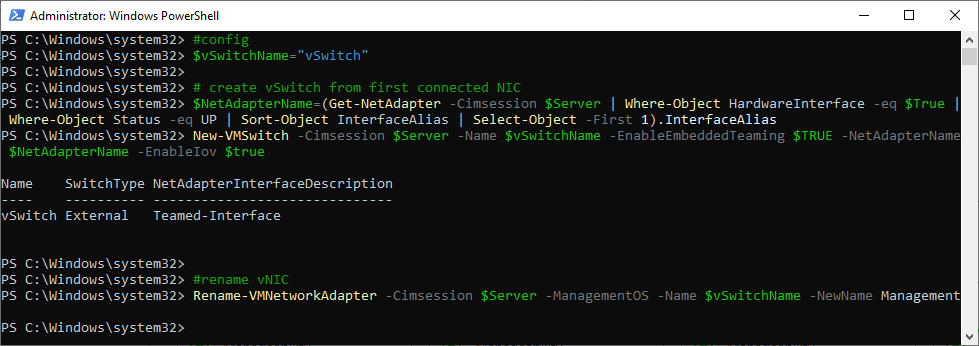
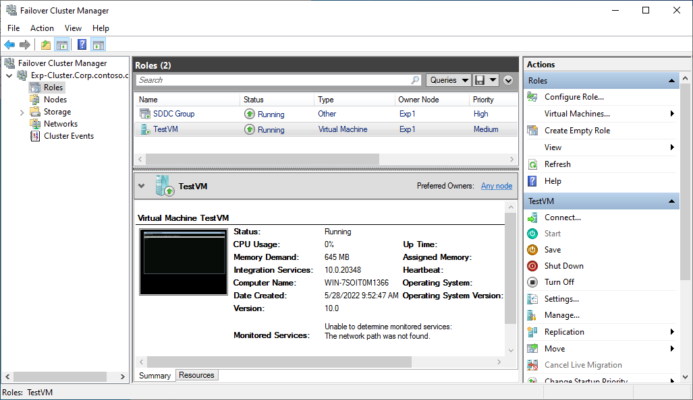

# Azure Stack HCI Cluster maintenance deep dive

<!-- TOC -->

- [Azure Stack HCI Cluster maintenance deep dive](#azure-stack-hci-cluster-maintenance-deep-dive)
    - [About the lab](#about-the-lab)
    - [Prerequisites](#prerequisites)
    - [Task 01 - Explore status of the Azure Stack HCI cluster](#task-01---explore-status-of-the-azure-stack-hci-cluster)
    - [Task 02 - Explore Microsoft update level of Azure Stack HCI Cluster](#task-02---explore-microsoft-update-level-of-azure-stack-hci-cluster)
    - [Task 03 - Explore missing Dell updates](#task-03---explore-missing-dell-updates)
    - [Task 04 - Perform "manual" update of Azure Stack HCI Cluster node](#task-04---perform-manual-update-of-azure-stack-hci-cluster-node)
    - [Task 05 - Perform scripted update of Azure Stack HCI Cluster](#task-05---perform-scripted-update-of-azure-stack-hci-cluster)

<!-- /TOC -->

## About the lab

This lab will help you understand how to deploy a single-node cluster and how to expand it to 2node cluster and also how to expand 2 node to 3+ node cluster.

This lab is not going into every detail (there might be another settings that needs to be pushed to hosts such as security settings, agents, ...). For end-to-end setup review [MSLab Azure Stack HCI deployment scenario](https://github.com/microsoft/MSLab/tree/master/Scenarios/AzSHCI%20Deployment).

The lab is based on [AzSHCI and Cluster Expansion](https://github.com/microsoft/MSLab/tree/master/Scenarios/AzSHCI%20and%20Cluster%20Expansion) MSLab scenario.

## Prerequisites

To perform following lab you should know how to operate MSLab:

* Hydrate MSLab with LabConfig from [01-HydrateMSLab](admin-guides/01-HydrateMSLab/readme.md)

* [Learn How MSLab works](admin-guides/02-WorkingWithMSLab/readme.md)

## LabConfig

Below LabConfig will deploy 4 nodes for Azure Stack HCI 21H2 assuming you can give a try to expanding 2 node cluster with another 2 nodes in one run.

Following labconfig is using nested virtualization to be able to deploy running virtual machine. You can modify it and use light version to deploy a dummy VM.

```PowerShell
$LabConfig=@{ DomainAdminName='LabAdmin'; AdminPassword='LS1setup!' ; <#Prefix = 'MSLab-' ;#> DCEdition='4'; Internet=$true ; AdditionalNetworksConfig=@(); VMs=@()}

#4 nodes for AzSHCI Cluster with nested virtualization enabled
1..4 | ForEach-Object {$VMNames="Exp" ; $LABConfig.VMs += @{ VMName = "$VMNames$_" ; Configuration = 'S2D' ; ParentVHD = 'AzSHCI21H2_G2.vhdx' ; HDDNumber = 4 ; HDDSize= 4TB ; MemoryStartupBytes= 4GB; VMProcessorCount=4 ; NestedVirt=$true ; VirtualTPM=$true}}

#3 nodes for AzSHCI Cluster light - without nested virtualization
#1..3 | ForEach-Object {$VMNames="Exp" ; $LABConfig.VMs += @{ VMName = "$VMNames$_" ; Configuration = 'S2D' ; ParentVHD = 'AzSHCI21H2_G2.vhdx' ; HDDNumber = 4 ; HDDSize= 4TB ; VMProcessorCount=4 ; VirtualTPM=$true}}
 
```

Deployment result


## Task 01 - Create a single-node Azure Stack HCI cluster

> Note: Run all PowerShell code from DC or Management machine

**Step 1** Install features

> Note: Notice that even in single node AzureStackHCI is Failover Clustering installed. This is due to Enable-ClusterS2D requires failover cluster role as it also install SDDC role (required for Windows Admin Center) and also creates ClusterPerformance history Cluster Shared Volume.

> Note: You can also notice, that Hyper-V is installed using DISM PowerShell module. It's because of Install-Windows feature checks for hardware prerequisites.

```PowerShell
#Config
$Server="Exp1"

#Install features for management
Install-WindowsFeature -Name RSAT-DHCP,RSAT-Clustering,RSAT-Clustering-Mgmt,RSAT-Clustering-PowerShell,RSAT-Hyper-V-Tools

# Install features on server
Invoke-Command -computername $Server -ScriptBlock {
    Enable-WindowsOptionalFeature -FeatureName Microsoft-Hyper-V -Online -NoRestart 
    Install-WindowsFeature -Name "Failover-Clustering","RSAT-Clustering-Powershell","Hyper-V-PowerShell"
}

# restart server
Restart-Computer -ComputerName $server -Protocol WSMan -Wait -For PowerShell
#failsafe - sometimes it evaluates, that servers completed restart after first restart (hyper-v needs 2)
Start-sleep 20
#make sure computers are restarted
    #Foreach ($Server in $Servers){
        do{$Test= Test-NetConnection -ComputerName $Server -CommonTCPPort WINRM}while ($test.TcpTestSucceeded -eq $False)
    #}
 
```


**Step 2** Configure networking

> Note: we will assume only one pNIC is connected. This one NIC will be shared with virtual machines.

```PowerShell
#config
$Server="Exp1"
$vSwitchName="vSwitch"

# create vSwitch from first connected NIC
$NetAdapterName=(Get-NetAdapter -Cimsession $Server | Where-Object HardwareInterface -eq $True | Where-Object Status -eq UP | Sort-Object InterfaceAlias | Select-Object -First 1).InterfaceAlias
New-VMSwitch -Cimsession $Server -Name $vSwitchName -EnableEmbeddedTeaming $TRUE -NetAdapterName $NetAdapterName -EnableIov $true

#rename vNIC
Rename-VMNetworkAdapter -Cimsession $Server -ManagementOS -Name $vSwitchName -NewName Management
 
```



**Step 3** Create failover cluster and rename cluster network

> Note: Notice ManagementPointNetworkType Distributed parameter. Instead of using another IP address, Cluster Name Object will use Distributed Domain Name instead. It means that every cluster node IP address will be registered to DNS with Cluster Name. Therefore every time you will resolve DNS name of CNO, it will resolve different node each time (if multiple nodes are present)

```PowerShell
#config
$Server="Exp1"
$ClusterName="Exp-Cluster"

#create cluster with Distributed Network Name (to not consume extra IP, because why not)
New-Cluster -Name $ClusterName -Node $Server -ManagementPointNetworkType "Distributed"
Start-Sleep 5
Clear-DNSClientCache

#Rename Cluster Management Network
(Get-ClusterNetwork -Cluster $clustername | Where-Object Role -eq "ClusterAndClient").Name="Management"
 
```

**Step 4** Enable storage spaces direct and register cluster

> Note: following code might seem complex, but its just paste and forget. It will ask you for logging using device authentication and will ask you for location of Azure Stack HCI metadata. The script is bit longer as it won't ask for credentials twice.

```PowerShell
#Config
$ClusterName="Exp-Cluster"

#Enable-ClusterS2D
Enable-ClusterS2D -CimSession $ClusterName -confirm:0 -Verbose

#register Azure Stack HCI
    #download Azure module
    Install-PackageProvider -Name NuGet -MinimumVersion 2.8.5.201 -Force
    if (!(Get-InstalledModule -Name Az.StackHCI -ErrorAction Ignore)){
        Install-Module -Name Az.StackHCI -Force
    }

    #login to azure
    #download Azure module
    if (!(Get-InstalledModule -Name az.accounts -ErrorAction Ignore)){
        Install-Module -Name Az.Accounts -Force
    }
    Login-AzAccount -UseDeviceAuthentication

    #select context if more available
    $context=Get-AzContext -ListAvailable
    if (($context).count -gt 1){
        $context | Out-GridView -OutputMode Single | Set-AzContext
    }

    #select subscription if more available
    $subscriptions=Get-AzSubscription
    if (($subscriptions).count -gt 1){
        $SubscriptionID=($subscriptions | Out-GridView -OutputMode Single | Select-AzSubscription).Subscription.Id
    }else{
        $SubscriptionID=$subscriptions.id
    }
    if (!(Get-InstalledModule -Name Az.Resources -ErrorAction Ignore)){
        Install-Module -Name Az.Resources -Force
    }
    #choose location for cluster (and RG)
    $region=(Get-AzLocation | Where-Object Providers -Contains "Microsoft.AzureStackHCI" | Out-GridView -OutputMode Single -Title "Please select Location for AzureStackHCI metadata").Location

    #Register AZSHCi without prompting for creds again
    $armTokenItemResource = "https://management.core.windows.net/"
    $graphTokenItemResource = "https://graph.windows.net/"
    $azContext = Get-AzContext
    $authFactory = [Microsoft.Azure.Commands.Common.Authentication.AzureSession]::Instance.AuthenticationFactory
    $graphToken = $authFactory.Authenticate($azContext.Account, $azContext.Environment, $azContext.Tenant.Id, $null, [Microsoft.Azure.Commands.Common.Authentication.ShowDialog]::Never, $null, $graphTokenItemResource).AccessToken
    $armToken = $authFactory.Authenticate($azContext.Account, $azContext.Environment, $azContext.Tenant.Id, $null, [Microsoft.Azure.Commands.Common.Authentication.ShowDialog]::Never, $null, $armTokenItemResource).AccessToken
    $id = $azContext.Account.Id
    Register-AzStackHCI -Region $Region -SubscriptionID $subscriptionID -ComputerName  $ClusterName -GraphAccessToken $graphToken -ArmAccessToken $armToken -AccountId $id -ResourceName $ClusterName
 
```


**Step 5** (Optional) Explore what was configured - network

> Note: there are 2 "physical" nics as this node will be later used in 2 node cluster with converged networking. You can also notice that vNIC was renamed and also cluster network was renamed.

```PowerShell
#config
$Server="Exp1"
$ClusterName="Exp-Cluster"

#check virtual switch
Get-VMSwitch -CimSession $Server
#check all network adapters
Get-NetAdapter -CimSession $Server
#check vNICs
Get-VMNetworkAdapter -CimSession $Server -ManagementOS
#check cluster networks
Get-ClusterNetwork -Cluster $clustername
 
```


**Step 6** (Optional) Explore what was configured - pool settings

> Note: Notice that there is FaultDomainAwarenessDefault "PhysicalDisk". With mode nodes it is "StorageScaleUnit" (like a server with it's enclosures). Default resiliency setting is mirror. You can also notice, that mirror resiliency setting is configured to create 2 copies (2-way mirror)

```PowerShell
$ClusterName="Exp-Cluster"

#Grab Storage Pool settings
Get-StoragePool -CimSession $ClusterName -FriendlyName "S2D on $ClusterName" | Select-Object ResiliencySettingNameDefault,FaultDomainAwarenessDefault
#Grab Storage Pool resiliency settings
Get-StoragePool -CimSession $ClusterName -FriendlyName "S2D on $ClusterName" | get-resiliencysetting
 
```


**Step 7** Create volume and VM

> Note: following script will create thin provisioned volume and will ask you for VHD (you can copy one from ParentDisk folder from MSLab) or just hit cancel to create dummy VM.

```PowerShell
#config
$ClusterName="Exp-Cluster"
$VolumeFriendlyName="OneNodeMirror"
$VMName="TestVM"

#ask for VHD (you can hit cancel to create dummy VM)
    [reflection.assembly]::loadwithpartialname("System.Windows.Forms")
    $openFile = New-Object System.Windows.Forms.OpenFileDialog -Property @{
        Title="Please select parent VHDx." # You can copy it from parentdisks on the Hyper-V hosts somewhere into the lab and then browse for it"
    }
    $openFile.Filter = "VHDx files (*.vhdx)|*.vhdx" 
    If($openFile.ShowDialog() -eq "OK"){
        Write-Host  "File $($openfile.FileName) selected" -ForegroundColor Cyan
    } 
    if (!$openFile.FileName){
        Write-Host "No VHD was selected... Dummy VM will be created" -ForegroundColor Red
    }
    $VHDPath = $openFile.FileName

#create Cluster Shared Volume (thin provisioned)
New-Volume -CimSession $ClusterName -StoragePoolFriendlyName "S2D on $ClusterName" -FriendlyName $VolumeFriendlyName -Size 1TB -ProvisioningType Thin

#Create VM
    if ($VHDPath){
        New-Item -Path "\\$ClusterName\ClusterStorage$\$VolumeFriendlyName\$VMName\Virtual Hard Disks" -ItemType Directory
        Copy-Item -Path $VHDPath -Destination "\\$ClusterName\ClusterStorage$\$VolumeFriendlyName\$VMName\Virtual Hard Disks\$VMName.vhdx" 
        $VM=New-VM -Name $VMName -MemoryStartupBytes 512MB -Generation 2 -Path "c:\ClusterStorage\$VolumeFriendlyName\" -VHDPath "c:\ClusterStorage\$VolumeFriendlyName\$VMName\Virtual Hard Disks\$VMName.vhdx" -CimSession ((Get-ClusterNode -Cluster $ClusterName).Name | Get-Random)
        #start VM
        $VM | Start-VM
 
    }else{
        Invoke-Command -ComputerName ((Get-ClusterNode -Cluster $ClusterName).Name | Get-Random) -ScriptBlock {
            #create some fake VMs
            New-VM -Name $using:VMName -NewVHDPath "c:\ClusterStorage\$($using:VolumeFriendlyName)\$($using:VMName)\Virtual Hard Disks\$($using:VMName).vhdx" -NewVHDSizeBytes 32GB -SwitchName $using:vSwitchName -Generation 2 -Path "c:\ClusterStorage\$($using:VolumeFriendlyName)\" -MemoryStartupBytes 32MB
        }
    }
    #make it HA
    Add-ClusterVirtualMachineRole -VMName $VMName -Cluster $ClusterName
 
```


