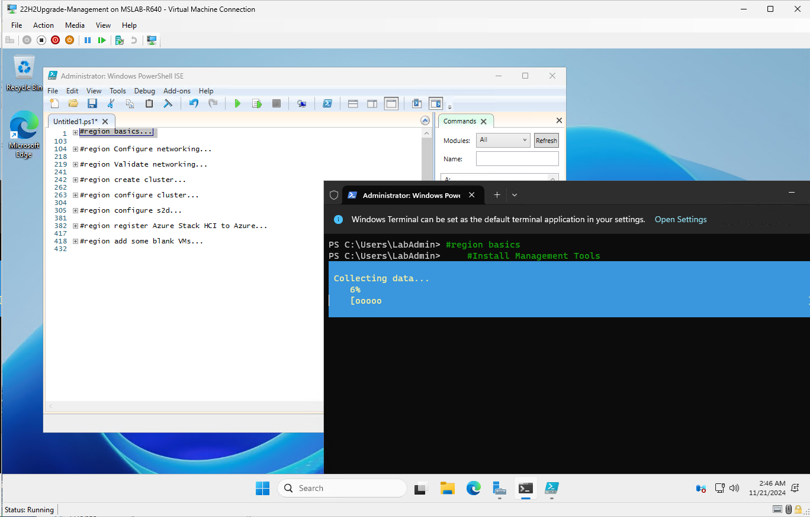
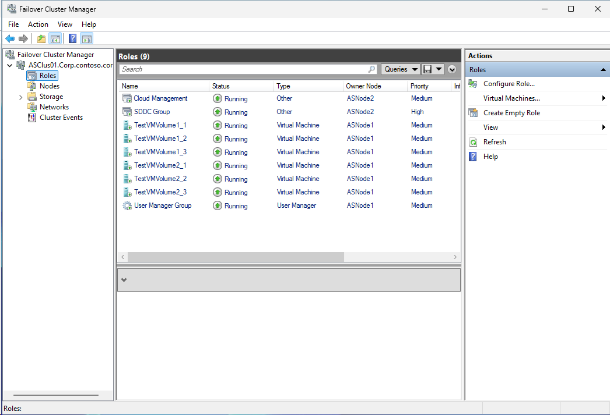
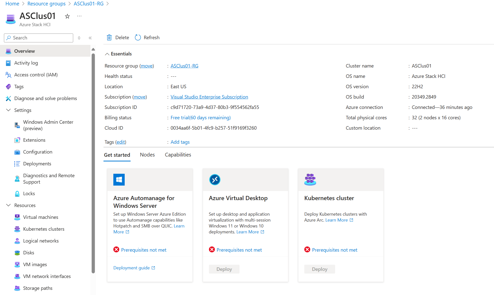
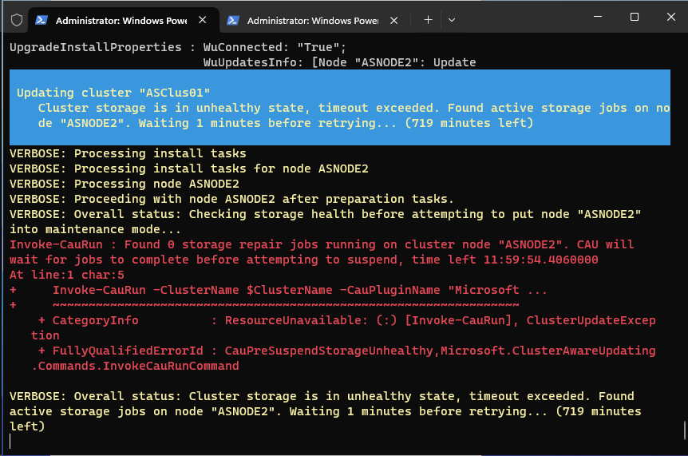
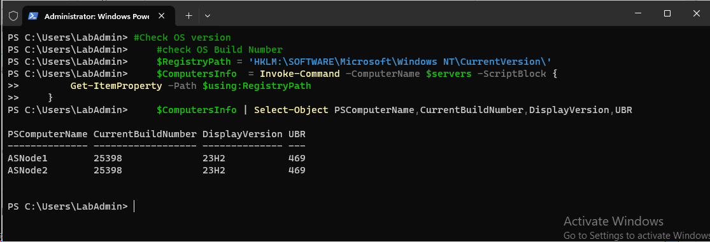
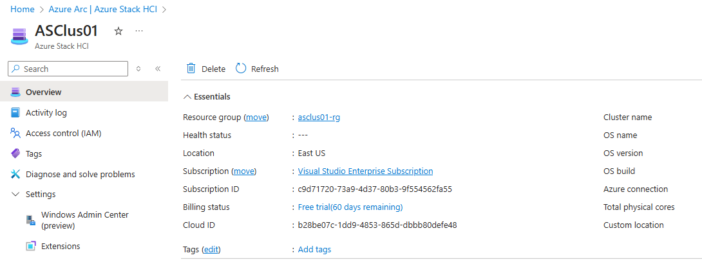

# Upgrading from Azure Local 22H2


<!-- TOC -->

- [Upgrading from Azure Local 22H2](#upgrading-from-azure-local-22h2)
    - [About the lab](#about-the-lab)
    - [Prerequisites](#prerequisites)
    - [ReFS issue as of March 2025](#refs-issue-as-of-march-2025)
    - [Download ISO for parent disk](#download-iso-for-parent-disk)
    - [Labconfig](#labconfig)
    - [Task 01: Install 22H2 cluster without NetATC](#task-01-install-22h2-cluster-without-netatc)
    - [Task 02a : Upgrade OS using CAU might not work](#task-02a--upgrade-os-using-cau-might-not-work)
    - [Task 02b: Upgrade OS using media](#task-02b-upgrade-os-using-media)
        - [Step 01: Download 23H2 media first](#step-01-download-23h2-media-first)
        - [Step 02: Mount image and copy to nodes](#step-02-mount-image-and-copy-to-nodes)
        - [Step 03: Update nodes using media](#step-03-update-nodes-using-media)
        - [Step 04: Update Cluster and Storage Pool versions](#step-04-update-cluster-and-storage-pool-versions)
    - [Task 02c: Upgrade OS using SConfig or Windows Update semi-manual](#task-02c-upgrade-os-using-sconfig-or-windows-update-semi-manual)
        - [Step 01: install feature update](#step-01-install-feature-update)
        - [Step 02: Post-Upgrade actions](#step-02-post-upgrade-actions)
    - [Task 03: Migrate networking to NetworkATC - only if NetATC is not already configured](#task-03-migrate-networking-to-networkatc---only-if-netatc-is-not-already-configured)
        - [Step 01 - Convert networking to NetATC](#step-01---convert-networking-to-netatc)
        - [Step 02: Remove NetATC IP Addresses](#step-02-remove-netatc-ip-addresses)
    - [Task 04: Validate Solution upgrade readiness](#task-04-validate-solution-upgrade-readiness)
    - [Task 05: Apply solution upgrade](#task-05-apply-solution-upgrade)
        - [Step 01: First some prerequisites - Prepare Active Directory](#step-01-first-some-prerequisites---prepare-active-directory)
        - [Step 02: Enforce sync - so Azure will see 23H2](#step-02-enforce-sync---so-azure-will-see-23h2)
        - [Perform Azure Onboard TBD: Option is not available in portal](#perform-azure-onboard-tbd-option-is-not-available-in-portal)

<!-- /TOC -->

## About the lab
In this lab you will learn how to upgrade Azure Local from versinon 22H2 to 23H2.

This lab assumes the most challenging approach - CAU upgrade not working (as I was not able to make it work anyway), NetATC not present (there is more complex process to make sure all VMs are running)

You will learn how to upgrade OS from install media, how to transition from traditional networking to NetworkATC while keeping all VMs up and running and how to onboard cluster to modern Lifecycle Management (23H2)

Official Dell KB https://www.dell.com/support/kbdoc/en-us/000259175/upgrade-azure-local-version-22h2-to-azure-local-version-23h2

Official Microsoft Documentation: https://learn.microsoft.com/en-us/azure/azure-local/upgrade/about-upgrades-23h2

Always make sure you have backup of your VMS!

## Prerequisites

* Hydrated MSLab with LabConfig from [01-HydrateMSLab](../../admin-guides/01-HydrateMSLab/readme.md)

* Understand [how MSLab works](../../admin-guides/02-WorkingWithMSLab/readme.md)

* Azure Local (Azure Stack HCI) 22H2 parent disk (see code below to be able to download ISO) and guide on how to [create parent disk](../../admin-guides/01-HydrateMSLab#task-4---create-azure-stack-hci-parent-disk)

## ReFS issue (as of March 2025)

There is already identified bug that causes ReFS volume to unmount. No data are lost, just enhanced metadata check has an issue that will dismount filesystem.

This registry will disappear after 22h2->23h2 OS upgrade. This renders CAU method unusable as you need to populate registry right after OS upgrade is done and before adding node back to cluster.

```PowerShell
#make sure failover clustering management tools are installed on management machine to be able to grab cluster nodes
Install-WindowsFeature -Name RSAT-Clustering,RSAT-Clustering-Mgmt,RSAT-Clustering-PowerShell

$ClusterName="ASClus01"
$Servers=(Get-ClusterNode -Cluster $ClusterName).Name

#disable ReFS metadata validation (temporary workaround until fix is shipped - most likely next Quality Release)
Invoke-Command -ComputerName $Servers -ScriptBlock {
    Set-ItemProperty -Path "HKLM:\SYSTEM\CurrentControlSet\Control\FileSystem" -Name "RefsEnableMetadataValidation" -Value 0 -Type DWord -ErrorAction Ignore
}
 
```

## Download ISO for parent disk

Here is some sample for downloading 22H2 parent disk. You can then [create parent disk](../../admin-guides/01-HydrateMSLab#task-4---create-azure-stack-hci-parent-disk) using 22H2 ISO, so you can deploy 22H2 with MSLab 

```PowerShell

    #Download files
    $DownloadFolder="$Env:Userprofile\Downloads"
    $files=@()
    $Files+=@{Uri="https://software-static.download.prss.microsoft.com/dbazure/888969d5-f34g-4e03-ac9d-1f9786c66750/AzureStackHCI_20349.1607_en-us.iso" ; FileName="AzureStackHCI_20349.1607_en-us.iso" ; Description="Azure Stack HCI 22H2 ISO"}
    #$Files+=@{Uri="https://software-static.download.prss.microsoft.com/dbazure/888969d5-f34g-4e03-ac9d-1f9786c66749/25398.469.231004-1141.zn_release_svc_refresh_SERVERAZURESTACKHCICOR_OEMRET_x64FRE_en-us.iso" ; FileName="25398.469.231004-1141.zn_release_svc_refresh_SERVERAZURESTACKHCICOR_OEMRET_x64FRE_en-us.iso" ; Description="Azure Stack HCI 23H2 ISO"}

    foreach ($file in $files){
        if (-not (Test-Path "$downloadfolder\$($file.filename)")){
            Start-BitsTransfer -Source $file.uri -Destination "$downloadfolder\$($file.filename)" -DisplayName "Downloading: $($file.filename)"
        }
    }

```

## Labconfig

```PowerShell
$LabConfig=@{ DomainAdminName='LabAdmin'; AdminPassword='LS1setup!'; DCEdition='4'; Internet=$true ; VMs=@()}

#with nested virtualization disabled
#1..2 | ForEach-Object {$LABConfig.VMs += @{ VMName = "ASNode$_" ; Configuration = 'S2D' ; ParentVHD = 'AzSHCI22H2_G2.vhdx'; HDDNumber = 12; HDDSize= 4TB ; MemoryStartupBytes= 1GB}}

#with nested virtualization enabled
1..2 | ForEach-Object {$LABConfig.VMs += @{ VMName = "ASNode$_" ; Configuration = 'S2D' ; ParentVHD = 'AzSHCI22H2_G2.vhdx' ; HDDNumber = 12; HDDSize= 4TB ; MemoryStartupBytes= 24GB; VMProcessorCount="MAX" ;  vTPM=$true ; NestedVirt=$true}}

#optional Windows Admin Center gateway
$LabConfig.VMs += @{ VMName = 'WACGW' ; ParentVHD = 'Win2025Core_G2.vhdx' ; MGMTNICs=1 }

#management machine
$LabConfig.VMs += @{ VMName = 'Management' ; ParentVHD = 'Win2025_G2.vhdx' ; MGMTNICs=1 ; AddToolsVHD=$True }
 
```


## Task 01: Install 22H2 cluster without NetATC

Simply follow [this script](./media/22H2_WithoutNetATC.ps1) to install cluster. Run the script from the Management machine. The best way is to run it region by region by pasting it from PowerShell ISE to PowerShell window



This script will setup 2 node Azure Local (Azure Stack HCI) 22H2 with traditional networking, 2 volumes and some VMs connected to virtual switch. Cluster will be also registered into Azure.





## Task 02a : Upgrade OS using CAU (might not work)

Documentation: https://learn.microsoft.com/en-us/azure/azure-local/upgrade/upgrade-22h2-to-23h2-powershell

My experience was, that the process never finished and never updated node.



```PowerShell
#make sure failover clustering management tools are installed on management machine
Install-WindowsFeature -Name RSAT-Clustering,RSAT-Clustering-Mgmt,RSAT-Clustering-PowerShell

$ClusterName="ASClus01"
$Servers=(Get-ClusterNode -Cluster $ClusterName).Name
#first test CAU (note that fw rules are missing)
$Test=Test-CauSetup -ClusterName $ClusterName
$Test | Format-Table -AutoSize

<#optional
#since this is fresh cluster, let's configure remote shutdown firewall rule (optional as you can enable firewall rules in CAU Run)
Enable-NetFirewallrule -Cimsession $Servers -Name "Wininit-Shutdown-In-Rule-TCP-RPC","Wininit-Shutdown-In-Rule-TCP-RPC-EPMapper"

#test CAU again
$Test=Test-CauSetup -ClusterName $ClusterName
$Test | Format-Table -AutoSize
#>

#Check OS version before CAU run
    #check OS Build Number
    $RegistryPath = 'HKLM:\SOFTWARE\Microsoft\Windows NT\CurrentVersion\'
    $ComputersInfo  = Invoke-Command -ComputerName $servers -ScriptBlock {
        Get-ItemProperty -Path $using:RegistryPath
    }
    $ComputersInfo | Select-Object PSComputerName,CurrentBuildNumber,DisplayVersion,UBR

#invoke CAU Scan run to upgrade OS
Invoke-CauScan -ClusterName $ClusterName -CauPluginName "Microsoft.RollingUpgradePlugin" -CauPluginArguments @{'WuConnected'='true';} -Verbose | Format-List *

#invoke CAU run
Invoke-CauRun -ClusterName $ClusterName -CauPluginName "Microsoft.RollingUpgradePlugin" -CauPluginArguments @{'WuConnected'='true';} -Verbose -EnableFirewallRules -Force -MaxFailedNodes 0 -RequireAllNodesOnline

#note: you can also run update from media located on file share with following cau argunemts: -CauPluginArguments @{ 'WuConnected'='false';'PathToSetupMedia'='\some\path\';}

#Check OS version again
    #check OS Build Number
    $RegistryPath = 'HKLM:\SOFTWARE\Microsoft\Windows NT\CurrentVersion\'
    $ComputersInfo  = Invoke-Command -ComputerName $servers -ScriptBlock {
        Get-ItemProperty -Path $using:RegistryPath
    }
    $ComputersInfo | Select-Object PSComputerName,CurrentBuildNumber,DisplayVersion,UBR
```

## Task 02b: Upgrade OS using media

### Step 01: Download 23H2 media first

```PowerShell

    #Download files
    $DownloadFolder="$Env:Userprofile\Downloads"
    $files=@()
    #$Files+=@{Uri="https://software-static.download.prss.microsoft.com/dbazure/888969d5-f34g-4e03-ac9d-1f9786c66750/AzureStackHCI_20349.1607_en-us.iso" ; FileName="AzureStackHCI_20349.1607_en-us.iso" ; Description="Azure Stack HCI 22H2 ISO"}
    $Files+=@{Uri="https://software-static.download.prss.microsoft.com/dbazure/888969d5-f34g-4e03-ac9d-1f9786c66749/25398.469.231004-1141.zn_release_svc_refresh_SERVERAZURESTACKHCICOR_OEMRET_x64FRE_en-us.iso" ; FileName="AzureStackHCI23H2.iso" ; Description="Azure Stack HCI 23H2 ISO"}

    foreach ($file in $files){
        if (-not (Test-Path "$downloadfolder\$($file.filename)")){
            Start-BitsTransfer -Source $file.uri -Destination "$downloadfolder\$($file.filename)" -DisplayName "Downloading: $($file.filename)"
        }
    }

```

### Step 02: Mount image and copy to nodes

```PowerShell
$Servers="ASNode1","ASNode2"
$ISOLocation="$env:UserProfile\Downloads\AzureStackHCI23H2.iso"

#First create temp folder

Invoke-Command -ComputerName $Servers -ScriptBlock {
    New-Item -ItemType Directory -Name Temp -Path c:\
}

#mount Azure Stack HCI ISO
$Mount=Mount-DiskImage -ImagePath $ISOLocation -PassThru
$DriveLetter = (Get-Volume -DiskImage $Mount).DriveLetter

#Copy content to servers
    #Create folder first
    Invoke-Command -ComputerName $Servers -ScriptBlock {
        New-Item -ItemType Directory -Name 23H2 -Path c:\Temp
    }
    #Copy media
    Foreach ($Server in $Servers){
        Copy-Item -Path "$DriveLetter`:\*" -Destination "\\$Server\C$\Temp\23H2\" -Recurse
    }

```

### Step 03: Update nodes using media

Since CAU run was not working, let's update using media.

Update will be performed using SETUP.exe. If you are scared of powershell, simply run setup.exe from c:\temp\23H2\ while logged in the node. (& c:\temp\23H2\setup.exe /auto upgrade /EULA Accept /DynamicUpdate disable)

Note: drain will fail in Virtual environment as VMs for some reason recognize different CPU after upgrade


```PowerShell

    $ClusterName="ASClus01"
    $Servers=(Get-ClusterNode -Cluster $ClusterName).Name

    #for some reason VMs wont live migrate from 23H2 to 22H2 in virtual environment ("incompatible cpu"), so we'll simply shut down all VMs
    #since VMs are blank, we'll turn it off (like unplugging powercord)
    Stop-VM -VMName * -CimSession $Servers -TurnOff

    foreach ($Server in $Servers){
        #make sure there are no jobs
        do{
            $jobs=(Get-StorageSubSystem -CimSession $ClusterName -FriendlyName Clus* | Get-StorageJob -CimSession $ClusterName)
            if ($jobs | Where-Object Name -eq Repair){
                $count=($jobs | Measure-Object).count
                $BytesTotal=($jobs | Measure-Object BytesTotal -Sum).Sum
                $BytesProcessed=($jobs | Measure-Object BytesProcessed -Sum).Sum
                [System.Console]::Write("$count Repair Storage Job(s) Running. GBytes Processed: $($BytesProcessed/1GB) GBytes Total: $($BytesTotal/1GB)               `r")
                #Check for Suspended jobs (if there are no running repair jobs, only suspended and still unhealthy disks). Kick the repair with Repair-Virtual disk if so... 
                if ((($jobs | where-Object Name -eq Repair | where-Object JobState -eq "Running") -eq $Null) -and ($jobs | where-Object Name -eq Repair | where-Object JobState -eq "Suspended") -and (Get-VirtualDisk -CimSession $ClusterName | where healthstatus -ne Healthy)){
                    Write-Output "Suspended repair job and Degraded virtual disk found. Invoking Virtual Disk repair"
                    Get-VirtualDisk -CimSession $ClusterName | where-Object HealthStatus -ne "Healthy" | Repair-VirtualDisk
                }
                Start-Sleep 5
            }
        }until (($jobs | Where-Object Name -eq Repair) -eq $null)
        #Check if all disks are healthy. Wait if not
        Write-Output "$(get-date -Format 'yyyy/MM/dd hh:mm:ss tt') $($Node): Checking if all disks are healthy"
        if (Get-VirtualDisk -CimSession $ClusterName | Where-Object HealthStatus -ne "Healthy"){
            Write-Output "$(get-date -Format 'yyyy/MM/dd hh:mm:ss tt') $($Node): Waiting for virtual disks to become healthy"
            do{Start-Sleep 5}while(Get-VirtualDisk -CimSession $ClusterName | Where-Object HealthStatus -ne "Healthy")
        }
        #Check if all fault domains are healthy. Wait if not
        Write-Output "$(get-date -Format 'yyyy/MM/dd hh:mm:ss tt') $($Node): Checking if all fault domains are healthy"
        if (Get-StorageFaultDomain -CimSession $ClusterName | Where-Object HealthStatus -ne "Healthy"){
            Write-Output "$(get-date -Format 'yyyy/MM/dd hh:mm:ss tt') $($Node): Waiting for fault domains to become healthy"
            do{Start-Sleep 5}while(Get-StorageFaultDomain -CimSession $ClusterName | Where-Object HealthStatus -ne "Healthy")
        }

        #make sure all nodes are up before suspending node
        if (Get-ClusterNode -Cluster $ClusterName | Where-Object State -ne up){
            Write-Output "Some nodes are not up. Skipping updates"
        }else{
            #proceed with suspending one node
            Suspend-ClusterNode -Name $Server -Cluster $ClusterName -Drain -Wait
            #initiate update
            Invoke-Command -ComputerName $Server -ScriptBlock {
                Start-Process -FilePath c:\temp\23H2\Setup.exe -ArgumentList "/auto upgrade /EULA Accept /DynamicUpdate disable" -WorkingDirectory c:\Temp\23H2\ -Wait
            }

            #now wait for computer to boot and check if version is 23H2
            Start-Sleep 10
            do{$Test= Test-NetConnection -ComputerName $Server -CommonTCPPort WINRM}while ($test.TcpTestSucceeded -eq $False)

            #check if computer is 23H2 already
            do{
                Start-Sleep 5
                $ComputerInfo  = Invoke-Command -ComputerName $server -ScriptBlock {
                    Get-ItemProperty -Path $using:RegistryPath
                    $ComputerInfo | Select-Object PSComputerName,CurrentBuildNumber,DisplayVersion,UBR
                }
            }while ($ComputerInfo.DisplayVersion -ne "23H2")

            #check if install is finished
            do{
                Start-Sleep 5
                $Windeploy=Invoke-Command -ComputerName $Server -ScriptBlock {get-process windeploy -ErrorAction Ignore}
            }while ($Windeploy -ne $Null)

            #add REFS registry
            Invoke-Command -ComputerName $Server -ScriptBlock {
                Set-ItemProperty -Path "HKLM:\SYSTEM\CurrentControlSet\Control\FileSystem" -Name "RefsEnableMetadataValidation" -Value 0 -Type DWord -ErrorAction Ignore
            }

            #add idrac registry (AX Nodes)
            Invoke-Command -computername $Server -scriptblock {
                New-Item -Path HKLM:\system\currentcontrolset\services\clussvc\parameters -ErrorAction Ignore
                New-ItemProperty -Path HKLM:\system\currentcontrolset\services\clussvc\parameters -Name ExcludeAdaptersByDescription -Value "Remote NDIS Compatible Device" -ErrorAction Ignore
                #Get-ItemProperty -Path HKLM:\system\currentcontrolset\services\clussvc\parameters -Name ExcludeAdaptersByDescription | Format-List ExcludeAdaptersByDescription
            }

            #now you can resume node
            Resume-ClusterNode -Name $Server -Cluster $ClusterName
        }
    }

```

You can now check versions

```PowerShell
#Check OS version
    #check OS Build Number
    $RegistryPath = 'HKLM:\SOFTWARE\Microsoft\Windows NT\CurrentVersion\'
    $ComputersInfo  = Invoke-Command -ComputerName $servers -ScriptBlock {
        Get-ItemProperty -Path $using:RegistryPath
    }
    $ComputersInfo | Select-Object PSComputerName,CurrentBuildNumber,DisplayVersion,UBR

```



### Step 04: Update Cluster and Storage Pool versions

```PowerShell
    $ClusterName="ASClus01"
    Update-ClusterFunctionalLevel -Cluster $ClusterName -Force
    Get-StoragePool -CimSession $ClusterName -IsPrimordial $False | Update-StoragePool -Confirm:0

```

## Task 02c: Upgrade OS using SConfig or Windows Update (semi-manual)


### Step 01: install feature update

Following example is demonstrating conservative approach, where you can run script step-by-step, node-by-node 

```PowerShell
$ClusterName="ASClus01"
#server we want to work with
$Server="ALNode1"

#apply the REFS registry (this will disappear anyway after 23h2 is applied, but ms docs recommends it :)
    #disable ReFS metadata validation (temporary workaround until fix is shipped - most likely next Quality Release)
    Invoke-Command -ComputerName $Server -ScriptBlock {
        Set-ItemProperty -Path "HKLM:\SYSTEM\CurrentControlSet\Control\FileSystem" -Name "RefsEnableMetadataValidation" -Value 0 -Type DWord -ErrorAction Ignore
        #reg add "HKEY_LOCAL_MACHINE\SYSTEM\CurrentControlSet\Control\FileSystem" /v "RefsEnableMetadataValidation" /t REG_DWORD /d 0 /f
    }

    #check
    Invoke-Command -ComputerName $Server -ScriptBlock {
        Get-ItemProperty -Path "HKLM:\SYSTEM\CurrentControlSet\Control\FileSystem" -Name "RefsEnableMetadataValidation" -ErrorAction Ignore
    }

#is everything healthy?
    #no jobs running
    Get-StorageSubSystem -CimSession $ClusterName -FriendlyName Clus* | Get-StorageJob -CimSession $ClusterName

    #all virtual disks healthy
    Get-VirtualDisk -CimSession $ClusterName 

    #all fault domains healhy
    Get-StorageFaultDomain -CimSession $ClusterName

    #make sure all nodes are healthy
    Get-ClusterNode -Cluster $ClusterName

#if all is good, suspend node
Suspend-ClusterNode -Name $Server -Drain -Cluster "ClusterName" -Wait

#apply update and wait for reboot

#apply feature update (or manual from sconfig)

    Invoke-Command -ComputerName $Server -ScriptBlock {
        New-PSSessionConfigurationFile -RunAsVirtualAccount -Path $env:TEMP\VirtualAccount.pssc
        Register-PSSessionConfiguration -Name 'VirtualAccount' -Path $env:TEMP\VirtualAccount.pssc -Force
    } -ErrorAction Ignore
    #sleep a bit
    Start-Sleep 2
    # Run Windows Update via ComObject (following script is simplified version of Microsoft.ServerCore.SConfig module located at c:\Windows\System32\WindowsPowerShell\v1.0\Modules\Microsoft.ServerCore.SConfig\2.0.0.0\ )
    Invoke-Command -ComputerName $Server -ConfigurationName 'VirtualAccount' -ScriptBlock {
        $UpdateSession = New-Object -Com Microsoft.Update.Session
        $Searcher = New-Object -ComObject Microsoft.Update.Searcher
        $UpdatesCollection = New-Object -Com Microsoft.Update.UpdateColl
        $SearchCriteriaAllUpdates =  "IsInstalled=0 and DeploymentAction='Installation' or
                                     IsInstalled=0 and DeploymentAction='OptionalInstallation' or
                                     IsPresent=1 and DeploymentAction='Uninstallation' or
                                     IsInstalled=1 and DeploymentAction='Installation' and RebootRequired=1 or
                                     IsInstalled=0 and DeploymentAction='Uninstallation' and RebootRequired=1"
        #select just feature update, download and install
        $FeatureUpdate = $Searcher.Search($SearchCriteriaAllUpdates).Updates | Where-Object Title -like "Feature*"
        #add to collection
        $UpdatesCollection.Add($FeatureUpdate)
        #download
        $Downloader = $UpdateSession.CreateUpdateDownloader()
        $Downloader.Updates = $UpdatesCollection
        $Downloader.Download()
        #install
        $Installer = $UpdateSession.CreateUpdateInstaller()
        $Installer.Updates = $UpdatesCollection
        $Installer.Install()
        #Commit
        $Committer = $UpdateSession.CreateUpdateInstaller()
        $Committer.Updates = $UpdatesCollection
        $Committer.Commit(0)
    }
    #remove temporary PSsession config
    Invoke-Command -ComputerName $Server -ScriptBlock {
        Unregister-PSSessionConfiguration -Name 'VirtualAccount'
        Remove-Item -Path $env:TEMP\VirtualAccount.pssc
    }

#reboot machine to finish
Restart-Computer -ComputerName $Server -Protocol WSMan -Wait -For PowerShell -Force


#wait for machine to apply 23H2
    $RegistryPath = 'HKLM:\SOFTWARE\Microsoft\Windows NT\CurrentVersion\'
    do{
        Start-Sleep 5
        $ComputerInfo  = Invoke-Command -ComputerName $server -ScriptBlock {
            Get-ItemProperty -Path $using:RegistryPath
            $ComputerInfo | Select-Object PSComputerName,CurrentBuildNumber,DisplayVersion,UBR
        }
    }while ($ComputerInfo.DisplayVersion -ne "23H2")


#check registry
    #check
    Invoke-Command -ComputerName $Server -ScriptBlock {
        Get-ItemProperty -Path "HKLM:\SYSTEM\CurrentControlSet\Control\FileSystem" -Name "RefsEnableMetadataValidation" -ErrorAction Ignore
    }

    #add registry back as it dissapeared
    Invoke-Command -ComputerName $Server -ScriptBlock {
        Set-ItemProperty -Path "HKLM:\SYSTEM\CurrentControlSet\Control\FileSystem" -Name "RefsEnableMetadataValidation" -Value 0 -Type DWord -ErrorAction Ignore
        #reg add "HKEY_LOCAL_MACHINE\SYSTEM\CurrentControlSet\Control\FileSystem" /v "RefsEnableMetadataValidation" /t REG_DWORD /d 0 /f
    }

    #add idrac registry (AX Nodes)
    Invoke-Command -computername $Server -scriptblock {
        New-Item -Path HKLM:\system\currentcontrolset\services\clussvc\parameters -ErrorAction Ignore
        New-ItemProperty -Path HKLM:\system\currentcontrolset\services\clussvc\parameters -Name ExcludeAdaptersByDescription -Value "Remote NDIS Compatible Device" -ErrorAction Ignore
        #Get-ItemProperty -Path HKLM:\system\currentcontrolset\services\clussvc\parameters -Name ExcludeAdaptersByDescription | Format-List ExcludeAdaptersByDescription
    }

#resume node
    Resume-ClusterNode -Name $Server -Cluster $ClusterName

```

### Step 02: Post-Upgrade actions


```PowerShell
#Check OS version
    #check OS Build Number
    $RegistryPath = 'HKLM:\SOFTWARE\Microsoft\Windows NT\CurrentVersion\'
    $ComputersInfo  = Invoke-Command -ComputerName $servers -ScriptBlock {
        Get-ItemProperty -Path $using:RegistryPath
    }
    $ComputersInfo | Select-Object PSComputerName,CurrentBuildNumber,DisplayVersion,UBR

#update functional levels
    Update-ClusterFunctionalLevel -Cluster $ClusterName -Force
    Get-StoragePool -CimSession $ClusterName -IsPrimordial $False | Update-StoragePool -Confirm:0
```

## Task 03: Migrate networking to NetworkATC - only if NetATC is not already configured

### Step 01 - Convert networking to NetATC

Since renaming vSwitch when VMs are connected to that vSwitch is breaking operation, it would be easiest to have old and new vSwitch in one moment, so you can switch all VMs in the same moment. For this transition, we would use one NIC in each node for "old" vswitch and one for "new" vswitch for transition phase.

This is just an example. There are multiple ways to achieve the same. The main breaking part is that if you rename virtual switch, you need to disconnect/connect all VMs NetAdapters attached to that vSwitch. Otherwise the Live Migration wont work.

You could also simply apply intent and rename virtual switches. This would need to disconnect/connect all network adapters to make sure Live Migration will work.

```PowerShell
    $ClusterName="ASClus01"
    $Servers=(Get-ClusterNode -Cluster $ClusterName).Name
    $vSwitchName="vSwitch"
    $pNICNames="Ethernet","Ethernet 2"

    $StorageVLANs=1,2
    $Stornet1="172.16.1."
    $Stornet2="172.16.2."
    $Stornet1StartIP=1 #Start IP Stornet 1
    $Stornet2StartIP=1 #Start IP Stornet 2

    #first Install NetATC and stop service on all nodes to prevent creating NetIntent where you dont want to.
    Invoke-Command -ComputerName $Servers -ScriptBlock {
        Install-WindowsFeature -Name NetworkATC
        Set-Service -Name NetworkATC -StartupType Disabled
        Stop-Service -Name NetworkATC
    }

    #Also make sure other important features are installed
    Invoke-Command -ComputerName $Servers -ScriptBlock {
        Install-WindowsFeature -Name Data-Center-Bridging,RSAT-DataCenterBridging-LLDP-Tools,Hyper-V-PowerShell, RSAT-Clustering-PowerShell
    }

    #since we are now on Windows Server 2025, we can install NetATC here to be able to manage intents
    Install-WindowsFeature -Name NetworkATC

    #since NetATC is stopped, we can create Network Intent without applying it to nodes (assuming you are using default QoS settings - you also might need to change cluster class number (in NetATC it's 7, older guides were configuring 5))

        #virtual environment (skipping RDMA config)
        $AdapterOverride = New-NetIntentAdapterPropertyOverrides
        $AdapterOverride.NetworkDirect = 0
        #Disable Automatic IPs (assuming subnets were manually set)
        $StorageOverride =New-NetIntentStorageOverrides
        $StorageOverride.EnableAutomaticIPGeneration=$False
        #Add intent (just for first NIC)
        Add-NetIntent -ClusterName $ClusterName -Name compute_management_storage -Compute -Management -Storage -AdapterName $pNICNames[0] -AdapterPropertyOverrides $AdapterOverride -StorageVlans $StorageVLANs[0] -StorageOverrides $StorageOverrides -Verbose

#first you need to suspend node, then remove vswitch (this will break SBL, that's why you need to suspend)
    foreach ($Server in $Servers){
        #make sure there are no jobs
        do{
            $jobs=(Get-StorageSubSystem -CimSession $ClusterName -FriendlyName Clus* | Get-StorageJob -CimSession $ClusterName)
            if ($jobs | Where-Object Name -eq Repair){
                $count=($jobs | Measure-Object).count
                $BytesTotal=($jobs | Measure-Object BytesTotal -Sum).Sum
                $BytesProcessed=($jobs | Measure-Object BytesProcessed -Sum).Sum
                [System.Console]::Write("$count Repair Storage Job(s) Running. GBytes Processed: $($BytesProcessed/1GB) GBytes Total: $($BytesTotal/1GB)               `r")
                #Check for Suspended jobs (if there are no running repair jobs, only suspended and still unhealthy disks). Kick the repair with Repair-Virtual disk if so... 
                if ((($jobs | where-Object Name -eq Repair | where-Object JobState -eq "Running") -eq $Null) -and ($jobs | where-Object Name -eq Repair | where-Object JobState -eq "Suspended") -and (Get-VirtualDisk -CimSession $ClusterName | where healthstatus -ne Healthy)){
                    Write-Output "Suspended repair job and Degraded virtual disk found. Invoking Virtual Disk repair"
                    Get-VirtualDisk -CimSession $ClusterName | where-Object HealthStatus -ne "Healthy" | Repair-VirtualDisk
                }
                Start-Sleep 5
            }
        }until (($jobs | Where-Object Name -eq Repair) -eq $null)
        #Check if all disks are healthy. Wait if not
        Write-Output "$(get-date -Format 'yyyy/MM/dd hh:mm:ss tt') $($Node): Checking if all disks are healthy"
        if (Get-VirtualDisk -CimSession $ClusterName | Where-Object HealthStatus -ne "Healthy"){
            Write-Output "$(get-date -Format 'yyyy/MM/dd hh:mm:ss tt') $($Node): Waiting for virtual disks to become healthy"
            do{Start-Sleep 5}while(Get-VirtualDisk -CimSession $ClusterName | Where-Object HealthStatus -ne "Healthy")
        }
        #Check if all fault domains are healthy. Wait if not
        Write-Output "$(get-date -Format 'yyyy/MM/dd hh:mm:ss tt') $($Node): Checking if all fault domains are healthy"
        if (Get-StorageFaultDomain -CimSession $ClusterName | Where-Object HealthStatus -ne "Healthy"){
            Write-Output "$(get-date -Format 'yyyy/MM/dd hh:mm:ss tt') $($Node): Waiting for fault domains to become healthy"
            do{Start-Sleep 5}while(Get-StorageFaultDomain -CimSession $ClusterName | Where-Object HealthStatus -ne "Healthy")
        }

        #make sure all nodes are up before suspending node
        if (Get-ClusterNode -Cluster $ClusterName | Where-Object State -ne up){
            Write-Output "Some nodes are not up. Skipping updates"
        }else{
            Suspend-ClusterNode -Name $Server -Cluster $ClusterName -Drain -Wait
            
            #in this case, removing vmswitch will return first pNIC it's configuration, so node will keep running
            Remove-VMSwitch -CimSession $Server -Name $vSwitchName -Force

            #remove all QoS
            Invoke-Command -ComputerName $Server -ScriptBlock {
                Get-NetQosTrafficClass | Remove-NetQosTrafficClass
                Get-NetQosPolicy | Remove-NetQosPolicy -Confirm:$false
                Get-NetQosFlowControl | Disable-NetQosFlowControl
            }

            #start NetATC
            Invoke-Command -ComputerName $Server -ScriptBlock {
                Set-Service -Name NetworkATC -StartupType Automatic
                Start-Service -Name NetworkATC
            }

            #check Intent Status and wait for it to finish
            do{Start-Sleep 5}while((Get-NetIntentStatus -ClusterName $ClusterName | Where-Object Host -eq $Server).ConfigurationStatus -ne "Success")

            #configure IP Address
            Get-NetAdapter -CimSession $Server -Name "vSMB(*#$($pNicNames[0]))" | New-NetIPAddress -IPAddress ($StorNet1+$Stornet1StartIP.ToString()) -PrefixLength 24
            $Stornet1StartIP++

            #now you can create vswitch from second NIC so you can live migrate VMs
            New-VMSwitch -CimSession $Server -Name $vSwitchName -AllowManagementOS $false -NetAdapterName $pNICNames[1]

            #and resume cluster node
            Resume-ClusterNode -Name $Server -Cluster $ClusterName
        }
    }

#now you can connect all vNICs to new vSwitch
Get-VMNetworkAdapter -CimSession $Servers -VMName * | Connect-VMNetworkAdapter -SwitchName "ConvergedSwitch(compute_management_storage)"
Start-Sleep 5

#and once VMs are connected to new switch, old switch can be removed
Remove-VMSwitch -CimSession $Servers -Name $vSwitchName -Force

#and now the intent can be modified with both physical NICs and both VLANs
Remove-NetIntent -Name compute_management_storage -ClusterName $ClusterName
#virtual environment (skipping RDMA config)
$AdapterOverride = New-NetIntentAdapterPropertyOverrides
$AdapterOverride.NetworkDirect = 0
#Disable Automatic IPs (assuming subnets were manually set)
$StorageOverride =New-NetIntentStorageOverrides
$StorageOverride.EnableAutomaticIPGeneration=$False
Add-NetIntent -ClusterName $ClusterName -Name compute_management_storage -Compute -Management -Storage -AdapterName $pNICNames -AdapterPropertyOverrides $AdapterOverride -StorageVlans $StorageVLANs -StorageOverrides $StorageOverrides -Verbose

#wait for intent to finish
do{Start-Sleep 5}while((Get-NetIntentStatus -ClusterName $ClusterName).ConfigurationStatus -contains "Provisioning")

#and configure static IP for second storage adapter
foreach ($Server in $Servers){
        Get-NetAdapter -CimSession $Server -Name "vSMB(*#$($pNicNames[1]))" | New-NetIPAddress -IPAddress ($StorNet2+$Stornet2StartIP.ToString()) -PrefixLength 24
        $Stornet2StartIP++
}

```

### Step 02: Remove NetATC IP Addresses

For some reason 10.71.1.x and 10.71.2.x IP addresses were configured even we configured EnableAutomaticIPGeneration to be false. Let's remove it

```PowerShell
Get-NetIPAddress -CimSession $Servers -IPAddress "10.71.*" | Remove-NetIPAddress -Confirm:0
 
```

As result, you will have your cluster with all networks managed with NetATC


## Task 04: Validate Solution upgrade readiness

https://learn.microsoft.com/en-us/azure/azure-local/upgrade/validate-solution-upgrade-readiness

```PowerShell
$servers="asnode1","asnode2"

#install powershell module
Install-Module -Name AzStackHci.EnvironmentChecker -AllowClobber -Force

#run checker
$PSSessions=New-PSSession $Servers
Invoke-AzStackHciUpgradeValidation -PsSession $PSSessions

#make sure all features are present

$windowsFeatures =  @(
    "Failover-Clustering",
    "NetworkATC", 
    "RSAT-AD-Powershell", 
    "RSAT-Hyper-V-Tools", 
    "Data-Center-Bridging", 
    "NetworkVirtualization", 
    "RSAT-AD-AdminCenter"
) 

Invoke-Command -ComputerName $Servers -ScriptBlock {
    Install-WindowsFeature -Name $using:windowsFeatures -IncludeAllSubFeature -IncludeManagementTools 
}

$windowsOptionalFeatures = @(

    "Server-Core", 
    "ServerManager-Core-RSAT", 
    "ServerManager-Core-RSAT-Role-Tools", 
    "ServerManager-Core-RSAT-Feature-Tools", 
    "DataCenterBridging-LLDP-Tools", 
    "Microsoft-Hyper-V", 
    "Microsoft-Hyper-V-Offline", 
    "Microsoft-Hyper-V-Online", 
    "RSAT-Hyper-V-Tools-Feature", 
    "Microsoft-Hyper-V-Management-PowerShell", 
    "NetworkVirtualization", 
    "RSAT-AD-Tools-Feature", 
    "RSAT-ADDS-Tools-Feature", 
    "DirectoryServices-DomainController-Tools", 
    "ActiveDirectory-PowerShell", 
    "DirectoryServices-AdministrativeCenter", 
    "DNS-Server-Tools", 
    "EnhancedStorage", 
    "WCF-Services45", 
    "WCF-TCP-PortSharing45", 
    "NetworkController", 
    "NetFx4ServerFeatures", 
    "NetFx4", 
    "MicrosoftWindowsPowerShellRoot", 
    "MicrosoftWindowsPowerShell", 
    "Server-Psh-Cmdlets", 
    "KeyDistributionService-PSH-Cmdlets", 
    "TlsSessionTicketKey-PSH-Cmdlets", 
    "Tpm-PSH-Cmdlets", 
    "FSRM-Infrastructure", 
    "ServerCore-WOW64", 
    "SmbDirect", 
    "FailoverCluster-AdminPak", 
    "Windows-Defender", 
    "SMBBW", 
    "FailoverCluster-FullServer", 
    "FailoverCluster-PowerShell", 
    "Microsoft-Windows-GroupPolicy-ServerAdminTools-Update", 
    "DataCenterBridging", 
    "BitLocker", 
    "Dedup-Core", 
    "FileServerVSSAgent", 
    "FileAndStorage-Services", 
    "Storage-Services", 
    "File-Services", 
    "CoreFileServer", 
    "SystemDataArchiver", 
    "ServerCoreFonts-NonCritical-Fonts-MinConsoleFonts", 
    "ServerCoreFonts-NonCritical-Fonts-BitmapFonts", 
    "ServerCoreFonts-NonCritical-Fonts-TrueType", 
    "ServerCoreFonts-NonCritical-Fonts-UAPFonts", 
    "ServerCoreFonts-NonCritical-Fonts-Support", 
    "ServerCore-Drivers-General", 
    "ServerCore-Drivers-General-WOW64", 
    "NetworkATC" 
) 
Invoke-Command -ComputerName $servers -ScriptBlock {
    Enable-WindowsOptionalFeature -FeatureName $using:windowsOptionalFeatures -All -Online 
}

```

Failed test - missing features


Successful test - features installed


## Task 05: Apply solution upgrade

https://learn.microsoft.com/en-us/azure/azure-local/upgrade/install-solution-upgrade

### Step 01: First some prerequisites - Prepare Active Directory

```PowerShell
$AsHCIOUName="OU=ASClus01,DC=Corp,DC=contoso,DC=com"
$LCMUserName="ASClus01-LCMUser"
$LCMPassword="LS1setup!LS1setup!"
$SecuredPassword = ConvertTo-SecureString $LCMPassword -AsPlainText -Force
$LCMCredentials= New-Object System.Management.Automation.PSCredential ($LCMUserName,$SecuredPassword)

$ClusterName="ASClus01"

#install posh module for prestaging Active Directory
Install-PackageProvider -Name NuGet -Force
Install-Module AsHciADArtifactsPreCreationTool -Repository PSGallery -Force
 
#make sure active directory module and GPMC is installed
Install-WindowsFeature -Name RSAT-AD-PowerShell,GPMC

#populate objects
New-HciAdObjectsPreCreation -AzureStackLCMUserCredential $LCMCredentials -AsHciOUName $AsHCIOUName

#move computer objects to new OU
$Servers=(Get-ClusterNode -Cluster $ClusterName).Name
Get-ADObject -Filter "name -eq `'$ClusterName`' -and objectclass -eq 'computer'" | Move-ADObject -TargetPath $AsHCIOUName
Foreach ($Server in $Servers){
    Get-ADObject -Filter "name -eq `'$Server`'" | Move-ADObject -TargetPath $AsHCIOUName
}

```

### Step 02: Enforce sync - so Azure will see 23H2

```PowerShell
Invoke-Command -ComputerName $ClusterName -ScriptBlock {
    Sync-AzureStackHCI
}


```

Before


After




### Perform Azure Onboard (TBD: Option is not available in portal)
