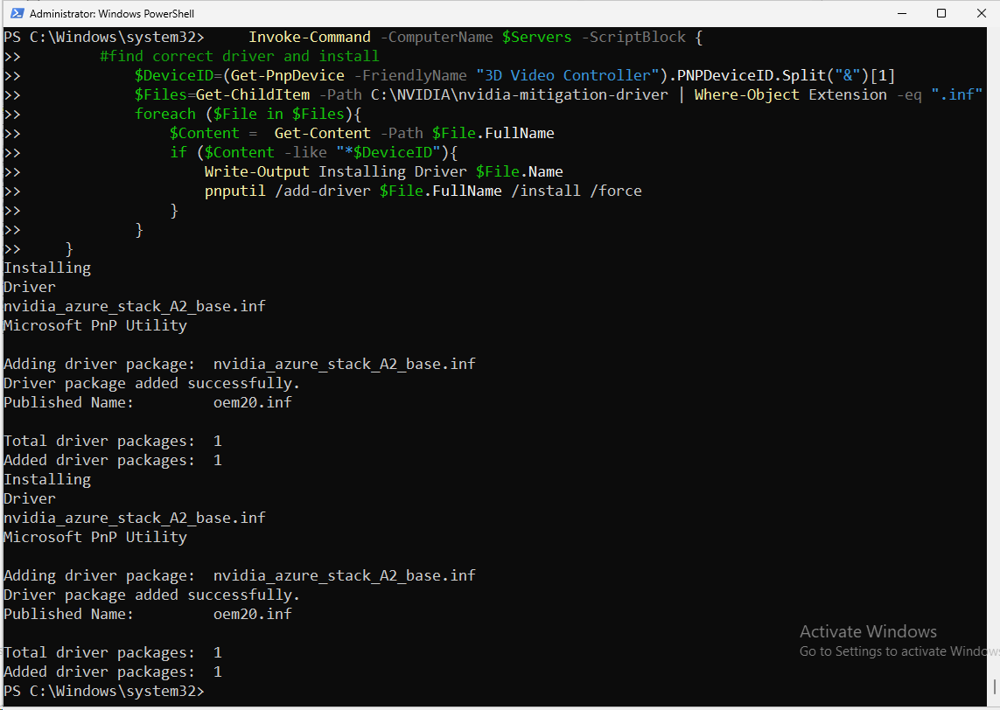
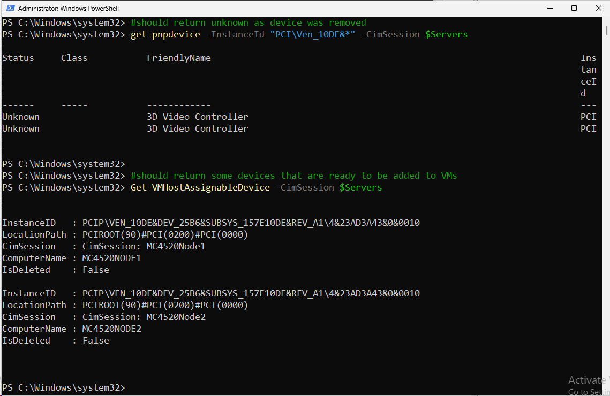
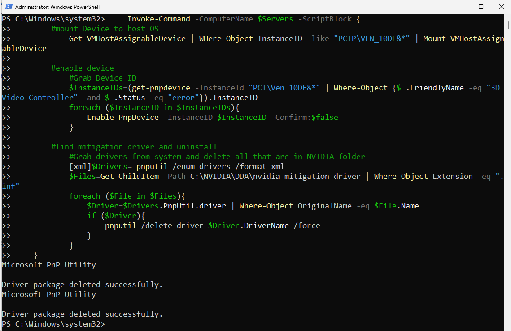
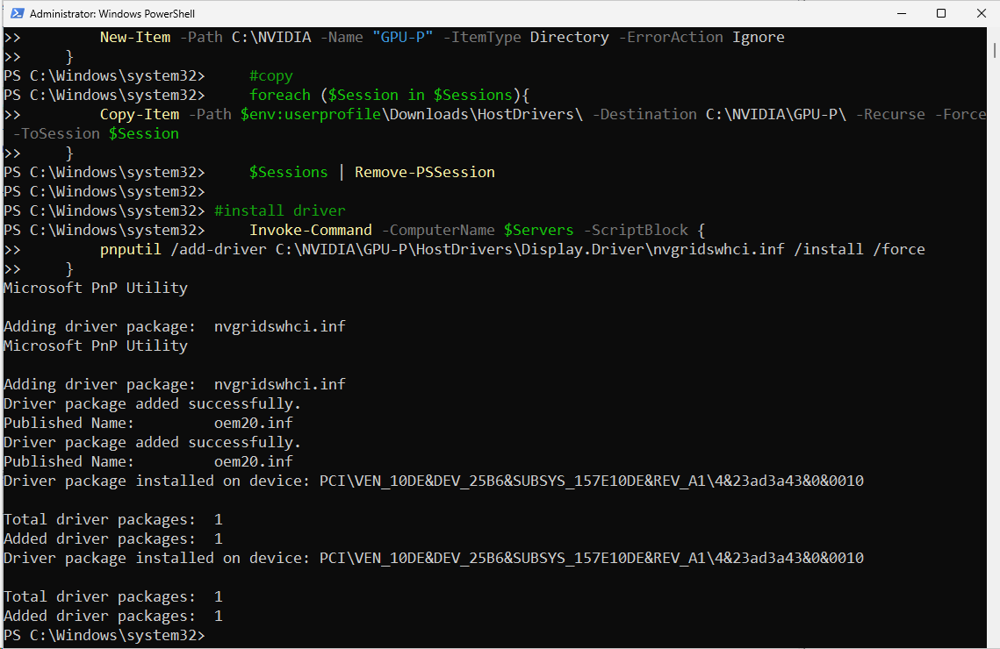
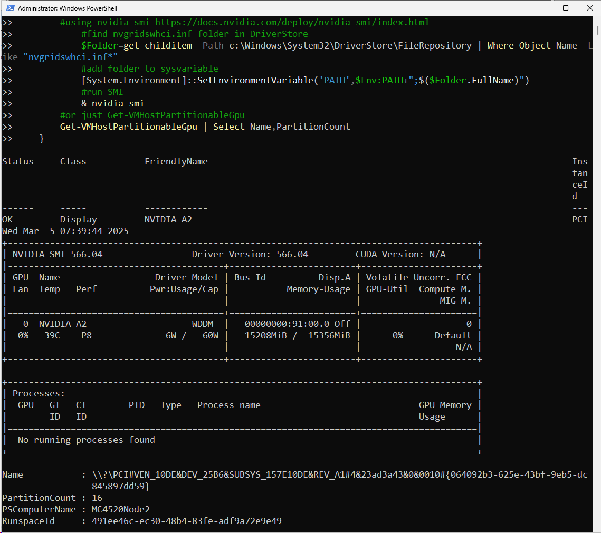
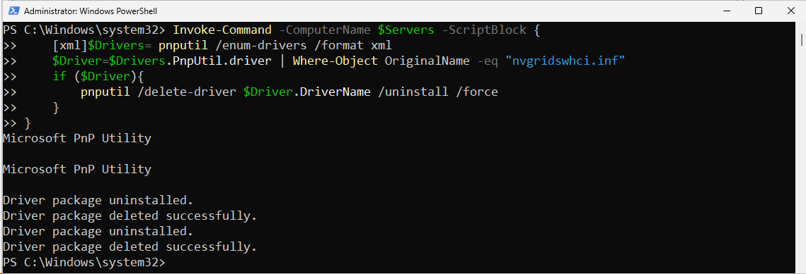
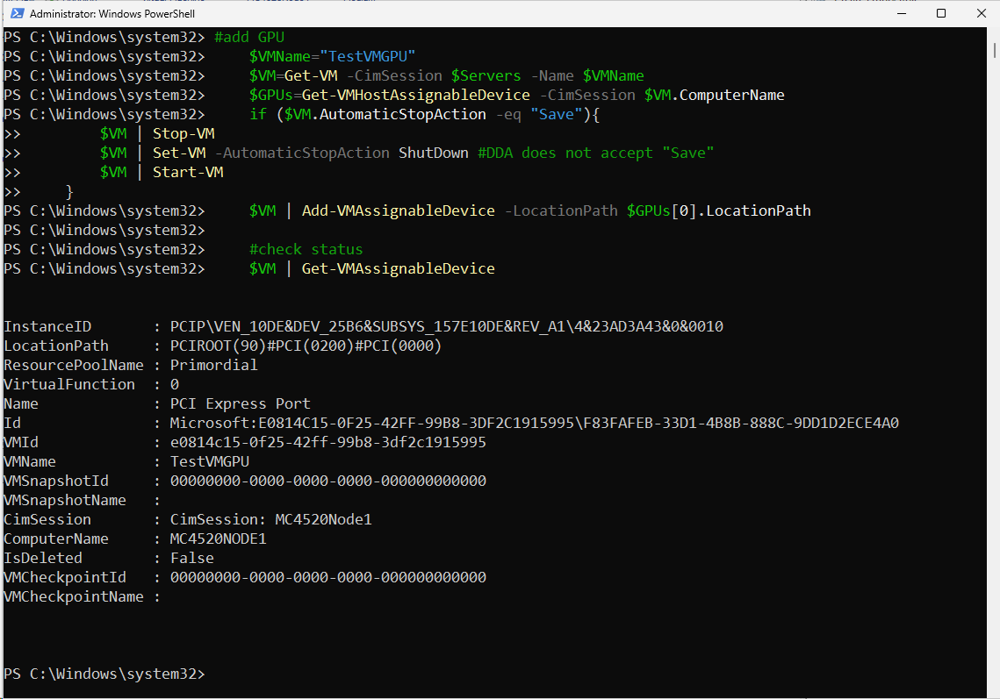
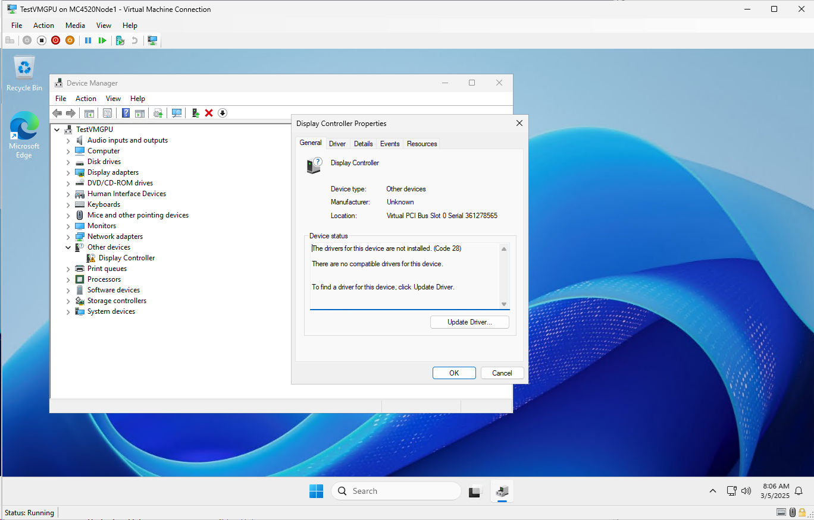
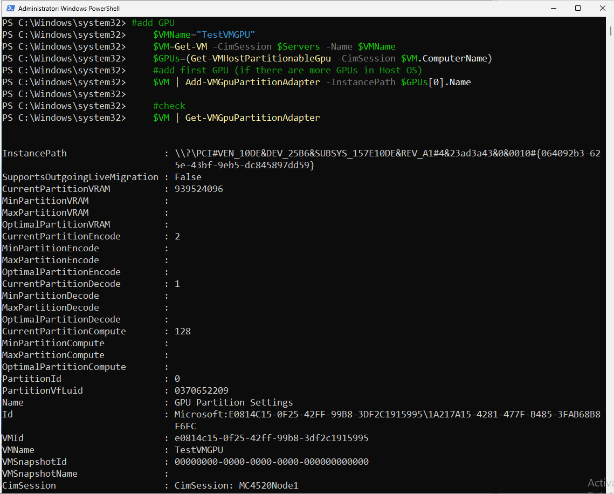
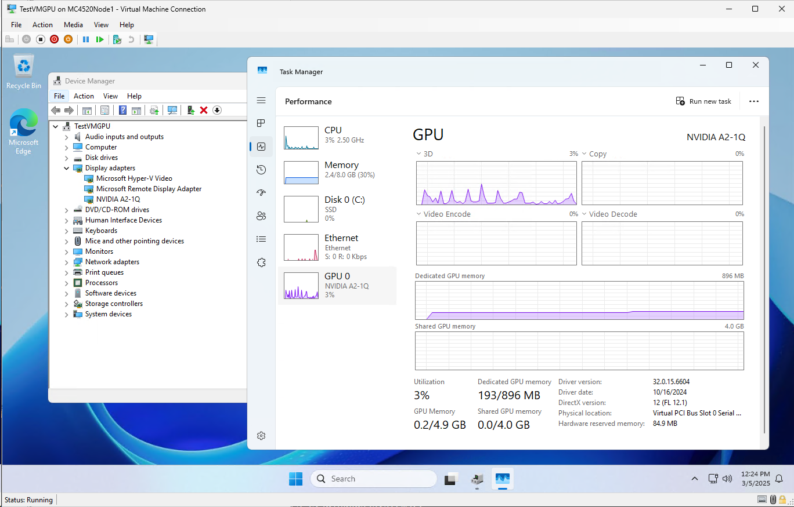

# Azure Local and NVIDIA GPUs


<!-- TOC -->

- [Azure Local and NVIDIA GPUs](#azure-local-and-nvidia-gpus)
    - [About the lab](#about-the-lab)
    - [Docs](#docs)
    - [Check drivers Status](#check-drivers-status)
    - [Prepare GPU for DDA](#prepare-gpu-for-dda)
        - [Download Driver](#download-driver)
        - [Prepare GPU for DDA](#prepare-gpu-for-dda)
        - [Check Device](#check-device)
        - [Remove Device from DDA pool and Uninstall Driver](#remove-device-from-dda-pool-and-uninstall-driver)
    - [Prepare GPU for GPU-P](#prepare-gpu-for-gpu-p)
        - [Install host driver](#install-host-driver)
        - [Check Host Device](#check-host-device)
        - [Uninstall host driver](#uninstall-host-driver)
    - [Attach GPU - DDA - PowerShell](#attach-gpu---dda---powershell)
    - [Attach GPU - GPU-P - PowerShell](#attach-gpu---gpu-p---powershell)
    - [Attach GPU - az cli](#attach-gpu---az-cli)
    - [Install Drivers in VMs - DDA](#install-drivers-in-vms---dda)
    - [Install Drivers in VMs - GPU-P](#install-drivers-in-vms---gpu-p)

<!-- /TOC -->


## About the lab

In this lab you will learn how to install, assign, unassign and uninstall GPU-P (GPU Partitioning) and DDA (Discrete Device Assignment) drivers into Virtual Machines.

In this lab was validated on Dell MC4520 with A2 NVIDIA GPU.

All commands were running from Windows Server 2025 management machine.

## Docs

Microsoft Docs
* https://learn.microsoft.com/en-us/azure/azure-local/manage/gpu-preparation?view=azloc-24112

NVIDIA Docs - GPU-P
* https://docs.nvidia.com/vgpu/17.0/grid-vgpu-release-notes-microsoft-azure-stack-hci/index.html
* https://docs.nvidia.com/vgpu/17.0/grid-vgpu-user-guide/index.html#install-vgpu-package-microsoft-azure-stack-hci

NVIDIA Docs - DDA
* https://docs.nvidia.com/datacenter/tesla/gpu-passthrough/

DDA Blogpost
* https://devblogs.microsoft.com/scripting/passing-through-devices-to-hyper-v-vms-by-using-discrete-device-assignment/

## Check drivers Status

```PowerShell
$Servers="MC4520Node1","MC4520Node2"

#check for GPUs (PCI\Ven_10DE&* = NVIDIA)
Get-PnpDevice -CimSession $Servers -InstanceId "PCI\Ven_10DE&*"

#make sure Hyper-V PowerShell is installed
Add-WindowsFeature -Name Hyper-V-PowerShell

#check for DDA devices
Get-VMHostAssignableDevice -CimSession $Servers

#check for GPU-P devices
Get-VMHostPartitionableGpu -CimSession $Servers | Select Name,PartitionCount

```

As you can see, there's just "3D Video Controller" and VMHostAssignableDevice and VMHostPartitionableGPU is empty.



## Prepare GPU for DDA

### Download Driver

Download mitigation driver - driver that informs Hyper-V on how to correctly reset the GPUs during VM reboots. This guarantees the GPU is in a clean state when the VM boots up, and avoids issues such as the driver not being able to initialize the GPU after VM reboot.

```PowerShell
#Download GPU mitigation driver
#https://docs.nvidia.com/datacenter/tesla/gpu-passthrough/
$URL="https://docs.nvidia.com/datacenter/tesla/gpu-passthrough/nvidia_azure_stack_inf_v2022.10.13_public.zip"

#Download
    #Set up web client to download files with authenticated web request in case there's a proxy
    $WebClient = New-Object System.Net.WebClient
    #$proxy = new-object System.Net.WebProxy
    $proxy = [System.Net.WebRequest]::GetSystemWebProxy()
    $proxy.Credentials = [System.Net.CredentialCache]::DefaultCredentials
    #$proxy.Address = $proxyAdr
    #$proxy.useDefaultCredentials = $true
    $WebClient.proxy = $proxy
    #$webclient.Headers.Add("User-Agent", "WhateverUser-AgentString/1.0")
    $FileName=$($URL.Split("/")| Select-Object -Last 1)
    $WebClient.DownloadFile($URL,"$env:userprofile\Downloads\$FileName")

#Extract
    New-Item -Path $Env:userprofile\Downloads\ -Name "nvidia-mitigation-driver" -ItemType Directory -ErrorAction Ignore
    Expand-Archive -Path "$env:userprofile\Downloads\$FileName" -DestinationPath "$Env:userprofile\Downloads\nvidia-mitigation-driver" -force

#Copy Driver to nodes
    $Sessions=New-PSSession -ComputerName $Servers
    #first create Nvidia Folders in c:\
    Invoke-Command -Session $Sessions -ScriptBlock {
        New-Item -Path C:\ -Name "NVIDIA" -ItemType Directory -ErrorAction Ignore
        New-Item -Path C:\NVIDIA -Name "DDA" -ItemType Directory -ErrorAction Ignore
    }
    #copy
    Foreach ($Session in $Sessions){
        Copy-Item -Path "$Env:userprofile\Downloads\nvidia-mitigation-driver" -Destination c:\NVIDIA\DDA -Recurse -Force -ToSession $Session 
    }
    $Sessions | Remove-PSSession

```

### Prepare GPU for DDA 

Following script will find model and based on information in inf it will use correct driver.

```PowerShell
#install drivers
    Invoke-Command -ComputerName $Servers -ScriptBlock {
        #Grab Device ID NVIDIA 3D Video Controller device
        $InstanceIDs=(get-pnpdevice -InstanceId "PCI\Ven_10DE&*" | Where-Object {$_.FriendlyName -eq "3D Video Controller"}).InstanceID
        $DeviceID=($InstanceIDs | Select-Object -First 1).Split("&")[1]

        #first disable and dismount the device
        if ($InstanceIDs){
            foreach ($InstanceID in $InstanceIDs){
                Disable-PnpDevice -InstanceID $InstanceID -Confirm:$false
                Dismount-VMHostAssignableDevice -InstancePath $InstanceID -Force
            }
        }

        #find correct mitigation driver and install
        if ($DeviceID){
            $Files=Get-ChildItem -Path C:\NVIDIA\DDA\nvidia-mitigation-driver | Where-Object Extension -eq ".inf"
            foreach ($File in $Files){
                $Content =  Get-Content -Path $File.FullName
                if ($Content -like "*$DeviceID"){
                    Write-Output Installing Driver $File.Name
                    pnputil /add-driver $File.FullName /install /force
                }
            }
        }
    }

```

### Check Device

```PowerShell
#should return unknown as device was removed
get-pnpdevice -InstanceId "PCI\Ven_10DE&*" -CimSession $Servers

#should return some devices that are ready to be added to VMs
Get-VMHostAssignableDevice -CimSession $Servers
 
```



### Remove Device from DDA pool and Uninstall Driver 

First the driver is deleted, device mounted back to OS and 

```PowerShell
#uninstall drivers
    Invoke-Command -ComputerName $Servers -ScriptBlock {
        #mount Device to host OS
            Get-VMHostAssignableDevice | WHere-Object InstanceID -like "PCIP\VEN_10DE&*" | Mount-VMHostAssignableDevice

        #enable device
            #Grab Device ID
            $InstanceIDs=(get-pnpdevice -InstanceId "PCI\Ven_10DE&*" | Where-Object {$_.FriendlyName -eq "3D Video Controller" -and $_.Status -eq "error"}).InstanceID
            foreach ($InstanceID in $InstanceIDs){
                Enable-PnpDevice -InstanceID $InstanceID -Confirm:$false
            }
        
        #find mitigation driver and uninstall
            #Grab drivers from system and delete all that are in NVIDIA folder
            [xml]$Drivers= pnputil /enum-drivers /format xml
            $Files=Get-ChildItem -Path C:\NVIDIA\DDA\nvidia-mitigation-driver | Where-Object Extension -eq ".inf"
            foreach ($File in $Files){
                $Driver=$Drivers.PnpUtil.driver | Where-Object OriginalName -eq $File.Name
                if ($Driver){
                    pnputil /delete-driver $Driver.DriverName /force
                }
            }
    }

```



## Prepare GPU for GPU-P

### Install host driver

Since this feature is licensed (NVIDIA), you will need to download host driver (and guest drivers) from your licensing site.

```PowerShell
$Servers="MC4520Node1","MC4520Node2"
$zipfile="$env:userprofile\Downloads\vGPU_18.0_BETA_Azure_Stack_HCI_Host_Drivers.zip"

#unzip
    Expand-Archive -Path $zipfile -DestinationPath $env:userprofile\Downloads\HostDrivers\ -Force

#copy driver
    $Sessions=New-PSSession -ComputerName $Servers
    #first create a NVIDIA folders in C:\
    Invoke-Command -Session $Sessions -ScriptBlock {
        New-Item -Path C:\ -Name "NVIDIA" -ItemType Directory -ErrorAction Ignore
        New-Item -Path C:\NVIDIA -Name "GPU-P" -ItemType Directory -ErrorAction Ignore
    }
    #copy
    foreach ($Session in $Sessions){
        Copy-Item -Path $env:userprofile\Downloads\HostDrivers\ -Destination C:\NVIDIA\GPU-P\ -Recurse -Force -ToSession $Session
    }
    $Sessions | Remove-PSSession

#install driver
    Invoke-Command -ComputerName $Servers -ScriptBlock {
        pnputil /add-driver C:\NVIDIA\GPU-P\HostDrivers\Display.Driver\nvgridswhci.inf /install /force
    }

```



### Check Host Device

Following code simply queries NVIDIA devices using get-pnpdevice, runs nvidia-smi (after it's added to system variables, so you can simply run "nvidia-smi") and queries VMHostPartitionableGPU.

```PowerShell
#check devices
    Invoke-Command -ComputerName $Servers -ScriptBlock {
        #using PNPDevice (query NVIDIA devices)
        get-pnpdevice -InstanceId "PCI\Ven_10DE&*"
        
        #using nvidia-smi https://docs.nvidia.com/deploy/nvidia-smi/index.html
            #find nvgridswhci.inf folder in DriverStore
            $Folder=get-childitem -Path c:\Windows\System32\DriverStore\FileRepository | Where-Object Name -Like "nvgridswhci.inf*"
            #add folder to sysvariable
            [System.Environment]::SetEnvironmentVariable('PATH',$Env:PATH+";$($Folder.FullName)")
            #run SMI
            & nvidia-smi
        #or just Get-VMHostPartitionableGpu
        Get-VMHostPartitionableGpu | Select Name,PartitionCount
    }

```



### Uninstall host driver

Following script will uninstall "nvgridswhci.inf" driver.

```PowerShell
Invoke-Command -ComputerName $Servers -ScriptBlock {
    [xml]$Drivers= pnputil /enum-drivers /format xml
    $Driver=$Drivers.PnpUtil.driver | Where-Object OriginalName -eq "nvgridswhci.inf"
    if ($Driver){
        pnputil /delete-driver $Driver.DriverName /uninstall /force
    }
}

```



## Attach GPU - DDA - PowerShell

In following part we'll attach GPU to "TestVMGPU" virtual machine that has been created using Azure Portal (and Resource Bridge).

Note, that DDA has limitations as VM cannot be saved, therefore there's a script that will configure AutomaticStopAction to be ShutDown.

```PowerShell
#make sure Hyper-V PowerShell is installed (so you can run AssignableDevice commands from management machine)
Add-WindowsFeature -Name Hyper-V-PowerShell

#add GPU
    $VMName="TestVMGPU"
    $VM=Get-VM -CimSession $Servers -Name $VMName
    $GPUs=Get-VMHostAssignableDevice -CimSession $VM.ComputerName
    if ($VM.AutomaticStopAction -eq "Save"){
        $VM | Stop-VM
        $VM | Set-VM -AutomaticStopAction ShutDown #DDA does not accept "Save"
        $VM | Start-VM
    }
    $VM | Add-VMAssignableDevice -LocationPath $GPUs[0].LocationPath

    #check status
    $VM | Get-VMAssignableDevice

#remove GPU
    <#
    $VM | Get-VMAssignableDevice | Remove-VMAssignableDevice 
    #>

```





## Attach GPU - GPU-P - PowerShell

```PowerShell
#make sure Hyper-V PowerShell is installed
Add-WindowsFeature -Name Hyper-V-PowerShell

#add GPU
    $VMName="TestVMGPU"
    $VM=Get-VM -CimSession $Servers -Name $VMName
    $GPUs=(Get-VMHostPartitionableGpu -CimSession $VM.ComputerName)
    #add first GPU (if there are more GPUs in Host OS)
    $VM | Add-VMGpuPartitionAdapter -InstancePath $GPUs[0].Name

    #check
    $VM | Get-VMGpuPartitionAdapter

#remove GPU (remove GPU is fine unless GPU is initiated in VM. If so, VM will reboot)
    <#
    $VMName="TestVMGPU"
    $VM=Get-VM -CimSession $Servers -Name $VMName
    $VM | Remove-VMGpuPartitionAdapter
    #>

```




## Attach GPU - az cli 

Notes: 
    *   it looks like VM is always rebooted (dirty shutdown) when adding/removing device. 
    *   DDA does not work and wont attach GPU.

* DDA
    https://learn.microsoft.com/en-us/azure/azure-local/manage/gpu-manage-via-device?view=azloc-24112

* GPU-P
    https://learn.microsoft.com/en-us/azure/azure-local/manage/gpu-manage-via-partitioning?view=azloc-24112


```PowerShell
#install az cli
    Start-BitsTransfer -Source https://aka.ms/installazurecliwindows -Destination $env:userprofile\Downloads\AzureCLI.msi
    Start-Process msiexec.exe -Wait -ArgumentList "/I  $env:userprofile\Downloads\AzureCLI.msi /quiet"
    #add az to enviromental variables so no posh restart is needed
    [System.Environment]::SetEnvironmentVariable('PATH',$Env:PATH+';C:\Program Files (x86)\Microsoft SDKs\Azure\CLI2\wbin')

#login to Azure
    az login --use-device-code

    #add Az extension https://learn.microsoft.com/en-us/cli/azure/stack-hci-vm?view=azure-cli-latest
    az extension add --name stack-hci-vm

#list running VMs
$ResourceGroupName="MCClus02-RG"
$VMName="TestVMGPU"

#List VMs
az stack-hci-vm list --resource-group $ResourceGroupName | ConvertFrom-JSON
az stack-hci-vm show --resource-group $ResourceGroupName --name $VMName | ConvertFrom-JSON

#GPU-P
    #add GPU (VM is restarted)
    az stack-hci-vm gpu attach --resource-group $ResourceGroupName --vm-name $VMName --gpus GpuP --yes

    #detach GPU (VM is restarted)
    #az stack-hci-vm gpu detach --resource-group $ResourceGroupName --vm-name $VMName --yes

#DDA (does not work??)
    #add GPU (VM is restarted, turned off)
    az stack-hci-vm gpu attach --resource-group $ResourceGroupName --vm-name $VMName --gpus GpuDDA --yes

    #detach GPU (VM is restarted)
    #az stack-hci-vm gpu detach --resource-group $ResourceGroupName --vm-name $VMName --yes

```

## Install Drivers in VMs - DDA

Note: I need to do more research as normal driver was not working.

```PowerShell
$Servers="TestVMGPU"
Invoke-Command -ComputerName $Servers -ScriptBlock {
    #Download drivers (this was latest driver to this date)
    $URL="https://us.download.nvidia.com/tesla/572.61/572.61-data-center-tesla-desktop-winserver-2022-2025-dch-international.exe"
    $fileName = [System.IO.Path]::GetFileName($url)
    Start-BitsTransfer -Source $URL -Destination "$env:userprofile\Downloads\$FileName"

    #install nanazip (7zip alternative)
    winget install nanazip --accept-source-agreements --source winget
    #extract
    start-process -FilePath "NanaZipC.exe" -ArgumentList "x `"$env:userprofile\Downloads\$FileName`" -o`"c:\NVIDIA\DDA\`"" -Wait
    #run setup.exe to install driver
    start-process -FilePath "c:\NVIDIA\DDA\setup.exe" -ArgumentList "-s -noreboot" -Wait
    #uninstall
    #start-process -FilePath "c:\NVIDIA\DDA\setup.exe" -ArgumentList "-s -clean -noreboot" -Wait
    #remove-item -path c:\NVIDIA\DDA -recurse
}

```

## Install Drivers in VMs - GPU-P

```PowerShell
$Servers="TestVMGPU"
$zipfile="$env:userprofile\Downloads\vGPU_18.0_Beta_Windows_Guest_Drivers.zip"

#unzip
    Expand-Archive -Path $zipfile -DestinationPath $env:userprofile\Downloads\WindowsGuestDrivers\ -Force

#copy driver (we'll copy over zip first as it's bit too large and file by file would take forever)
    $Sessions=New-PSSession -ComputerName $Servers
    #copy
    foreach ($Session in $Sessions){
        Copy-Item -Path $zipfile -Destination $zipfile -Force -ToSession $Session
    }

    #first create a NVIDIA folders in C:\ and then expand archive
    Invoke-Command -Session $Sessions -ScriptBlock {
        New-Item -Path C:\ -Name "NVIDIA" -ItemType Directory -ErrorAction Ignore
        New-Item -Path C:\NVIDIA -Name "GPU-P" -ItemType Directory -ErrorAction Ignore
        Expand-Archive -Path $using:zipfile -DestinationPath c:\NVIDIA\GPU-P\ -Force
    }
    $Sessions | Remove-PSSession


#install driver
    Invoke-Command -ComputerName $Servers -ScriptBlock {
        start-process -FilePath "c:\NVIDIA\GPU-P\setup.exe" -ArgumentList "-s -noreboot" -Wait
    }

#uninstall
    #start-process -FilePath "c:\NVIDIA\setup.exe" -ArgumentList "-s -clean -noreboot" -Wait
    #remove-item -path c:\NVIDIA\GPU-P -recurse


```




