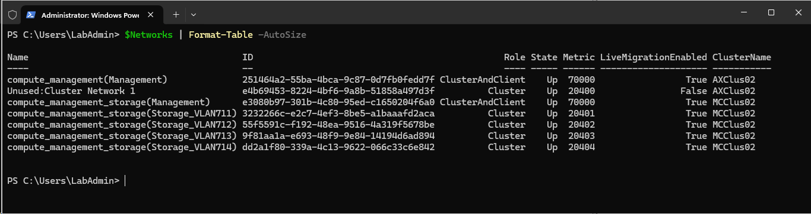

# Check Live Migration networks

Note: to be able to Live migrate, you need to add Management network to Live Migration networks

```PowerShell
$ClusterNames="AXClus02","MCClus02"

#first make sure NetATC and Failover Cluster PowerShell is installed on management machine(WS2025)
Add-WindowsFeature -Name NetworkATC,RSAT-Clustering-PowerShell

#create and configure override to rewrite Live Migration network settings
$override=New-NetIntentGlobalClusterOverrides
$override.EnableLiveMigrationNetworkSelection=$false
foreach ($ClusterName in $ClusterNames){
    Set-NetIntent -GlobalClusterOverrides $override -ClusterName $ClusterName
    #check
    (Get-NetIntent -GlobalOverrides -ClusterName $ClusterName).ClusterOverride
}


#list live migration networks
    $Networks=@()
    foreach ($ClusterName in $ClusterNames){
        #check MigrationExcludeNetworks first
            $ExcludedNetworksIDs=(Get-ClusterResourceType -Cluster $ClusterName -Name "Virtual Machine" | Get-ClusterParameter -Name MigrationExcludeNetworks).Value -split ";"
            $ClusterNetworks=Get-ClusterNetwork -Cluster $ClusterName
            # Create a list of network names
            $Networks+=foreach ($ClusterNetwork in $ClusterNetworks){
                #check if ClusterNetworkID is in list
                $LiveMigrationEnabled= -not ($ExcludedNetworksIDs -contains $CLusterNetwork.ID)
                [PSCustomObject]@{
                    Name                = $ClusterNetwork.Name
                    ID                  = $ClusterNetwork.ID
                    Role                = $ClusterNetwork.Role
                    State               = $ClusterNetwork.State
                    Metric              = $ClusterNetwork.Metric
                    LiveMigrationEnabled= $LiveMigrationEnabled
                    ClusterName         = $ClusterName
                }
            }
    }

$Networks | Format-Table -AutoSize

```


# Configure Live Migration networks  

Configure both Management and Storage networks for Live Migration

```PowerShell
$ClusterNames="AXClus02","MCClus02"

#first find all networks that are not management and not storage (with NetworkATC, Management network and Storage Networks are renamed)
foreach ($ClusterName in $ClusterNames){
    $ClusterNetworks=(Get-ClusterNetwork -Cluster $ClusterName | Where-Object {$_.Name -notlike "*Management*" -and $_.Name -notlike "*Storage*"} )
    if ($ClusterNetworks){
        $ClusterNetworkIDs=([String]::Join(";",$ClusterNetworks.ID))
        Get-ClusterResourceType -Cluster $ClusterName -Name "Virtual Machine" | Set-ClusterParameter -Name MigrationExcludeNetworks -Value $ClusterNetworkIDs
    }else{
        Get-ClusterResourceType -Cluster $ClusterName -Name "Virtual Machine" | Set-ClusterParameter -Name MigrationExcludeNetworks -Value ""
    }
}

```

Check again

```PowerShell
$ClusterNames="AXClus02","MCClus02"

#list live migration networks
    $Networks=@()
    foreach ($ClusterName in $ClusterNames){
        #check MigrationExcludeNetworks first
            $ExcludedNetworksIDs=(Get-ClusterResourceType -Cluster $ClusterName -Name "Virtual Machine" | Get-ClusterParameter -Name MigrationExcludeNetworks).Value -split ";"
            $ClusterNetworks=Get-ClusterNetwork -Cluster $ClusterName
            # Create a list of network names
            $Networks+=foreach ($ClusterNetwork in $ClusterNetworks){
                #check if ClusterNetworkID is in list
                $LiveMigrationEnabled= -not ($ExcludedNetworksIDs -contains $CLusterNetwork.ID)
                [PSCustomObject]@{
                    Name                = $ClusterNetwork.Name
                    ID                  = $ClusterNetwork.ID
                    Role                = $ClusterNetwork.Role
                    State               = $ClusterNetwork.State
                    Metric              = $ClusterNetwork.Metric
                    LiveMigrationEnabled= $LiveMigrationEnabled
                    ClusterName         = $ClusterName
                }
            }
    }

$Networks | Format-Table -AutoSize

```




# Live Migration script

```PowerShell
#Live Migration cluster to cluster
    #Configure kerberos constrained delegation to move from Firstcluster to SecondCluster and back
    # https://technet.microsoft.com/en-us/windows-server-docs/compute/hyper-v/deploy/set-up-hosts-for-live-migration-without-failover-clustering

    #region configure cluster authentication protocol to Kerberos
        #define cluster names.
        $Clusters="AXClus02","MCClus02"

        #make sure Failover Clustering and Hyper-V PowerShell is installed
        Install-WindowsFeature -Name RSAT-Clustering-PowerShell,Hyper-V-PowerShell

        #configure kerberos constrained delegation for cifs and Microsoft Virtual System Migration Service, both name and FQDN
        foreach ($Cluster in $Clusters){
            $SourceNodes=(Get-ClusterNode -Cluster $Cluster).Name
            $DestinationNodes=$clusters | ForEach-Object {if ($_ -ne $cluster){(Get-ClusterNode -Cluster $_).Name}}

            Foreach ($DestinationNode in $DestinationNodes){
                $HostName = $DestinationNode 
                $HostFQDN = (Resolve-DnsName $HostName).name | Select-Object -First 1
                Foreach ($SourceNode in $SourceNodes){
                    Get-ADComputer $SourceNode | Set-ADObject -Add @{"msDS-AllowedToDelegateTo"="Microsoft Virtual System Migration Service/$HostFQDN", "Microsoft Virtual System Migration Service/$HostName", "cifs/$HostFQDN", "cifs/$HostName"}
                }
            }
        }

        #Switch to any authentication protocol https://blogs.technet.microsoft.com/virtualization/2017/02/01/live-migration-via-constrained-delegation-with-kerberos-in-windows-server-2016/
        foreach ($Cluster in $clusters){
            $ClusterNodes=(Get-ClusterNode -Cluster $Cluster).Name
            Foreach ($ClusterNode in $ClusterNodes){
                $GUID=(Get-ADComputer $clusternode).ObjectGUID
                $comp=Get-ADObject -identity $Guid -Properties "userAccountControl"
                #Flip the ADS_UF_TRUSTED_TO_AUTHENTICATE_FOR_DELEGATION bit using powershell bitwise OR operation (-bor)
                $Comp.userAccountControl = $Comp.userAccountControl -bor 16777216
                Set-ADObject -Instance $Comp
            }
        }

        #Switch to kerberos authentication for live migration
        foreach ($Cluster in $Clusters){
            $ClusterNodes=(Get-ClusterNode -Cluster $Cluster).Name
            Set-VMHost -CimSession $ClusterNodes -VirtualMachineMigrationAuthenticationType Kerberos
        }

    #endregion

    #region Live Migrate one or more VMs
        $SourceClusterName="AXClus02"
        $DestinationClusterName="MCClus02"
        $SourceStoragePath="C:\ClusterStorage\UserStorage_1"
        $DestinationStoragePath="C:\ClusterStorage\UserStorage_1"
        $VMNames=(Get-VM -cimsession (get-clusternode -cluster $SourceClusterName).Name | Where-Object Path -Like "$SourceStoragePath*" | Out-GridView -OutputMode Multiple).Name 
        #remove VMs from HA Resources
        foreach ($VMName in $VMNames){
            Get-ClusterResource -Cluster $SourceClusterName -name "Virtual Machine $VMName" | Remove-ClusterResource -force
            Get-ClusterGroup -Cluster $SourceClusterName -Name $VMName | Remove-ClusterGroup -force
        }

        #Live migrate to different cluster
        foreach ($VMName in $VMNames){
            #Grab random node in cluster $DestinationClusterName
            $DestinationHost=(get-clusternode -cluster $DestinationClusterName | get-random).Name
            $VM=Get-VM -Cimsession (get-clusternode -cluster $SourceClusterName).Name -Name $VMName
            #assuming there's same vswitch name
            $VM | Move-VM -DestinationHost $DestinationHost -DestinationStoragePath  "$DestinationStoragePath\$($VM.Name)" -IncludeStorage -Passthru
        }

        #import VM(s) as HA resources in new cluster
        foreach ($VMName in $VMNames){
            Add-ClusterVirtualMachineRole -VMName $VMName -Cluster $DestinationClusterName
        }
    #endregion

```
